# Nếu database query nhanh nhưng API vẫn chậm, bạn kiểm tra gì tiếp?

## ⚡ Tóm tắt ngắn (30s)
* **Bản chất**: Hiện tượng này chỉ ra nút thắt cổ chai nằm ở **Tầng xử lý ứng dụng (Application Layer)** hoặc **Môi trường truyền tải (Network/Serialization)**, chứ không nằm ở tầng lưu trữ dữ liệu.
* **Các thảm họa thực chiến được giải quyết**:
    1. **Nghẽn cổ chai CPU do dịch chuỗi (JSON Serialization Bottleneck)**: DB query mất 5ms để lấy ra 100,000 bản ghi, nhưng ứng dụng Java tốn 3,000ms CPU để chuyển đống object đó thành chuỗi JSON truyền về cho client.
    2. **Độ trễ truyền tải mạng lớn (Payload Transfer Overhead)**: Truy vấn DB chạy rất nhanh trên mạng nội bộ (LAN 0.1ms), nhưng file kết quả nặng 20MB truyền qua mạng WAN đến điện thoại người dùng tốn hàng giây.
    3. **Treo luồng do đồng bộ hóa (Thread Blocking / Lock Contention)**: Các luồng xử lý bị kẹt tại các khối `synchronized` hoặc các thao tác IO blocking đồng bộ (đọc file, ghi log đồng bộ).
* **Quyết định Senior**: Sử dụng công cụ **APM Profiler** (như JProfiler hoặc Datadog Continuous Profiler) để chụp trạng thái CPU và Thread. Kiểm tra dung lượng dữ liệu trả về (Payload Size), cấu hình nén dữ liệu (Gzip/Brotli), và tối ưu hóa cấu trúc dữ liệu trả về thông qua DTO gọn nhẹ.

---

## 🔍 Chi tiết bản chất thực chiến

Khi cơ sở dữ liệu xác nhận câu truy vấn chạy cực nhanh (ví dụ `Execution time: 2ms`), nhưng APM báo API đó mất 3 giây để hoàn thành, các nguyên nhân chính bao gồm:

### 1. Chi phí tuần tự hóa dữ liệu (Serialization Overhead)
* Việc chuyển đổi cấu trúc đối tượng phức tạp trong bộ nhớ (ví dụ: các Entity có mối quan hệ lồng nhau phức tạp được nạp bởi Hibernate) thành định dạng JSON/XML cực kỳ ngốn CPU. Với lượng dữ liệu lớn, thư viện như Jackson (trong Spring Boot) phải duyệt qua cây đối tượng bằng cơ chế Reflection, tiêu tốn rất nhiều thời gian.

### 2. Độ trễ truyền tải mạng (Network Payload Transfer)
* **Dữ liệu lớn**: SELECT lấy ra 50MB dữ liệu. DB chạy mất 10ms vì RAM của DB lớn và cùng mạng LAN với App. Nhưng từ App truyền 50MB đó về Client (mạng 4G/Wifi yếu) sẽ tốn 3-5 giây.
* **Nhiều hop mạng (Cascading Network Calls)**: Ứng dụng thực hiện nhiều cuộc gọi tuần tự (N+1 HTTP calls) đến các microservices khác để ghép dữ liệu, mỗi cuộc gọi mất 20ms mạng tích lũy tạo nên độ trễ lớn.

### 3. Khóa đồng bộ hóa (Thread Synchronization Blocks)
* Các đoạn code sử dụng các thư viện cũ không thread-safe hoặc bọc các tác vụ nặng trong khối `synchronized` sẽ chặn đứng các luồng khác chạy song song. Các luồng xử lý phải xếp hàng chờ khóa giải phóng (`BLOCKED` state).

### 4. Đọc/Ghi IO Đồng bộ (Blocking IO)
* Ứng dụng thực hiện ghi log quá nhiều ở mức `DEBUG` hoặc ghi log đồng bộ xuống đĩa cứng (Synchronous Logging). Tốc độ ghi của đĩa cứng trở thành nút thắt cổ chai làm chậm luồng xử lý API.

---

## 🎨 Sơ đồ trực quan (Phân bổ thời gian Request Lifetime)

```mermaid
gantt
    title Phân bổ thời gian xử lý Request (Tổng cộng: 2000ms)
    dateFormat  X
    axisFormat %s ms
    
    Tải mạng đến App Server          :active, a1, 0, 100
    Spring Security & Filter Chain  :active, a2, 100, 150
    Thực thi DB Query (Fast!)      :crit, a3, 150, 160
    Xử lý Logic & Mapping DTO      :active, a4, 160, 400
    Jackson JSON Serialization (Nghẽn CPU!):crit, a5, 400, 1500
    Truyền tải Payload 15MB về Client:active, a6, 1500, 2000
```



---

## 💻 Code thực chiến / Cấu hình thực tế: BAD vs GOOD

### ❌ BAD: Lấy thừa dữ liệu từ DB, xử lý tuần tự và serialize cấu trúc Entity lồng nhau
Code JPA lấy toàn bộ Entity cồng kềnh chứa các quan hệ lồng nhau (Lazy loading kích hoạt ngầm khi serialize), xử lý tính toán bằng vòng lặp đồng bộ khóa luồng và trả về JSON quá lớn.

* **Mã nguồn Java tồi**:
```java
@RestController
@RequestMapping("/api/reports")
public class ReportControllerBad {
    @Autowired
    private OrderRepository orderRepository;

    @GetMapping("/heavy")
    public List<Order> getHeavyReport() {
        // ❌ SELECT * lấy toàn bộ dữ liệu cồng kềnh của 50,000 đơn hàng
        List<Order> orders = orderRepository.findAll();
        
        // ❌ Xử lý logic nặng đồng bộ và khóa luồng không cần thiết
        synchronized(this) {
            for (Order order : orders) {
                // Giả lập xử lý nặng tính toán
                calculateComplexMetrics(order); 
            }
        }
        
        // ❌ Trả trực tiếp danh sách Entity JPA chứa cấu trúc lồng nhau (User, Items, Payments)
        // Jackson sẽ kích hoạt hàng vạn câu truy vấn Lazy Load ngầm và tốn CPU để sinh JSON khổng lồ.
        return orders;
    }
}
```

---

### ✅ GOOD: Sử dụng DTO tối giản, xử lý bất đồng bộ và kích hoạt nén HTTP Gzip
Chuyển đổi dữ liệu sang DTO mỏng để tối giản JSON payload, xử lý tính toán song song sử dụng Java Stream Parallel hoặc CompletableFuture, và kích hoạt nén dữ liệu truyền tải.

* **Cấu hình nén dữ liệu truyền tải (application.properties)**:
```properties
# Kích hoạt nén Gzip cho các response lớn để giảm dung lượng mạng truyền tải
server.compression.enabled=true
server.compression.mime-types=application/json,application/xml,text/html,text/xml
server.compression.min-response-size=1024
# ✅ Chỉ nén các response có dung lượng lớn hơn 1KB
```

* **Mã nguồn Java tối ưu**:
```java
@RestController
@RequestMapping("/api/reports")
public class ReportControllerGood {
    
    @Autowired
    private OrderRepository orderRepository;

    @GetMapping("/light")
    public ResponseEntity<List<OrderSummaryDTO>> getLightReport() {
        // ✅ Chỉ lấy các trường dữ liệu cần thiết thông qua DTO Projection ở tầng DB
        List<OrderSummaryDTO> summaries = orderRepository.findProjectedSummary();
        
        // ✅ Xử lý tính toán song song sử dụng Parallel Stream (Tận dụng tối đa Multi-core CPU)
        // Không sử dụng synchronized khóa luồng vật lý
        summaries.parallelStream().forEach(this::calculateComplexMetricsQuick);
        
        // ✅ Trả về danh sách DTO phẳng, gọn nhẹ, Jackson sinh chuỗi JSON cực nhanh (< 20ms)
        return ResponseEntity.ok()
            .header(HttpHeaders.CACHE_CONTROL, "max-age=60") // Cấu hình cache trình duyệt 1 phút
            .body(summaries);
    }
    
    private void calculateComplexMetricsQuick(OrderSummaryDTO dto) {
        // Thuật toán tối ưu hóa
    }
}
```

---

## 📊 Bảng so sánh các tác nhân gây trễ tại Application Layer

| Tác nhân gây trễ | Cách phát hiện | Công cụ kiểm chứng | Giải pháp khắc phục |
| :--- | :--- | :--- | :--- |
| **JSON Serialization** | CPU của App server tăng 100% khi nhận request lớn, DB CPU rất thấp. | APM Profiler (Jackson methods time) | Dùng DTO, tắt các trường không dùng, hoặc chuyển sang Jackson Afterburner module. |
| **Dữ liệu truyền mạng lớn** | Thời gian phản hồi đo từ Client rất lớn, nhưng thời gian đo từ App Controller rất nhỏ. | Browser DevTools (Network tab - Content Download time) | Bật HTTP Gzip/Brotli compression, áp dụng phân trang (Pagination). |
| **Thread Blocking (Khóa)** | Biểu đồ Thread Dump có nhiều thread ở trạng thái `BLOCKED` chờ `monitor lock`. | `jstack` Thread Dump | Thay thế `synchronized` bằng `ReentrantLock` có timeout hoặc cấu hình Non-blocking IO. |
| **Ghi Log đồng bộ** | CPU nhàn rỗi nhưng App phản hồi chậm, IO-Wait của App server tăng cao. | Lsof / OS IO monitoring | Chuyển sang **Async Appender** trong Logback/Log4j2. |

---

## ⚠️ Common Gotchas & Questions follow-up

### 1. Cạm bẫy "Nổ bộ nhớ do nạp quá nhiều đối tượng" (JVM OutOfMemory via Heap Exhaustion)
* **Vấn đề**: API xuất dữ liệu báo cáo hoạt động bình thường với vài trăm người dùng. Nhưng khi có nhiều người cùng xuất báo cáo lớn một lúc, ứng dụng Java đột ngột bị treo cứng và sập nguồn (OOM).
* **Nguyên nhân**: Việc lấy hàng triệu dòng dữ liệu từ DB nạp vào bộ nhớ RAM của App dưới dạng Java Objects sẽ chiếm dung lượng RAM gấp 10-20 lần so với dung lượng thô dưới Database (do Java Object Header overhead). Khi RAM bị đầy, JVM liên tục thực hiện Full GC để cứu vãn bộ nhớ, đẩy CPU tăng 100% và chặn mọi luồng API khác.
* **Giải pháp**: Không bao giờ nạp toàn bộ danh sách bản ghi lớn vào bộ nhớ. Sử dụng cơ chế **Streaming (Cursor/Scroll)** trong JPA để đọc dữ liệu theo từng block nhỏ, hoặc viết dữ liệu trực tiếp xuống file tạm ở dạng đĩa cứng và stream file về cho người dùng.

### 2. Câu hỏi đào sâu từ interviewer
* **Q: Làm thế nào bạn xác định được một nút thắt cổ chai hiệu năng nằm sâu trong code Java mà không thể reproduce ở môi trường Local? Bạn có thể sử dụng công cụ gì trực tiếp trên Production?**
  * *Trả lời*: Để chẩn đoán mã nguồn trực tiếp trên Production mà không làm sụt giảm hiệu năng hệ thống, tôi sẽ sử dụng **Continuous Profiling (APM Profilers)**:
    1. Tôi sẽ kích hoạt công cụ Java Flight Recorder (JFR) tích hợp sẵn trong JVM bằng lệnh `jcmd <PID> JFR.start name=profile duration=60s filename=prod_profile.jfr`.
    2. JFR chạy ở tầng nhân JVM với chi phí hiệu năng cực kỳ thấp (thường < 1% CPU overhead), hoàn toàn an toàn cho Production.
    3. Sau 60 giây ghi nhận, tôi tải file `prod_profile.jfr` về máy local và mở bằng phần mềm **JDK Mission Control**.
    4. Tại đây, tôi có thể xem chính xác **Flame Graph (Biểu đồ ngọn lửa)** hiển thị cây thư mục các phương thức (methods) tiêu tốn nhiều CPU time nhất, hoặc xem chính xác dòng code nào đang thực hiện phân bổ bộ nhớ (Garbage Allocation) nhiều nhất gây chậm hệ thống.
