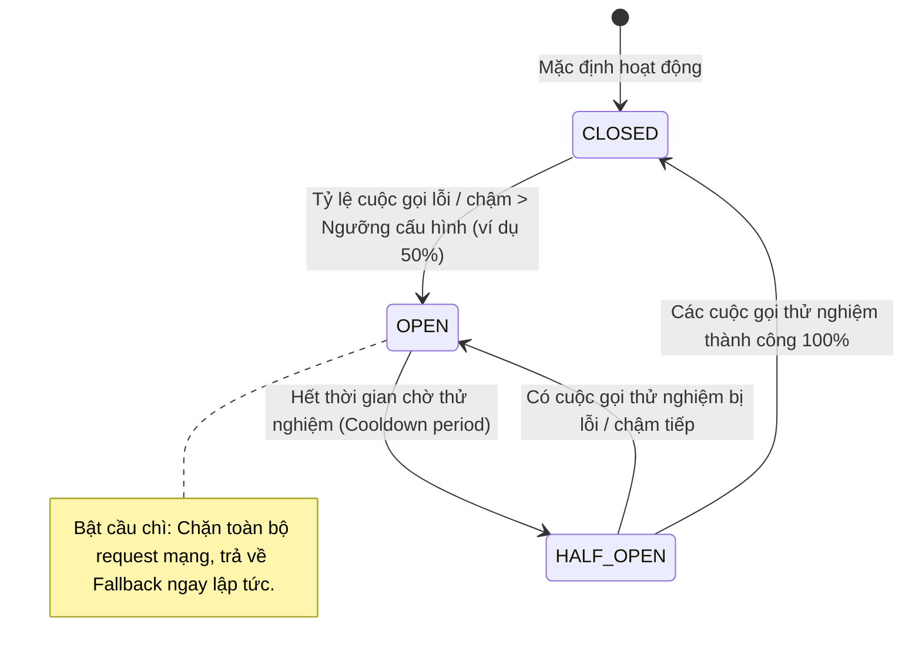

# Nếu downstream service chậm, service của bạn nên phản ứng thế nào?

## ⚡ Tóm tắt ngắn (30s)
* **Bản chất**: Đây là bài toán bảo vệ hệ thống trước lỗi lan truyền (**Cascading Failures**). Khi dịch vụ hạ nguồn (downstream) bị chậm, dịch vụ của bạn bắt buộc phải áp dụng triết lý **"Tự bảo vệ hệ thống (Self-Preservation)"** và **"Ngắt mạch nhanh (Fail-Fast)"** để tránh bị kéo sập theo.
* **Các thảm họa thực chiến được giải quyết**:
    1. **Nghẽn cổ chai tài nguyên diện rộng (Thread Pool Starvation)**: Service A gọi HTTP sang Service B bị chậm 5 giây. Nếu không có bảo vệ, các luồng xử lý của Service A sẽ bị kẹt chờ đợi, nhanh chóng làm cạn kiệt thread pool của Service A và khiến toàn bộ Service A ngừng hoạt động.
    2. **Quá tải lũy tiến cho đối tác (Amplified Overload)**: Downstream đang bị quá tải nhẹ. Service của bạn liên tục gửi thêm request và tự động retry vô tổ chức, biến sự cố nhỏ của đối tác thành thảm họa sập hệ thống hoàn toàn.
* **Quyết định Senior**: Triển khai thiết kế phòng vệ toàn diện sử dụng **Resilience4j**: thiết lập **Timeout** chặt chẽ, bọc các cuộc gọi bằng **Circuit Breaker** (Bộ ngắt mạch) để chủ động chặn đứng cuộc gọi khi tỷ lệ lỗi/chậm vượt ngưỡng, áp dụng **Bulkhead** để cô lập tài nguyên luồng, và luôn định nghĩa **Fallback Method** (Hành vi dự phòng) để đảm bảo trải nghiệm khách hàng không bị đứt gãy.

---

## 🔍 Chi tiết bản chất thực chiến

Để đối phó với sự chậm trễ của downstream service, một hệ thống phân tán vững chắc (resilient distributed system) phải triển khai 4 chốt chặn phòng ngự cốt lõi:

### 1. Circuit Breaker (Bộ ngắt mạch)
Hoạt động giống như cầu chì điện trong gia đình. Nó giám sát kết quả các cuộc gọi mạng và duy trì 3 trạng thái chính:
* **CLOSED (Đóng mạch)**: Trạng thái bình thường, mọi request được phép đi qua đến downstream.
* **OPEN (Hở mạch)**: Khi tỷ lệ lỗi hoặc số cuộc gọi chậm vượt ngưỡng (ví dụ: > 50% cuộc gọi bị trễ), bộ ngắt mạch lập tức "nảy cầu chì". Mọi request tiếp theo sẽ bị chặn ngay lập tức tại cổng và ném lỗi `CallNotPermittedException` để trả về kết quả dự phòng nhanh chóng mà không cần gọi mạng thực tế. Điều này giúp downstream có thời gian để tự phục hồi.
* **HALF-OPEN (Nửa mở)**: Sau một khoảng thời gian chờ (ví dụ 30 giây), bộ ngắt mạch cho phép một số lượng nhỏ request thử đi qua. Nếu các cuộc gọi thử này thành công, mạch sẽ đóng lại (CLOSED). Nếu tiếp tục thất bại, mạch lại mở ra (OPEN).

### 2. Timeouts (Giới hạn thời gian chờ)
* Luôn thiết lập cả hai thông số: `ConnectTimeout` (thời gian thiết lập kết nối mạng) và `ReadTimeout` (thời gian chờ nhận dữ liệu). Tuyệt đối không sử dụng giá trị mặc định vô hạn.

### 3. Bulkhead (Cô lập tài nguyên)
* Lấy cảm hứng từ các vách ngăn chống tràn trên tàu thủy. Chúng ta tách biệt các thread pool dành riêng cho từng downstream service khác nhau. Nếu Downstream B bị chậm và làm cạn kiệt thread pool của vách ngăn B, các luồng của vách ngăn A và C vẫn hoạt động hoàn toàn độc lập, không bị ảnh hưởng.

---

## 🎨 Sơ đồ trực quan (Trạng thái và luồng chuyển đổi Circuit Breaker)



---

## 💻 Code thực chiến / Cấu hình thực tế: BAD vs GOOD

### ❌ BAD: Thực hiện cuộc gọi mạng trực tiếp không có cơ chế bảo vệ và phòng vệ
Mã nguồn sử dụng `RestTemplate` mặc định bọc trực tiếp trong luồng xử lý API chính, không giới hạn thời gian chờ và không có cơ chế xử lý khi downstream gặp sự cố.

```java
@Service
public class OrderServiceBad {
    @Autowired
    private RestTemplate restTemplate;

    public OrderResponse processOrder(OrderRequest request) {
        // ❌ Không có Timeout, không có Circuit Breaker
        // Nếu payment-service bị treo 10 giây, luồng xử lý của OrderService cũng bị treo 10 giây
        PaymentResponse payment = restTemplate.postForObject(
            "http://payment-service/api/v1/charge", 
            request, 
            PaymentResponse.class
        );
        
        return new OrderResponse(request.getOrderId(), payment.getStatus());
    }
}
```

---

### ✅ GOOD: Tích hợp Resilience4j Circuit Breaker và Fallback Method an toàn
Sử dụng annotation `@CircuitBreaker` của Resilience4j để tự động bọc cuộc gọi mạng, cấu hình timeout chặt chẽ và khai báo phương thức dự phòng (fallback) để trả về thông tin mặc định hữu ích cho người dùng.

* **Cấu hình Resilience4j (application.yml)**:
```yaml
resilience4j:
  circuitbreaker:
    instances:
      paymentService:
        slidingWindowType: COUNT_BASED
        slidingWindowSize: 10              # Giám sát 10 cuộc gọi gần nhất
        failureRateThreshold: 50           # Ngắt mạch nếu lỗi >= 50%
        slowCallRateThreshold: 50          # Ngắt mạch nếu cuộc gọi chậm >= 50%
        slowCallDurationThreshold: 2000ms  # Định nghĩa cuộc gọi chậm là > 2 giây
        waitDurationInOpenState: 15000ms   # Thời gian giữ trạng thái OPEN là 15 giây trước khi chuyển sang HALF-OPEN
        permittedNumberOfCallsInHalfOpenState: 3 # Cho phép 3 cuộc gọi thử nghiệm ở HALF-OPEN
```

* **Mã nguồn Java tối ưu**:
```java
@Service
public class OrderServiceGood {
    private static final Logger logger = LoggerFactory.getLogger(OrderServiceGood.class);

    @Autowired
    private RestTemplate restTemplate;

    // ✅ Bọc bảo vệ Circuit Breaker và khai báo phương thức Fallback cứu hộ
    @CircuitBreaker(name = "paymentService", fallbackMethod = "processOrderFallback")
    public OrderResponse processOrder(OrderRequest request) {
        logger.info("Sending payment request for order: {}", request.getOrderId());
        
        PaymentResponse payment = restTemplate.postForObject(
            "http://payment-service/api/v1/charge", 
            request, 
            PaymentResponse.class
        );
        
        return new OrderResponse(request.getOrderId(), payment.getStatus());
    }

    // ✅ Phương thức Fallback cứu hộ - bắt buộc phải trùng tham số đầu vào và nhận thêm Exception
    public OrderResponse processOrderFallback(OrderRequest request, Throwable t) {
        logger.error("Payment service failed or slow! Activating fallback for order: {}. Reason: {}", 
            request.getOrderId(), t.getMessage());
        
        // Trả về trạng thái chờ xử lý an toàn thay vì nổ lỗi 500
        // Hệ thống sẽ sử dụng một Batch Job chạy ngầm để quét và đối soát thanh toán lại sau
        return new OrderResponse(request.getOrderId(), "PAYMENT_PENDING_FALLBACK");
    }
}
```

---

## 📊 Bảng so sánh các công cụ phòng vệ hệ thống

| Công cụ phòng vệ | Vai trò cốt lõi | Cách thức hoạt động | Phù hợp nhất khi nào? |
| :--- | :--- | :--- | :--- |
| **Timeout** | Chặn đứng thời gian chờ đợi | Ném exception khi vượt quá giới hạn mili-giây cấu hình. | Bắt buộc áp dụng cho **100%** mọi cuộc gọi mạng. |
| **Circuit Breaker** | Ngắt mạch tạm thời để tự phục hồi | Theo dõi tỷ lệ lỗi, tự động chặn đứng request đi tiếp khi chạm ngưỡng đỏ. | Bảo vệ các giao tiếp đồng bộ giữa các microservices nội bộ. |
| **Bulkhead** | Cô lập vùng ảnh hưởng của lỗi | Giới hạn số lượng thread hoặc semaphore chạy song song cho từng kênh. | Dành cho các tác vụ xuất dữ liệu nặng hoặc các API gọi sang third-party chậm chạp. |
| **Rate Limiter** | Giới hạn số lượng yêu cầu | Từ chối phục vụ (trả về lỗi HTTP 429) khi số lượng request/giây vượt giới hạn. | Bảo vệ hệ thống trước sự tấn công spam hoặc quá tải từ các Client bên ngoài. |

---

## ⚠️ Common Gotchas & Questions follow-up

### 1. Cạm bẫy "Bẫy lỗi sai kiểu trong Fallback Method"
* **Vấn đề**: Bạn khai báo `@CircuitBreaker(name = "serviceA", fallbackMethod = "myFallback")` nhưng khi chạy thực tế, ứng dụng vẫn crash nổ lỗi và không kích hoạt phương thức fallback.
* **Nguyên nhân**: Chữ ký (Signature) của phương thức Fallback viết sai quy định của Resilience4j. Phương thức fallback **bắt buộc** phải:
  1. Trùng tên được khai báo trong `@CircuitBreaker`.
  2. Có danh sách tham số đầu vào khớp hoàn toàn với phương thức gốc.
  3. Tham số cuối cùng **bắt buộc** phải là kiểu kế thừa của `Throwable` (để nhận diện lỗi).
  4. Có kiểu dữ liệu trả về trùng khớp hoàn toàn với phương thức gốc.
* **Giải pháp**: Luôn viết unit test giả lập lỗi để kiểm chứng phương thức fallback được kích hoạt chính xác trước khi đưa lên môi trường thật.

### 2. Câu hỏi đào sâu từ interviewer
* **Q: Trong mô hình Microservices phân tán, nếu toàn bộ chuỗi cuộc gọi A -> B -> C -> D đều kích hoạt Circuit Breaker đồng thời khi D bị sập, điều gì sẽ xảy ra? Làm thế nào để cấu hình tối ưu để tránh hiện tượng ngắt mạch lan truyền sai lệch?**
  * *Trả lời*: Đây là hiện tượng **Cascading Circuit Breaking (Ngắt mạch dây chuyền)**. Khi Service D bị sập, Service C ngắt mạch D. Tuy nhiên, nếu Service C không có fallback tốt và trực tiếp ném lỗi về cho B, B cũng sẽ ghi nhận lỗi và ngắt mạch C, kéo dài dây chuyền lên đến A.
  * Để khắc phục hiện tượng này, tôi sẽ thiết kế cấu hình tối ưu:
    1. **Local Fallbacks**: Mỗi tầng dịch vụ trung gian bắt buộc phải tự xử lý lỗi cục bộ của mình (Local Fallback) thay vì ném lỗi thô ngược lên tầng trên. Ví dụ: C sập thì B trả về dữ liệu cũ đã cache, không ném lỗi về A.
    2. **Exception Filtering**: Cấu hình Circuit Breaker ở các tầng trên bỏ qua các Exception thuộc nhóm business logic (như *UserNotFoundException*) hoặc các Exception do chính hệ thống ngắt mạch ở tầng dưới chủ động trả về, chỉ ghi nhận lỗi cho các lỗi hạ tầng mạng vật lý thực sự.
