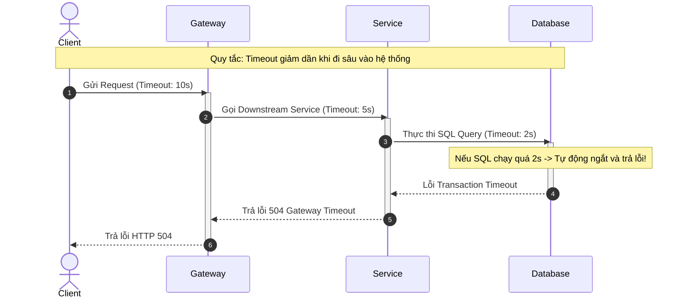

# Timeout nên đặt ở client, gateway, service hay database?

## ⚡ Tóm tắt ngắn (30s)
* **Bản chất**: Câu trả lời là **Bắt buộc phải đặt ở tất cả các tầng**, nhưng với giá trị khác nhau tuân theo quy tắc **"Timeout giảm dần theo chiều sâu (Cascading / Decreasing Timeouts)"**.
* **Các thảm họa thực chiến được giải quyết**:
    1. **Nghẽn cổ chai tài nguyên do rò rỉ kết nối (Connection Leak / Starvation)**: Nếu không đặt timeout ở database, một câu query bị lock sẽ giữ kết nối vật lý vô thời hạn, nhanh chóng làm cạn kiệt connection pool của server.
    2. **Lãng phí tài nguyên xử lý (Wasted Processing)**: Client đã bỏ cuộc (abort request) sau 5 giây vì chờ quá lâu, nhưng Gateway vẫn giữ kết nối sang Service, Service vẫn giữ kết nối chạy query nặng dưới DB trong 60 giây tiếp theo. Toàn bộ hệ thống chạy rỗng vô ích.
* **Quyết định Senior**: Áp dụng quy tắc **"Gateway Timeout > Service Timeout > Database Timeout"**. Khi request đi sâu vào hệ thống, thời gian sống còn lại (Time-To-Live) của request phải được tính toán động và đính kèm vào HTTP Headers (ví dụ: `X-Request-Timeout`) để các downstream service tự ngắt khi nhận thấy không còn đủ thời gian xử lý.

---

## 🔍 Chi tiết bản chất thực chiến

Việc đặt timeout ở mỗi tầng có mục đích bảo vệ riêng biệt. Hãy phân tích vai trò cụ thể:

### 1. Tầng Client (Trình duyệt, Mobile App)
* **Mục tiêu**: Bảo vệ trải nghiệm người dùng cuối. 
* **Hành động**: Thường đặt timeout lớn (ví dụ 10–15 giây) để chấp nhận các kết nối mạng di động (3G/4G) chập chờn, có độ trễ lớn.

### 2. Tầng API Gateway (Nginx, Spring Cloud Gateway, Kong)
* **Mục tiêu**: Giải phóng tài nguyên định tuyến (connections/threads của gateway) nhanh chóng để tiếp tục nhận traffic mới.
* **Hành động**: Đặt timeout ngắn hơn client (ví dụ 5–8 giây). Gateway là chốt chặn đầu tiên ngăn chặn các request "lười biếng" chiếm giữ socket.

### 3. Tầng Service (Application Layer)
* **Mục tiêu**: Bảo vệ thread pool của ứng dụng.
* **Hành động**: Đặt timeout ngắn hơn gateway (ví dụ 3–5 giây). Đây là nơi thực hiện các cuộc gọi API chéo (service-to-service). Các cuộc gọi này bắt buộc phải có timeout chặt chẽ để tránh thread starvation.

### 4. Tầng Database (Storage Layer)
* **Mục tiêu**: Bảo vệ kết nối vật lý và chống nghẽn CPU database.
* **Hành động**: Đặt timeout ngắn nhất (ví dụ 1–2 giây). Nếu một câu query SQL không hoàn thành trong vòng 2 giây, nó có vấn đề (thiếu index, khóa bảng) và cần bị hủy (`KILL`) ngay lập tức để giải phóng tài nguyên CPU/RAM cho các câu truy vấn lành mạnh khác.

---

## 🎨 Sơ đồ trực quan (Mô hình Cascading Timeouts)



---

## 💻 Code thực chiến / Cấu hình thực tế: BAD vs GOOD

### ❌ BAD: Không cấu hình Timeout ở tầng Web Client và Database Query
Sử dụng cấu hình mặc định vô hạn của Spring Boot RestTemplate và cấu hình Hibernate JPA không có giới hạn truy vấn SQL, tạo sơ hở cho sự cố treo luồng vô thời hạn.

* **Mã nguồn Spring Java tồi**:
```java
@Service
public class ReportServiceBad {
    @Autowired
    private EntityManager entityManager;

    public List<Object> getHeavyReport() {
        // ❌ Truy vấn SQL nặng không giới hạn thời gian chạy. 
        // Nếu DB bị lock, câu query này sẽ chạy vô tận và chiếm giữ 1 Connection trong pool mãi mãi.
        return entityManager.createQuery("SELECT o FROM HeavyOrder o")
                            .getResultList();
    }
}
```

---

### ✅ GOOD: Cấu hình Timeout đồng bộ tại Web Client và Database Query
Cấu hình chi tiết `connect-timeout` và `read-timeout` cho HTTP client, đồng thời thiết lập `querytimeout` ở tầng JDBC để bảo vệ tài nguyên hệ thống.

* **Cấu hình Web Client với Timeout chặt chẽ (Spring WebFlux WebClient)**:
```java
@Configuration
public class WebClientConfig {
    @Bean
    public WebClient webClient() {
        // ✅ Cấu hình HTTP Client có Timeout an toàn ở tầng Service
        HttpClient httpClient = HttpClient.create()
            .option(ChannelOption.CONNECT_TIMEOUT_MILLIS, 1000) // ✅ 1s kết nối mạng
            .responseTimeout(Duration.ofMillis(3000))           // ✅ 3s chờ nhận phản hồi
            .doOnConnected(conn -> conn
                .addHandlerLast(new ReadTimeoutHandler(3, TimeUnit.SECONDS))
                .addHandlerLast(new WriteTimeoutHandler(3, TimeUnit.SECONDS)));

        return WebClient.builder()
            .clientConnector(new ReactorClientHttpConnector(httpClient))
            .build();
    }
}
```

* **Mã nguồn Java JPA tối ưu hóa Timeout cho Database Query**:
```java
@Repository
public interface OrderRepository extends JpaRepository<Order, Long> {

    // ✅ Khai báo query timeout trực tiếp trên Spring Data JPA (Đơn vị: Giây)
    @QueryHints(value = {
        @QueryHint(name = "jakarta.persistence.query.timeout", value = "2000") // ✅ Hủy query nếu chạy quá 2 giây
    })
    @Query("SELECT o FROM Order o WHERE o.status = :status")
    List<Order> findByStatusWithTimeout(String status);
}
```

---

## 📊 Bảng tổng hợp cấu hình Timeout tối ưu theo kiến trúc chuẩn

| Tầng hệ thống | Tham số cấu hình cần thiết | Giá trị khuyến nghị (OLTP System) | Lợi ích mang lại |
| :--- | :--- | :--- | :--- |
| **Client** | HTTP Connection / Request Timeout | 10,000ms - 15,000ms | Đảm bảo kết nối mạng di động chập chờn không bị đứt gãy quá sớm. |
| **API Gateway** | Route Timeout / Read Timeout | 5,000ms - 8,000ms | Giải phóng socket định tuyến nhanh chóng khi service backend bị treo. |
| **Service (App)** | Connect Timeout / Read Timeout | Connect: 1,000ms<br>Read: 3,000ms | Bảo vệ Thread Pool của microservice hiện tại trước sự cố downstream chậm. |
| **Database** | Query Timeout / Transaction Timeout | 1,000ms - 2,000ms | Ngăn chặn các câu SQL không tối ưu chiếm dụng connection và CPU quá lâu. |

---

## ⚠️ Common Gotchas & Questions follow-up

### 1. Cạm bẫy "Báo động giả do Timeout không đồng bộ"
* **Vấn đề**: Bạn cấu hình **Gateway Timeout = 2 giây** và **Service Timeout = 5 giây**. Khi Service đang xử lý một tác vụ nặng tốn 3 giây, Gateway nhận thấy quá 2 giây liền chủ động ngắt kết nối và báo lỗi 504 về cho người dùng. Tuy nhiên, ở tầng backend, Service vẫn tiếp tục xử lý tác vụ thêm 1 giây nữa rồi ghi nhận thành công.
* **Hậu quả**: Người dùng nhận thông báo giao dịch thất bại (504), nhưng thực tế tiền vẫn bị trừ hoặc order vẫn được tạo thành công trong database, tạo ra tình trạng mất nhất quán dữ liệu nghiêm trọng.
* **Giải pháp**: Luôn tuân thủ tuyệt đối quy tắc **Gateway Timeout > Service Timeout**. Gateway bắt buộc phải kiên nhẫn chờ đợi lâu hơn thời gian xử lý tối đa của Service.

### 2. Câu hỏi đào sâu từ interviewer
* **Q: Làm thế nào để giải quyết bài toán "Lãng phí tài nguyên xử lý" (Wasted Processing) khi Client đã ngắt kết nối mạng nhưng Backend vẫn tiếp tục xử lý tác vụ ngầm vô ích?**
  * *Trả lời*: Để giải quyết triệt để vấn đề này, tôi sẽ triển khai cơ chế **Propagation of Request Cancellation (Truyền đạt sự hủy bỏ request)**:
    1. Trong Java, sử dụng **Spring WebFlux** hoặc **CompletableFuture / Reactive Programming** có hỗ trợ lan truyền tín hiệu hủy (Cancellation signal).
    2. Khi Client chủ động đóng kết nối (Abort), HTTP server (Netty/Tomcat) sẽ phát hiện ra sự kiện ngắt kết nối đột ngột này.
    3. Tín hiệu hủy này sẽ được truyền dọc theo luồng xử lý ứng dụng, kích hoạt hủy bỏ các thread đang chạy, và tự động gọi lệnh `CANCEL` truy vấn SQL đang thực thi dưới Database thông qua Driver JDBC.
    4. Việc này giúp thu hồi và giải phóng ngay lập tức CPU, RAM, và Connection cho hệ thống.
