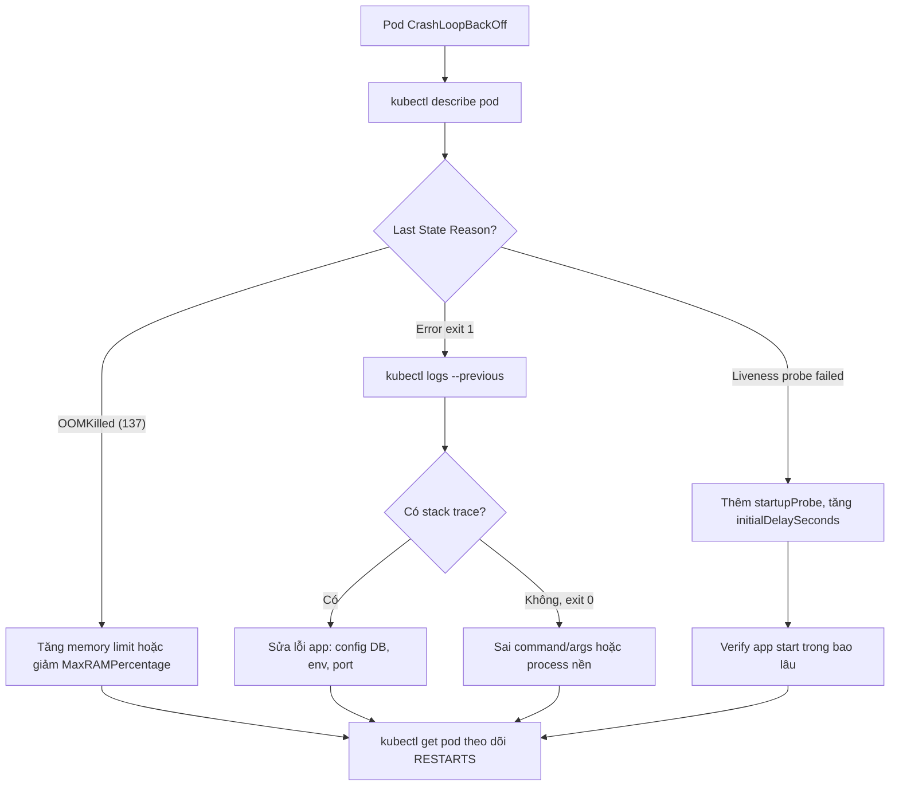

# Pod restart liên tục. Bạn debug thế nào?

## ⚡ Tóm tắt ngắn (30s)
* **Bản chất**: Pod restart liên tục (`CrashLoopBackOff`) là triệu chứng chứ không phải nguyên nhân. Kubernetes thấy container thoát ra (exit) hoặc bị probe giết, nên khởi động lại theo cơ chế **backoff lũy tiến** (10s → 20s → 40s → ... tối đa 5 phút). Senior Engineer không đoán mò mà debug theo **quy trình tầng lớp**: đọc trạng thái (`describe`) → đọc log lần chết trước (`logs --previous`) → phân loại nguyên nhân theo **Exit Code** → xác minh resource/probe/config.
* **Thảm họa thực chiến được giải quyết**:
  1. **Đổ lỗi sai chỗ**: Dev thấy Pod restart liền nghĩ "code lỗi", rollback bản deploy, nhưng thực ra Pod chết vì `liveness probe` gọi `/health` quá sớm (app cần 40s khởi động nhưng `initialDelaySeconds=10`). Rollback xong vẫn restart, mất 2 giờ vô ích.
  2. **CrashLoop ẩn của exit 137**: Pod restart đều đặn mỗi 3 phút, log không có exception. Thực chất là `OOMKilled` (kernel giết vì vượt cgroup memory limit), phải nhìn `kubectl describe` mới thấy `Last State: OOMKilled`.
* **Quyết định Senior**:
  1. **Luôn đọc `logs --previous`**: Log của container hiện tại (vừa start) thường sạch; nguyên nhân nằm ở lần chết trước.
  2. **Phân loại theo Exit Code**: `0` (thoát bình thường, sai command), `1` (lỗi app/exception), `137` (SIGKILL/OOMKilled), `143` (SIGTERM), `139` (segfault native).
  3. **Tách biệt "app chết" với "probe giết app"**: Nếu `describe` ghi `Liveness probe failed` thì lỗi ở probe config, không phải code.

---

## 🔍 Chi tiết bản chất thực chiến: Quy trình debug CrashLoopBackOff 5 bước

Khi một Pod ở trạng thái `CrashLoopBackOff`, ta đi tuần tự từ ngoài vào trong, không nhảy cóc:

### Bước 1: Đọc tổng quan trạng thái
* `kubectl get pod <pod> -o wide` xem `RESTARTS` tăng nhanh ra sao, Pod nằm trên Node nào (loại trừ lỗi Node).
* `kubectl describe pod <pod>` là vàng: phần `Last State` ghi rõ `Terminated` với `Reason` (Error / OOMKilled / Completed) và `Exit Code`. Phần `Events` ghi lý do probe fail, image pull lỗi, mount config lỗi.

### Bước 2: Đọc log của lần chết trước
* `kubectl logs <pod> --previous` (hay `-p`) lấy stdout/stderr của container **đã chết**. Đây là nơi chứa stack trace Java thật sự. Log của container hiện tại thường chỉ là lần khởi động mới.

### Bước 3: Phân loại theo Exit Code
* **Exit 0**: Container chạy xong rồi thoát — thường do sai `command/args`, hoặc app không phải process foreground (chạy nền rồi shell thoát).
* **Exit 1 / 2**: App ném exception khi khởi động — sai config DB, thiếu env var, port bị chiếm.
* **Exit 137 = 128 + 9 (SIGKILL)**: Bị kernel OOMKilled (vượt memory limit) hoặc bị `liveness probe` giết.
* **Exit 143 = 128 + 15 (SIGTERM)**: Bị yêu cầu tắt — thường liên quan tới shutdown/rollout.

### Bước 4: Kiểm tra Probe và Resource
* Nếu Events ghi `Liveness probe failed: HTTP 503` → app khởi động chậm hơn `initialDelaySeconds`. JVM Spring Boot thường cần 30–60s, dùng **startupProbe** để tách giai đoạn khởi động khỏi liveness.
* Nếu `Last State: OOMKilled` → memory limit thấp hơn nhu cầu thực (heap + metaspace + thread stacks). Xem chi tiết ở câu OOMKilled.

### Bước 5: Vào trong điều tra
* `kubectl exec -it <pod> -- sh` chỉ dùng được khi container còn sống đủ lâu. Với CrashLoop quá nhanh, tạm thời ghi đè `command: ["sleep", "3600"]` để giữ Pod sống mà vào shell điều tra config/biến môi trường.

---

## 🎨 Sơ đồ cây quyết định debug CrashLoopBackOff



---

## 💻 Code thực chiến: BAD vs GOOD

### ❌ BAD: Liveness probe giết app đang khởi động chậm
```yaml
# Spring Boot cần ~45s để start, nhưng probe gọi sau 10s và giết liên tục
livenessProbe:
  httpGet:
    path: /actuator/health
    port: 8080
  initialDelaySeconds: 10   # ❌ Quá sớm: app chưa lên, probe fail -> SIGKILL -> CrashLoop
  periodSeconds: 5
  failureThreshold: 3
```
Hậu quả: Pod chưa kịp khởi động đã bị giết, restart vô tận, exit code 137 nhưng KHÔNG phải OOM — dễ chẩn đoán nhầm.

### ✅ GOOD: Tách startupProbe khỏi liveness
```yaml
# startupProbe bảo vệ giai đoạn khởi động, liveness chỉ bật sau khi app đã lên
startupProbe:
  httpGet:
    path: /actuator/health/liveness
    port: 8080
  # Cho phép tối đa 30 x 5s = 150s để app khởi động xong
  failureThreshold: 30
  periodSeconds: 5
livenessProbe:
  httpGet:
    path: /actuator/health/liveness
    port: 8080
  periodSeconds: 10
  failureThreshold: 3      # ✅ Chỉ chạy SAU khi startupProbe pass
readinessProbe:
  httpGet:
    path: /actuator/health/readiness
    port: 8080
  periodSeconds: 10
```

### Bộ lệnh debug chuẩn (bash)
```bash
# 1. Tổng quan + đếm restart
kubectl get pod my-app -o wide
# 2. Lý do chết, exit code, events
kubectl describe pod my-app
# 3. Log của lần chết TRƯỚC (quan trọng nhất)
kubectl logs my-app --previous --tail=200
# 4. Xem event toàn namespace, sắp xếp theo thời gian
kubectl get events --sort-by=.lastTimestamp -n production
# 5. Giữ Pod sống để vào điều tra config (ghi đè command tạm thời)
kubectl debug my-app -it --image=busybox --target=app -- sh
```

### Cấu hình Spring Boot phơi bày health endpoints
```yaml
management:
  endpoint:
    health:
      probes:
        enabled: true   # bật /actuator/health/liveness và /readiness
  health:
    livenessstate:
      enabled: true
    readinessstate:
      enabled: true
```

---

## 📊 Bảng so sánh nguyên nhân CrashLoop theo Exit Code

| Exit Code | Tín hiệu / Ý nghĩa | Nguyên nhân thường gặp | Nơi tìm bằng chứng |
| :--- | :--- | :--- | :--- |
| **0** | Thoát bình thường | Sai `command/args`, process chạy nền rồi shell thoát | `describe` → Reason: Completed |
| **1 / 2** | Lỗi ứng dụng | Exception khi start: sai config DB, thiếu env, port chiếm | `logs --previous` (stack trace) |
| **137** | SIGKILL (128+9) | OOMKilled (vượt mem limit) hoặc liveness probe giết | `describe` → OOMKilled / Liveness failed |
| **143** | SIGTERM (128+15) | Bị yêu cầu tắt, shutdown chưa kịp hoàn tất | `describe` Events, rollout history |
| **139** | SIGSEGV (128+11) | Lỗi native: JNI, thư viện C, JVM crash | `hs_err_pid.log`, core dump |

---

## ⚠️ Common Gotchas & Questions follow-up

### 1. Cạm bẫy "Đọc nhầm log container hiện tại thay vì log lần chết"
* **Vấn đề**: Dev gõ `kubectl logs my-app` thấy log sạch, kết luận "app bình thường" rồi hoang mang vì Pod vẫn restart. Thực chất container hiện tại vừa khởi động lại 2 giây trước, chưa kịp chết. Nguyên nhân nằm trong log của **lần chết trước** mà chỉ `--previous` mới lấy được.
* **Giải pháp**: Luôn dùng `kubectl logs <pod> --previous` khi debug CrashLoop. Nếu container restart quá nhanh khiến không kịp ghi log ra hệ thống tập trung (ELK/Loki), tạm thời thêm `preStop` sleep hoặc dùng `kubectl debug` để giữ Pod.

### 2. Câu hỏi đào sâu từ interviewer
* **Interviewer: "Pod restart đúng mỗi 30 phút một lần, đều như đồng hồ, log không có exception, describe không ghi OOMKilled. Bạn nghi ngờ gì?"**
* **Trả lời**:
  1. **Memory leak chậm chạm trần limit**: Heap tăng tuyến tính, cứ 30 phút chạm `memory limit` → kernel OOMKill. Cần bật JVM in ra `Last State` và xác minh bằng `kubectl top pod` theo dõi RSS tăng dần. Bằng chứng OOM đôi khi không hiện rõ nếu là container OOM (cgroup) chứ không phải JVM OOM.
  2. **Liveness probe lỗi gián đoạn**: Endpoint `/health` phụ thuộc DB; mỗi 30 phút connection pool bị reset/timeout làm probe trả 503 đủ `failureThreshold` lần → bị giết. Sửa bằng cách tách liveness (chỉ kiểm tra process còn sống) khỏi readiness (kiểm tra dependency).
  3. **Cron-driven workload**: Một job nội bộ chạy mỗi 30 phút nạp dữ liệu lớn gây spike RAM tức thời. Giải pháp: tách job sang `CronJob` riêng, hoặc nâng limit và giảm `MaxRAMPercentage`.
