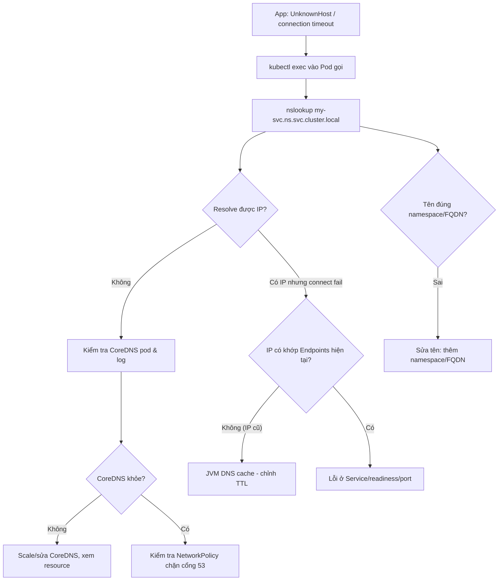

# Service DNS trong cluster lỗi gây connection fail. Bạn debug ra sao?

## ⚡ Tóm tắt ngắn (30s)
* **Bản chất**: Trong Kubernetes, service giao tiếp với nhau qua **tên DNS** (`my-svc.namespace.svc.cluster.local`) do **CoreDNS** phân giải. Khi DNS lỗi, app nhận `UnknownHostException` / connection timeout dù service đích hoàn toàn khỏe. Nguyên nhân trải nhiều tầng: sai tên/namespace, CoreDNS quá tải hoặc crash, **`ndots:5` gây khuếch đại truy vấn DNS**, NetworkPolicy chặn cổng 53, hoặc JVM **cache DNS vĩnh viễn** giữ IP cũ sau khi Pod đích đổi IP.
* **Thảm họa thực chiến**:
  1. **JVM cache IP chết**: service đích restart đổi ClusterIP/Pod IP, nhưng JVM (mặc định cache DNS theo `networkaddress.cache.ttl`) giữ IP cũ → connect mãi vào IP đã chết → `Connection refused` kéo dài cho tới khi restart Pod gọi.
  2. **`ndots:5` làm CoreDNS quá tải**: mỗi lần resolve một host ngoài, Pod thử nối lần lượt các search domain (`.svc.cluster.local`, `.cluster.local`...) → 5–10 truy vấn DNS cho **một** hostname → CoreDNS nghẽn, latency tăng, timeout dây chuyền.
* **Quyết định Senior**:
  1. **Debug từ trong Pod**: `nslookup`/`dig` từ chính Pod gặp lỗi, không đoán từ ngoài.
  2. **Kiểm tra CoreDNS** (pod, log, metric, ConfigMap) và `/etc/resolv.conf` của Pod.
  3. **Chỉnh JVM DNS TTL** và cân nhắc `dnsConfig ndots:2` cho service gọi nhiều domain ngoài.

---

## 🔍 Chi tiết bản chất thực chiến: quy trình debug DNS theo tầng

### Tầng 1: Tên và namespace
* Trong cùng namespace: gọi `my-svc` là đủ. Khác namespace: phải `my-svc.other-ns` hoặc FQDN `my-svc.other-ns.svc.cluster.local`. Gọi `my-svc` từ namespace khác sẽ **không resolve** → lỗi.

### Tầng 2: Resolver của Pod
* Xem `/etc/resolv.conf` trong Pod: `nameserver` phải trỏ tới ClusterIP của CoreDNS (thường `10.96.0.10`); `search` chứa các domain; `options ndots:5`.
* `ndots:5` nghĩa là: hostname có **ít hơn 5 dấu chấm** sẽ được thử nối lần lượt với từng search domain trước khi thử như tên tuyệt đối. Gọi `api.github.com` (2 dots) → thử `api.github.com.ns.svc.cluster.local`, `...cluster.local`... rồi mới tới `api.github.com.` → nhiều truy vấn thừa.

### Tầng 3: CoreDNS khỏe không
* `kubectl -n kube-system get pod -l k8s-app=kube-dns` xem CoreDNS có chạy/restart. Log CoreDNS có lỗi `SERVFAIL`, plugin error? Metric `coredns_dns_request_duration_seconds` cao? CoreDNS thiếu replica/resource khi cluster lớn là nguyên nhân nghẽn phổ biến.

### Tầng 4: NetworkPolicy / cổng 53
* Một NetworkPolicy "default deny egress" có thể **chặn UDP/TCP 53** tới CoreDNS → mọi resolve fail. Phải mở egress tới kube-system DNS.

### Tầng 5: JVM DNS cache
* JVM cache kết quả DNS theo `networkaddress.cache.ttl` (security property). Mặc định với SecurityManager là cache **vĩnh viễn** (`-1`); không có thì ~30s. Service Kubernetes đổi IP thường xuyên → JVM giữ IP cũ gây lỗi. Đặt TTL ngắn (vd 30–60s) hoặc resolve lại mỗi connection.

---

## 🎨 Sơ đồ cây debug DNS trong cluster



---

## 💻 Code thực chiến: BAD vs GOOD

### ❌ BAD: JVM giữ IP DNS cũ + ndots mặc định cho app gọi nhiều domain ngoài
```java
// ❌ Không cấu hình DNS TTL -> với một số setup cache vĩnh viễn -> giữ IP chết
public class HttpClientHolder {
    static final HttpClient client = HttpClient.newHttpClient();
    // gọi http://payment-svc:8080 ; nếu payment-svc đổi IP, client kẹt IP cũ
}
```

### ✅ GOOD: chỉnh DNS TTL + dnsConfig hợp lý
```java
// ✅ Đặt sớm trong main() trước khi tạo socket: TTL ngắn để theo kịp IP đổi
public class App {
    public static void main(String[] args) {
        java.security.Security.setProperty("networkaddress.cache.ttl", "30");
        java.security.Security.setProperty("networkaddress.cache.negative.ttl", "10");
        SpringApplication.run(App.class, args);
    }
}
```
```yaml
# Pod gọi nhiều domain NGOÀI cluster: giảm ndots để bớt truy vấn thừa
spec:
  dnsConfig:
    options:
    - name: ndots
      value: "2"          # ✅ giảm khuếch đại search domain (mặc định 5)
  # Có thể cân nhắc NodeLocal DNSCache để giảm tải CoreDNS
```

### Bash: bộ lệnh debug DNS
```bash
# 1. Resolve từ chính Pod gặp lỗi
kubectl exec -it my-app -- nslookup payment-svc.prod.svc.cluster.local
# 2. Xem resolver của Pod
kubectl exec my-app -- cat /etc/resolv.conf
# 3. CoreDNS khỏe không
kubectl -n kube-system get pods -l k8s-app=kube-dns
kubectl -n kube-system logs -l k8s-app=kube-dns --tail=100
# 4. Endpoints của service đích có IP đúng không
kubectl get endpoints payment-svc -n prod
# 5. Test bằng Pod debug có sẵn tool mạng
kubectl run dnsutils --rm -it --image=registry.k8s.io/e2e-test-images/jessie-dnsutils:1.3 -- sh
```

---

## 📊 Bảng so sánh các nguyên nhân DNS fail

| Nguyên nhân | Triệu chứng | Cách xác minh | Khắc phục |
| :--- | :--- | :--- | :--- |
| **Sai tên/namespace** | NXDOMAIN ngay | `nslookup` trong Pod | Dùng FQDN hoặc đúng namespace |
| **CoreDNS quá tải/crash** | Timeout, SERVFAIL từng lúc | log + metric CoreDNS | Scale CoreDNS, NodeLocal DNSCache |
| **ndots:5 khuếch đại** | Latency DNS cao, nhiều query | `tcpdump`/metric query rate | `dnsConfig ndots:2`, FQDN có dấu chấm cuối |
| **NetworkPolicy chặn 53** | Mọi resolve fail sau khi thêm policy | Test egress, xem policy | Mở egress tới kube-dns |
| **JVM cache IP cũ** | Connect vào IP đã chết | So IP cache với Endpoints | `networkaddress.cache.ttl=30` |

---

## ⚠️ Common Gotchas & Questions follow-up

### 1. Cạm bẫy "JVM DNS cache vĩnh viễn giữ IP của Pod đã chết"
* **Vấn đề**: Service đích được deploy lại, ClusterIP giữ nguyên nhưng nếu app gọi **headless service** hoặc resolve trực tiếp Pod IP, IP đổi sau mỗi rollout. JVM với `networkaddress.cache.ttl=-1` (cache mãi mãi, mặc định khi có SecurityManager) giữ IP cũ → mọi request fail `Connection refused` cho tới khi **restart Pod gọi**. Cực khó debug vì service đích "rõ ràng đang chạy".
* **Giải pháp**: Đặt `networkaddress.cache.ttl` ngắn (30–60s) trong `java.security` hoặc bằng `Security.setProperty` lúc khởi động. Với ClusterIP service thông thường thì IP ổn định nên ít gặp; nhưng headless service / direct pod IP thì bắt buộc phải chỉnh TTL. Dùng HTTP client resolve lại DNS mỗi request cũng giúp.

### 2. Câu hỏi đào sâu từ interviewer
* **Interviewer: "DNS thỉnh thoảng timeout ngẫu nhiên dưới tải cao, không cố định service nào. Bạn nghi gì?"**
* **Trả lời**:
  1. **CoreDNS bị nghẽn do `ndots:5` khuếch đại**: mỗi hostname ngoài sinh nhiều truy vấn; dưới tải cao, tổng QPS DNS vọt lên, CoreDNS hết CPU/conntrack → timeout ngẫu nhiên. Khắc phục: giảm `ndots`, thêm dấu chấm cuối cho FQDN ngoài (`api.github.com.`), tăng replica CoreDNS.
  2. **`conntrack` race / UDP DNS trên một số kernel cũ**: lỗi kinh điển khiến gói DNS UDP bị drop ngẫu nhiên dưới tải. Khắc phục: dùng **NodeLocal DNSCache** (chạy DNS cache trên mỗi node, dùng TCP tới CoreDNS) để loại bỏ race và giảm latency.
  3. **Thiếu resource CoreDNS**: CoreDNS không có HPA mặc định; cluster lớn lên nhưng CoreDNS vẫn 2 replica → quá tải. Cấp request/limit hợp lý và cân nhắc autoscale theo số node.
