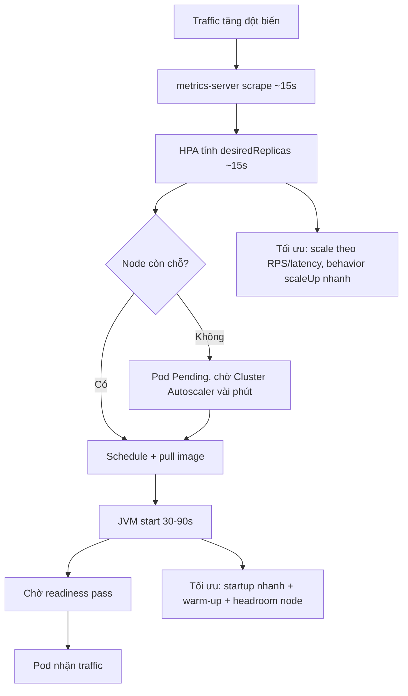

# Horizontal Pod Autoscaler scale chậm. Bạn xử lý thế nào?

## ⚡ Tóm tắt ngắn (30s)
* **Bản chất**: HPA scale chậm là tổng của nhiều độ trễ cộng dồn, KHÔNG phải một nguyên nhân: (1) **metric trễ** — metrics-server scrape mỗi ~15s, HPA tính mỗi ~15s; (2) **đo sai tín hiệu** — scale theo CPU trong khi nút thắt là độ dài hàng đợi/độ trễ; (3) **CPU-based HPA phản ứng muộn vì JVM warm-up** làm CPU cao giả lúc start; (4) **`behavior` stabilization window** mặc định cho scale-down 5 phút (và scale-up có trần tốc độ); (5) **thiếu node** → Pod mới `Pending` chờ Cluster Autoscaler thêm node (vài phút). Senior xử lý bằng cách **rút ngắn từng mắt xích** và **scale theo đúng tín hiệu**.
* **Thảm họa thực chiến**:
  1. **Burst traffic, HPA phản ứng sau 2–3 phút**: traffic tăng gấp 5 lúc 9h sáng, HPA thấy CPU tăng sau 15–30s, tạo Pod mới, Pod Java mất 60s khởi động + chờ readiness → khách chịu lỗi suốt vài phút.
  2. **Đo nhầm tín hiệu**: service I/O-bound (chờ DB), CPU thấp nên HPA không scale dù latency đã thảm họa và hàng đợi đầy.
* **Quyết định Senior**:
  1. **Scale theo metric phản ánh đúng tải**: RPS, queue length, latency p95 (custom/external metrics) thay vì chỉ CPU.
  2. **Tinh chỉnh `behavior`**: cho scale-up nhanh, scale-down chậm có kiểm soát.
  3. **Giảm thời gian Pod mới sẵn sàng**: startup nhanh + warm-up + dự phòng node.

---

## 🔍 Chi tiết bản chất thực chiến: chuỗi độ trễ của HPA

### Tổng độ trễ từ lúc tải tăng đến lúc có Pod phục vụ
$$T_{phản ứng} = T_{scrape\,metric} + T_{HPA\,sync} + T_{schedule} + T_{pull\,image} + T_{JVM\,start} + T_{readiness}$$
Mỗi mắt xích vài chục giây; với Java, `T_{JVM start} + T_{readiness}` thường là phần lớn nhất (30–90s). Rút ngắn tổng = tấn công mắt xích lớn nhất trước.

### Vì sao CPU-based HPA hay phản ứng muộn/sai
* **JVM warm-up làm CPU nhiễu**: lúc start, JIT compile + classload đẩy CPU lên cao → HPA tưởng tải cao và scale oan; ngược lại service I/O-bound thì CPU thấp dù đang nghẽn → HPA không scale.
* CPU là proxy gián tiếp cho tải. Đo trực tiếp **cái người dùng cảm nhận** (RPS, latency, queue depth) chính xác hơn.

### `behavior` điều khiển tốc độ scale
* `scaleUp`: mặc định cho phép tăng nhanh (gấp đôi hoặc +4 Pod mỗi 15s, lấy lớn hơn), `stabilizationWindowSeconds: 0`.
* `scaleDown`: mặc định **stabilization 300s** (chống flapping) — đây là lý do scale-down luôn "chậm", và đó là **cố ý**. Scale-up chậm mới là vấn đề cần sửa.

### Pod mới kẹt vì thiếu node
* Nếu cluster hết tài nguyên, Pod mới `Pending` → phải chờ **Cluster Autoscaler** thêm node (provision VM vài phút). HPA "scale" rồi nhưng không có chỗ chạy → vô dụng. Cần **headroom node** hoặc **over-provisioning** (Pod giả pause priority thấp giữ chỗ).

---

## 🎨 Sơ đồ chuỗi độ trễ và điểm tối ưu HPA



---

## 💻 Code thực chiến: BAD vs GOOD

### ❌ BAD: HPA chỉ theo CPU, không tinh chỉnh behavior
```yaml
apiVersion: autoscaling/v2
kind: HorizontalPodAutoscaler
metadata:
  name: api
spec:
  scaleTargetRef: { apiVersion: apps/v1, kind: Deployment, name: api }
  minReplicas: 2
  maxReplicas: 20
  metrics:
  - type: Resource
    resource:
      name: cpu
      target: { type: Utilization, averageUtilization: 80 }
  # ❌ CPU nhiễu do JVM warm-up; ❌ không behavior -> scale-down mặc định chậm
```

### ✅ GOOD: scale theo RPS + CPU, behavior scale-up nhanh
```yaml
apiVersion: autoscaling/v2
kind: HorizontalPodAutoscaler
metadata:
  name: api
spec:
  scaleTargetRef: { apiVersion: apps/v1, kind: Deployment, name: api }
  minReplicas: 3
  maxReplicas: 30
  metrics:
  - type: Pods                      # ✅ custom metric: RPS mỗi Pod (qua Prometheus Adapter)
    pods:
      metric: { name: http_requests_per_second }
      target: { type: AverageValue, averageValue: "100" }
  - type: Resource
    resource:
      name: cpu
      target: { type: Utilization, averageUtilization: 70 }
  behavior:
    scaleUp:
      stabilizationWindowSeconds: 0
      policies:
      - type: Percent
        value: 100                  # ✅ cho phép tăng gấp đôi mỗi 15s
        periodSeconds: 15
      - type: Pods
        value: 4
        periodSeconds: 15
      selectPolicy: Max
    scaleDown:
      stabilizationWindowSeconds: 300   # ✅ giảm chậm có kiểm soát, chống flapping
      policies:
      - type: Percent
        value: 50
        periodSeconds: 60
```

### Spring: phơi bày RPS cho Prometheus để HPA dùng
```java
@Component
public class RpsMetrics {
    public RpsMetrics(MeterRegistry registry) {
        // micrometer tự tạo http_server_requests; tạo thêm gauge RPS nếu cần custom
        Gauge.builder("http_requests_per_second", this, RpsMetrics::currentRps)
             .register(registry);
    }
    private double currentRps() { /* tính từ cửa sổ trượt */ return 0.0; }
}
```

---

## 📊 Bảng so sánh metric scale & cách tăng tốc

| Cách scale | Phản ánh tải | Độ trễ phát hiện | Hợp với | Nhược điểm |
| :--- | :--- | :--- | :--- | :--- |
| **CPU utilization** | Gián tiếp | Trung bình, nhiễu warm-up | Service CPU-bound | Sai cho I/O-bound |
| **RPS (custom metric)** | Trực tiếp | Nhanh nếu metric tươi | API HTTP | Cần Prometheus Adapter |
| **Queue length** | Trực tiếp tải tồn đọng | Nhanh | Worker/consumer | Cần expose metric |
| **Latency p95** | Theo trải nghiệm | Trễ hơn chút | SLA-driven | Có thể phản ứng muộn |
| **KEDA (event-driven)** | Theo event (Kafka lag...) | Rất nhanh, scale-to-zero | Async/queue | Thêm component |

---

## ⚠️ Common Gotchas & Questions follow-up

### 1. Cạm bẫy "Scale Pod nhưng quên scale node — Pod Pending vô dụng"
* **Vấn đề**: HPA tăng `replicas` từ 5 lên 20, nhưng cluster không còn tài nguyên → 15 Pod mới kẹt `Pending`. HPA report "đã scale" nhưng thực tế **không có Pod nào phục vụ thêm**. Cluster Autoscaler phải provision VM mới mất 2–5 phút → đúng lúc burst thì vẫn down. Đây là điểm mù phổ biến: chỉ nhìn HPA mà quên tầng node.
* **Giải pháp**: (1) Giữ **headroom node** thường trực, hoặc dùng **over-provisioning** — Pod "pause" priority thấp giữ sẵn chỗ, khi cần thì bị preempt nhường chỗ cho Pod thật (chỗ đã sẵn, không chờ provision). (2) Cấu hình Cluster Autoscaler scale-up nhanh, dùng node group warm. (3) Theo dõi cả Pod Pending lẫn HPA.

### 2. Câu hỏi đào sâu từ interviewer
* **Interviewer: "Traffic có pattern dự đoán được (cao điểm 9h sáng mỗi ngày). HPA reactive vẫn trễ. Làm gì tốt hơn?"**
* **Trả lời**:
  1. **Scale chủ động theo lịch (predictive/scheduled)**: dùng `CronJob`/KEDA Cron scaler hoặc tăng `minReplicas` trước cao điểm (vd 8h45 nâng minReplicas) để Pod đã sẵn sàng (đã warm) trước khi traffic tới — loại bỏ hoàn toàn độ trễ reactive.
  2. **KEDA event-driven** cho workload async: scale theo **Kafka consumer lag** trực tiếp, phản ứng tức thì với tồn đọng, hỗ trợ scale-to-zero tiết kiệm chi phí lúc thấp điểm.
  3. **Giảm thời gian Pod sẵn sàng** (đòn bẩy lớn nhất cho Java): startup nhanh (AppCDS, CRaC, hoặc native image GraalVM), warm-up endpoint trước khi readiness pass, để mỗi Pod mới online trong vài giây thay vì cả phút — khi đó HPA reactive cũng đủ nhanh.
