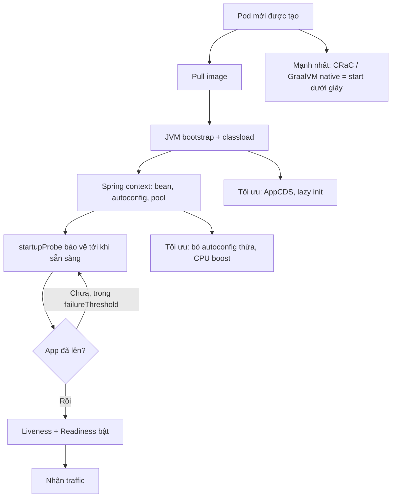

# Startup time Java service quá lâu ảnh hưởng deployment. Bạn tối ưu gì?

## ⚡ Tóm tắt ngắn (30s)
* **Bản chất**: JVM khởi động chậm vì phải **classload hàng nghìn class**, **JIT compile** từ interpreter, và Spring phải **quét classpath, khởi tạo bean, kết nối DB/pool** trước khi sẵn sàng. Một Spring Boot điển hình mất 30–90s. Trong Kubernetes, startup chậm gây hậu quả dây chuyền: **rollout lâu** (mỗi Pod chờ readiness), **HPA phản ứng vô dụng** (Pod mới chưa kịp lên thì burst đã qua), **dễ fail startupProbe** → CrashLoop, và **CPU spike lúc start** làm các Pod cùng node bị throttle.
* **Thảm họa thực chiến**:
  1. **Rollback chậm chết người**: sự cố production, cần rollback gấp, nhưng mỗi Pod mất 80s khởi động × rolling → mất nhiều phút mới khôi phục, kéo dài downtime.
  2. **Autoscale không kịp**: HPA tạo Pod mới khi burst, nhưng 90s sau Pod mới ready thì đỉnh tải đã đi qua, khách đã chịu lỗi.
  3. **CPU limit thấp làm start càng lâu**: throttle lúc JIT compile → startup từ 40s lên 120s → fail startupProbe → restart vô tận.
* **Quyết định Senior**:
  1. **`startupProbe`** để tách giai đoạn khởi động, không bị liveness giết oan.
  2. **Tăng CPU lúc start** (startup boost) vì start là CPU-intensive.
  3. **Giảm startup gốc**: AppCDS, lazy init, ít auto-config, hoặc **CRaC / GraalVM native** cho khởi động dưới giây.

---

## 🔍 Chi tiết bản chất thực chiến: startup chậm ở đâu và sửa thế nào

### Phân rã thời gian khởi động
* **JVM bootstrap**: load core class, init heap/GC.
* **Classloading ứng dụng**: đọc và verify bytecode hàng nghìn class — tốn I/O và CPU.
* **Spring context**: component scan, tạo bean, proxy AOP, auto-configuration (nhiều starter = nhiều cấu hình thừa).
* **Kết nối ngoài**: tạo connection pool DB, kết nối Kafka/Redis, chạy migration (Flyway/Liquibase).
* **JIT warm-up**: code chạy interpreter trước, C1/C2 compile dần — app "lạnh" chậm vài phút đầu.

### Đòn bẩy giảm startup (từ rẻ tới mạnh)
1. **Tăng CPU lúc start**: vì start CPU-intensive, cấp nhiều CPU đầu rồi giảm (Kubernetes 1.27+ in-place resize, hoặc đơn giản đặt request đủ lớn). Tránh CPU limit thấp gây throttle lúc JIT.
2. **Lazy initialization**: `spring.main.lazy-initialization=true` — bean chỉ tạo khi cần. Giảm startup đáng kể nhưng request đầu chậm hơn.
3. **AppCDS (Application Class-Data Sharing)**: dump class đã load vào archive, lần sau JVM mmap thẳng → bỏ qua phần classload/verify. Giảm 20–40% startup.
4. **Loại auto-config thừa**: chỉ giữ starter cần thiết; `@SpringBootApplication(exclude=...)`.
5. **CRaC (Coordinated Restore at Checkpoint)**: chụp snapshot tiến trình đã warm, restore trong **vài chục ms**. Cần JVM hỗ trợ (Azul Zulu CRaC).
6. **GraalVM Native Image**: biên dịch AOT ra binary, startup ~**vài chục ms**, RAM thấp — nhưng mất tính linh hoạt JIT, build phức tạp, một số reflection cần khai báo.

### Tách giai đoạn khởi động bằng startupProbe
* `startupProbe` cho app **toàn bộ thời gian cần** để lên (vd 150s) mà không bị liveness giết. Liveness/readiness chỉ bắt đầu sau khi startupProbe pass → không CrashLoop oan vì khởi động chậm.

---

## 🎨 Sơ đồ tối ưu startup Java trong K8s



---

## 💻 Code thực chiến: BAD vs GOOD

### ❌ BAD: không startupProbe, CPU thấp, không tối ưu
```yaml
containers:
- name: app
  image: api:v1
  resources:
    limits: { cpu: "300m" }     # ❌ throttle lúc JIT -> start cực lâu
  livenessProbe:
    httpGet: { path: /health, port: 8080 }
    initialDelaySeconds: 20     # ❌ app cần 80s -> bị giết khi đang start -> CrashLoop
    periodSeconds: 5
```

### ✅ GOOD: startupProbe + CPU đủ + AppCDS + lazy
```yaml
containers:
- name: app
  image: api:v1
  resources:
    requests: { cpu: "1", memory: "1Gi" }
    limits:   { memory: "1Gi" }      # ✅ không limit CPU -> không throttle lúc start
  startupProbe:
    httpGet: { path: /actuator/health/liveness, port: 8080 }
    failureThreshold: 30             # ✅ tối đa 30 x 5s = 150s để start
    periodSeconds: 5
  livenessProbe:
    httpGet: { path: /actuator/health/liveness, port: 8080 }
    periodSeconds: 10
    failureThreshold: 3              # ✅ chỉ chạy sau startupProbe
  readinessProbe:
    httpGet: { path: /actuator/health/readiness, port: 8080 }
    periodSeconds: 10
```

### Dockerfile: bật AppCDS để rút ngắn classload
```dockerfile
FROM eclipse-temurin:21-jre
COPY app.jar /app.jar
# Tạo CDS archive lúc build (chạy thử app sinh classlist rồi dump)
RUN java -XX:ArchiveClassesAtExit=/app.jsa -jar /app.jar --spring.context.exit=onRefresh || true
ENTRYPOINT ["java", \
  "-XX:SharedArchiveFile=/app.jsa", \
  "-XX:+TieredCompilation", "-XX:TieredStopAtLevel=1", \
  "-XX:MaxRAMPercentage=70.0", \
  "-jar", "/app.jar"]
```
```properties
# application.properties: giảm khối lượng khởi động
spring.main.lazy-initialization=true
spring.jmx.enabled=false
spring.flyway.enabled=true
# Chỉ giữ autoconfig cần thiết; tránh include starter không dùng
```

---

## 📊 Bảng so sánh các kỹ thuật giảm startup

| Kỹ thuật | Mức giảm startup | Đánh đổi | Độ phức tạp |
| :--- | :--- | :--- | :--- |
| **startupProbe + CPU boost** | Không giảm gốc, nhưng tránh CrashLoop & throttle | Tốn CPU lúc start | Thấp |
| **Lazy initialization** | 20–40% | Request đầu chậm, lỗi config phát hiện muộn | Thấp |
| **AppCDS** | 20–40% | Build thêm bước tạo archive | Trung bình |
| **CRaC (checkpoint/restore)** | ~100x (dưới giây) | Cần JVM CRaC, xử lý state lúc snapshot | Cao |
| **GraalVM Native Image** | ~100x + RAM thấp | Mất JIT, build lâu, reflection phải khai báo | Cao |

---

## ⚠️ Common Gotchas & Questions follow-up

### 1. Cạm bẫy "CPU limit thấp biến startup chậm thành CrashLoop"
* **Vấn đề**: Để "tiết kiệm", team đặt `limits.cpu: 300m`. Lúc khởi động, JIT compiler + classloading cần burst CPU nhưng bị CFS throttle → startup phình từ 40s lên 130s. `startupProbe` (hoặc liveness) hết `failureThreshold` trước khi app lên → bị giết → restart → lại start chậm → **CrashLoopBackOff** dù code hoàn toàn đúng. Rất khó chẩn đoán vì "chạy local thì nhanh".
* **Giải pháp**: Cấp **nhiều CPU cho giai đoạn start** — bỏ CPU limit hoặc đặt rộng, dùng `requests.cpu` đủ lớn để scheduler đảm bảo core. Với Kubernetes 1.27+ có thể dùng in-place resize giảm CPU sau khi app ổn định. Luôn cấu hình `startupProbe` rộng rãi để app có đủ thời gian lên.

### 2. Câu hỏi đào sâu từ interviewer
* **Interviewer: "Bạn chọn CRaC hay GraalVM native cho service cần startup nhanh? Dựa trên tiêu chí nào?"**
* **Trả lời**:
  1. **GraalVM native** phù hợp khi muốn **startup dưới giây + RAM thấp** và service tương đối ổn định về dependency: lý tưởng cho serverless, scale-to-zero, hàm ngắn. Đánh đổi: build chậm, mất JIT (throughput đỉnh thấp hơn JVM cho workload chạy lâu CPU-bound), reflection/proxy/dynamic phải khai báo hint — refactor tốn công với codebase Spring lớn cũ.
  2. **CRaC** phù hợp khi muốn **giữ nguyên JVM/JIT** (throughput đỉnh cao cho service chạy lâu) mà vẫn restore nhanh: chụp snapshot sau khi app đã warm. Đánh đổi: phải xử lý state mở lúc checkpoint (đóng/mở lại connection, file handle), cần JVM hỗ trợ CRaC, snapshot phụ thuộc môi trường.
  3. **Quyết định của tôi**: service request-driven chạy lâu, nhạy throughput → **CRaC**; service scale-to-zero/burst nhiều, ưu tiên startup & footprint → **GraalVM native**. Trước khi nhảy sang hai cái đó, luôn thử AppCDS + lazy init + CPU boost vì rẻ và đủ tốt cho phần lớn trường hợp.
