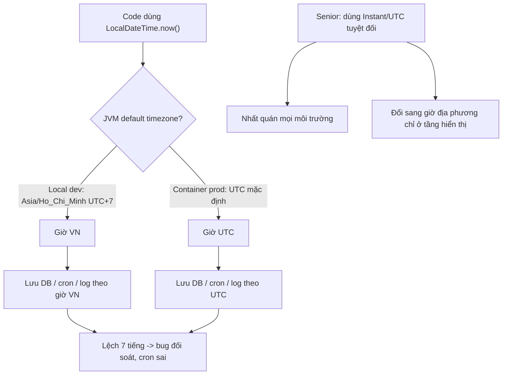

# Container clock/timezone khác expectation gây bug gì?

## ⚡ Tóm tắt ngắn (30s)
* **Bản chất**: Container mặc định chạy timezone **UTC** (image base thường không có `/etc/localtime` trỏ tới vùng cụ thể), trong khi dev test ở máy local theo giờ Việt Nam (`Asia/Ho_Chi_Minh`, UTC+7). Nếu code dùng **giờ local của JVM** (`LocalDateTime.now()`, `new Date()` rồi format không nêu zone), kết quả lệch **7 tiếng** giữa local và production → bug âm thầm: cron chạy sai giờ, log lệch thời gian, dữ liệu lưu sai mốc, token hết hạn sớm/muộn, báo cáo sai ngày. **Clock skew** (đồng hồ container lệch giờ thực) thì hiếm vì container chia sẻ kernel clock với host, nhưng vẫn gây lỗi với JWT/TOTP/chữ ký nếu host lệch NTP.
* **Thảm họa thực chiến**:
  1. **Cron job chạy lệch 7 tiếng**: job "chốt sổ cuối ngày 23:59" cấu hình theo giờ local; production UTC nên chạy lúc 06:59 sáng hôm sau theo giờ VN → báo cáo sai ngày, đối soát lệch.
  2. **Bản ghi lưu sai mốc**: `LocalDateTime.now()` lưu vào DB không kèm zone; local ghi giờ VN, prod ghi giờ UTC → cùng cột nhưng hai ý nghĩa → truy vấn theo ngày sai.
  3. **JWT/TOTP fail do skew**: host lệch NTP vài phút → token `exp`/OTP bị coi hết hạn/chưa hiệu lực.
* **Quyết định Senior**:
  1. **Luôn dùng UTC + thời điểm tuyệt đối** (`Instant`/`OffsetDateTime`/`ZonedDateTime`), chỉ đổi sang giờ địa phương ở tầng hiển thị.
  2. **Đặt timezone container tường minh** nếu buộc dùng giờ địa phương (env `TZ`).
  3. **Đồng bộ NTP ở host/node**, không tin clock trong container cho mục đích bảo mật.

---

## 🔍 Chi tiết bản chất thực chiến: timezone vs clock và các lớp bug

### Timezone: nguồn lệch giờ phổ biến nhất
* Container kế thừa kernel clock của host (UTC theo epoch), nhưng **cách diễn giải** thành giờ "đọc được" phụ thuộc timezone của tiến trình. Image slim thường thiếu `tzdata` và mặc định UTC. JVM đọc timezone từ `TZ` env hoặc `/etc/localtime`, fallback UTC.
* `LocalDateTime.now()` lấy giờ theo **default zone của JVM** → trên prod (UTC) khác local (UTC+7). Đây là lỗi gốc rễ: dùng kiểu **không mang thông tin zone** rồi giả định zone.

### Quy tắc xử lý thời gian chuẩn
* **Lưu trữ & truyền**: luôn dùng **UTC tuyệt đối** — `Instant` (epoch) hoặc `timestamptz`. Không lưu `LocalDateTime` cho mốc sự kiện thật.
* **Tính toán/so sánh**: dùng `Instant`/`OffsetDateTime`, không phụ thuộc default zone.
* **Hiển thị**: đổi sang `ZonedDateTime` của người dùng **chỉ ở tầng UI/format**.
* **Cron nghiệp vụ**: nêu rõ zone (Quartz/Spring `@Scheduled(zone=...)`, hoặc CronJob `spec.timeZone` từ K8s 1.27+).

### Clock skew và bảo mật
* Container không có đồng hồ riêng — nó dùng clock kernel host. Vì vậy "container clock lệch" thực chất là **host lệch NTP**. Ảnh hưởng: JWT `exp/nbf`, TOTP/OTP, chữ ký request (AWS SigV4), TLS cert validity, idempotency window. Phải bật **NTP/chrony trên node**. Trong container không nên (và thường không thể) `settimeofday`.

---

## 🎨 Sơ đồ vì sao lệch giờ local vs production



---

## 💻 Code thực chiến: BAD vs GOOD

### ❌ BAD: dùng giờ local, phụ thuộc default zone
```java
// ❌ Kết quả khác nhau giữa local (UTC+7) và prod (UTC)
public class OrderService {
    public void createOrder(Order o) {
        o.setCreatedAt(LocalDateTime.now());   // ❌ không mang zone -> nhập nhằng
        // ❌ format không nêu zone -> hiển thị theo default zone của JVM
        String label = new SimpleDateFormat("yyyy-MM-dd HH:mm").format(new Date());
        log.info("Tạo đơn lúc {}", label);
    }
}
```
```java
// ❌ Cron không nêu zone -> chạy theo default zone của JVM (UTC trên prod)
@Scheduled(cron = "0 59 23 * * *")   // mong muốn 23:59 giờ VN nhưng chạy 23:59 UTC
public void closeDailyBook() { ... }
```

### ✅ GOOD: UTC tuyệt đối + zone tường minh
```java
public class OrderService {
    private static final Clock CLOCK = Clock.systemUTC();   // ✅ luôn UTC

    public void createOrder(Order o) {
        o.setCreatedAt(Instant.now(CLOCK));    // ✅ mốc tuyệt đối, không nhập nhằng
        log.info("Tạo đơn lúc {}", Instant.now(CLOCK));  // log theo UTC
    }

    // Hiển thị cho người dùng VN: đổi zone CHỈ ở tầng UI
    public String display(Instant createdAt) {
        return DateTimeFormatter.ofPattern("yyyy-MM-dd HH:mm")
                .withZone(ZoneId.of("Asia/Ho_Chi_Minh"))
                .format(createdAt);
    }
}
```
```java
// ✅ Cron nêu rõ zone nghiệp vụ
@Scheduled(cron = "0 59 23 * * *", zone = "Asia/Ho_Chi_Minh")
public void closeDailyBook() { ... }
```
```yaml
# Nếu BUỘC dùng giờ địa phương cho cả app: đặt TZ tường minh + cài tzdata
spec:
  containers:
  - name: app
    image: api:v1
    env:
    - name: TZ
      value: "Asia/Ho_Chi_Minh"   # JVM & libc đọc -> nhất quán, có chủ đích
# K8s CronJob: nêu timeZone (1.27+) thay vì phụ thuộc UTC mặc định
# spec.timeZone: "Asia/Ho_Chi_Minh"
```

---

## 📊 Bảng so sánh kiểu thời gian Java cho container

| Kiểu | Mang zone? | Dùng cho | Rủi ro trong container |
| :--- | :--- | :--- | :--- |
| **`Instant`** | UTC tuyệt đối (epoch) | Lưu trữ, so sánh, truyền | An toàn nhất, khuyến nghị |
| **`OffsetDateTime`** | Có offset cố định | API/JSON cần offset | Tốt; nhớ chuẩn hoá UTC |
| **`ZonedDateTime`** | Có zone đầy đủ (DST) | Hiển thị theo vùng | Tốt cho UI, nặng hơn |
| **`LocalDateTime`** | ❌ Không | Chỉ khi đã ngầm hiểu zone | **Nguy hiểm**: lệch theo default zone |
| **`java.util.Date`** | ❌ (legacy) | Tránh dùng mới | Format phụ thuộc default zone |

---

## ⚠️ Common Gotchas & Questions follow-up

### 1. Cạm bẫy "Chạy đúng ở local, sai ở production — vì local tình cờ cùng zone với giả định"
* **Vấn đề**: Code dùng `LocalDateTime.now()` và test pass trên máy dev (UTC+7) vì mọi tính toán đều cùng một zone, không lộ lỗi. Lên production (UTC) thì mốc thời gian lệch 7 tiếng: đơn tạo lúc 1h sáng VN bị ghi sang ngày hôm trước (UTC), báo cáo theo ngày sai, cron chốt sổ chạy nhầm thời điểm. Bug chỉ xuất hiện ở prod nên rất tốn công truy.
* **Giải pháp**: (1) Cấm dùng `LocalDateTime`/`Date` cho mốc sự kiện; bắt buộc `Instant`/UTC qua review/lint. (2) Tiêm `Clock` (bean) để test ép được zone/UTC, viết test chạy với `-Duser.timezone=UTC` để phát hiện sớm. (3) Cố định môi trường: hoặc UTC ở mọi nơi, hoặc đặt `TZ` tường minh — không để mặc định ngầm định.

### 2. Câu hỏi đào sâu từ interviewer
* **Interviewer: "Lưu thời gian trong DB nên dùng UTC hay giờ địa phương? Vì sao, và xử lý DST ra sao?"**
* **Trả lời**:
  1. **Luôn lưu UTC** (cột `timestamptz`/`Instant`): mốc tuyệt đối, không nhập nhằng, dễ so sánh, không bị ảnh hưởng khi đổi server/zone. Đổi sang giờ người dùng chỉ ở tầng hiển thị theo zone của họ.
  2. **DST (giờ mùa hè)**: lưu UTC tránh được hố DST — cùng một `Instant` luôn xác định. Nếu lưu giờ địa phương, thời điểm trong "giờ nhảy" (mất 1h hoặc lặp 1h khi đổi DST) trở nên mơ hồ/không hợp lệ. Việt Nam không dùng DST nhưng hệ thống đa quốc gia thì đây là cạm bẫy lớn.
  3. **Sự kiện tương lai theo "giờ tường" (wall-clock)** — ví dụ "họp 9h sáng giờ Tokyo ngày X" — thì lưu kèm **timezone ID** (`ZonedDateTime` + zone), không chỉ UTC, vì luật DST có thể đổi giữa lúc đặt lịch và lúc diễn ra; lưu zone cho phép tính lại UTC đúng.
