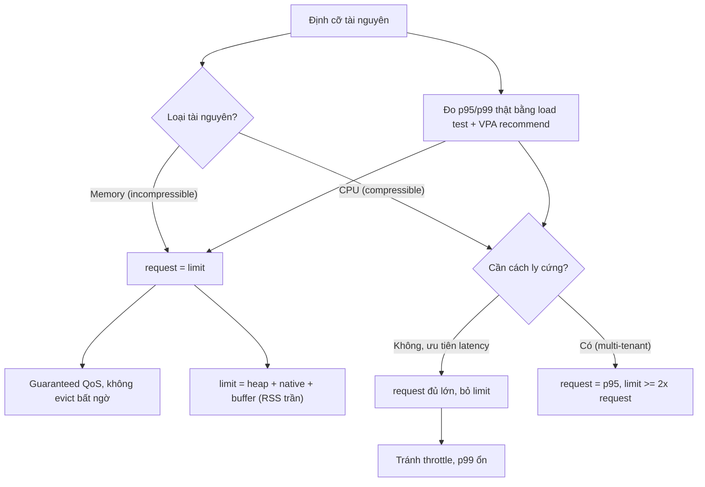

# Resource request/limit nên đặt thế nào?

## ⚡ Tóm tắt ngắn (30s)
* **Bản chất**: `requests` là lượng tài nguyên **đảm bảo** (scheduler dùng để xếp Pod lên node và để cấp phát khi tranh chấp); `limits` là **trần** không được vượt. Hai loại tài nguyên hành xử khác nhau triệt để: **CPU là compressible** (vượt limit → bị throttle, không chết) còn **memory là incompressible** (vượt limit → **OOMKilled**, chết cứng). Tỷ lệ request/limit còn quyết định **QoS class** (Guaranteed / Burstable / BestEffort) → ảnh hưởng thứ tự bị evict khi node thiếu tài nguyên. Đặt sai gây hai thái cực: quá thấp → throttle/OOMKilled/evict; quá cao → lãng phí, bin-packing kém, tốn tiền.
* **Thảm họa thực chiến**:
  1. **Request quá thấp**: scheduler tưởng node rỗng, dồn nhiều Pod → node over-subscribe → throttle CPU + OOMKilled hàng loạt khi tải lên.
  2. **Memory limit quá thấp**: OOMKilled định kỳ (xem câu memory limit < heap).
  3. **CPU limit quá thấp**: throttle, p99 latency thảm họa (xem câu CPU limit).
* **Quyết định Senior**:
  1. **Memory: request = limit** → Guaranteed QoS, không bị evict bất ngờ (memory không nén được).
  2. **CPU: đặt request đủ lớn**, cân nhắc **bỏ limit** (hoặc limit rất rộng) để tránh throttle oan.
  3. **Định cỡ theo dữ liệu thật** (p95/p99 từ giám sát + load test), không đoán.

---

## 🔍 Chi tiết bản chất thực chiến: nguyên tắc định cỡ

### CPU vs Memory hành xử ngược nhau
* **CPU (compressible)**: vượt `requests` chỉ bị throttle khi node bận; vượt `limits` → throttle theo CFS quota, **không chết**. Vì vậy CPU limit thấp gây latency chứ không gây sập → nhiều team **bỏ CPU limit**, chỉ giữ request.
* **Memory (incompressible)**: vượt `limits` → kernel **OOMKilled** (exit 137). Không có "throttle memory". Do đó memory limit phải **rộng rãi và chính xác**, và nên đặt **request = limit**.

### QoS class do request/limit quyết định
* **Guaranteed**: mọi container có request = limit cho **cả CPU và memory** → ưu tiên cao nhất, bị evict **sau cùng**. Dành cho service stateful/critical.
* **Burstable**: có request nhưng request < limit (hoặc thiếu một loại) → có thể burst, nhưng **bị evict trước Guaranteed** khi node memory pressure.
* **BestEffort**: không đặt request/limit nào → **bị evict đầu tiên**. Chỉ hợp cho job throwaway.

### Quy trình định cỡ chuẩn
1. **Đo thực tế**: chạy load test + giám sát `kubectl top` / Prometheus để lấy p95/p99 CPU và memory thật.
2. **Memory request = limit** = trần RSS dự đoán (heap + native + buffer ~10-20%).
3. **CPU request** = mức p95 sử dụng; limit bỏ trống hoặc ≥ 2× request nếu cần cách ly.
4. **Tái định cỡ định kỳ** bằng **VPA (Vertical Pod Autoscaler)** ở chế độ recommend để đề xuất con số dựa trên lịch sử.

### Headroom cho JVM
* Memory limit phải tính cả native (metaspace, stacks, direct) — không chỉ heap. Đặt heap = 70% limit (`MaxRAMPercentage=70`). CPU request đủ để JIT/GC không nghẽn lúc start và lúc tải.

---

## 🎨 Sơ đồ quyết định đặt request/limit



---

## 💻 Code thực chiến: BAD vs GOOD

### ❌ BAD: request quá thấp, CPU limit chặt, memory request < limit
```yaml
resources:
  requests:
    cpu: "50m"        # ❌ scheduler tưởng node rỗng -> dồn cục -> over-subscribe
    memory: "256Mi"   # ❌ request << limit -> Burstable -> dễ bị evict
  limits:
    cpu: "500m"       # ❌ throttle nặng cho Java đa luồng
    memory: "2Gi"     # ❌ request 256Mi nhưng dùng thật ~1.8Gi -> evict/oom khi node pressure
```

### ✅ GOOD: memory bằng nhau (Guaranteed memory), CPU request đủ
```yaml
resources:
  requests:
    cpu: "1"          # ✅ đủ cho JIT/GC, bin-packing đúng
    memory: "2Gi"     # ✅ = limit -> không evict bất ngờ
  limits:
    # KHÔNG đặt limits.cpu -> tránh throttle (CPU compressible)
    # Nếu multi-tenant cần cách ly: limits.cpu: "2"
    memory: "2Gi"     # ✅ = request, đủ cho heap(70%) + native
```
```dockerfile
# JVM khớp với memory limit để RSS không vượt 2Gi
ENTRYPOINT ["java", \
  "-XX:MaxRAMPercentage=70.0", \
  "-XX:MaxMetaspaceSize=256m", \
  "-XX:MaxDirectMemorySize=256m", \
  "-jar", "app.jar"]
```

### VPA ở chế độ đề xuất (không tự sửa, chỉ khuyến nghị)
```yaml
apiVersion: autoscaling.k8s.io/v1
kind: VerticalPodAutoscaler
metadata:
  name: api-vpa
spec:
  targetRef:
    apiVersion: apps/v1
    kind: Deployment
    name: api
  updatePolicy:
    updateMode: "Off"     # ✅ chỉ recommend, không tự apply (tránh restart bất ngờ)
```

---

## 📊 Bảng so sánh QoS class & chiến lược request/limit

| Tiêu chí | Guaranteed | Burstable | BestEffort |
| :--- | :--- | :--- | :--- |
| **Điều kiện** | request = limit (CPU & mem) | có request, request < limit | không đặt gì |
| **Thứ tự bị evict** | Sau cùng | Giữa | **Đầu tiên** |
| **Phù hợp** | Service critical/stateful, JVM prod | Service co giãn, dev/staging | Job throwaway |
| **Memory** | nên = limit | request < limit (rủi ro evict) | không có trần → nguy hiểm |
| **CPU** | = limit (có thể throttle) | burst được | tranh chấp tự do |
| **Bin-packing** | Chặt, dự đoán được | Linh hoạt, rủi ro over-subscribe | Không kiểm soát |

---

## ⚠️ Common Gotchas & Questions follow-up

### 1. Cạm bẫy "Copy-paste request/limit giữa các service mà không định cỡ riêng"
* **Vấn đề**: Một template `cpu: 500m / memory: 512Mi` được nhân bản cho mọi service. Service nhẹ thì lãng phí (đặt chỗ thừa, tốn tiền, bin-packing kém); service nặng thì thiếu (OOMKilled, throttle). Tệ nhất: memory 512Mi cho một JVM Spring Boot thực dùng 1.2Gi → OOMKilled liên tục ngay khi lên prod, nhưng "local chạy ổn" nên bị bỏ qua.
* **Giải pháp**: Định cỡ **từng service theo dữ liệu thật**: load test để lấy p95/p99 CPU & RSS, rồi đặt memory request=limit theo RSS trần + buffer, CPU request theo p95. Dùng VPA recommend để có con số dựa trên lịch sử production. Định kỳ rà soát (right-sizing) vì tải thay đổi theo thời gian.

### 2. Câu hỏi đào sâu từ interviewer
* **Interviewer: "Tại sao bạn khuyên bỏ CPU limit nhưng giữ memory limit? Nghe như mâu thuẫn về tính nhất quán."**
* **Trả lời**:
  1. **Bản chất vật lý khác nhau**: CPU **nén được** — khi vượt phần được cấp, tiến trình chỉ **chậm lại** (throttle) rồi tiếp tục, không mất dữ liệu. Memory **không nén được** — khi vượt, không có cách "chậm lại", kernel buộc phải **giết** tiến trình (OOMKilled). Vì vậy hai loại cần chính sách trần khác nhau.
  2. **Bỏ CPU limit** cho phép app dùng CPU rỗi của node để hấp thụ burst và GC → giảm p99, không gây hại vì khi node bận thì `requests` vẫn đảm bảo phần tối thiểu và throttle công bằng. **Giữ memory limit** là bắt buộc để ngăn một Pod leak nuốt hết RAM node, gây OOMKilled lan sang Pod khác.
  3. **Ngoại lệ**: trong cụm multi-tenant nghiêm ngặt hoặc khi cần khả năng dự đoán chi phí tuyệt đối, vẫn đặt CPU limit nhưng **rộng** (≥ 2× request) và theo dõi `cfs_throttled_periods` để chắc chắn không throttle service nhạy latency. Nhất quán không nằm ở "đặt limit cho mọi thứ" mà ở "đặt chính sách đúng theo bản chất tài nguyên".
