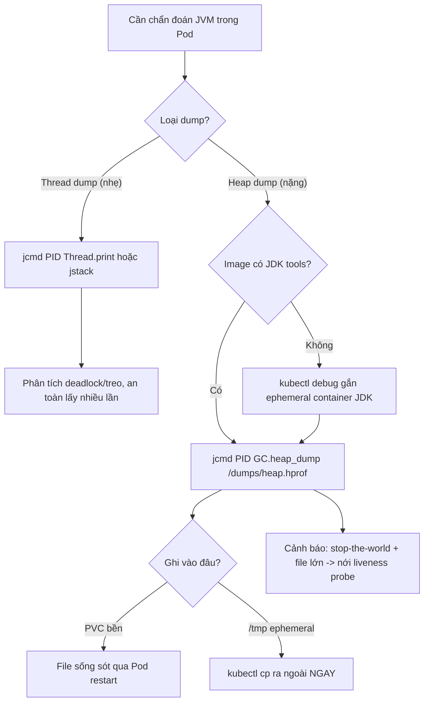

# Làm sao capture heap dump/thread dump trong container?

## ⚡ Tóm tắt ngắn (30s)
* **Bản chất**: Trong container, ta vẫn dùng các công cụ JVM chuẩn (`jcmd`, `jstack`, `jmap`) nhưng phải vượt qua ba rào cản đặc thù của Kubernetes: (1) **image slim không có JDK tools** (chỉ có JRE, thiếu `jcmd`); (2) **dump file nằm trên filesystem ephemeral** của container — Pod restart là **mất sạch**, nên phải ghi ra **volume bền** hoặc copy ra ngoài kịp; (3) **dump heap làm app "đứng hình"** (stop-the-world) và file rất to (cỡ bằng heap) → có thể gây OOMKilled/timeout probe ngay lúc dump. **Thread dump** thì nhẹ, lấy thoải mái; **heap dump** thì nặng, phải cẩn trọng.
* **Thảm họa thực chiến**:
  1. **Dump xong Pod restart, mất file**: lấy heap dump vào `/tmp` rồi Pod bị OOMKilled/redeploy → file bay theo container → công cốc.
  2. **Heap dump gây OOMKilled**: heap 4GB, dump cần thêm bộ nhớ/đĩa, app pause vài giây → liveness probe fail → bị giết giữa lúc dump → file hỏng.
* **Quyết định Senior**:
  1. **Tự động chụp khi OOM**: `-XX:+HeapDumpOnOutOfMemoryError -XX:HeapDumpPath=/dumps` ghi ra **volume bền**.
  2. **Thread dump thường xuyên, rẻ**: `jstack`/`jcmd Thread.print` để chẩn đoán deadlock/treo.
  3. **Copy dump ra ngoài** (`kubectl cp`) hoặc ghi thẳng vào PVC trước khi Pod chết.

---

## 🔍 Chi tiết bản chất thực chiến: ba bài toán và cách giải

### Bài toán 1: thiếu tool trong image slim
* Image `eclipse-temurin:21-jre` chỉ có JRE — **không có** `jcmd/jstack/jmap`. Giải pháp:
  * Dùng image JDK cho môi trường debug, hoặc thêm tool vào image.
  * `kubectl debug` gắn **ephemeral container** có JDK vào Pod đang chạy, share PID namespace để chạy `jcmd` lên process JVM mục tiêu — không cần sửa image gốc.
  * `jcmd` là công cụ đa năng nhất: `jcmd <pid> GC.heap_dump`, `jcmd <pid> Thread.print`, `jcmd <pid> VM.native_memory`.

### Bài toán 2: dump bay theo container ephemeral
* Filesystem container là **ephemeral**: restart → mất. Phải ghi dump ra **volume bền**: `emptyDir` (sống theo Pod, mất khi Pod xóa — chỉ tạm), tốt hơn là **PVC** (PersistentVolumeClaim) sống độc lập. Hoặc copy ngay ra ngoài bằng `kubectl cp` trước khi Pod chết.
* Heap dump khi OOM: bật `-XX:+HeapDumpOnOutOfMemoryError -XX:HeapDumpPath=/dumps/heap.hprof` với `/dumps` mount PVC → khi JVM ném `OutOfMemoryError`, dump tự ghi ra nơi bền.

### Bài toán 3: heap dump nặng, có thể tự gây sự cố
* Heap dump là **stop-the-world**, file ≈ kích thước heap (heap 4GB → file ~4GB). Trong lúc dump: app pause, có thể fail liveness probe → bị giết; cần thêm dung lượng đĩa và đôi khi bộ nhớ.
* Phòng ngừa: lấy dump lúc tải thấp; đảm bảo PVC đủ chỗ; nới `livenessProbe` timeout/failureThreshold để không bị giết giữa lúc dump; nếu chỉ cần đếm object có thể dùng `jmap -histo` (nhẹ hơn full dump).

### Lưu ý OOMKilled vs OOM heap
* Nếu container bị **OOMKilled (137)** bởi cgroup, JVM bị SIGKILL **không kịp** chạy `HeapDumpOnOutOfMemoryError` (vốn chỉ trigger khi JVM tự ném `OutOfMemoryError`). Để có dump trong trường hợp native leak, phải chủ động `jcmd GC.heap_dump` định kỳ hoặc khi RSS gần trần, KHÔNG thể trông chờ cờ tự động.

---

## 🎨 Sơ đồ luồng lấy dump an toàn trong K8s



---

## 💻 Code thực chiến: BAD vs GOOD

### ❌ BAD: dump vào /tmp ephemeral, không tool, không volume
```bash
# ❌ Image JRE không có jmap -> lệnh fail
kubectl exec my-app -- jmap -dump:live,format=b,file=/tmp/heap.hprof 1
# ❌ Nếu chạy được, file ở /tmp ephemeral -> Pod restart là mất sạch
```

### ✅ GOOD: volume bền + auto-dump khi OOM + ephemeral container để lấy thủ công
```yaml
spec:
  template:
    spec:
      containers:
      - name: app
        image: eclipse-temurin:21-jre
        env:
        - name: JAVA_TOOL_OPTIONS
          value: >-
            -XX:+HeapDumpOnOutOfMemoryError
            -XX:HeapDumpPath=/dumps/heap-$HOSTNAME.hprof
            -XX:+ExitOnOutOfMemoryError
        volumeMounts:
        - name: dumps
          mountPath: /dumps          # ✅ mount volume bền
        livenessProbe:
          httpGet: { path: /actuator/health/liveness, port: 8080 }
          timeoutSeconds: 5
          failureThreshold: 6        # ✅ nới để không bị giết giữa lúc dump
      volumes:
      - name: dumps
        persistentVolumeClaim:
          claimName: heap-dumps-pvc  # ✅ PVC sống độc lập với Pod
```

### Lệnh lấy dump thủ công an toàn
```bash
# 1. Tìm PID của JVM trong container (thường là 1 nếu exec form)
kubectl exec my-app -- jcmd
# 2. THREAD DUMP (nhẹ, lấy thoải mái) - chẩn đoán deadlock/treo
kubectl exec my-app -- jcmd 1 Thread.print > threaddump.txt
# 3. HEAP DUMP qua ephemeral container có JDK (image gốc thiếu tool)
kubectl debug my-app -it --image=eclipse-temurin:21-jdk \
  --target=app -- jcmd 1 GC.heap_dump /dumps/heap.hprof
# 4. Nếu dump ở filesystem ephemeral, copy ra ngoài NGAY trước khi Pod chết
kubectl cp my-app:/dumps/heap.hprof ./heap.hprof
# 5. Histogram nhẹ thay full dump khi chỉ cần đếm object
kubectl exec my-app -- jcmd 1 GC.class_histogram | head -40
```

---

## 📊 Bảng so sánh thread dump vs heap dump

| Tiêu chí | Thread dump | Heap dump |
| :--- | :--- | :--- |
| **Mục đích** | Deadlock, treo, thread đói, CPU cao | Memory leak, phân bố object, OOM heap |
| **Chi phí** | Rất nhẹ, gần như tức thì | Nặng: stop-the-world, file ≈ heap size |
| **An toàn lấy nhiều lần** | Có (nên lấy 3 lần cách vài giây) | Hạn chế — có thể gây OOM/timeout probe |
| **Công cụ** | `jstack`, `jcmd Thread.print` | `jmap -dump`, `jcmd GC.heap_dump` |
| **Lưu ở đâu** | stdout/file nhỏ, copy dễ | Volume bền (PVC), file lớn |
| **Phân tích bằng** | Đọc trực tiếp, fastthread.io | Eclipse MAT, VisualVM, JProfiler |

---

## ⚠️ Common Gotchas & Questions follow-up

### 1. Cạm bẫy "Trông chờ HeapDumpOnOutOfMemoryError nhưng bị OOMKilled nên không có dump"
* **Vấn đề**: Team bật `-XX:+HeapDumpOnOutOfMemoryError` và yên tâm sẽ có dump khi hết RAM. Nhưng app bị **container OOMKilled** (cgroup, SIGKILL exit 137) do **native memory** vượt limit — JVM heap chưa đầy nên **không ném `OutOfMemoryError`**, cờ auto-dump **không kích hoạt**, và SIGKILL không cho JVM kịp làm gì. Kết quả: không có dump nào, không có manh mối, chỉ thấy exit 137. Đây là lý do nhiều incident "OOM" mà chẳng có heap dump.
* **Giải pháp**: Phân biệt hai loại OOM. Với nghi ngờ **native leak** (RSS tăng nhưng heap phẳng), chủ động `jcmd GC.heap_dump` + `jcmd VM.native_memory` (bật `-XX:NativeMemoryTracking=summary`) **trước khi** chạm trần, hoặc dùng sidecar/cron giám sát RSS để tự chụp khi gần limit. Để headroom memory đủ để dump không tự gây OOMKilled.

### 2. Câu hỏi đào sâu từ interviewer
* **Interviewer: "Production OOM không thường xuyên, không tái hiện được local. Làm sao bắt được nguyên nhân mà không gây thêm sự cố?"**
* **Trả lời**:
  1. **Auto-capture vào nơi bền + chặn restart vội**: `-XX:+HeapDumpOnOutOfMemoryError -XX:HeapDumpPath=/dumps` (PVC) kết hợp `-XX:+ExitOnOutOfMemoryError` để JVM thoát sạch sau khi dump (tránh trạng thái nửa vời). Đảm bảo PVC đủ chỗ chứa file cỡ heap.
  2. **Quan sát liên tục, ít xâm lấn**: bật **JFR (Java Flight Recorder)** chạy nền vòng tròn (`-XX:StartFlightRecording=disk=true,maxsize=200m,dumponexit=true`) — chi phí thấp, ghi lại allocation/GC/leak suspect để phân tích sau sự cố mà không cần tái hiện. Theo dõi `kubectl top` + Prometheus JVM metrics (heap, GC, RSS) để bắt xu hướng leak.
  3. **Bảo toàn hiện trường**: khi Pod OOM, tránh để nó bị xóa ngay — dùng `terminationGracePeriodSeconds` + preStop, hoặc cấu hình để Pod failed giữ lại cho điều tra; copy dump/JFR ra ngoài bằng `kubectl cp` hoặc đẩy lên object storage qua sidecar trước khi container biến mất.
