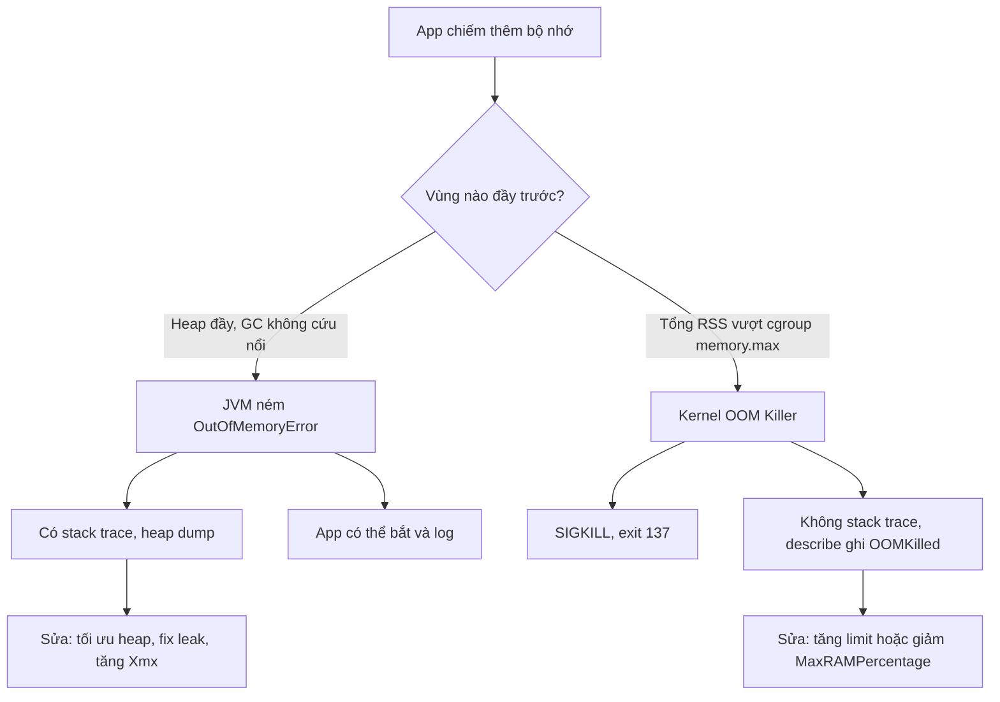

# Pod bị OOMKilled. Khác gì Java OutOfMemoryError?

## ⚡ Tóm tắt ngắn (30s)
* **Bản chất**: Đây là hai sự kiện ở **hai tầng hoàn toàn khác nhau**, dễ bị nhầm vì cùng chữ "OOM":
  * **OOMKilled** là hành động của **kernel Linux**: khi tổng RSS (Resident Set Size) của tất cả tiến trình trong container vượt `resources.limits.memory` (chính là `memory.max` của cgroup), kernel OOM killer **giết cứng** process bằng `SIGKILL`. Container thoát với **exit code 137** (128+9). App không nhận được tín hiệu gì, không kịp log, không cleanup.
  * **Java `OutOfMemoryError`** là sự kiện **bên trong JVM**: khi vùng heap (hoặc Metaspace, direct buffer...) đầy và GC không giải phóng đủ, JVM **chủ động ném** `OutOfMemoryError` — một `Error` có stack trace, có thể bắt được, có thể trigger heap dump.
* **Thảm họa thực chiến**:
  1. **Đổ lỗi nhầm tầng**: App bị OOMKilled (137) nhưng dev đi tăng `-Xmx`, làm RSS càng lớn, càng OOMKilled sớm hơn. Sai hướng hoàn toàn.
  2. **JVM không "thấy" limit của container**: Trên Java cũ (< 8u191), JVM đọc RAM của **cả Node** (ví dụ 64GB) thay vì limit của container (2GB), tự đặt heap mặc định = 1/4 RAM = 16GB → vượt limit ngay → OOMKilled khi vừa cấp phát heap.
* **Quyết định Senior**:
  1. **Phân biệt bằng bằng chứng**: `describe` ghi `OOMKilled` + exit 137 → kernel kill. Log có `java.lang.OutOfMemoryError: Java heap space` → JVM OOM.
  2. **Dùng JVM container-aware**: Java 10+ (và 8u191+) mặc định bật `-XX:+UseContainerSupport`, đọc đúng cgroup limit. Đặt heap theo phần trăm: `-XX:MaxRAMPercentage=75.0`.
  3. **memory limit phải > heap**: vì RSS = heap + Metaspace + thread stacks + direct/native buffers + code cache + JVM overhead.

---

## 🔍 Chi tiết bản chất thực chiến: Hai tầng quản lý bộ nhớ

### Tầng cgroup (Container OOMKilled)
* Kubernetes đặt `limits.memory` → kernel tạo cgroup với `memory.max`. Khi tổng RSS chạm trần, kernel OOM killer chọn process điểm cao nhất (thường là JVM) và gửi `SIGKILL`.
* Đặc điểm: **không có ân hạn**, không stack trace, exit 137, `describe` ghi `Last State: Terminated, Reason: OOMKilled`.
* RSS là **bộ nhớ vật lý thực sự đang chiếm**, bao gồm cả native memory ngoài heap — đây là điểm mấu chốt khiến `-Xmx` không phản ánh đủ.

### Tầng JVM (Java OutOfMemoryError)
* JVM quản lý nhiều vùng: **Heap** (`-Xmx`), **Metaspace** (class metadata), **Thread stacks** (`-Xss` × số thread), **Direct ByteBuffer** (Netty/NIO), **Code Cache** (JIT), **GC structures**.
* `OutOfMemoryError: Java heap space` → heap đầy. `OutOfMemoryError: Metaspace` → quá nhiều class (classloader leak). `OutOfMemoryError: Direct buffer memory` → tràn off-heap.
* JVM ném Error có thể bắt được; với heap, nên bật `-XX:+HeapDumpOnOutOfMemoryError` để chụp dump phân tích.

### Công thức bộ nhớ cần nhớ
$$RSS_{JVM} \approx Heap + Metaspace + (Threads \times Stack) + DirectBuffers + CodeCache + Overhead$$

Nếu đặt `-Xmx1800m` mà `limits.memory = 2Gi`, phần dư 248MB thường KHÔNG đủ cho Metaspace (~100MB) + 200 thread × 1MB stack + Netty direct buffer → RSS vượt 2Gi → **OOMKilled dù heap chưa đầy**. Đây là cái bẫy kinh điển: bị giết bởi cgroup trong khi JVM tưởng mình vẫn ổn.

---

## 🎨 Sơ đồ so sánh hai loại OOM



---

## 💻 Code thực chiến: BAD vs GOOD

### ❌ BAD: Đặt heap cứng vượt headroom, JVM cũ không thấy limit
```dockerfile
# Java 8 bản cũ (< 8u191) KHÔNG container-aware
FROM openjdk:8u151-jre
# ❌ Xmx cứng = đúng bằng limit, không chừa native memory
ENTRYPOINT ["java", "-Xmx2g", "-jar", "app.jar"]
```
```yaml
resources:
  limits:
    memory: "2Gi"   # ❌ Heap 2g + Metaspace + stacks + direct -> RSS > 2Gi -> OOMKilled 137
```

### ✅ GOOD: JVM container-aware + headroom hợp lý
```dockerfile
FROM eclipse-temurin:21-jre
# ✅ UseContainerSupport mặc định bật; đặt heap theo % của limit
ENTRYPOINT ["java", \
  "-XX:MaxRAMPercentage=70.0", \
  "-XX:InitialRAMPercentage=70.0", \
  "-XX:MaxMetaspaceSize=256m", \
  "-XX:+HeapDumpOnOutOfMemoryError", \
  "-XX:HeapDumpPath=/dumps", \
  "-jar", "app.jar"]
```
```yaml
resources:
  requests:
    memory: "2Gi"
  limits:
    memory: "2Gi"   # ✅ Heap ~1.4Gi (70%), chừa ~600Mi cho native/metaspace/stacks
```

### Java: kiểm tra JVM có thấy đúng limit không
```java
// Chạy trong container để xác nhận JVM đọc đúng cgroup limit
public class MemCheck {
    public static void main(String[] args) {
        Runtime rt = Runtime.getRuntime();
        long maxMb = rt.maxMemory() / (1024 * 1024);
        long procMb = ((com.sun.management.OperatingSystemMXBean)
                java.lang.management.ManagementFactory.getOperatingSystemMXBean())
                .getTotalMemorySize() / (1024 * 1024);
        // Nếu maxMb ~ vài GB trên container 2Gi -> JVM KHÔNG thấy limit (JVM cũ)
        System.out.println("JVM maxHeap=" + maxMb + "MB, container total=" + procMb + "MB");
    }
}
```

### Lệnh xác minh trong cluster
```bash
# Xem có bị OOMKilled không
kubectl describe pod my-app | grep -A3 "Last State"
# Theo dõi RSS thực tế so với limit
kubectl top pod my-app
# In flag JVM thực sự đang dùng (đọc đúng cgroup chưa)
kubectl exec my-app -- java -XX:+PrintFlagsFinal -version | grep -i maxheap
```

---

## 📊 Bảng so sánh OOMKilled (cgroup) vs Java OutOfMemoryError

| Tiêu chí | OOMKilled (Container / cgroup) | Java OutOfMemoryError (JVM) |
| :--- | :--- | :--- |
| **Ai gây ra** | Kernel Linux OOM killer | Bản thân JVM |
| **Điều kiện** | Tổng RSS > `limits.memory` (cgroup memory.max) | Một vùng JVM (heap/metaspace/direct) đầy, GC bất lực |
| **Tín hiệu / Exit** | `SIGKILL`, exit code **137** | Ném `Error`, exit thường **1** (nếu không bắt) |
| **Bằng chứng** | `describe` → Reason: OOMKilled | Stack trace `java.lang.OutOfMemoryError` trong log |
| **Cleanup / log** | Không có, chết tức thì | Có thể bắt, log, chụp heap dump |
| **Hướng sửa** | Tăng limit hoặc **giảm** heap %, fix native leak | Tối ưu/tăng heap, fix object leak, sửa classloader |

---

## ⚠️ Common Gotchas & Questions follow-up

### 1. Cạm bẫy "Tăng -Xmx khi bị OOMKilled làm tình hình tệ hơn"
* **Vấn đề**: Thấy exit 137, dev phản xạ "thiếu RAM" → tăng `-Xmx` từ 1.5g lên 2g trong khi `limits.memory` vẫn 2Gi. Heap lớn hơn → RSS lớn hơn → chạm trần cgroup **sớm hơn** → OOMKilled nhanh hơn. Vòng lặp sai lầm.
* **Giải pháp**: Khi bị OOMKilled mà JVM heap chưa đầy (không có `OutOfMemoryError` trong log), nghĩa là **native memory** mới là thủ phạm. Cần: (1) tăng `limits.memory` để có headroom, HOẶC (2) giảm `MaxRAMPercentage` để chừa chỗ cho native, (3) điều tra leak off-heap (Netty direct buffer, mmap, thread quá nhiều).

### 2. Câu hỏi đào sâu từ interviewer
* **Interviewer: "App của bạn bị OOMKilled exit 137 nhưng `jstat` cho thấy heap chỉ dùng 60%. Bộ nhớ đi đâu?"**
* **Trả lời**:
  1. **Native / off-heap memory**: RSS gồm cả phần ngoài heap. Thủ phạm phổ biến: **Direct ByteBuffer** của Netty (gRPC, reactive), **Metaspace** phình do classloader leak (hot-reload, dynamic proxy), **thread stacks** (mỗi thread ~1MB, 500 thread = 500MB), **mmap** file, **glibc malloc arena** phân mảnh.
  2. **Cách điều tra**: Bật **Native Memory Tracking** (`-XX:NativeMemoryTracking=summary`) rồi `jcmd <pid> VM.native_memory summary` để xem từng vùng. Theo dõi `kubectl top pod` thấy RSS tăng dù heap phẳng → xác nhận leak native.
  3. **Khắc phục**: Giới hạn direct memory `-XX:MaxDirectMemorySize`, cap số thread của pool, đặt `-XX:MaxMetaspaceSize`, hoặc thử `jemalloc`/`-XX:+UseG1GC` với `MALLOC_ARENA_MAX=2` để giảm phân mảnh glibc.
