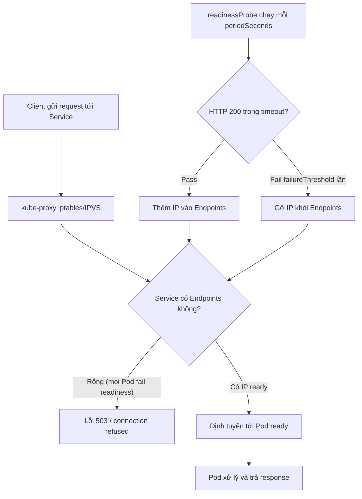

# Readiness probe fail làm service không nhận traffic. Bạn kiểm tra gì?

## ⚡ Tóm tắt ngắn (30s)
* **Bản chất**: `readinessProbe` quyết định Pod có được đưa vào danh sách **Endpoints** của Service hay không. Khi probe fail, Kubernetes **gỡ IP của Pod khỏi Service Endpoints** → kube-proxy/Ingress không định tuyến traffic tới nữa. Pod **vẫn chạy** (không bị restart như liveness), chỉ là "không sẵn sàng nhận khách". Nếu **tất cả** Pod đều fail readiness, Service có Endpoints rỗng → client nhận lỗi connection refused / 503.
* **Thảm họa thực chiến**:
  1. **Cả service biến mất khỏi load balancer**: Một bản deploy mới đặt readiness gọi `/actuator/health` (health tổng) — endpoint này kiểm tra cả DB. DB chậm 5 giây → tất cả Pod fail readiness đồng loạt → Service Endpoints rỗng → toàn bộ traffic 503 dù app vẫn sống.
  2. **Probe quá nghiêm khắc gây flapping**: `timeoutSeconds=1` nhưng app GC pause 1.5s định kỳ → probe timeout → Pod bị gỡ khỏi Endpoints → vừa được thêm lại đã bị gỡ tiếp (flapping), traffic dao động.
* **Quyết định Senior**:
  1. **Kiểm tra Endpoints trước tiên**: `kubectl get endpoints <svc>` — nếu rỗng thì chắc chắn do readiness.
  2. **Tách readiness khỏi liveness**: readiness kiểm tra "sẵn sàng phục vụ" (gồm dependency thiết yếu), liveness chỉ kiểm tra "process còn sống".
  3. **Phân biệt dependency cứng vs mềm**: DB là cứng (mất DB thì không phục vụ được → fail readiness hợp lý), nhưng cache/dịch vụ phụ là mềm (không nên kéo cả service xuống).

---

## 🔍 Chi tiết bản chất thực chiến: Readiness điều khiển Endpoints ra sao

### Cơ chế đằng sau
* Mỗi Pod pass readiness → controller thêm IP:port của Pod vào object **Endpoints** (hoặc EndpointSlice) của Service. kube-proxy lập trình iptables/IPVS dựa trên danh sách này.
* Pod fail readiness `failureThreshold` lần liên tiếp → IP bị **gỡ** khỏi Endpoints. Kết nối đang xử lý không bị cắt ngay (khác liveness), nhưng kết nối mới không tới nữa.
* Đây là cơ chế **zero-downtime deploy**: Pod mới chỉ nhận traffic sau khi readiness pass; Pod cũ vẫn phục vụ tới khi Pod mới sẵn sàng.

### Quy trình kiểm tra khi service không nhận traffic
1. **`kubectl get endpoints <svc>`** — Endpoints rỗng? → readiness là thủ phạm. Có IP? → lỗi ở Service selector / Ingress / NetworkPolicy.
2. **`kubectl describe pod <pod>`** — Events ghi `Readiness probe failed: HTTP 503` kèm lý do.
3. **`kubectl get pod`** — cột `READY` hiển thị `0/1` (container chạy nhưng chưa ready).
4. **Gọi probe thủ công từ trong Pod**: `kubectl exec <pod> -- curl -s localhost:8080/actuator/health/readiness` để xem app trả gì.
5. **Kiểm tra cấu hình probe**: `timeoutSeconds`, `periodSeconds`, `failureThreshold`, `path`, `port` có đúng không.

### Phân biệt dependency cứng vs mềm trong readiness
* **Cứng (hard)**: thiếu nó app không phục vụ được request chính → đưa vào readiness (ví dụ: DB chính).
* **Mềm (soft)**: thiếu nó vẫn phục vụ được dạng suy giảm → KHÔNG đưa vào readiness, dùng circuit breaker/fallback (ví dụ: Redis cache, recommendation service).
* Sai lầm phổ biến: nhét **mọi** dependency vào health readiness → một dịch vụ phụ chết kéo theo cả service "không ready" → downtime dây chuyền.

---

## 🎨 Sơ đồ luồng readiness điều khiển traffic



---

## 💻 Code thực chiến: BAD vs GOOD

### ❌ BAD: Readiness dùng health tổng, kéo cả service xuống khi DB chậm
```yaml
readinessProbe:
  httpGet:
    path: /actuator/health        # ❌ Health tổng: kiểm tra cả DB, Redis, Kafka...
    port: 8080
  timeoutSeconds: 1               # ❌ Quá ngắn so với GC pause / DB latency
  periodSeconds: 5
  failureThreshold: 1             # ❌ Một lần fail là gỡ ngay -> flapping
```
Hậu quả: DB chậm 2s → tất cả Pod fail readiness → Endpoints rỗng → 503 toàn bộ.

### ✅ GOOD: Readiness chỉ kiểm tra điều thực sự cần, tách dependency mềm
```yaml
readinessProbe:
  httpGet:
    path: /actuator/health/readiness   # ✅ readinessState group, có kiểm soát
    port: 8080
  timeoutSeconds: 3
  periodSeconds: 10
  failureThreshold: 3               # ✅ Chịu được nhiễu thoáng qua
  successThreshold: 1
```

### Spring Boot: cấu hình readiness group, đẩy Redis sang dependency mềm
```yaml
management:
  endpoint:
    health:
      probes:
        enabled: true
      group:
        readiness:
          include: db          # ✅ chỉ DB là dependency cứng cho readiness
          # KHÔNG include redis: cache là dependency mềm
  health:
    redis:
      enabled: false           # tránh kéo readiness xuống khi cache lỗi
```
```java
// Cache mềm: dùng fallback thay vì làm app "không ready"
@Service
public class ProductService {
    private final RedisCache cache;
    private final ProductRepository repo;

    public Product get(Long id) {
        try {
            Product cached = cache.get(id);
            if (cached != null) return cached;
        } catch (RedisConnectionException e) {
            // ✅ Cache chết -> vẫn phục vụ từ DB, KHÔNG fail readiness
            log.warn("Cache miss do Redis lỗi, fallback DB, id={}", id);
        }
        return repo.findById(id).orElseThrow();
    }
}
```

### Lệnh kiểm tra
```bash
kubectl get endpoints my-svc -o wide       # rỗng = readiness fail
kubectl get pod -l app=my-app              # cột READY 0/1?
kubectl describe pod my-app | grep -A2 Readiness
kubectl exec my-app -- curl -s localhost:8080/actuator/health/readiness
```

---

## 📊 Bảng so sánh Readiness vs Liveness Probe

| Tiêu chí | Readiness Probe | Liveness Probe |
| :--- | :--- | :--- |
| **Câu hỏi trả lời** | "Pod có sẵn sàng nhận traffic không?" | "Pod còn sống không, có cần restart không?" |
| **Hành động khi fail** | Gỡ IP khỏi Service Endpoints | Giết & restart container |
| **Pod có restart không** | **Không**, vẫn chạy | **Có**, SIGKILL rồi tạo lại |
| **Nên kiểm tra gì** | Dependency cứng (DB), khả năng phục vụ | Chỉ process/deadlock, KHÔNG kiểm tra dependency |
| **Rủi ro khi cấu hình sai** | Cả service mất traffic (Endpoints rỗng) | CrashLoop vô tận |
| **Khi mất dependency mềm** | Dùng fallback, KHÔNG fail | Không liên quan |

---

## ⚠️ Common Gotchas & Questions follow-up

### 1. Cạm bẫy "Readiness và Liveness trỏ cùng một endpoint health tổng"
* **Vấn đề**: Cả hai probe dùng `/actuator/health` (kiểm tra DB). Khi DB chập chờn: readiness fail (gỡ traffic — đúng) NHƯNG liveness cũng fail → Pod bị **restart**. Restart không làm DB hồi phục, app khởi động lại rồi lại fail liveness → CrashLoop hàng loạt, biến sự cố DB tạm thời thành sập toàn cụm.
* **Giải pháp**: **Liveness không bao giờ kiểm tra dependency ngoài**. Liveness chỉ nên trả 200 nếu process/event-loop còn phản hồi (`/actuator/health/liveness` của Spring chỉ phản ánh `livenessState`). Dependency để readiness lo. Như vậy DB chết → traffic bị gỡ nhưng Pod không restart, tự hồi phục khi DB lên.

### 2. Câu hỏi đào sâu từ interviewer
* **Interviewer: "Endpoints có IP, Pod READY 1/1, nhưng client vẫn nhận 503. Readiness ổn rồi, vậy lỗi ở đâu?"**
* **Trả lời**:
  1. **Service selector lệch label**: `Service.spec.selector` không khớp `Pod.labels` → Endpoints thực ra trỏ nhầm hoặc rỗng cho đúng app. Kiểm tra `kubectl describe svc` so với `kubectl get pod --show-labels`.
  2. **Sai targetPort / containerPort**: Service forward tới port app không listen → connection refused dù Pod ready. Đối chiếu `targetPort` với `containerPort`.
  3. **NetworkPolicy chặn**: Một `NetworkPolicy` mới chặn traffic từ Ingress namespace tới Pod. Test bằng `kubectl exec` từ một Pod cùng namespace.
  4. **Ingress/LB cache Endpoints cũ**, hoặc 503 đến từ tầng trên (Ingress controller chưa reload). Xem log Ingress controller để khoanh vùng tầng phát sinh 503.
