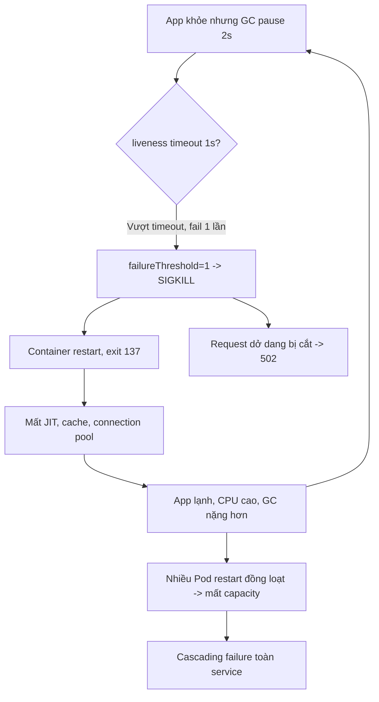

# Liveness probe quá aggressive gây restart không cần thiết. Hậu quả?

## ⚡ Tóm tắt ngắn (30s)
* **Bản chất**: `livenessProbe` cấu hình quá "hung hăng" (`timeoutSeconds` quá ngắn, `failureThreshold` quá thấp, `initialDelaySeconds` quá nhỏ, hoặc endpoint kiểm tra cả dependency ngoài) khiến Kubernetes **giết và restart container** vì những lý do tạm thời, không phải vì app thực sự chết. App đang khỏe nhưng bị `SIGKILL` → exit 137 → restart, đôi khi thành `CrashLoopBackOff`.
* **Hậu quả thực chiến**:
  1. **GC pause bị hiểu nhầm là "chết"**: Một Full GC stop-the-world 2 giây làm app không trả probe trong `timeoutSeconds=1` → liveness fail → restart. Restart làm mất hết warm cache, JIT, connection pool → app lạnh, chậm hơn → GC nặng hơn → restart tiếp. Vòng xoáy tử thần.
  2. **Sự cố dependency biến thành sập toàn cụm**: Liveness gọi `/health` kiểm tra DB. DB chậm 5s → **tất cả** Pod fail liveness đồng thời → restart đồng loạt → mất toàn bộ capacity đúng lúc hệ thống đang tải nặng → cascading failure.
  3. **Mất request đang xử lý**: liveness giết bằng SIGKILL (không graceful), các request/transaction dở dang bị cắt đứt → 502, dữ liệu treo.
* **Quyết định Senior**:
  1. **Liveness chỉ kiểm tra "process còn phản hồi"**, KHÔNG kiểm tra dependency ngoài.
  2. **Nới `timeoutSeconds`/`failureThreshold`** để chịu được GC pause và nhiễu thoáng qua.
  3. **Dùng `startupProbe`** cho giai đoạn khởi động chậm, để liveness chỉ bật khi app đã ổn định.

---

## 🔍 Chi tiết bản chất thực chiến: Tại sao liveness aggressive nguy hiểm hơn readiness

### Liveness giết — readiness chỉ gỡ
* Readiness fail chỉ **gỡ Pod khỏi traffic** (có thể hồi phục êm ái). Liveness fail **giết process** — hành động hủy diệt, không hồi đầu. Vì vậy liveness sai cấu hình gây thiệt hại nặng hơn nhiều.
* Sau restart: JVM mất JIT-compiled hot code (chạy lại từ interpreter → chậm), connection pool phải tạo lại, cache cục bộ rỗng, classloading lại. App "lạnh" tiêu tốn nhiều CPU/RAM hơn lúc bình thường → dễ kích hoạt vòng lặp restart.

### Bốn kiểu cấu hình aggressive gây hại
1. **`timeoutSeconds` quá ngắn (1s)**: GC pause, I/O blip, CPU throttle đều có thể vượt 1s → fail oan. Nên ≥ 3–5s.
2. **`failureThreshold` quá thấp (1)**: Một lần nhiễu là giết. Nên ≥ 3 để chịu lỗi thoáng qua.
3. **`initialDelaySeconds` quá nhỏ**: App Spring Boot cần 30–60s start nhưng probe bắt đầu sau 10s → giết khi đang khởi động. Giải pháp đúng là `startupProbe`.
4. **Endpoint kiểm tra dependency ngoài**: Liveness gọi DB/Redis → lỗi dependency thành lỗi liveness → restart vô ích (restart không sửa được DB).

### Liveness đúng nên kiểm tra gì
* Chỉ nên xác nhận: process còn chạy, event loop/thread chính chưa deadlock, có thể phục vụ một request nội bộ siêu nhẹ. Spring `livenessState` chỉ phản ánh trạng thái nội tại của app, không gọi ra ngoài — đó là lựa chọn chuẩn.

---

## 🎨 Sơ đồ vòng xoáy restart do liveness aggressive



---

## 💻 Code thực chiến: BAD vs GOOD

### ❌ BAD: Liveness hung hãn, kiểm tra cả DB
```yaml
livenessProbe:
  httpGet:
    path: /actuator/health     # ❌ Kiểm tra cả DB -> dependency lỗi = restart
    port: 8080
  initialDelaySeconds: 10      # ❌ App cần 45s mới start xong
  timeoutSeconds: 1            # ❌ GC pause là fail
  periodSeconds: 5
  failureThreshold: 1          # ❌ Một lần nhiễu là giết
```

### ✅ GOOD: startupProbe + liveness nhẹ + dung sai cao
```yaml
# Bảo vệ giai đoạn khởi động chậm
startupProbe:
  httpGet:
    path: /actuator/health/liveness
    port: 8080
  failureThreshold: 30         # ✅ tối đa 30 x 5s = 150s để start
  periodSeconds: 5
# Liveness chỉ chạy SAU khi startupProbe pass
livenessProbe:
  httpGet:
    path: /actuator/health/liveness   # ✅ chỉ livenessState, không gọi DB
    port: 8080
  timeoutSeconds: 5            # ✅ chịu được GC pause
  periodSeconds: 10
  failureThreshold: 3          # ✅ cần 3 lần fail liên tiếp mới restart
```

### Spring Boot: liveness không gồm dependency
```yaml
management:
  endpoint:
    health:
      probes:
        enabled: true
      group:
        liveness:
          include: livenessState   # ✅ KHÔNG include db/redis
        readiness:
          include: readinessState, db
  health:
    livenessstate:
      enabled: true
    readinessstate:
      enabled: true
```
```java
// Nếu cần custom: liveness chỉ phản ánh trạng thái NỘI TẠI (vd: deadlock detector)
@Component
public class AppLivenessIndicator implements HealthIndicator {
    private final DeadlockDetector detector; // chỉ kiểm tra thread nội bộ

    @Override
    public Health health() {
        // ✅ Không gọi DB/Redis ở đây. Chỉ xác nhận app không deadlock.
        return detector.hasDeadlock()
                ? Health.down().withDetail("reason", "thread deadlock").build()
                : Health.up().build();
    }
}
```

---

## 📊 Bảng so sánh cấu hình liveness an toàn vs aggressive

| Tham số | Aggressive (NGUY HIỂM) | An toàn (Senior) | Lý do |
| :--- | :--- | :--- | :--- |
| **endpoint** | `/health` (gồm DB) | `/health/liveness` (nội tại) | Tránh lỗi dependency gây restart |
| **timeoutSeconds** | 1 | 3–5 | Chịu được GC pause, I/O blip |
| **failureThreshold** | 1 | 3 | Chịu nhiễu thoáng qua |
| **initialDelaySeconds** | 10 | dùng `startupProbe` | Tách khởi động khỏi liveness |
| **periodSeconds** | 2–5 | 10 | Giảm áp lực probe, giảm false positive |
| **Hậu quả sai** | CrashLoop, cascading | App tự hồi phục êm | — |

---

## ⚠️ Common Gotchas & Questions follow-up

### 1. Cạm bẫy "Probe restart làm sự cố nhỏ thành thảm họa lớn (correlated failure)"
* **Vấn đề**: Vì tất cả Pod chia sẻ **cùng cấu hình liveness** và **cùng dependency** (cùng DB), khi DB chậm thì **mọi Pod fail đồng thời** và **restart đồng thời**. Đây là correlated failure — đúng lúc cần capacity nhất thì mất sạch. Tệ hơn, các Pod restart đồng loạt tạo "thundering herd" mở connection mới đập vào DB đang yếu, khiến DB chết hẳn.
* **Giải pháp**: (1) Loại dependency ngoài khỏi liveness. (2) Nếu buộc phải có, dùng circuit breaker để health trả "degraded" thay vì "down". (3) Cân nhắc PodDisruptionBudget và readiness (gỡ traffic) thay vì liveness (restart) cho lỗi dependency.

### 2. Câu hỏi đào sâu từ interviewer
* **Interviewer: "Làm sao phân biệt app thực sự bị deadlock/treo (cần restart) với app chỉ đang chậm vì tải/GC (không nên restart)?"**
* **Trả lời**:
  1. **Liveness phải đo "tiến triển" chứ không đo "tốc độ"**: App chậm vẫn còn xử lý (forward progress); app treo thì đứng im hoàn toàn. Endpoint liveness nên trả 200 chừng nào thread chính/event loop còn nhúc nhích, dù latency cao.
  2. **Heartbeat nội bộ**: Cho một watchdog cập nhật timestamp mỗi N giây từ luồng nghiệp vụ; liveness chỉ fail nếu timestamp cũ hơn ngưỡng lớn (vd 60s) → chứng tỏ luồng thực sự đứng, không phải chỉ chậm.
  3. **Tách bạch tín hiệu**: Tải cao → readiness fail (gỡ bớt traffic, autoscale) là phản ứng đúng; treo thật → liveness fail (restart). Nhầm lẫn hai cái khiến ta restart oan khi chỉ cần scale. `failureThreshold` cao + `timeoutSeconds` rộng giúp tránh restart vì chậm thoáng qua.
