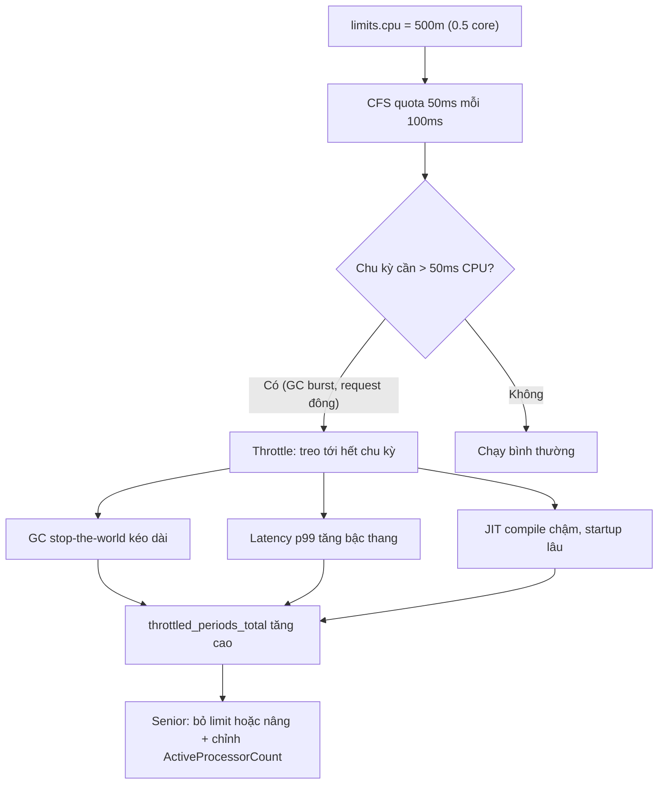

# CPU limit quá thấp ảnh hưởng Java service như thế nào?

## ⚡ Tóm tắt ngắn (30s)
* **Bản chất**: `resources.limits.cpu` được kernel thực thi qua **CFS (Completely Fair Scheduler) quota**: trong mỗi chu kỳ 100ms (`cfs_period_us`), container chỉ được dùng tối đa `limit × 100ms` thời gian CPU. Dùng hết quota → tiến trình bị **throttle** (treo) tới hết chu kỳ. Với Java, hậu quả nặng vì JVM là **đa luồng cố hữu**: GC threads, JIT compiler threads, request threads đều cần CPU đồng thời. CPU limit thấp khiến chúng tranh nhau quota ít ỏi → **latency spike, GC pause kéo dài, JIT chậm, startup lâu**.
* **Thảm họa thực chiến**:
  1. **Latency p99 tăng vọt không rõ lý do**: CPU usage trung bình chỉ 30% nhưng p99 latency cao bất thường. Thủ phạm là **CFS throttling**: app bị treo từng đợt 100ms dù trung bình thấp. `container_cpu_cfs_throttled_periods_total` cao là dấu hiệu vàng.
  2. **GC pause dài bất thường**: `limit=500m` (0.5 core) nhưng JVM thấy nhiều core → tạo nhiều GC thread, lúc GC cần burst CPU thì bị throttle → stop-the-world kéo dài 2–3s thay vì 200ms.
* **Quyết định Senior**:
  1. **JVM container-aware từ Java 8u191+/10**: tự đọc CPU quota để chỉnh số GC/JIT/ForkJoinPool thread theo `availableProcessors()`.
  2. **Cân nhắc bỏ CPU limit, chỉ đặt request**: CPU là tài nguyên **co giãn được** (compressible) — vượt request chỉ bị throttle khi node bận, không bị giết. Nhiều team bỏ limit để tránh throttle oan.
  3. **Đặt `-XX:ActiveProcessorCount`** khi cần kiểm soát chính xác số thread.

---

## 🔍 Chi tiết bản chất thực chiến: CFS quota và JVM đa luồng

### CFS throttling hoạt động ra sao
* `limits.cpu: "1"` = 1 core = quota 100ms mỗi chu kỳ 100ms. `limits.cpu: "500m"` = 0.5 core = quota 50ms/100ms.
* Nếu trong một chu kỳ 100ms app cần 80ms CPU nhưng quota chỉ 50ms → sau 50ms bị **throttle treo 50ms** còn lại → request đang chạy đứng hình nửa chu kỳ. Trung bình CPU vẫn "thấp" nhưng latency tăng theo bậc thang.
* Đo bằng metric: `rate(container_cpu_cfs_throttled_periods_total) / rate(container_cpu_cfs_periods_total)` — tỷ lệ chu kỳ bị throttle. > 25% là nghiêm trọng.

### Vì sao Java đặc biệt nhạy cảm
* **GC song song**: G1/Parallel GC tạo số thread ~ số core. Khi GC chạy cần burst nhiều core cùng lúc; CPU limit thấp biến GC song song thành "nghẽn cổ chai", kéo dài stop-the-world.
* **JIT compiler**: C1/C2 compiler chạy nền cần CPU. Bị throttle → code lâu được tối ưu → app chạy interpreter chậm lâu hơn.
* **Startup**: khởi động Spring Boot là CPU-intensive (classloading, bean init). CPU thấp → startup từ 30s lên 90s → trễ rollout, có thể fail startupProbe.
* **ForkJoinPool / thread pool**: `parallelStream`, reactor scheduler mặc định size theo `availableProcessors()`.

### JVM container-aware (Java 8u191+/10+)
* Mặc định `-XX:+UseContainerSupport`: JVM đọc cgroup CPU quota → `Runtime.availableProcessors()` trả về số **làm tròn lên** từ `quota/period` (vd limit `1500m` → 2). Nhờ đó GC/JIT/pool thread không bị tạo dư theo số core vật lý của node.
* Trên Java cũ (< 8u191): JVM thấy toàn bộ core của node (vd 64) → tạo 64 GC thread cho container 0.5 core → thảm họa context switch + throttle.

---

## 🎨 Sơ đồ CPU throttling ảnh hưởng Java



---

## 💻 Code thực chiến: BAD vs GOOD

### ❌ BAD: limit thấp + JVM cũ thấy hết core của node
```dockerfile
FROM openjdk:8u151-jre        # ❌ KHÔNG container-aware
ENTRYPOINT ["java", "-jar", "app.jar"]
```
```yaml
resources:
  requests:
    cpu: "100m"
  limits:
    cpu: "500m"               # ❌ 0.5 core nhưng JVM tạo GC thread theo 64 core node
```
Hậu quả: 64 GC thread tranh 0.5 core → throttle liên tục, GC pause dài, p99 thảm họa.

### ✅ GOOD: JVM mới, request hợp lý, kiểm soát thread
```dockerfile
FROM eclipse-temurin:21-jre   # ✅ container-aware mặc định
# Tùy chọn: cố định số processor JVM thấy để GC/pool ổn định
ENTRYPOINT ["java", \
  "-XX:+UseContainerSupport", \
  "-XX:MaxRAMPercentage=70.0", \
  "-jar", "app.jar"]
```
```yaml
resources:
  requests:
    cpu: "1"                  # ✅ đảm bảo 1 core khi scheduler xếp Pod
  # Cân nhắc KHÔNG đặt limits.cpu để tránh throttle oan (CPU compressible)
  # Nếu cần limit (multi-tenant), đặt rộng rãi: limit >= request, vd "2"
  limits:
    cpu: "2"
```

### Java: kiểm tra số core JVM thấy & chỉnh pool theo đó
```java
public class CpuCheck {
    public static void main(String[] args) {
        int procs = Runtime.getRuntime().availableProcessors();
        // Container-aware: với limit 1500m -> in ra 2 (làm tròn lên)
        System.out.println("availableProcessors = " + procs);

        // ✅ Đặt size pool theo số core JVM THỰC SỰ thấy, tránh oversubscribe
        var pool = java.util.concurrent.Executors.newFixedThreadPool(
                Math.max(2, procs));
        pool.shutdown();
    }
}
```

---

## 📊 Bảng so sánh đặt CPU request/limit cho Java service

| Chiến lược | requests.cpu | limits.cpu | Ưu điểm | Rủi ro |
| :--- | :--- | :--- | :--- | :--- |
| **Limit thấp = request** | 500m | 500m | Bin-packing chặt, dễ tính chi phí | Throttle nặng, GC pause dài |
| **Limit cao hơn request** | 1 | 2 | Burst được khi cần, ít throttle | Node có thể oversubscribe |
| **Chỉ request, bỏ limit** | 1 | (không đặt) | **Không throttle**, latency ổn | Cần Node đủ headroom, ồn hàng xóm |
| **JVM cũ < 8u191** | bất kỳ | bất kỳ | — | JVM thấy hết core node → thảm họa |

---

## ⚠️ Common Gotchas & Questions follow-up

### 1. Cạm bẫy "CPU usage thấp nhưng latency cao — quên nhìn throttling"
* **Vấn đề**: Dashboard hiển thị CPU usage trung bình 30%, team kết luận "thừa CPU" và còn giảm limit để tiết kiệm. Nhưng p99 latency vẫn xấu. Lý do: throttling xảy ra theo **từng chu kỳ 100ms** — app burst hết quota trong 30ms rồi bị treo 70ms; trung bình hóa theo phút thì chỉ thấy 30%, che giấu hoàn toàn các đợt treo. Đây là lỗi quan sát kinh điển.
* **Giải pháp**: Luôn theo dõi `container_cpu_cfs_throttled_periods_total` và `throttled_seconds`, không chỉ `cpu usage`. Nếu tỷ lệ throttled period cao mà usage thấp → nâng/bỏ limit. Java service burst (request đến theo cụm + GC) đặc biệt cần điều này.

### 2. Câu hỏi đào sâu từ interviewer
* **Interviewer: "Nên đặt CPU limit hay không cho Java microservice? Trình bày trade-off."**
* **Trả lời**:
  1. **Lập luận bỏ limit**: CPU là tài nguyên **compressible** — vượt request chỉ bị throttle khi node thực sự bận, không bị giết (khác memory). Bỏ limit cho phép app dùng CPU rỗi của node để hấp thụ burst và GC, giảm p99 đáng kể. `requests.cpu` vẫn đảm bảo phần tối thiểu khi scheduling và khi tranh chấp.
  2. **Lập luận giữ limit**: Trong cụm multi-tenant, một Pod "ồn ào" có thể nuốt hết CPU node, làm hàng xóm đói. Limit đảm bảo cách ly và khả năng dự đoán chi phí. Nếu giữ limit thì đặt **rộng** (limit ≥ 2× request) và bật `static CPU manager policy` cho pod nhạy latency.
  3. **Quan điểm cân bằng (của tôi)**: với service nhạy latency, ưu tiên **request đủ lớn + không limit (hoặc limit rất rộng)**; với batch/cron không nhạy latency thì đặt limit chặt để bảo vệ cụm. Luôn kèm `-XX:+UseContainerSupport` và giám sát throttling.
