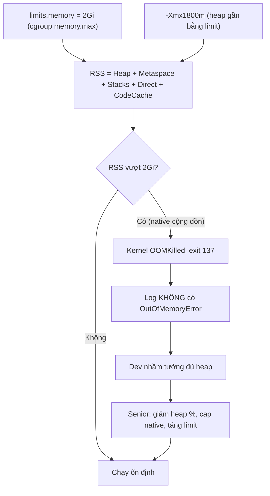

# Memory limit thấp hơn JVM heap setting gây vấn đề gì?

## ⚡ Tóm tắt ngắn (30s)
* **Bản chất**: Khi `resources.limits.memory` (cgroup `memory.max`) **nhỏ hơn hoặc xấp xỉ** tổng bộ nhớ JVM thực dùng, container sẽ bị **OOMKilled (exit 137)** bởi kernel. Sai lầm gốc là chỉ nhìn `-Xmx` (heap) mà quên rằng RSS thực = **heap + Metaspace + thread stacks + direct buffers + code cache + GC structures + JVM overhead**. Đặt `-Xmx` gần bằng (hoặc lớn hơn) limit là công thức chắc chắn cho OOMKilled.
* **Thảm họa thực chiến**:
  1. **OOMKilled dù heap chưa đầy**: `-Xmx1800m`, `limits.memory=2Gi`. App chạy bình thường, heap dùng 1.2g, nhưng RSS = 1.8g heap + 200m metaspace + 300m thread stacks + 200m direct = 2.5g > 2Gi → kernel OOMKill. Log không có `OutOfMemoryError` nào → dev hoang mang.
  2. **JVM cũ tự sát**: Java < 8u191 không thấy limit, đặt heap mặc định = 1/4 RAM **node** (node 64GB → heap 16GB) → vừa cấp phát đã vượt limit 2Gi → OOMKilled ngay khi start.
* **Quyết định Senior**:
  1. **Không bao giờ đặt `-Xmx` gần bằng limit**. Để dành 25–35% headroom cho native memory.
  2. **Ưu tiên `-XX:MaxRAMPercentage`** thay vì `-Xmx` cứng: heap tự co giãn theo limit, an toàn khi đổi limit.
  3. **Tính đủ các vùng**: heap + metaspace + stacks + direct + code cache, rồi cộng buffer.

---

## 🔍 Chi tiết bản chất thực chiến: RSS không chỉ là heap

### Bản đồ bộ nhớ một tiến trình JVM
* **Heap** (`-Xmx`): nơi chứa object — phần dev hay quan tâm nhất, nhưng chỉ là **một phần** RSS.
* **Metaspace**: metadata của class, nằm **ngoài heap** (native). Mặc định không giới hạn → leak classloader làm phình vô tận. Đặt `-XX:MaxMetaspaceSize`.
* **Thread stacks**: mỗi thread ~512KB–1MB (`-Xss`). 300 thread Tomcat ≈ 300MB. Reactive/async pool nhiều thread càng tốn.
* **Direct ByteBuffer / off-heap**: Netty, gRPC, NIO cấp phát ngoài heap. Giới hạn bằng `-XX:MaxDirectMemorySize`.
* **Code Cache**: JIT-compiled native code (~240MB max mặc định).
* **GC + JVM internal**: card table, remembered set, symbol table, thread-local allocation buffer...

### Công thức ước lượng limit an toàn
$$limits.memory \ge MaxHeap + MaxMetaspace + (Threads \times Xss) + MaxDirect + CodeCache + Overhead$$

Quy tắc thực dụng: nếu dùng `MaxRAMPercentage`, đặt **70–75%** cho heap, chừa 25–30% cho phần còn lại. Ví dụ `limits.memory=2Gi` → heap ~1.4Gi.

### Vì sao "tăng limit khi OOMKilled" đúng còn "tăng -Xmx" thường sai
* Bị OOMKilled mà heap chưa đầy → thủ phạm là **native**. Tăng `-Xmx` chỉ làm RSS phình thêm → OOMKilled sớm hơn. Phải tăng **limit** (cho headroom) hoặc **giảm** heap % và cap native.

---

## 🎨 Sơ đồ vì sao heap < limit vẫn OOMKilled



---

## 💻 Code thực chiến: BAD vs GOOD

### ❌ BAD: -Xmx gần bằng limit, không cap native
```dockerfile
FROM eclipse-temurin:21-jre
# ❌ Heap 1800m gần đụng limit 2Gi, không chừa chỗ cho metaspace/stacks/direct
ENTRYPOINT ["java", "-Xmx1800m", "-Xms1800m", "-jar", "app.jar"]
```
```yaml
resources:
  limits:
    memory: "2Gi"   # ❌ RSS thực ~2.5Gi -> OOMKilled 137
```

### ✅ GOOD: MaxRAMPercentage + cap đầy đủ các vùng
```dockerfile
FROM eclipse-temurin:21-jre
ENTRYPOINT ["java", \
  "-XX:MaxRAMPercentage=70.0", \
  "-XX:InitialRAMPercentage=70.0", \
  "-XX:MaxMetaspaceSize=256m", \
  "-XX:MaxDirectMemorySize=256m", \
  "-XX:+HeapDumpOnOutOfMemoryError", \
  "-XX:HeapDumpPath=/dumps/heapdump.hprof", \
  "-jar", "app.jar"]
```
```yaml
resources:
  requests:
    memory: "2Gi"
  limits:
    memory: "2Gi"   # ✅ heap ~1.4Gi (70%), chừa ~600Mi cho native -> RSS < 2Gi
```

### Java: in ra ngân sách bộ nhớ để verify
```java
import java.lang.management.ManagementFactory;
import java.lang.management.MemoryUsage;

public class MemBudget {
    public static void main(String[] args) {
        MemoryUsage heap = ManagementFactory.getMemoryMXBean().getHeapMemoryUsage();
        MemoryUsage nonHeap = ManagementFactory.getMemoryMXBean().getNonHeapMemoryUsage();
        long mb = 1024 * 1024;
        // heap.max nên ~70% của limits.memory; nonHeap (metaspace+codecache) cộng thêm
        System.out.printf("Heap max=%dMB used=%dMB | NonHeap used=%dMB%n",
                heap.getMax() / mb, heap.getUsed() / mb, nonHeap.getUsed() / mb);
        System.out.println("Threads ~ " + ManagementFactory.getThreadMXBean().getThreadCount()
                + " (mỗi thread ~1MB stack)");
    }
}
```

---

## 📊 Bảng so sánh -Xmx cứng vs MaxRAMPercentage

| Tiêu chí | `-Xmx` cứng (vd 1800m) | `-XX:MaxRAMPercentage=70` |
| :--- | :--- | :--- |
| **Bám theo limit** | Không — phải sửa tay mỗi lần đổi limit | Có — heap tự co giãn theo cgroup limit |
| **Rủi ro OOMKilled** | Cao nếu đặt gần limit, quên native | Thấp nếu để 70%, đã chừa headroom |
| **Khi đổi limit (vd 2Gi→4Gi)** | Quên đổi Xmx → lãng phí RAM | Tự dùng 70% của 4Gi |
| **Yêu cầu JVM** | Mọi phiên bản | Khuyến nghị Java 10+ (8u191+ có) |
| **Khả năng đọc/audit** | Rõ con số tuyệt đối | Cần biết limit để suy ra heap |

---

## ⚠️ Common Gotchas & Questions follow-up

### 1. Cạm bẫy "Tính RSS chỉ bằng heap, quên Metaspace và thread stacks"
* **Vấn đề**: Đội ngũ ước lượng "app dùng tối đa 1.5g heap nên limit 1.5Gi là đủ". Thực tế Metaspace của ứng dụng Spring nhiều annotation/proxy lên tới 250MB, Tomcat 200 thread × 1MB = 200MB stacks, cộng direct buffer của HTTP client → RSS chạm 2g. Limit 1.5Gi → OOMKilled liên tục mỗi khi tải cao (lúc thread pool nở ra).
* **Giải pháp**: Luôn lập **ngân sách bộ nhớ đầy đủ**: heap + metaspace + (số thread tối đa × Xss) + direct + code cache + ~10% overhead. Cap từng vùng (`MaxMetaspaceSize`, `MaxDirectMemorySize`) để RSS có trần dự đoán được, rồi đặt limit lớn hơn trần đó. Dùng Native Memory Tracking để đo thực tế.

### 2. Câu hỏi đào sâu từ interviewer
* **Interviewer: "Có nên đặt `requests.memory` bằng `limits.memory` cho Java service không? Vì sao?"**
* **Trả lời**:
  1. **Nên đặt bằng nhau (Guaranteed QoS)**: Memory là tài nguyên **không nén được** (incompressible) — vượt là bị giết, không "mượn tạm" được như CPU. Đặt request = limit đưa Pod vào QoS class **Guaranteed**, ưu tiên cao nhất khi node thiếu RAM (bị evict sau cùng), và scheduler đặt chỗ chính xác.
  2. **Nếu request < limit (Burstable)**: Pod có thể bị **evict** khi node memory pressure dù chưa chạm limit riêng — rủi ro cho service stateful/nhạy cảm. Tiết kiệm bin-packing nhưng kém ổn định.
  3. **JVM thích cố định**: Với heap đặt theo % của limit, RSS của JVM khá ổn định quanh trần, nên ít hưởng lợi từ việc "request thấp hơn limit". Vì vậy với Java production, tôi mặc định **request = limit cho memory** để có Guaranteed QoS và tránh evict bất ngờ.
