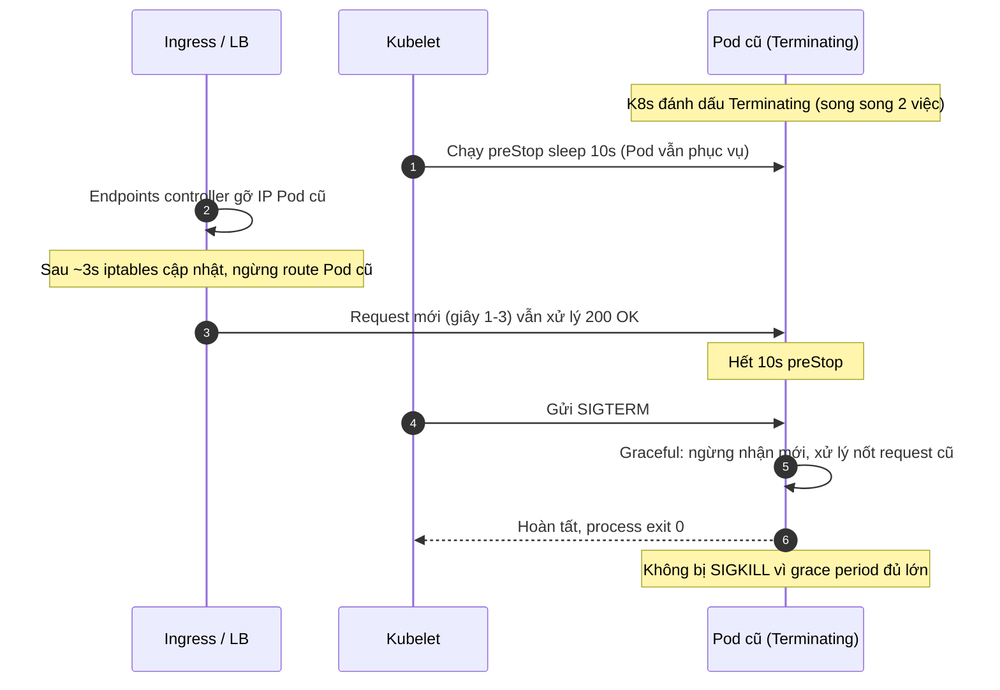

# Rolling update làm mất request đang xử lý. Cách phòng tránh?

## ⚡ Tóm tắt ngắn (30s)
* **Bản chất**: Trong `RollingUpdate`, Kubernetes lần lượt xóa Pod cũ và tạo Pod mới. Request bị mất khi Pod cũ bị tắt **trước khi** nó được gỡ sạch khỏi định tuyến, hoặc bị tắt **đột ngột** (SIGKILL) trong khi đang xử lý dở. Hai nguyên nhân gốc: (1) **độ trễ đồng bộ Endpoints** — khi Pod chuyển `Terminating`, việc gỡ IP khỏi Service Endpoints và việc gửi `SIGTERM` xảy ra **song song**, nên LB vẫn còn gửi request mới tới Pod đang tắt; (2) **thiếu graceful shutdown** — app không xử lý nốt request hiện tại trước khi chết.
* **Thảm họa thực chiến**:
  1. **502/504 hàng loạt khi deploy**: Pod cũ nhận SIGTERM tắt Tomcat ngay, nhưng Ingress chưa cập nhật Endpoints (mất 2–5s) → request mới vào Pod đã chết → 502.
  2. **Giao dịch đứt nửa chừng**: Request thanh toán đang gọi Stripe mất 4s, Pod bị SIGKILL ở giây thứ 2 → khách bị trừ tiền nhưng DB chưa lưu trạng thái → dữ liệu treo.
* **Quyết định Senior**:
  1. **`preStop` hook sleep** để Pod "sống thêm" 5–15s, cho LB/Ingress kịp gỡ IP trước khi app ngừng nhận kết nối.
  2. **Graceful shutdown ở app**: Spring `server.shutdown: graceful` — ngừng nhận request mới, xử lý nốt request cũ.
  3. **`terminationGracePeriodSeconds` đủ lớn** = preStop sleep + thời gian xử lý nốt + buffer, để không bị SIGKILL giữa chừng.
  4. **`maxUnavailable: 0` + readinessProbe đúng** để Pod mới chỉ nhận traffic khi đã sẵn sàng.

---

## 🔍 Chi tiết bản chất thực chiến: Vòng đời tắt Pod và điểm rơi request

### Trình tự khi Pod bị xóa (chạy SONG SONG, đây là mấu chốt)
* Khi Pod sang `Terminating`, Kubernetes đồng thời làm hai việc **không có thứ tự đảm bảo**:
  1. **Endpoints controller** gỡ IP Pod khỏi Service → kube-proxy/Ingress cập nhật iptables (mất vài giây để lan toả).
  2. **kubelet** chạy `preStop` (nếu có) rồi gửi `SIGTERM` cho container.
* Vì hai việc này song song, nếu app tắt ngay khi nhận SIGTERM (không preStop) thì trong "khoảng trống đồng bộ" LB vẫn route request mới tới Pod đã đóng socket → **connection refused → 502**.

### `preStop` sleep giải quyết race condition
* `preStop: sleep 10` ép kubelet **chờ 10s trước khi gửi SIGTERM**. Trong 10s đó Pod vẫn nhận và xử lý request bình thường, còn Endpoints controller có đủ thời gian gỡ IP. Hết sleep, không còn request mới tới nữa, lúc này SIGTERM mới được gửi → graceful shutdown xử lý nốt request cũ.

### Graceful shutdown ở tầng app
* `server.shutdown: graceful`: khi nhận SIGTERM, Tomcat **ngừng accept kết nối mới** nhưng giữ các request đang chạy tới khi xong (tối đa `timeout-per-shutdown-phase`). Kết hợp với preStop, không request nào bị cắt giữa chừng.

### Ràng buộc thời gian
$$terminationGracePeriodSeconds \ge preStopSleep + gracefulTimeout + buffer$$
Nếu tổng vượt `terminationGracePeriodSeconds`, kubelet gửi **SIGKILL** cắt đứt mọi thứ → mất request. Phải đặt grace period đủ rộng.

---

## 🎨 Sơ đồ tắt Pod an toàn khi rolling update



---

## 💻 Code thực chiến: BAD vs GOOD

### ❌ BAD: Không preStop, không graceful, grace period mặc định
```yaml
spec:
  template:
    spec:
      containers:
      - name: app
        image: order-service:v2
        # ❌ Không preStop -> SIGTERM gửi ngay -> race với gỡ Endpoints -> 502
        # ❌ Không graceful shutdown -> request dở bị cắt
```

### ✅ GOOD: preStop + graceful + grace period + chiến lược update an toàn
```yaml
spec:
  strategy:
    type: RollingUpdate
    rollingUpdate:
      maxUnavailable: 0      # ✅ không giảm capacity dưới mong muốn
      maxSurge: 1            # tạo Pod mới trước khi xóa Pod cũ
  template:
    spec:
      terminationGracePeriodSeconds: 45   # ✅ >= preStop(10) + graceful(30) + buffer(5)
      containers:
      - name: app
        image: order-service:v2
        lifecycle:
          preStop:
            exec:
              command: ["/bin/sh", "-c", "sleep 10"]   # ✅ cho LB kịp gỡ IP
        readinessProbe:
          httpGet:
            path: /actuator/health/readiness
            port: 8080
          periodSeconds: 5
```

### Spring Boot: bật graceful shutdown
```yaml
server:
  shutdown: graceful          # ✅ ngừng nhận mới, xử lý nốt request cũ
spring:
  lifecycle:
    timeout-per-shutdown-phase: 30s
```
```java
// Dockerfile dùng exec form để Java là PID 1 và NHẬN được SIGTERM
// ENTRYPOINT ["java", "-jar", "app.jar"]   <-- exec form, KHÔNG dùng shell form
@Component
public class GracefulTaskCloser implements ApplicationListener<ContextClosedEvent> {
    private final ExecutorService worker;
    public GracefulTaskCloser(ExecutorService worker) { this.worker = worker; }
    @Override public void onApplicationEvent(ContextClosedEvent e) {
        worker.shutdown();                         // ngừng nhận task mới
        try {
            if (!worker.awaitTermination(20, TimeUnit.SECONDS))
                worker.shutdownNow();              // ép dừng nếu quá hạn
        } catch (InterruptedException ex) {
            worker.shutdownNow(); Thread.currentThread().interrupt();
        }
    }
}
```

---

## 📊 Bảng so sánh trước/sau khi áp dụng graceful rolling update

| Tiêu chí | Mặc định (không cấu hình) | Senior (preStop + graceful) |
| :--- | :--- | :--- |
| **Lỗi 502/504 khi deploy** | Hàng loạt (race Endpoints) | ~0% |
| **Request dở dang** | Bị cắt bởi SIGKILL | Xử lý nốt rồi mới tắt |
| **maxUnavailable** | 25% (mặc định) → giảm capacity | 0 → giữ nguyên capacity |
| **PID nhận SIGTERM** | Có thể là /bin/sh (shell form) → mất tín hiệu | Java PID 1 (exec form) |
| **Thời gian deploy mỗi Pod** | Nhanh nhưng rủi ro | Chậm hơn ~30-45s, an toàn |
| **Giao dịch tài chính** | Nguy cơ mất/treo | Toàn vẹn |

---

## ⚠️ Common Gotchas & Questions follow-up

### 1. Cạm bẫy "Shell form trong Dockerfile nuốt mất SIGTERM (PID 1 trap)"
* **Vấn đề**: Dockerfile viết `CMD java -jar app.jar` (shell form) → `/bin/sh` thành PID 1, Java là tiến trình con. Kubernetes gửi SIGTERM tới PID 1 = `/bin/sh`, mà shell **không forward** tín hiệu sang con. Java không hề biết bị tắt, vẫn chạy. Sau `terminationGracePeriodSeconds`, kubelet gửi SIGKILL → graceful shutdown vô nghĩa, request dở bị cắt.
* **Giải pháp**: Dùng **exec form** `ENTRYPOINT ["java", "-jar", "app.jar"]` để Java là PID 1 và nhận SIGTERM trực tiếp; hoặc dùng `tini` làm init forward tín hiệu: `ENTRYPOINT ["/sbin/tini", "--", "java", "-jar", "app.jar"]`.

### 2. Câu hỏi đào sâu từ interviewer
* **Interviewer: "Đã có graceful shutdown mà thỉnh thoảng deploy vẫn dính vài lỗi 502. Còn nguyên nhân nào nữa?"**
* **Trả lời**:
  1. **HTTP keep-alive connection cũ ở client/LB**: client giữ kết nối persistent tới Pod cũ; sau khi Pod đóng, request kế tiếp trên kết nối đó fail. Khắc phục: app trả `Connection: close` trong giai đoạn shutdown, hoặc đặt connection idle timeout phía LB nhỏ hơn.
  2. **Endpoints lan toả chậm ở cụm lớn**: với hàng nghìn node, cập nhật iptables/IPVS mất lâu hơn preStop sleep. Tăng preStop sleep (10→15s) hoặc dùng EndpointSlice + readiness gating.
  3. **Pod mới chưa thật sự sẵn sàng**: readiness pass nhưng connection pool/cache còn lạnh → request đầu timeout. Dùng `startupProbe` + warm-up endpoint, và `minReadySeconds` để Pod mới ổn định trước khi xóa Pod cũ tiếp theo.
  4. **Ingress controller riêng (NGINX) có vòng đời đồng bộ khác** — kiểm tra `proxy-next-upstream` để retry sang Pod khỏe khi gặp lỗi tạm thời.
