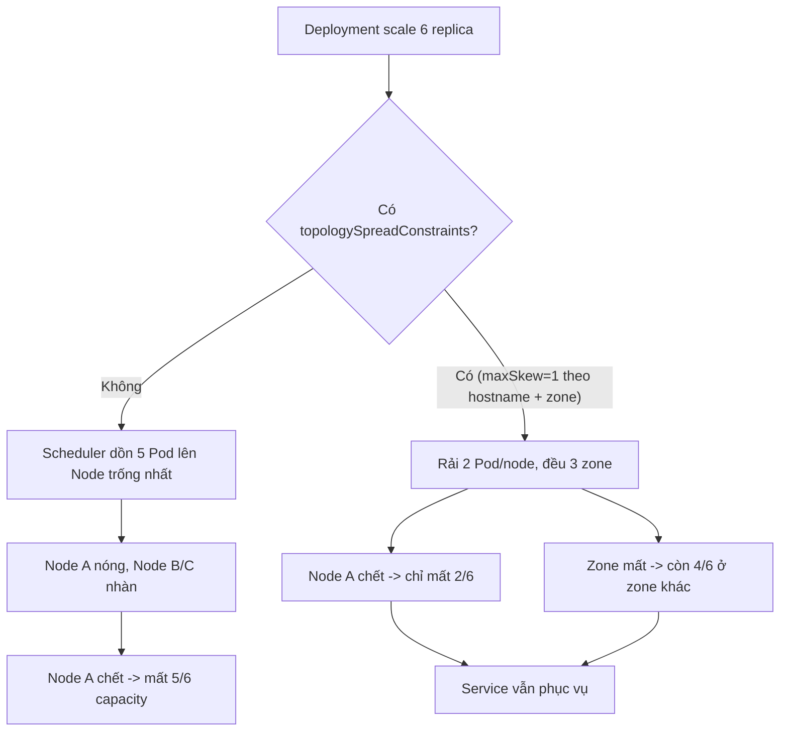

# Pod schedule không đều gây hot spot. Bạn xử lý thế nào?

## ⚡ Tóm tắt ngắn (30s)
* **Bản chất**: "Hot spot" xảy ra khi scheduler dồn nhiều Pod của cùng một service lên **cùng một node** (hoặc cùng một zone), khiến node đó quá tải (CPU/RAM/network) trong khi node khác nhàn rỗi. Hậu quả nặng nhất là **mất tính sẵn sàng**: nếu node nóng đó chết (hoặc zone đó mất), một phần lớn (đôi khi toàn bộ) replica của service biến mất cùng lúc → mất khả năng phục vụ dù `replicas` nhìn có vẻ nhiều.
* **Thảm họa thực chiến**:
  1. **Một node chết kéo sập service**: 6 replica nhưng 5 nằm trên cùng node A (do node A còn nhiều tài nguyên rỗi lúc schedule). Node A reboot → mất 5/6 capacity tức thời → service quá tải, cascade.
  2. **Mất cả zone**: tất cả Pod tình cờ ở zone `us-east-1a`; zone đó gặp sự cố mạng → service down hoàn toàn dù cluster trải 3 zone.
  3. **Resource hot spot**: node A gánh 5 Pod ngốn RAM → các Pod ở đó bị OOMKilled/evict dây chuyền.
* **Quyết định Senior**:
  1. **`topologySpreadConstraints`** để rải đều Pod theo node và theo zone.
  2. **`podAntiAffinity`** để tránh xếp nhiều replica cùng service lên một node.
  3. **Đặt `requests` chính xác** để scheduler tính bin-packing đúng, tránh dồn cục.

---

## 🔍 Chi tiết bản chất thực chiến: vì sao Pod bị dồn cục

### Scheduler mặc định không "rải đều" theo ý ta
* kube-scheduler chấm điểm node theo nhiều plugin; mặc định nó ưu tiên node phù hợp (đủ tài nguyên), KHÔNG đảm bảo phân tán đều replica của một Deployment. Nếu một node mới join còn trống, nhiều Pod cùng đợt rollout có thể dồn lên đó.
* Khi scale up nhanh hoặc sau khi một node hồi phục, các Pod mới dễ "đổ" về node trống nhất → mất cân bằng.

### Hai công cụ chính để chống hot spot
1. **`topologySpreadConstraints`** (khuyến nghị, hiện đại): yêu cầu phân bố Pod đều theo một `topologyKey` (vd `kubernetes.io/hostname` cho node, `topology.kubernetes.io/zone` cho zone) với độ lệch tối đa `maxSkew`.
2. **`podAntiAffinity`**: ngăn (hard `required`) hoặc ưu tiên tránh (soft `preferred`) việc đặt hai Pod cùng label lên cùng `topologyKey`.

### `requests` đúng giúp scheduler quyết định đúng
* Nếu `requests` quá thấp so với mức app thực dùng, scheduler tưởng node còn nhiều chỗ → dồn thêm Pod → node thực tế quá tải (over-subscription) → hot spot tài nguyên dù số Pod mỗi node trông "hợp lý". Đặt `requests` sát với mức p95 sử dụng thật.

### Khắc phục mất cân bằng đã xảy ra
* `topologySpreadConstraints` chỉ áp dụng lúc **schedule**; Pod đã chạy không tự di chuyển. Dùng **Descheduler** (component riêng) để evict Pod vi phạm spread, buộc reschedule lại cho cân bằng.

---

## 🎨 Sơ đồ chống hot spot bằng spread constraints



---

## 💻 Code thực chiến: BAD vs GOOD

### ❌ BAD: Không ràng buộc phân tán
```yaml
spec:
  replicas: 6
  template:
    spec:
      containers:
      - name: app
        image: api:v3
        resources:
          requests:
            cpu: "50m"        # ❌ request quá thấp -> scheduler tưởng node rỗng -> dồn cục
            memory: "128Mi"
      # ❌ Không topologySpread, không antiAffinity -> dễ dồn 1 node/1 zone
```

### ✅ GOOD: spread theo node + zone, anti-affinity mềm, request thực tế
```yaml
spec:
  replicas: 6
  template:
    metadata:
      labels:
        app: api
    spec:
      topologySpreadConstraints:
      - maxSkew: 1
        topologyKey: kubernetes.io/hostname        # ✅ rải đều theo NODE
        whenUnsatisfiable: ScheduleAnyway          # mềm: không kẹt schedule
        labelSelector:
          matchLabels:
            app: api
      - maxSkew: 1
        topologyKey: topology.kubernetes.io/zone   # ✅ rải đều theo ZONE
        whenUnsatisfiable: DoNotSchedule           # cứng cho HA đa zone
        labelSelector:
          matchLabels:
            app: api
      affinity:
        podAntiAffinity:
          preferredDuringSchedulingIgnoredDuringExecution:
          - weight: 100
            podAffinityTerm:
              topologyKey: kubernetes.io/hostname
              labelSelector:
                matchLabels:
                  app: api                          # ✅ tránh 2 Pod api cùng node
      containers:
      - name: app
        image: api:v3
        resources:
          requests:
            cpu: "500m"       # ✅ sát mức dùng thật -> bin-packing chính xác
            memory: "1Gi"
          limits:
            memory: "1Gi"
```

### Bash: kiểm tra phân bố Pod theo node/zone
```bash
# Đếm Pod mỗi node
kubectl get pods -l app=api -o wide --no-headers | awk '{print $7}' | sort | uniq -c
# Đếm Pod mỗi zone (cần label zone trên node)
kubectl get pods -l app=api -o json | jq -r '.items[].spec.nodeName' \
  | xargs -I{} kubectl get node {} -o jsonpath='{.metadata.labels.topology\.kubernetes\.io/zone}{"\n"}' \
  | sort | uniq -c
```

---

## 📊 Bảng so sánh các cơ chế chống hot spot

| Cơ chế | Mục đích | Ưu điểm | Hạn chế |
| :--- | :--- | :--- | :--- |
| **topologySpreadConstraints** | Rải đều theo node/zone với maxSkew | Linh hoạt, đa tầng (node+zone), hiện đại | Chỉ áp lúc schedule; cần label topology |
| **podAntiAffinity (required)** | Cấm 2 Pod cùng label/node | Đảm bảo cứng phân tán | Có thể kẹt nếu thiếu node → Pod Pending |
| **podAntiAffinity (preferred)** | Ưu tiên phân tán | Không kẹt schedule | Không đảm bảo tuyệt đối |
| **requests chính xác** | Bin-packing đúng | Tránh over-subscription | Không trực tiếp ép rải đều |
| **Descheduler** | Cân bằng lại Pod đang chạy | Sửa mất cân bằng đã xảy ra | Component thêm; gây evict/restart |

---

## ⚠️ Common Gotchas & Questions follow-up

### 1. Cạm bẫy "`whenUnsatisfiable: DoNotSchedule` quá cứng làm Pod kẹt Pending"
* **Vấn đề**: Đặt spread theo `hostname` với `DoNotSchedule` và `maxSkew: 1`, nhưng cluster chỉ có 3 node trong khi cần 6 replica → không thể giữ skew ≤ 1 → 3 Pod còn lại kẹt `Pending` mãi, capacity tụt. Tệ hơn, autoscale Pod (HPA) không bù được vì Pod mới cũng Pending.
* **Giải pháp**: Dùng `ScheduleAnyway` (mềm) cho ràng buộc theo node để không kẹt schedule, và chỉ dùng `DoNotSchedule` (cứng) cho **zone** khi thật sự cần HA đa zone và chắc chắn đủ node mỗi zone. Kết hợp Cluster Autoscaler để thêm node khi spread không thoả.

### 2. Câu hỏi đào sâu từ interviewer
* **Interviewer: "Pod đã rải đều lúc deploy, nhưng sau một sự cố node, chúng dồn cục trở lại. Vì sao và xử lý thế nào?"**
* **Trả lời**:
  1. **Spread chỉ tác động lúc schedule**: khi node chết, các Pod trên đó được tạo lại; nếu lúc đó chỉ vài node còn chỗ, chúng dồn về đó. Khi node cũ hồi phục, Pod **không tự di chuyển ngược lại** → mất cân bằng kéo dài.
  2. **Dùng Descheduler**: chạy định kỳ với strategy `RemovePodsViolatingTopologySpreadConstraint` để evict Pod vi phạm, buộc scheduler rải lại đều. Kết hợp PodDisruptionBudget để evict an toàn (không tụt dưới ngưỡng available).
  3. **Phòng ngừa**: bật Cluster Autoscaler để luôn có node trống ở mỗi zone; đặt PDB `minAvailable` hợp lý để khi node bảo trì/chết, K8s không evict quá nhiều Pod cùng lúc; theo dõi phân bố qua metric và cảnh báo khi skew vượt ngưỡng.
