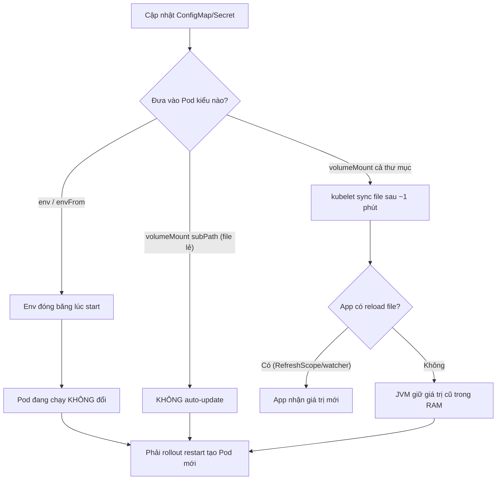

# ConfigMap/Secret update nhưng app không nhận. Vì sao?

## ⚡ Tóm tắt ngắn (30s)
* **Bản chất**: Có **hai cách** đưa ConfigMap/Secret vào Pod, và chúng hành xử **khác nhau hoàn toàn** khi cập nhật:
  * **Qua `env` / `envFrom` (biến môi trường)**: giá trị được "đóng băng" vào tiến trình **lúc container khởi động**. Cập nhật ConfigMap/Secret **KHÔNG** thay đổi env của Pod đang chạy — phải **tạo lại Pod** mới nhận.
  * **Qua `volumeMount` (mount file)**: kubelet **tự đồng bộ** file trong volume sau một khoảng (thường ~1 phút + TTL cache). File mới được cập nhật, NHƯNG app chỉ "nhận" nếu nó **đọc lại file** hoặc có cơ chế reload — JVM đã đọc file lúc start sẽ không tự biết file đổi.
* **Thảm họa thực chiến**:
  1. **Đổi config xong không có tác dụng**: team sửa ConfigMap (đổi feature flag, log level), `kubectl apply`, chờ mãi app vẫn dùng giá trị cũ vì config nạp qua `env` → cần rollout restart mà không ai biết.
  2. **Secret xoay vòng (rotation) không ăn**: đổi DB password trong Secret nhưng Pod cũ vẫn cầm password cũ trong env → kết nối DB fail sau khi password cũ bị thu hồi.
* **Quyết định Senior**:
  1. **Hiểu rõ env (cần restart) vs volume (tự sync file, nhưng app phải reload)**.
  2. **Chủ động trigger rollout** khi config đổi: `kubectl rollout restart` hoặc checksum annotation để Deployment tự đổi.
  3. **subPath mount KHÔNG auto-update** — cạm bẫy lớn.

---

## 🔍 Chi tiết bản chất thực chiến: ba lý do phổ biến app không nhận config mới

### Lý do 1: Config nạp qua biến môi trường (`env`/`envFrom`)
* Biến môi trường được set **một lần** khi container start (do kernel `execve`). Linux không có cơ chế đẩy env mới vào tiến trình đang chạy. Vì vậy đổi ConfigMap/Secret **không** chạm tới Pod đang sống. Bắt buộc **tạo lại Pod**.

### Lý do 2: Mount volume nhưng app không reload
* Với `volumeMount`, kubelet đồng bộ file qua symlink atomic (`..data`) sau một khoảng trễ (kube-apiserver sync period + kubelet cache TTL, tổng có thể ~1 phút). File trên đĩa **được cập nhật**, nhưng nếu app đọc file đó **một lần lúc start** (Spring `@Value`, `application.yml`) thì giá trị trong bộ nhớ JVM vẫn cũ. Cần cơ chế **reload**: Spring Cloud Kubernetes reload, `@RefreshScope`, hoặc file watcher.

### Lý do 3: `subPath` chặn auto-update
* Khi mount **một file cụ thể** bằng `subPath`, Kubernetes **không** cập nhật file đó khi ConfigMap đổi (vì subPath phá vỡ symlink atomic). File subPath chỉ đổi khi Pod được tạo lại. Đây là cạm bẫy rất hay gặp: mount cả thư mục thì auto-update, mount file lẻ bằng subPath thì không.

### Cách buộc nhận config mới
* **Rollout restart**: `kubectl rollout restart deployment/app` tạo Pod mới đọc lại config — đơn giản, an toàn nhất cho cả env và file.
* **Checksum annotation**: gắn hash của ConfigMap vào `pod.template.annotations`; config đổi → hash đổi → template đổi → Deployment tự rollout. Tự động hoá trong CI/CD (Helm hay dùng cách này).

---

## 🎨 Sơ đồ vì sao app không nhận config mới



---

## 💻 Code thực chiến: BAD vs GOOD

### ❌ BAD: env + kỳ vọng đổi config là tự ăn
```yaml
spec:
  template:
    spec:
      containers:
      - name: app
        image: api:v1
        envFrom:
        - configMapRef:
            name: app-config   # ❌ đổi ConfigMap không tác động Pod đang chạy
        - secretRef:
            name: db-secret    # ❌ rotate password không ăn cho Pod cũ
```

### ✅ GOOD: checksum annotation tự rollout khi config đổi
```yaml
spec:
  template:
    metadata:
      annotations:
        # ✅ Hash của ConfigMap; đổi config -> hash đổi -> template đổi -> rollout tự động
        checksum/config: "{{ sha256sum (toJson .Values.appConfig) }}"
    spec:
      containers:
      - name: app
        image: api:v1
        envFrom:
        - configMapRef:
            name: app-config
        volumeMounts:
        - name: cfg
          mountPath: /etc/app          # ✅ mount cả thư mục -> auto-update file
          # KHÔNG dùng subPath nếu muốn auto-update
      volumes:
      - name: cfg
        configMap:
          name: app-config
```

### Lệnh buộc nhận config mới + verify
```bash
# Cách chắc ăn nhất: tạo Pod mới đọc lại config
kubectl rollout restart deployment/api
kubectl rollout status deployment/api
# Kiểm tra env Pod đang chạy có giá trị mới chưa
kubectl exec api-xxxx -- printenv | grep FEATURE_FLAG
# Kiểm tra file mount đã sync chưa
kubectl exec api-xxxx -- cat /etc/app/application.yml
```

### Spring: reload không cần restart (khi mount volume)
```java
@RestController
@RefreshScope                               // ✅ bean được tạo lại khi /actuator/refresh
public class FeatureController {
    @Value("${feature.new-checkout:false}")
    private boolean newCheckout;            // đọc lại sau refresh

    @GetMapping("/feature")
    public boolean flag() { return newCheckout; }
}
// Cần spring-cloud-kubernetes hoặc gọi POST /actuator/refresh sau khi file đổi
```

---

## 📊 Bảng so sánh cách inject ConfigMap/Secret

| Cách inject | Tự cập nhật khi đổi? | Độ trễ | App cần làm gì | Phù hợp |
| :--- | :--- | :--- | :--- | :--- |
| **env / envFrom** | ❌ Không | — | Rollout restart | Config tĩnh, ít đổi |
| **volumeMount (thư mục)** | ✅ Có (file) | ~1 phút | Reload file (RefreshScope/watcher) | Config đổi nóng |
| **volumeMount subPath (file lẻ)** | ❌ Không | — | Rollout restart | Cần đường dẫn file cố định |
| **Secret qua env** | ❌ Không | — | Rollout restart | Secret ít xoay vòng |
| **Secret qua volume** | ✅ Có (file) | ~1 phút | App đọc lại file | Rotation tự động |

---

## ⚠️ Common Gotchas & Questions follow-up

### 1. Cạm bẫy "subPath mount tưởng auto-update nhưng không"
* **Vấn đề**: Team mount đúng một file `application.yml` bằng `subPath` để khỏi đụng các file khác trong thư mục. Họ kỳ vọng đổi ConfigMap thì file tự đổi như tài liệu nói về volume. Thực tế `subPath` **phá vỡ cơ chế symlink atomic** của kubelet → file **không bao giờ tự cập nhật**, chỉ đổi khi Pod tạo lại. Hậu quả: đổi config tưởng đã ăn (vì là volume) nhưng app vẫn cũ → debug rất khó vì kỳ vọng sai.
* **Giải pháp**: Nếu cần auto-update, mount **cả thư mục** (không subPath) và để app đọc file trong đó; hoặc chấp nhận subPath nhưng luôn `rollout restart` khi đổi config. Ghi rõ trong runbook để tránh nhầm.

### 2. Câu hỏi đào sâu từ interviewer
* **Interviewer: "Đổi DB password trong Secret để xoay vòng, làm sao không gây downtime cho app?"**
* **Trả lời**:
  1. **Dual-password / overlap window**: cấu hình DB chấp nhận **cả password cũ và mới** trong một khoảng giao thoa. Cập nhật Secret → rollout restart từng phần (rolling) để Pod mới dùng password mới, Pod cũ vẫn dùng password cũ còn hợp lệ → không đứt kết nối. Sau khi mọi Pod đã mới, thu hồi password cũ.
  2. **Tránh inject qua env nếu rotation thường xuyên**: dùng Secret qua **volume** + app đọc lại file/khởi tạo lại datasource khi file đổi, hoặc dùng giải pháp như **External Secrets Operator / Vault Agent** sidecar tự renew credential ngắn hạn mà không cần restart.
  3. **Connection pool**: sau khi đổi password, pool cũ vẫn giữ connection cũ (đã auth). Cần invalidate pool để tạo connection mới với credential mới — nếu không, lỗi auth chỉ xuất hiện khi pool tạo connection mới lúc tải cao, rất khó debug.
