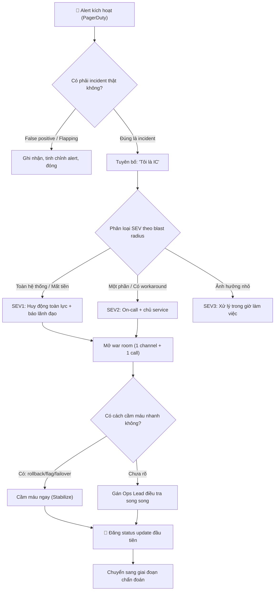

# Khi incident xảy ra, senior engineer nên làm gì trong 5 phút đầu?

## ⚡ Tóm tắt ngắn (30s)
* **Bản chất**: 5 phút đầu của một incident quyết định MTTR (Mean Time To Resolution) của toàn bộ sự cố. Senior engineer KHÔNG lao vào đọc log hay sửa code ngay. Việc đầu tiên là **thiết lập trật tự chỉ huy (Establish Command)** theo mô hình ICS (Incident Command System): tuyên bố incident, nhận vai **Incident Commander (IC)**, đánh giá mức độ nghiêm trọng (SEV level), và **ổn định trước, chẩn đoán sau (Stabilize before Diagnose)**.
* **Thảm họa thực chiến được giải quyết**:
  1. **Hỗn loạn không người chỉ huy (Headless Chaos)**: 8 engineer cùng nhảy vào war room, mỗi người sửa một thứ trên production, không ai biết ai đang làm gì. MTTR kéo dài gấp 3 lần vì các thay đổi giẫm chân nhau.
  2. **Lao vào debug khi hệ thống đang cháy (Premature Debugging)**: On-call dành 25 phút đọc stack trace để tìm root cause trong khi khách hàng không thanh toán được, thay vì rollback ngay để cầm máu.
* **Quyết định Senior**:
  1. **Tuyên bố & nhận vai IC trong 60 giây**: Mở war room (Slack channel + bridge call), nói rõ "Tôi là IC cho incident này" để chấm dứt hỗn loạn.
  2. **Phân loại SEV & xác định blast radius**: SEV1/SEV2/SEV3 dựa trên phạm vi ảnh hưởng và doanh thu, quyết định mức huy động nguồn lực.
  3. **Cầm máu trước**: Ưu tiên rollback/feature-flag-off/failover để khôi phục dịch vụ, root cause để sau khi đã ổn định.

---

## 🔍 Chi tiết bản chất thực chiến: Checklist 5 phút đầu của Incident Commander

5 phút đầu được chia thành 5 hành động tuần tự, mỗi hành động khoảng 1 phút:

```
[Báo động: PagerDuty/Alert 🚨] ──> [Phút 1: TUYÊN BỐ & NHẬN VAI IC]
                                         │
                                         ▼
                                  [Phút 2: ĐÁNH GIÁ SEV & BLAST RADIUS]
                                         │
                                         ▼
                                  [Phút 3: MỞ WAR ROOM & GỌI NGƯỜI]
                                         │
                                         ▼
                                  [Phút 4: QUYẾT ĐỊNH CẦM MÁU (Mitigate)]
                                         │
                                         ▼
                                  [Phút 5: COMMUNICATE STATUS ĐẦU TIÊN]
```

### Phút 1: Tuyên bố incident & nhận vai Incident Commander
* Khoảnh khắc tệ nhất là không ai dám nói "đây là incident". Senior phải chủ động tuyên bố và nhận vai IC. **IC không phải người giỏi tech nhất, mà là người điều phối** — IC giữ cho team tập trung, ra quyết định và bảo vệ luồng thông tin.
* Câu nói thiết lập trật tự: *"Đây là incident, tôi là IC. Mọi thay đổi production phải báo qua tôi trước."*

### Phút 2: Đánh giá SEV level & blast radius
* Trả lời 3 câu hỏi: (1) Bao nhiêu % user bị ảnh hưởng? (2) Có chạm vào luồng tiền/core business (thanh toán, đặt hàng) không? (3) Có nguy cơ mất/hỏng dữ liệu không?
* Gán SEV ngay (xem bảng so sánh). SEV1 = huy động toàn lực, đánh thức cả quản lý; SEV3 = xử lý trong giờ hành chính.

### Phút 3: Mở war room & huy động đúng người
* Một kênh duy nhất (single source of truth): Slack channel `#incident-<id>` + một bridge call. Không tản mát thông tin ra nhiều nơi.
* Gọi đúng người: chủ service nghi vấn, on-call hạ tầng. **Không gọi cả công ty** — quá nhiều người làm nhiễu (bystander effect).

### Phút 4: Quyết định cầm máu (Mitigate first)
* Câu hỏi vàng: *"Hành động nhanh nhất để khôi phục dịch vụ là gì?"* — thường là rollback, tắt feature flag, hoặc failover sang region khác.
* **Không cần biết root cause để cầm máu.** Cầm máu xong mới điều tra.

### Phút 5: Communicate status đầu tiên
* Đăng update đầu tiên cho stakeholder/status page trong vòng 5 phút, kể cả khi chưa biết gì: *"Chúng tôi đã ghi nhận sự cố, đang điều tra, update sau 15 phút."* Sự im lặng làm xói mòn niềm tin nhanh hơn cả bản thân sự cố.

---

## 🎨 Sơ đồ trực quan: Luồng quyết định 5 phút đầu của IC



---

## 💻 Code thực chiến: Runbook checklist "5 phút đầu" (artifact dán sẵn trong war room)

Trong thực tế, thứ giúp một engineer bình tĩnh nhất không phải kiến thức mà là một **checklist dán sẵn**. Dưới đây là artifact runbook chuẩn để pin lên đầu kênh incident.

### Artifact: `INCIDENT-FIRST-5-MIN.md`
```markdown
# 🚨 RUNBOOK: 5 PHÚT ĐẦU KHI CÓ INCIDENT

## ☐ PHÚT 0-1: ESTABLISH COMMAND
- [ ] Gõ vào kênh: "ĐÂY LÀ INCIDENT. Tôi là IC: @<tên>"
- [ ] Tạo kênh #incident-YYYYMMDD-<slug>
- [ ] Bật bridge call (link: <zoom/meet>)

## ☐ PHÚT 1-2: ASSESS (trả lời 3 câu)
- [ ] % user ảnh hưởng:  ______
- [ ] Chạm luồng tiền/core? (Y/N):  ______
- [ ] Nguy cơ mất dữ liệu? (Y/N):  ______
- [ ] => SEV LEVEL:  [ SEV1 / SEV2 / SEV3 ]

## ☐ PHÚT 2-3: MOBILIZE
- [ ] Gán Ops Lead (người fix):  @______
- [ ] Gán Comms Lead (người báo cáo):  @______
- [ ] Gán Scribe (người ghi timeline):  @______
- [ ] SEV1 => @page engineering-manager

## ☐ PHÚT 3-4: STABILIZE (cầm máu trước!)
- [ ] Lựa chọn nhanh nhất:
      [ ] Tắt feature flag: <tên flag>
      [ ] Rollback: kubectl rollout undo deploy/<svc>
      [ ] Failover region: <runbook link>
- [ ] ÁP DỤNG SINGLE-WRITER: chỉ Ops Lead chạm production

## ☐ PHÚT 4-5: COMMUNICATE
- [ ] Đăng status page (template bên dưới)
- [ ] Hẹn giờ update tiếp theo: +15 phút

## ⛔ KHÔNG LÀM TRONG 5 PHÚT ĐẦU:
- ❌ Đọc full stack trace tìm root cause
- ❌ Sửa code "cho đẹp"
- ❌ Để nhiều người cùng đổi production
```

---

## 📊 Bảng so sánh: Hành vi Junior vs Senior trong 5 phút đầu

| Tiêu chí | ❌ Junior Engineer | ✅ Senior Engineer (Incident Commander) |
| :--- | :--- | :--- |
| **Hành động đầu tiên** | Mở log, đọc stack trace, tìm dòng code lỗi. | Tuyên bố incident, nhận vai IC, thiết lập trật tự. |
| **Mục tiêu ưu tiên** | Tìm cho ra nguyên nhân gốc (root cause). | Khôi phục dịch vụ (stabilize) — root cause tính sau. |
| **Cách huy động người** | Gọi càng nhiều người càng tốt, hoặc tự ôm. | Gọi đúng vai trò, phân công IC/Ops/Comms/Scribe. |
| **Thay đổi production** | Ai thấy gì sửa nấy, song song nhiều người. | Single-writer rule: chỉ Ops Lead được chạm. |
| **Communicate** | Im lặng cho đến khi fix xong. | Update status trong 5 phút dù chưa biết nguyên nhân. |
| **Kết quả MTTR** | Cao, hỗn loạn, dễ gây sự cố chồng sự cố. | Thấp, có kiểm soát, có thể audit lại được. |

---

## ⚠️ Common Gotchas & Questions follow-up

### 1. Cạm bẫy "IC tự tay đi fix (The Player-Coach Trap)"
* **Vấn đề**: Senior giỏi nhất nhận vai IC nhưng rồi không kìm được, tự nhảy vào terminal gõ lệnh fix. Lúc này không còn ai điều phối: thông tin từ các nhánh điều tra không được tổng hợp, stakeholder không được update, và chính IC bị "tunnel vision" cắm đầu vào một giả thuyết.
* **Giải pháp**: **IC phải giữ tay khỏi bàn phím.** Vai trò của IC là điều phối và ra quyết định, không phải gõ lệnh. Nếu team quá nhỏ và IC buộc phải fix, hãy bàn giao vai IC cho người khác trước khi nhảy vào terminal. Tách bạch "người chỉ huy" và "người thực thi" là nguyên tắc cốt lõi của ICS.

### 2. Câu hỏi đào sâu từ interviewer
* **Q: "Bạn là người duy nhất on-call lúc 3 giờ sáng, không gọi được ai. Bạn có còn áp dụng mô hình IC/Ops/Comms tách bạch không, hay làm tất cả một mình?"**
* **Trả lời**:
  * Khi chỉ có một mình, ta không bỏ mô hình mà **gộp vai trò nhưng tuần tự hóa hành động** để không mất kiểm soát:
    1. **Vẫn viết timeline ra văn bản** (mình tự làm Scribe): mỗi hành động ghi 1 dòng có timestamp vào kênh incident. Đây là cứu cánh khi bàn giao ca và viết postmortem.
    2. **Comms tối giản nhưng không bỏ**: đăng 1 status update tự động/ngắn gọn để stakeholder biết có người đang xử lý, hẹn giờ update tiếp.
    3. **Stabilize ưu tiên tuyệt đối**: một mình thì không có băng thông vừa fix vừa điều tra, nên chọn hành động cầm máu an toàn nhất (rollback) trước, rồi mới điều tra trong trạng thái hệ thống đã ổn định.
    4. **Escalate sớm**: nếu sau 10-15 phút chưa cầm được máu, kích hoạt escalation path (gọi cấp trên/secondary on-call) — một mình ôm SEV1 quá lâu là anti-pattern.
