# Làm sao đo incident impact?

## ⚡ Tóm tắt ngắn (30s)
* **Bản chất**: Đo impact của incident là **lượng hóa thiệt hại trên nhiều chiều đo (multi-dimensional)**, không chỉ "downtime bao lâu". Các chiều cốt lõi: **thời lượng (MTTD/MTTR)**, **phạm vi người dùng ảnh hưởng**, **mức độ vi phạm SLO/SLA & tiêu hao error budget**, **tác động tài chính (doanh thu mất, chi phí)**, và **tác động phi tài chính (niềm tin, uy tín, hợp đồng)**. Mục tiêu của việc đo là để **phân loại SEV đúng, ưu tiên hóa follow-up, và ra quyết định đầu tư phòng ngừa dựa trên dữ liệu** — không phải để trừng phạt.
* **Thảm họa thực chiến được giải quyết**:
  1. **Đo sai dẫn đến đầu tư sai (Misallocation)**: Chỉ nhìn "downtime 28 phút" mà bỏ qua việc đó là 28 phút giờ cao điểm chạm đúng luồng thanh toán → đánh giá thấp mức nghiêm trọng, không đầu tư phòng ngừa, sự cố lặp lại tốn kém hơn.
  2. **Không đo được = không cải thiện được (Invisible Toil)**: Không track MTTD/MTTR theo thời gian nên không biết quy trình incident đang tốt lên hay tệ đi.
* **Quyết định Senior**:
  1. **Đo bằng customer-centric metrics, không chỉ server-centric**: "% giao dịch thất bại" quan trọng hơn "CPU 1 pod cao".
  2. **Quy ra error budget & tiền khi có thể**: Biến impact thành ngôn ngữ business để ra quyết định đầu tư.
  3. **Track xu hướng MTTD/MTTR theo thời gian**: Đo để cải tiến quy trình, không phải để chấm điểm cá nhân.

---

## 🔍 Chi tiết bản chất thực chiến: 5 chiều đo impact

### Chiều 1: Thời gian (Time-based metrics)
* **MTTD (Mean Time To Detect)**: từ lúc sự cố bắt đầu đến lúc phát hiện. Đo chất lượng monitoring/alert.
* **MTTA (Mean Time To Acknowledge)**: từ alert đến lúc có người nhận. Đo chất lượng on-call.
* **MTTR (Mean Time To Resolve/Recover)**: từ phát hiện đến khôi phục. Đo chất lượng phản ứng.
* Phân rã MTTR giúp biết bottleneck nằm ở phát hiện hay xử lý.

### Chiều 2: Phạm vi người dùng (User impact)
* **% user ảnh hưởng**, số request lỗi, số giao dịch thất bại. Trọng số theo **luồng nghiệp vụ**: 1% lỗi ở luồng thanh toán nghiêm trọng hơn 10% lỗi ở trang "Giới thiệu".
* **Customer-centric**: đo ở góc nhìn người dùng (giao dịch hoàn tất được không?), không chỉ góc nhìn server.

### Chiều 3: SLO / SLA & Error Budget
* **SLO** (mục tiêu nội bộ) và **SLA** (cam kết hợp đồng, có phạt) bị vi phạm bao nhiêu.
* **Error budget**: nếu SLO là 99.9% availability/tháng, thì ngân sách lỗi cho phép là $0.1\% \times 30 \times 24 \times 60 \approx 43.2$ phút/tháng. Incident 28 phút tiêu **65%** error budget tháng → tín hiệu mạnh để siết phòng ngừa.

### Chiều 4: Tác động tài chính (Financial)
* **Doanh thu mất trực tiếp**: ước tính = (giao dịch lỗi) × (giá trị giao dịch trung bình), hoặc (thời lượng) × (doanh thu/phút giờ cao điểm).
* **Chi phí phát sinh**: phạt SLA, hoàn tiền/credit khách hàng, giờ công xử lý, chi phí cơ hội.

### Chiều 5: Phi tài chính (Reputation & Trust)
* Churn khách hàng, tin tiêu cực, mất hợp đồng B2B, tinh thần team, niềm tin nội bộ. Khó định lượng nhưng phải ghi nhận định tính.

---

## 🎨 Sơ đồ trực quan: Các mốc thời gian và chiều đo impact

```mermaid
flowchart LR
    A["Sự cố<br>bắt đầu"] -->|"MTTD<br>(phát hiện)"| B["Alert<br>kích hoạt"]
    B -->|"MTTA<br>(nhận)"| C["On-call<br>nhận việc"]
    C -->|"Time to<br>Mitigate"| D["Đã cầm máu<br>(mitigated)"]
    D -->|"Time to<br>Resolve"| E["Khôi phục<br>hoàn toàn"]
    A -.->|"TỔNG MTTR (toàn bộ tác động)"| E
    subgraph IMPACT["📊 Đo trên 5 chiều"]
        F["⏱️ Thời gian:<br>MTTD/MTTA/MTTR"]
        G["👥 User:<br>% ảnh hưởng, giao dịch lỗi"]
        H["📉 SLO/SLA:<br>error budget tiêu hao"]
        I["💰 Tài chính:<br>doanh thu mất + chi phí"]
        J["🤝 Phi tài chính:<br>uy tín, churn, niềm tin"]
    end
    E --> IMPACT
    style D fill:#ff9,stroke:#333
    style E fill:#9f9,stroke:#333
```



---

## 💻 Code thực chiến: Báo cáo đo impact + truy vấn metric (artifact)

### Artifact: `INCIDENT-IMPACT-REPORT.md`
```markdown
# 📊 BÁO CÁO IMPACT — Incident #2026-0630 (SEV2, payment 5xx)

## ⏱️ THỜI GIAN
- Sự cố bắt đầu (T0):        10:35
- Phát hiện (alert):         10:37   => MTTD = 2 phút  ✅ tốt
- Nhận (acknowledge):        10:38   => MTTA = 1 phút  ✅ tốt
- Mitigate (cầm máu):        10:52   => 15 phút
- Resolve (khôi phục):       11:03   => MTTR = 26 phút

## 👥 PHẠM VI USER
- User bị ảnh hưởng:         ~12,000 (~9% MAU active giờ đó)
- Request lỗi:               ~41,000 (5xx)
- Giao dịch thất bại:        ~3,400 (luồng CORE thanh toán ⚠️)

## 📉 SLO / ERROR BUDGET
- SLO availability:          99.9%/tháng (budget = 43.2 phút/tháng)
- Đã tiêu:                   26 phút = 60% budget tháng 🔴
- SLA hợp đồng B2B:          vi phạm với 2 khách enterprise (có credit)

## 💰 TÀI CHÍNH (ước tính)
- Doanh thu mất trực tiếp:   3,400 giao dịch × giá TB = ~X
- Credit/hoàn SLA:           ~Y cho 2 khách enterprise
- Giờ công xử lý:            6 người × 1.5h = 9 giờ công

## 🤝 PHI TÀI CHÍNH
- 1 khách enterprise gửi email phàn nàn, nguy cơ churn.
- 14 ticket CS, mức hài lòng giảm tạm thời.

## 🏷️ KẾT LUẬN SEV
=> Xác nhận SEV2 (chạm luồng tiền core, tiêu 60% budget,
   vi phạm SLA B2B). Ưu tiên follow-up: HIGH.
```

### Artifact: PromQL đo customer-centric impact
```promql
# % giao dịch thanh toán thất bại trong cửa sổ incident
sum(rate(payment_transactions_total{status="failed"}[1m]))
  /
sum(rate(payment_transactions_total[1m])) * 100

# Tổng số giao dịch lỗi trong khoảng incident (để quy ra tiền)
sum(increase(payment_transactions_total{status="failed"}[26m]))

# Error budget burn rate (so với ngưỡng cho phép)
# burn rate > 1 nghĩa là đang tiêu budget nhanh hơn mức bền vững
(1 - (sum(rate(http_requests_total{status!~"5.."}[5m]))
      / sum(rate(http_requests_total[5m])))) / (1 - 0.999)
```

---

## 📊 Bảng so sánh: Chiều đo & cách dùng

| Chiều đo | Metric chính | Đo cái gì | Dùng để |
| :--- | :--- | :--- | :--- |
| **Thời gian** | MTTD, MTTA, MTTR | Tốc độ phát hiện & phục hồi | Cải tiến monitoring & quy trình phản ứng |
| **Phạm vi user** | % user, giao dịch lỗi | Bao nhiêu người, luồng nào | Phân loại SEV, ưu tiên |
| **SLO/Error budget** | % budget tiêu hao | Mức "vượt ngân sách lỗi" | Quyết định freeze feature / siết phòng ngừa |
| **SLA hợp đồng** | Mức vi phạm cam kết | Phạt/credit pháp lý | Báo cáo legal/business, bồi thường |
| **Tài chính** | Doanh thu mất, chi phí | Thiệt hại bằng tiền | Justify đầu tư phòng ngừa |
| **Phi tài chính** | Churn, ticket CS, uy tín | Niềm tin & danh tiếng | Quyết định communicate & xin lỗi |

---

## ⚠️ Common Gotchas & Questions follow-up

### 1. Cạm bẫy "Đo server-centric thay vì customer-centric (Vanity Metrics)"
* **Vấn đề**: Team báo cáo "uptime 99.95%, CPU bình thường, không có pod nào chết" và kết luận incident "nhẹ". Nhưng thực tế tầng load balancer trả 200 OK trong khi backend trả về trang lỗi rỗng, hoặc thanh toán "thành công" về mặt HTTP nhưng tiền không trừ — người dùng KHÔNG mua được hàng. Các metric server xanh đẹp che giấu thảm họa ở góc nhìn khách hàng. Đo sai dẫn đến phân loại SEV thấp và bỏ qua một sự cố nghiêm trọng.
* **Giải pháp**: (1) Ưu tiên **customer-centric SLI**: đo "tỉ lệ giao dịch hoàn tất thành công từ góc nhìn người dùng", "tỉ lệ trang load đủ nội dung", không chỉ "HTTP 200 rate". (2) **Synthetic monitoring / real user monitoring (RUM)**: bot mô phỏng luồng mua hàng thật và đo từ ngoài vào. (3) Định nghĩa SLO dựa trên **trải nghiệm người dùng cuối**, để khi SLO đỏ thì đúng là người dùng đang đau, không phải báo động giả từ một metric kỹ thuật vô nghĩa.

### 2. Câu hỏi đào sâu từ interviewer
* **Q: "Làm sao bạn ước tính doanh thu mất khi không phải mọi giao dịch lỗi đều là doanh thu mất thật (user có thể thử lại sau)?"**
* **Trả lời**:
  * Ước tính tài chính cần trung thực về độ bất định, không thổi phồng cũng không xem nhẹ:
    1. **Phân biệt mất vĩnh viễn vs trì hoãn**: Một số giao dịch lỗi là *doanh thu trì hoãn* (user thử lại 10 phút sau và mua thành công) — không nên tính là mất. Phần *mất thật* là những user bỏ đi không quay lại. Ta ước lượng tỉ lệ này bằng cách so sánh tổng doanh thu ngày sự cố với baseline ngày thường (đo phần "lõm" không được bù lại sau khi hồi phục).
    2. **Dùng baseline & phương pháp lõm (dip analysis)**: Vẽ đường doanh thu thực tế và đường dự báo (cùng giờ các tuần trước). Diện tích phần lõm giữa hai đường, sau khi trừ phần "hồi" lại sau incident, là ước tính doanh thu mất ròng.
    3. **Đưa ra khoảng (range), không con số giả-chính-xác**: Báo cáo "ước tính mất X đến Y, giả định Z% user không quay lại" trung thực hơn một con số đơn lẻ. Ghi rõ giả định để người đọc hiểu độ tin cậy.
    4. **Tính cả chi phí gián tiếp dài hạn**: Doanh thu trực tiếp chỉ là một phần. Với khách B2B, một incident có thể khiến mất cả hợp đồng nhiều năm — giá trị này (LTV) lớn hơn nhiều so với vài giao dịch lỗi, và cần đưa vào để justify đầu tư phòng ngừa đúng mức.
