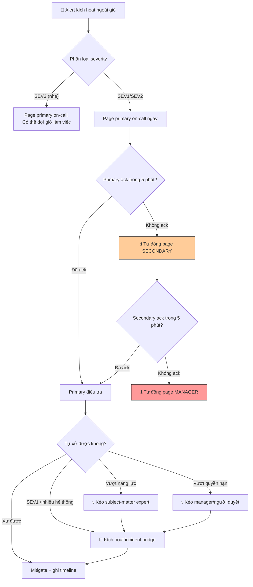

# Khi alert xảy ra ngoài giờ, bạn xử lý escalation thế nào?

## ⚡ Tóm tắt ngắn (30s)
* **Bản chất**: Escalation ngoài giờ là một **quy trình có cấu trúc theo tầng (tiered on-call)**, không phải "gọi đại ai đó". Cốt lõi: **primary on-call → secondary on-call → engineering manager → incident bridge**, mỗi tầng có **thời gian timeout** rõ ràng. Hai loại escalation: **theo thời gian** (primary không ack trong N phút thì tự động nhảy lên secondary) và **theo nội dung** (vượt quá năng lực/quyền hạn thì chủ động kéo người phù hợp vào). Nguyên tắc: **escalate sớm không phải là yếu kém, mà là trách nhiệm** — ôm một mình quá lâu mới là anti-pattern.
* **Thảm họa thực chiến được giải quyết**:
  1. **Alert rơi vào hư không (Missed Page)**: Primary on-call ngủ quên/mất sóng, không có escalation tự động → SEV1 không ai xử lý 40 phút giữa đêm.
  2. **Anh hùng kiệt sức ôm một mình (Hero Burnout)**: On-call ngại gọi cấp trên lúc 3h sáng, tự vật lộn 2 tiếng với việc vượt quá khả năng, kéo dài downtime và kiệt sức.
* **Quyết định Senior**:
  1. **Escalation policy tự động theo timeout**: Không ack trong X phút → tự nhảy tầng, không phụ thuộc con người tỉnh táo.
  2. **Escalate theo nội dung khi cần**: Vượt quyền (cần phê duyệt), vượt năng lực (cần chuyên gia), hoặc SEV cao → kéo người đúng vào ngay.
  3. **Bảo vệ sức khỏe on-call**: Ưu tiên alert sạch (giảm noise), follow-the-sun cho team đa múi giờ, và văn hóa "gọi là đúng".

---

## 🔍 Chi tiết bản chất thực chiến: Mô hình escalation theo tầng

### Hai trục escalation
```
TRỤC THỜI GIAN (time-based, tự động)      TRỤC NỘI DUNG (content-based, chủ động)
──────────────────────────────────       ────────────────────────────────────
Primary on-call                          "Vượt quyền hạn của tôi?"
  ↓ không ack trong 5 phút                 → kéo manager/người có quyền duyệt
Secondary on-call                        "Vượt năng lực của tôi?"
  ↓ không ack trong 5 phút                 → kéo subject-matter expert
Engineering Manager                      "SEV1 / chạm nhiều hệ thống?"
  ↓ không xử được / cần nguồn lực           → kích hoạt incident bridge
Incident Bridge / Exec                   "Cần quyết định business?"
                                           → kéo product/business owner
```

### Escalation theo thời gian (Time-based / Automatic)
* Cấu hình trong công cụ on-call (PagerDuty/Opsgenie): mỗi tầng có **acknowledgement timeout**. Primary nhận page; nếu không ack trong (ví dụ) 5 phút, hệ thống **tự động** page secondary; tiếp tục không ack thì lên manager.
* Ưu điểm: không phụ thuộc một con người tỉnh táo. Đây là lớp bảo vệ chống "missed page".

### Escalation theo nội dung (Content-based / Manual)
* On-call **chủ động** kéo người khác vào khi: (1) **vượt quyền** — cần ai đó có thẩm quyền phê duyệt (ví dụ rollback ảnh hưởng tiền, gọi nhà cung cấp); (2) **vượt năng lực** — cần chuyên gia domain cụ thể; (3) **vượt phạm vi** — chạm nhiều team/hệ thống cần điều phối.
* Quy tắc vàng: **"escalate sớm, escalate thường xuyên"**. Nghi ngờ thì kéo người vào — thừa người dễ sửa hơn thiếu người.

### Severity quyết định mức huy động
* **SEV1**: page ngay primary + secondary + manager song song, đánh thức cả management chain. **SEV3**: chỉ primary, có thể đợi giờ hành chính. SEV quyết định ai bị đánh thức lúc 3h sáng.

### Bảo vệ on-call (sustainable on-call)
* Alert phải **actionable** (mỗi page phải có việc để làm) — page rác lúc nửa đêm bào mòn tinh thần và gây alert fatigue. Team đa múi giờ dùng **follow-the-sun** để không ai phải trực đêm thường xuyên.

---

## 🎨 Sơ đồ trực quan: Luồng escalation ngoài giờ



---

## 💻 Code thực chiến: Escalation policy + runbook đêm khuya (artifact)

### Artifact: cấu hình escalation policy (PagerDuty/Opsgenie style)
```yaml
# escalation-policy.yml — chính sách leo thang tự động theo thời gian
name: "payment-service-oncall"
escalation_rules:
  - level: 1
    targets: [ "schedule:primary-oncall" ]
    escalate_after_minutes: 5     # không ack trong 5p -> lên level 2
  - level: 2
    targets: [ "schedule:secondary-oncall" ]
    escalate_after_minutes: 5
  - level: 3
    targets: [ "user:engineering-manager" ]
    escalate_after_minutes: 10
  - level: 4
    targets: [ "schedule:incident-commander-pool" ]
    escalate_after_minutes: 10

severity_overrides:
  SEV1:
    notify_immediately: [ "schedule:primary-oncall",
                          "schedule:secondary-oncall",
                          "user:engineering-manager" ]   # page song song
    open_incident_bridge: true
  SEV3:
    quiet_hours: true             # gom lại, không đánh thức ban đêm
```

### Artifact: `ONCALL-NIGHT-RUNBOOK.md` (dán cạnh giường on-call)
```markdown
# 🌙 RUNBOOK ON-CALL ĐÊM KHUYA

## KHI BỊ PAGE (làm theo thứ tự)
1. ☐ ACK trong 5 phút (kể cả khi còn ngái ngủ) — để chặn auto-escalate.
2. ☐ Mở dashboard, xác định SEV (blast radius? chạm tiền? mất data?).
3. ☐ SEV1/SEV2 => tuyên bố incident, nhận IC, mở kênh.

## KHI NÀO ESCALATE (đừng ngại — gọi là ĐÚNG)
- ☐ Sau 15 phút chưa cầm được máu  => kéo secondary.
- ☐ Cần phê duyệt (rollback chạm tiền, gọi vendor) => kéo manager.
- ☐ Cần chuyên gia domain cụ thể => page expert tương ứng.
- ☐ Chạm nhiều hệ thống / SEV1 => mở incident bridge.

## ⛔ ĐỪNG LÀM
- ❌ Ôm một mình quá 20 phút vì sợ làm phiền người khác lúc 3h sáng.
- ❌ Thực hiện thay đổi rủi ro cao (chạm data) một mình không review.
- ❌ Bỏ qua ACK rồi ngủ tiếp ("chắc tự hết").

## SAU KHI ỔN ĐỊNH
- ☐ Ghi lại timeline (cho ca sau & postmortem).
- ☐ Bàn giao cho ca ngày nếu cần theo dõi tiếp.
- ☐ Đánh dấu nếu đây là alert RÁC để tinh chỉnh sau (giảm noise).
```

---

## 📊 Bảng so sánh: Các tầng escalation và tiêu chí kích hoạt

| Tầng | Ai | Khi nào kích hoạt | Mục đích |
| :--- | :--- | :--- | :--- |
| **L1 — Primary** | On-call chính | Mọi alert. | Người phản ứng đầu tiên. |
| **L2 — Secondary** | On-call dự phòng | Primary không ack trong timeout, HOẶC primary cần thêm tay. | Backup khi primary kẹt/mất sóng. |
| **L3 — Manager** | Engineering Manager | Hai tầng đầu không ack, HOẶC cần quyết định/nguồn lực. | Thẩm quyền & điều phối nguồn lực. |
| **Content — Expert** | Subject-matter expert | Vượt năng lực domain cụ thể. | Kiến thức chuyên sâu. |
| **Content — Bridge** | Incident bridge / IC pool | SEV1, chạm nhiều hệ thống. | Điều phối đa team. |
| **Business — Exec** | Product/Business owner | Cần quyết định business (vd hy sinh feature). | Quyết định ngoài phạm vi kỹ thuật. |

---

## ⚠️ Common Gotchas & Questions follow-up

### 1. Cạm bẫy "Alert fatigue giết chết escalation (The Crying Wolf Problem)"
* **Vấn đề**: Hệ thống bắn quá nhiều alert rác — cảnh báo không actionable, ngưỡng đặt quá nhạy, alert lặp lại cho cùng một vấn đề. On-call bị đánh thức 6 lần mỗi đêm vì những thứ không cần làm gì. Kết quả: họ bắt đầu **mặc kệ alert, tắt thông báo, hoặc ack rồi ngủ tiếp mà không xem**. Đến khi một SEV1 thật sự xảy ra, nó chìm nghỉm trong biển noise và không ai phản ứng — chính alert fatigue đã vô hiệu hóa toàn bộ hệ thống escalation.
* **Giải pháp**: (1) **Mọi alert phải actionable**: nếu một alert không đòi hỏi hành động của con người, nó là dashboard metric chứ không phải page. Audit định kỳ và xóa/hạ cấp alert rác. (2) **Phân tầng alert theo độ khẩn**: chỉ những gì thật sự cần can thiệp ngay mới page ngoài giờ; phần còn lại gom vào ticket xử lý giờ hành chính. (3) **Đo "alert noise ratio"** (tỉ lệ alert dẫn đến hành động thật) như một metric sức khỏe; tỉ lệ thấp là tín hiệu phải dọn dẹp. (4) **Symptom-based alerting**: cảnh báo dựa trên triệu chứng người dùng (SLO burn) thay vì từng nguyên nhân riêng lẻ, giảm số alert trùng lặp cho cùng một sự cố.

### 2. Câu hỏi đào sâu từ interviewer
* **Q: "On-call escalate lên bạn (manager) lúc 3h sáng cho một việc mà bạn thấy đáng ra họ tự xử được. Bạn phản ứng thế nào để không làm họ ngại escalate lần sau?"**
* **Trả lời**:
  * Cách phản ứng trong khoảnh khắc này định hình toàn bộ văn hóa escalation của team:
    1. **Tuyệt đối KHÔNG trách móc lúc đó**: Trong incident, ưu tiên là xử lý, không phải dạy dỗ. Phản ứng tiêu cực ("việc này mà cũng gọi?") sẽ khiến họ lần sau ngại escalate — và lần sau có thể là một SEV1 thật sự bị ôm một mình quá lâu. Cái giá của "escalate thừa" rẻ hơn nhiều "escalate thiếu".
    2. **Cảm ơn và hỗ trợ**: Ghi nhận việc họ làm đúng quy trình ("cảm ơn đã gọi, để mình xem cùng"). Củng cố thông điệp "escalate sớm là hành vi đúng".
    3. **Dạy SAU, không phải TRONG incident**: Sau khi mọi thứ ổn định, trong một cuộc trao đổi riêng và mang tính hỗ trợ (blameless), giúp họ tự tin hơn: "lần này em hoàn toàn có thể tự xử bằng cách X; nhưng gọi là không sai chút nào". Cung cấp runbook, đào tạo để lần sau họ có công cụ tự quyết.
    4. **Coi đây là tín hiệu hệ thống**: Nếu nhiều người escalate cho cùng loại việc "đáng ra tự xử", đó là dấu hiệu thiếu runbook, thiếu quyền truy cập, hoặc thiếu đào tạo — sửa hệ thống (viết runbook, cấp quyền, training) thay vì kỳ vọng con người giỏi lên. Mục tiêu là giảm nhu cầu escalate bằng cách trao quyền, không bằng cách làm họ sợ escalate.
