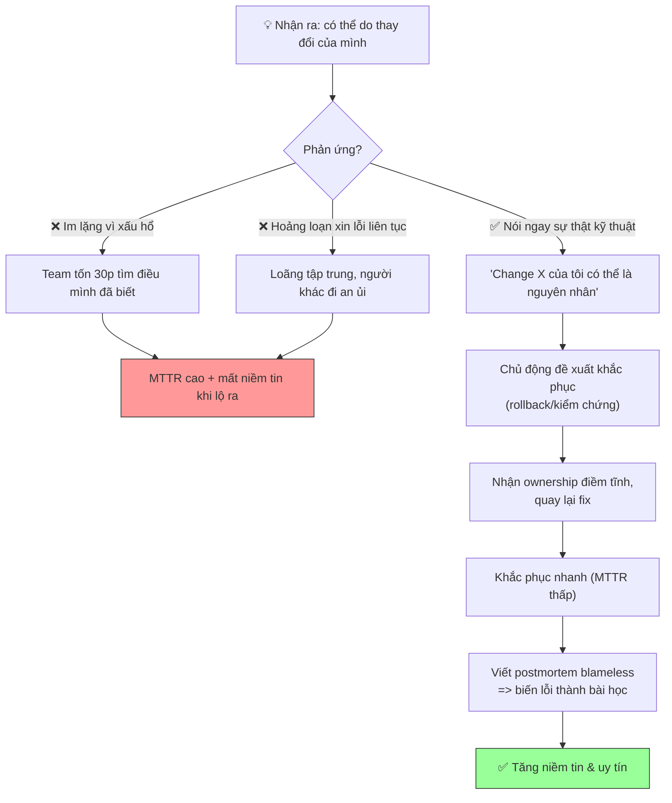

# Khi incident do lỗi của bạn, bạn communicate ra sao?

## ⚡ Tóm tắt ngắn (30s)
* **Bản chất**: Khi chính bạn là người gây ra sự cố, cách communicate đúng đắn là **minh bạch, sở hữu trách nhiệm (ownership) mà không tự dằn vặt công khai, và tập trung vào hành động khắc phục thay vì cảm xúc tội lỗi**. Nghịch lý quan trọng: trong văn hóa **blameless**, việc bạn thẳng thắn nói "thay đổi của tôi gây ra điều này" KHÔNG phải để nhận tội, mà là **chia sẻ thông tin quan trọng nhất giúp khắc phục nhanh hơn** — bạn là người hiểu rõ thay đổi đó nhất. Im lặng vì xấu hổ là hành vi gây hại nhất.
* **Thảm họa thực chiến được giải quyết**:
  1. **Im lặng vì xấu hổ (Shame-driven Silence)**: Engineer biết chính deploy của mình gây lỗi nhưng giấu vì sợ bị đánh giá, để team mất 30 phút đi tìm nguyên nhân mà lẽ ra họ có thể nói ngay.
  2. **Tự trừng phạt công khai gây nhiễu (Public Self-flagellation)**: Liên tục xin lỗi, hoảng loạn "lỗi tại em" trong war room, làm loãng sự tập trung và khiến không khí căng thẳng, người khác phải đi an ủi thay vì fix.
* **Quyết định Senior**:
  1. **Nói ngay khi nghi mình là nguyên nhân**: "Thay đổi X của tôi lúc 10:35 có thể là nguyên nhân, ta thử kiểm chứng/rollback" — đặt thông tin lên trước cảm xúc.
  2. **Ownership ở hành động, không phải ở lời than**: Tập trung "tôi sẽ làm gì để khắc phục", không "tôi tệ quá".
  3. **Tách incident khỏi giá trị bản thân**: Tin vào nguyên tắc blameless — hệ thống đã cho phép sai sót, và mình đóng góp bằng việc khắc phục + cải tiến, không bằng việc tự dằn vặt.

---

## 🔍 Chi tiết bản chất thực chiến: Khung communicate khi bạn là nguyên nhân

### Nguyên tắc nền: thông tin > cảm xúc trong lúc cháy
* Người gây ra thay đổi là người **có context giá trị nhất**: biết chính xác đã đổi gì, có thể rollback nhanh nhất, đoán được tác động. Giữ im lặng vì xấu hổ là **lãng phí nguồn lực chẩn đoán quý nhất**. Trong 5 phút đầu, một câu "có thể do change của tôi" có thể cắt MTTR đi một nửa.

### Tách bạch 3 thứ thường bị trộn lẫn
```
1. SỰ THẬT KỸ THUẬT (nói ngay, rõ ràng)
   "Deploy v2.3 của tôi lúc 10:35 đổi config timeout, nhiều khả năng
    đây là nguyên nhân retry storm."
2. HÀNH ĐỘNG KHẮC PHỤC (chủ động đề xuất)
   "Tôi đề xuất rollback v2.3 ngay, tôi có thể thực thi trong 1 phút."
3. CẢM XÚC CÁ NHÂN (để SAU, riêng tư, ngắn gọn)
   KHÔNG: lặp đi lặp lại "em xin lỗi, tại em" giữa war room.
   CÓ: một lời nhận trách nhiệm điềm tĩnh, rồi quay lại việc.
```

### Ownership đúng cách (accountability) vs tự trừng phạt (guilt)
* **Ownership lành mạnh**: "Đây là thay đổi của tôi, tôi sẽ dẫn việc khắc phục và viết postmortem để chúng ta không gặp lại." → tăng niềm tin.
* **Tự trừng phạt độc hại**: hoảng loạn, xin lỗi liên tục, đông cứng vì sợ → làm chậm cả team và buộc người khác phải an ủi.

### Communicate ra ngoài (stakeholder): không cá nhân hóa
* Với stakeholder/khách hàng, thông điệp **không nêu tên cá nhân** ("một thay đổi trong hệ thống đã gây ra..."), vì đây là trách nhiệm của tổ chức, không phải để chỉ mặt một người. Cá nhân hóa ra ngoài vừa không chuyên nghiệp vừa phá vỡ văn hóa blameless.

### Vai trò của postmortem: biến lỗi thành đóng góp
* Người gây sự cố thường là người **viết và trình bày postmortem** — đây là tín hiệu văn hóa mạnh: bạn được tin tưởng, trải nghiệm của bạn trở thành bài học cho cả tổ chức. Đây là cách "chuộc lỗi" mang tính xây dựng, không phải qua việc tự dằn vặt.

---

## 🎨 Sơ đồ trực quan: Phản ứng đúng khi nhận ra mình là nguyên nhân



---

## 💻 Code thực chiến: Mẫu phát ngôn nội bộ & ngoài (artifact)

### Artifact: `OWNING-YOUR-INCIDENT.md`
```markdown
# 🗣️ MẪU PHÁT NGÔN KHI BẠN LÀ NGUYÊN NHÂN

## ✅ TRONG WAR ROOM (nói NGAY, đặt thông tin lên trước)
> "Mọi người, deploy v2.3 lúc 10:35 là của tôi — nó đổi config timeout
>  từ 2s xuống 0.5s. Rất có thể đây là nguyên nhân retry storm. Tôi đề
>  xuất rollback v2.3 ngay, tôi thực thi được trong 1 phút. OK chứ IC?"

## ✅ NHẬN OWNERSHIP (điềm tĩnh, MỘT lần, rồi quay lại việc)
> "Đây là thay đổi của tôi, tôi sẽ dẫn việc khắc phục và viết postmortem.
>  Giờ tập trung cầm máu trước đã."

## ❌ TRÁNH (tự trừng phạt công khai — gây nhiễu)
> "Trời ơi tại em hết, em xin lỗi, em làm hỏng hết rồi, em tệ quá..."
>  (lặp lại nhiều lần => loãng tập trung, người khác phải đi an ủi)

## ✅ BÁO STAKEHOLDER (KHÔNG nêu tên cá nhân — đây là việc của tổ chức)
> "Một thay đổi cấu hình trong hệ thống đã gây gián đoạn thanh toán.
>  Chúng tôi đã xác định và đang khắc phục. Cập nhật trước {HH:MM}."

## ✅ MỞ ĐẦU POSTMORTEM (sở hữu bài học, blameless)
> "Tôi là người thực hiện thay đổi dẫn đến sự cố này. Báo cáo dưới đây
>  phân tích lỗ hổng HỆ THỐNG đã cho phép thay đổi đó lọt lên production
>  mà không bị chặn, để chúng ta sửa tận gốc."
```

### Artifact: checklist tinh thần 30 giây
```text
KHI NGHI MÌNH GÂY RA SỰ CỐ — TỰ HỎI:
[ ] Mình có thông tin gì giúp team khắc phục nhanh hơn? -> NÓI NGAY.
[ ] Mình rollback/kiểm chứng được nhanh không?         -> ĐỀ XUẤT.
[ ] Mình đang đặt cảm xúc lên trước thông tin không?   -> ĐỪNG.
[ ] Stakeholder cần biết "cái gì", không cần "ai".     -> KHÔNG nêu tên.
[ ] Đây là cơ hội đóng góp (postmortem), không phải án phạt.
```

---

## 📊 Bảng so sánh: Phản ứng độc hại vs phản ứng chuyên nghiệp

| Tình huống | ❌ Phản ứng độc hại | ✅ Phản ứng chuyên nghiệp (Senior) |
| :--- | :--- | :--- |
| **Khoảnh khắc nhận ra** | Im lặng vì sợ bị đánh giá. | Nói ngay sự thật kỹ thuật để giúp team. |
| **Trong war room** | Xin lỗi liên tục, hoảng loạn. | Nhận ownership điềm tĩnh, quay lại fix. |
| **Trọng tâm** | Cảm xúc tội lỗi của bản thân. | Hành động khắc phục & thông tin. |
| **Báo stakeholder** | Cá nhân hóa / hoặc giấu. | "Một thay đổi hệ thống", không nêu tên. |
| **Sau incident** | Né tránh, hy vọng bị quên. | Viết postmortem, biến lỗi thành bài học. |
| **Tác động niềm tin** | Giảm (giấu giếm hoặc gây mệt). | Tăng (minh bạch, trách nhiệm, trưởng thành). |

---

## ⚠️ Common Gotchas & Questions follow-up

### 1. Cạm bẫy "Im lặng vì xấu hổ trong môi trường tưởng-là-blameless (Shame Override)"
* **Vấn đề**: Ngay cả trong tổ chức có văn hóa blameless tốt, bản năng xấu hổ cá nhân vẫn rất mạnh. Engineer biết rõ deploy của mình gây lỗi nhưng vẫn im lặng, thậm chí *giả vờ điều tra cùng mọi người* trong khi đã biết nguyên nhân, vì khoảnh khắc thừa nhận quá khó. Điều này gây hại kép: kéo dài MTTR (team đi tìm thứ một người đã biết) và khi sự thật lộ ra qua audit log, niềm tin sụp đổ nặng hơn nhiều so với nếu đã thẳng thắn từ đầu. Bản năng xấu hổ thắng cả văn hóa tốt.
* **Giải pháp**: (1) Nội tâm hóa nguyên tắc blameless thật sự: **thông tin bạn đang giữ quý hơn sự thoải mái của bạn** — nói ra là hành vi vị tha, không phải nhận tội. (2) Tổ chức phải **liên tục chứng minh blameless bằng hành động**, đặc biệt cách đối xử với người gây sự cố trước đó, để bản năng tin tưởng thắng bản năng xấu hổ. (3) Luyện phản xạ: ngay khi nghi mình là nguyên nhân, **nói trong vòng 60 giây** — đặt một rào cản thời gian chống lại xu hướng trì hoãn vì xấu hổ. (4) Lãnh đạo kể công khai về incident của chính mình tạo "permission" cho người khác làm điều tương tự.

### 2. Câu hỏi đào sâu từ interviewer
* **Q: "Sự cố do bạn gây ra ảnh hưởng lớn đến một khách hàng quan trọng, và sếp yêu cầu bạn trực tiếp giải trình với khách hàng đó. Bạn communicate thế nào?"**
* **Trả lời**:
  * Giải trình trực tiếp với khách hàng đòi hỏi cân bằng giữa trung thực, chuyên nghiệp và bảo vệ niềm tin:
    1. **Sở hữu ở cấp tổ chức, không tự hạ thấp cá nhân**: Với khách hàng, ngôn ngữ là "chúng tôi" — "chúng tôi đã gây ra gián đoạn, chúng tôi chịu trách nhiệm và đã khắc phục". Khách hàng cần thấy một tổ chức đáng tin và có năng lực, không cần nghe một cá nhân tự trách. Việc nội bộ ai gây ra là chuyện nội bộ.
    2. **Trung thực về nguyên nhân ở mức phù hợp**: Giải thích bản chất sự cố và tác động một cách trung thực nhưng không sa đà vào chi tiết kỹ thuật/bảo mật không cần thiết. Tránh che giấu hay giảm nhẹ — khách hàng B2B thường tinh ý và sự trung thực xây dựng lại niềm tin tốt hơn.
    3. **Tập trung vào "điều gì đảm bảo không tái diễn"**: Phần khách hàng quan tâm nhất không phải "lỗi gì" mà "làm sao tôi tin điều này không lặp lại". Trình bày các action item phòng ngừa cụ thể (guardrail, test, monitoring) — biến sự cố thành bằng chứng về sự trưởng thành của quy trình.
    4. **Chuẩn bị cùng team, không đi một mình**: Phối hợp với Communications/account manager để thống nhất thông điệp, chuẩn bị các biện pháp khắc phục cụ thể (credit, ưu tiên hỗ trợ). Đây vẫn là việc của tổ chức, và việc mình được giao trình bày là cơ hội thể hiện trách nhiệm trưởng thành — đúng tinh thần biến lỗi thành đóng góp.
