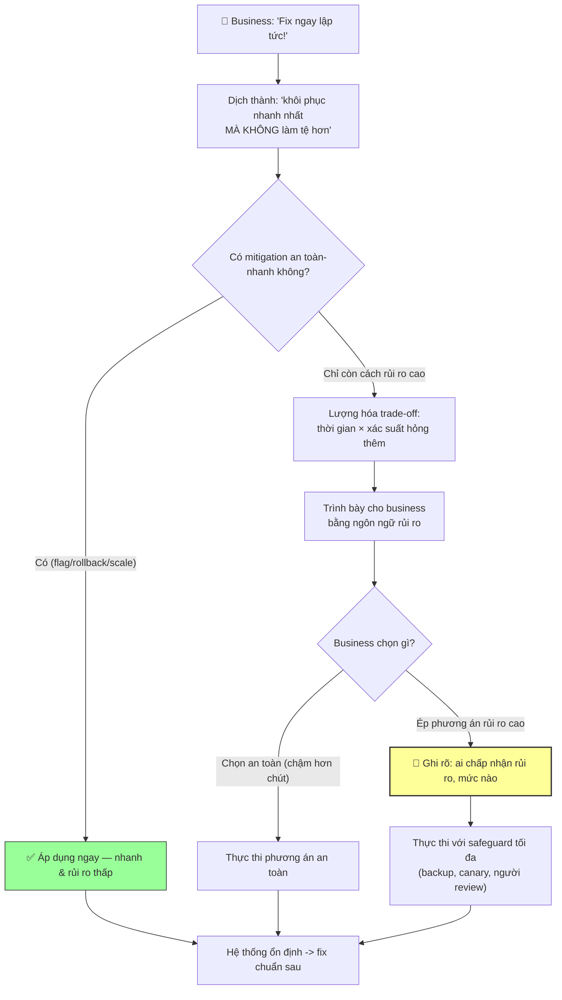

# Khi áp lực từ business yêu cầu fix nhanh, bạn cân bằng rủi ro thế nào?

## ⚡ Tóm tắt ngắn (30s)
* **Bản chất**: Cân bằng giữa "fix nhanh" (áp lực business) và "fix an toàn" (rủi ro kỹ thuật) là bài toán **quản trị rủi ro dưới áp lực**. Senior không chọn cực đoan nào mà **biến yêu cầu mơ hồ "nhanh lên" thành một quyết định rủi ro được lượng hóa và được sở hữu rõ ràng**. Công cụ cốt lõi: phân biệt **mitigation an toàn-nhanh** (ưu tiên) với **hotfix vội-rủi ro** (tránh), trình bày trade-off bằng ngôn ngữ business, và đảm bảo mọi quyết định chấp nhận rủi ro đều **có người sở hữu và được ghi lại**.
* **Thảm họa thực chiến được giải quyết**:
  1. **Hotfix vội gây sự cố kép (Panic Hotfix)**: Bị business hối thúc, engineer viết và deploy thẳng lên prod một fix chưa test, tạo ra lỗi mới tệ hơn — "fix nhanh" thành "hỏng nhanh".
  2. **Tê liệt vì cầu toàn (Analysis Paralysis)**: Ở thái cực ngược lại, từ chối mọi mitigation tạm vì "chưa đủ an toàn", để hệ thống cháy lâu hơn cần thiết trong khi đã có cách cầm máu rủi ro thấp.
* **Quyết định Senior**:
  1. **Ưu tiên mitigation an toàn-nhanh trước hotfix rủi ro**: Tắt flag/rollback/scale (giây-phút, rủi ro thấp) thường vừa nhanh hơn vừa an toàn hơn việc "code gấp một fix".
  2. **Lượng hóa & trình bày trade-off**: Dịch rủi ro kỹ thuật sang ngôn ngữ business (xác suất sự cố kép, thời gian mất thêm nếu hỏng) để business tham gia quyết định có thông tin.
  3. **Quyết định chấp nhận rủi ro phải có owner & được ghi lại**: Ai chấp nhận rủi ro, ở mức nào — minh bạch, không để áp lực miệng đẩy team vào hành động nguy hiểm vô danh.

---

## 🔍 Chi tiết bản chất thực chiến: Khung cân bằng rủi ro dưới áp lực

### Bước 1: Hiểu áp lực business thực chất là gì
* "Fix nhanh lên" thường là **biểu đạt của nỗi đau** (đang mất tiền/khách), không phải mệnh lệnh kỹ thuật cụ thể. Senior dịch nó thành câu hỏi đúng: *"Cách khôi phục dịch vụ nhanh nhất MÀ KHÔNG làm tình hình tệ hơn là gì?"* — chữ "không làm tệ hơn" chính là phần business cũng muốn nhưng không nói ra.

### Bước 2: Phân biệt "nhanh" an toàn vs "nhanh" nguy hiểm
```
NHANH & AN TOÀN (ưu tiên)            NHANH & NGUY HIỂM (cảnh giác)
────────────────────────            ──────────────────────────────
- Tắt feature flag (giây)           - Code hotfix gấp, deploy thẳng prod
- Rollback bản đã biết tốt          - Sửa data thủ công không backup
- Scale up / failover               - Skip review/test "cho nhanh"
- Bật circuit breaker / shed load   - Tắt safety check để "đi nhanh hơn"
=> rủi ro thấp, khả nghịch          => rủi ro sự cố kép cao, khó nghịch
```
* Nghịch lý quan trọng: mitigation an toàn thường **vừa nhanh hơn vừa ít rủi ro hơn** hotfix vội. Áp lực business thực ra được thỏa mãn tốt nhất bằng lựa chọn an toàn.

### Bước 3: Lượng hóa rủi ro để business cùng quyết
* Trình bày trade-off bằng số/ngôn ngữ rủi ro, không bằng thuật ngữ kỹ thuật: *"Phương án A (rollback): 3 phút, rủi ro thấp. Phương án B (hotfix): nếu đúng thì 15 phút, nhưng 30% khả năng tạo lỗi mới khiến downtime kéo dài thêm 1 giờ."* Khi business thấy con số, họ thường tự chọn an toàn.

### Bước 4: Sở hữu quyết định rủi ro (decision ownership)
* Nếu business vẫn ép một phương án rủi ro cao, quyết định đó phải được **một người có thẩm quyền sở hữu công khai** và **ghi vào timeline**: "Chấp nhận rủi ro hotfix chưa test theo yêu cầu của [tên], lúc [giờ]". Điều này không phải để đổ lỗi, mà để quyết định chấp nhận rủi ro là *có ý thức*, không phải bị áp lực miệng đẩy đi một cách vô danh.

### Nguyên tắc "stabilize before diagnose" vẫn áp dụng
* Áp lực càng lớn càng phải kỷ luật: cầm máu bằng cách an toàn trước, không để áp lực đẩy thẳng sang "code gấp một giải pháp triệt để" khi chưa hiểu rõ nguyên nhân.

---

## 🎨 Sơ đồ trực quan: Cân bằng tốc độ vs rủi ro dưới áp lực



---

## 💻 Code thực chiến: Bảng trình bày trade-off cho business (artifact)

Vũ khí mạnh nhất khi bị ép "nhanh lên" là một bảng so sánh phương án rõ ràng — nó chuyển cuộc tranh luận cảm tính thành quyết định dựa trên dữ liệu trong 30 giây.

### Artifact: `RISK-TRADEOFF-TABLE.md` (trình bày tại war room)
```markdown
# ⚖️ LỰA CHỌN MITIGATION — trình bày cho business (T+8 phút)

| Phương án        | Thời gian cầm máu | Rủi ro             | Nếu hỏng thì sao        |
|------------------|-------------------|--------------------|-------------------------|
| A. Tắt feature   | ~30 giây          | 🟢 Thấp            | Hầu như không hỏng được |
|    flag          |                   | (code cũ vẫn chạy) |                         |
| B. Rollback v1.8 | ~3 phút           | 🟡 Trung bình      | Nếu schema lệch: +20p   |
|                  |                   | (cần check DB)     | sửa data                |
| C. Hotfix gấp    | ~15 phút (nếu     | 🔴 Cao             | 30% tạo lỗi mới =>      |
|    deploy thẳng  |  đúng ngay)       | (chưa test)        | downtime +1 giờ         |

## 👉 KHUYẾN NGHỊ KỸ THUẬT: Phương án A (nhanh NHẤT + an toàn NHẤT).
## Phương án C "có vẻ là fix thật" nhưng kỳ vọng thời gian xấu hơn A/B
## vì rủi ro sự cố kép. "Nhanh" thật sự nằm ở A, không phải C.

---
## NẾU BUSINESS VẪN CHỌN C, GHI VÀO TIMELINE:
[HH:MM] Quyết định: chọn hotfix chưa-test theo yêu cầu @<tên-business>.
        Rủi ro đã được trình bày & chấp nhận. Safeguard: backup DB +
        canary 5% + @<senior> review trước khi rollout 100%.
```

### Artifact: kịch bản đối thoại với business
```text
BUSINESS: "Sao lâu thế, fix ngay đi!"
SENIOR:   "Em hiểu đang gấp. Có 3 cách. Cách nhanh NHẤT là tắt flag,
           30 giây, gần như không rủi ro — em làm luôn nhé. Cách 'viết
           fix mới' nghe có vẻ triệt để nhưng thực ra CHẬM hơn và 30%
           khả năng làm hỏng thêm, kéo dài downtime cả tiếng. Vậy em
           đi đường an toàn-nhanh trước, fix triệt để làm sau khi đã
           cầm máu. Đồng ý chứ ạ?"
=> Thắng áp lực bằng cách cho business thấy "an toàn" CHÍNH LÀ "nhanh".
```

---

## 📊 Bảng so sánh: 3 thái độ trước áp lực "fix nhanh"

| Tiêu chí | ❌ Cowboy (chiều áp lực mù quáng) | ❌ Cầu toàn (tê liệt) | ✅ Senior (cân bằng rủi ro) |
| :--- | :--- | :--- | :--- |
| **Phản ứng với "nhanh lên"** | Lao vào hotfix chưa test ngay. | Từ chối mọi cách tạm vì "chưa an toàn". | Chọn mitigation an toàn-nhanh, hoãn fix triệt để. |
| **Cách ra quyết định** | Cảm tính, theo áp lực miệng. | Né tránh quyết định. | Lượng hóa trade-off, quyết có dữ liệu. |
| **Giao tiếp với business** | "Vâng làm ngay" (rồi hỏng). | "Không được" (không giải thích). | Trình bày phương án + rủi ro, cùng quyết. |
| **Rủi ro sự cố kép** | Rất cao. | Thấp nhưng downtime kéo dài. | Thấp + cầm máu nhanh. |
| **Sở hữu rủi ro** | Vô danh, dễ đổ lỗi sau. | N/A. | Ghi rõ ai chấp nhận rủi ro gì. |
| **Kết quả** | Hỏng nhanh. | Chậm không cần thiết. | Nhanh & an toàn, có trách nhiệm. |

---

## ⚠️ Common Gotchas & Questions follow-up

### 1. Cạm bẫy "Áp lực miệng đẩy team vào quyết định vô danh (Pressure Without Ownership)"
* **Vấn đề**: Giữa lúc căng thẳng, một lãnh đạo nói "cứ làm đi, chịu trách nhiệm cho" bằng miệng, engineer deploy một hotfix rủi ro, nó gây sự cố kép. Sau đó không ai nhớ/thừa nhận đã ra lệnh đó, và engineer thực thi trở thành người gánh hậu quả. Áp lực thì tập thể nhưng trách nhiệm lại đổ lên một cá nhân. Điều này vừa bất công vừa khiến lần sau không ai dám nói thật về rủi ro.
* **Giải pháp**: (1) **Ghi quyết định rủi ro vào timeline ngay khi nó được đưa ra** — không phải để "bắt lỗi" mà để quyết định chấp nhận rủi ro là minh bạch và có chủ. Một dòng "[10:50] Chấp nhận rủi ro hotfix theo yêu cầu @X" bảo vệ cả người thực thi lẫn tính nghiêm túc của quyết định. (2) **IC là người gác cổng**: mọi thay đổi rủi ro cao phải qua IC, và IC có quyền yêu cầu làm rõ "ai sở hữu rủi ro này?" trước khi cho thực thi. (3) Văn hóa blameless giúp việc này không mang tính đối đầu — ghi lại là chuẩn mực, không phải hành vi phòng thủ.

### 2. Câu hỏi đào sâu từ interviewer
* **Q: "Business khẳng định mỗi phút downtime mất rất nhiều tiền nên 'rủi ro gì cũng phải thử'. Làm sao bạn phản biện mà không tỏ ra cản trở?"**
* **Trả lời**:
  * Mấu chốt là đứng cùng phía với business (cùng muốn giảm thiệt hại) chứ không đối đầu, rồi dùng chính logic chi phí của họ để lập luận:
    1. **Đồng tình với mục tiêu, phản biện phương tiện**: "Em hoàn toàn đồng ý mỗi phút đều quý — chính vì thế em muốn chọn cách rủi ro thấp, vì một hotfix hỏng sẽ làm chúng ta mất KHÔNG PHẢI vài phút mà cả tiếng nữa." Ta dùng chính ngôn ngữ chi phí/phút của họ để chứng minh an toàn = ít tốn kém hơn.
    2. **Định lượng kỳ vọng (expected cost)**: Phương án rủi ro cao có chi phí kỳ vọng = (thời gian nếu thành công × xác suất) + (downtime kéo dài nếu hỏng × xác suất hỏng). Thường con số này TỆ hơn phương án an toàn. Trình bày bằng kỳ vọng giúp business thấy "thử mọi thứ" không phải chiến lược tối ưu chi phí.
    3. **Đưa ra đường đi an toàn-mà-vẫn-nhanh**: Phản biện sẽ phản tác dụng nếu chỉ nói "không". Luôn kèm một phương án hành động ngay ("em tắt flag trong 30 giây bây giờ") để business thấy ta đang giải quyết, không cản trở.
    4. **Nếu vẫn bị ép, thực thi có safeguard + ghi nhận**: Khi business chấp nhận rủi ro một cách có ý thức và có thẩm quyền, ta không cứng nhắc chống lại — ta thực thi với mọi safeguard có thể (backup, canary, người review) và ghi lại quyết định. Senior cân bằng giữa kỷ luật kỹ thuật và tôn trọng quyền quyết định business, miễn là rủi ro được minh bạch và có chủ.
