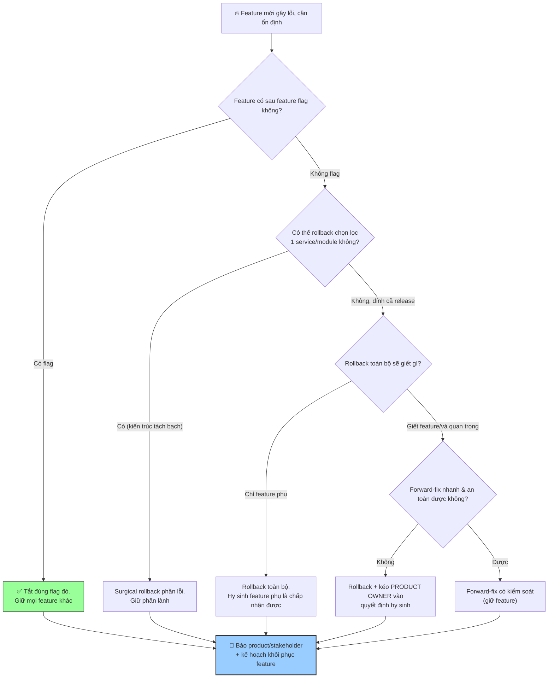

# Khi rollback gây mất một số feature mới, bạn quyết định thế nào?

## ⚡ Tóm tắt ngắn (30s)
* **Bản chất**: Đây là bài toán **đánh đổi giữa tính ổn định (stability) và tính năng (functionality)** dưới áp lực incident. Quyết định dựa trên nguyên tắc: **ổn định của luồng cốt lõi luôn thắng tính mới của feature phụ**. Nhưng Senior không chọn nhị phân "rollback tất cả hay không" — họ tìm cách **cô lập (isolate)** để chỉ tắt phần gây lỗi mà giữ phần lành (feature flag, partial rollback), và khi buộc phải hy sinh feature thì đó là **quyết định kinh doanh được communicate rõ, không phải quyết định kỹ thuật âm thầm**.
* **Thảm họa thực chiến được giải quyết**:
  1. **Rollback "tất cả hoặc không" thô bạo (All-or-Nothing Rollback)**: Vì một feature mới lỗi, rollback nguyên bản release, vô tình giết luôn 5 feature mới lành khác và một bản vá bảo mật quan trọng — thiệt hại lan rộng không cần thiết.
  2. **Hy sinh feature âm thầm (Silent Feature Loss)**: Rollback làm mất một feature mà product/marketing vừa truyền thông rầm rộ, nhưng không ai báo họ → khủng hoảng truyền thông chồng lên sự cố kỹ thuật.
* **Quyết định Senior**:
  1. **Cô lập trước, hy sinh sau**: Ưu tiên feature flag / partial rollback để chỉ tắt phần lỗi, giữ phần lành.
  2. **Ổn định core > feature phụ**: Nếu phải chọn, bảo vệ luồng doanh thu/cốt lõi; feature mới có thể tạm mất.
  3. **Quyết định hy sinh feature là quyết định business, phải communicate**: Kéo product owner vào, báo stakeholder, đặt kế hoạch khôi phục feature.

---

## 🔍 Chi tiết bản chất thực chiến: Thang quyết định từ cô lập đến hy sinh

### Nguyên tắc nền: ổn định là tính năng quan trọng nhất
* Một hệ thống ổn định không có feature mới vẫn phục vụ được khách hàng; một hệ thống đầy feature mới nhưng sập thì vô giá trị. Vì vậy mặc định: **khi xung đột, ưu tiên đưa hệ thống về trạng thái ổn định**, chấp nhận tạm mất feature.

### Thang lựa chọn (ưu tiên từ ít thiệt hại đến nhiều)
```
1. FEATURE FLAG OFF (lý tưởng nhất)
   → tắt đúng feature lỗi, giữ TẤT CẢ phần còn lại. Mất 1 feature.
2. PARTIAL / SURGICAL ROLLBACK
   → rollback đúng service/module lỗi, giữ các service khác.
3. ROLLBACK TOÀN BỘ RELEASE (cuối cùng)
   → mất nhiều feature lành. Chỉ khi không cô lập được.
4. FORWARD-FIX (nếu rollback giết thứ quá quan trọng)
   → giữ nguyên, vá nhanh có kiểm soát. Rủi ro cao hơn.
```
* Bài học: **thiết kế để cô lập được** (feature flag, kiến trúc module/service tách bạch) chính là thứ cho phép ta tránh "all-or-nothing" ngay từ đầu.

### Khi buộc phải hy sinh feature: ai quyết?
* Hy sinh một feature đã ra mắt **không phải quyết định thuần kỹ thuật** — nó ảnh hưởng cam kết với khách hàng, kế hoạch marketing, doanh thu. Senior **kéo product owner / business vào vòng quyết định**, trình bày: "để ổn định, tôi cần tắt feature X trong N giờ; tác động business là gì?". Quyết định cuối là của business, kỹ thuật cung cấp thông tin & lựa chọn.

### Cân nhắc đặc biệt: feature có trạng thái / dữ liệu
* Nếu feature mới đã tạo ra **dữ liệu người dùng** (đơn hàng, nội dung), rollback có thể làm "mồ côi" hoặc mất dữ liệu đó. Phải đánh giá: rollback có gây mất dữ liệu không? Có cần kế hoạch migrate/bảo toàn dữ liệu trước khi rollback không? Đây là lý do feature flag (giữ code, chỉ ẩn UI) thường an toàn hơn rollback (gỡ cả code lẫn schema).

---

## 🎨 Sơ đồ trực quan: Cây quyết định cô lập vs hy sinh feature



---

## 💻 Code thực chiến: Cô lập feature & template hy sinh có kiểm soát (artifact)

### Artifact: feature flag cho phép tắt chọn lọc (thay vì rollback toàn bộ)
```java
// Nhờ bọc feature mới trong flag, ta tắt ĐÚNG phần lỗi mà KHÔNG
// phải rollback cả release (giữ các feature lành khác).
public CheckoutResult checkout(Cart cart, User user) {
    // Feature mới "express-checkout" đang gây lỗi -> chỉ cần tắt flag này
    if (featureFlags.isEnabled("express-checkout", user)) {
        try {
            return expressCheckout(cart, user);   // nhánh mới (lỗi)
        } catch (Exception e) {
            // graceful degrade: tự rơi về luồng cũ thay vì fail cứng
            log.warn("express-checkout lỗi, fallback luồng chuẩn", e);
            return standardCheckout(cart, user);
        }
    }
    return standardCheckout(cart, user);          // luồng cốt lõi luôn an toàn
}
```

### Artifact: `FEATURE-SACRIFICE-DECISION.md` (khi buộc phải hy sinh)
```markdown
# 🎯 QUYẾT ĐỊNH HY SINH FEATURE — Incident #2026-0630

## TÌNH HUỐNG
- Để ổn định checkout, cần tắt feature "express-checkout".
- Không cô lập riêng được vì dùng chung deploy với 4 feature khác.

## PHÂN TÍCH TÁC ĐỘNG (kỹ thuật cung cấp)
| Feature bị ảnh hưởng nếu rollback toàn bộ | Mức độ quan trọng |
|-------------------------------------------|-------------------|
| express-checkout (đang lỗi)               | Cần tắt           |
| dark-mode UI                              | Phụ, mất tạm OK   |
| coupon-v2                                 | ⚠️ Marketing đang chạy campaign! |
| security-patch CVE-xxxx                   | 🔴 KHÔNG được mất  |

## QUYẾT ĐỊNH (business sở hữu)
- ❌ KHÔNG rollback toàn bộ (sẽ mất security patch + coupon campaign).
- ✅ Forward-fix có kiểm soát cho express-checkout (đã được @PO duyệt).
- Người duyệt hy sinh/giữ: @ProductOwner lúc 10:55.

## COMMUNICATE
- [ ] Báo marketing: coupon-v2 KHÔNG bị ảnh hưởng (an tâm).
- [ ] Báo CS: express-checkout tạm ẩn ~2h, hướng dẫn dùng luồng chuẩn.
- [ ] Status page: "một số tính năng mới tạm thời chưa khả dụng".
- [ ] Kế hoạch khôi phục express-checkout: ETA sau khi fix chuẩn, OPS-49xx.
```

---

## 📊 Bảng so sánh: Các mức can thiệp khi feature mới gây lỗi

| Phương án | Phạm vi thiệt hại | Tốc độ | Rủi ro | Khi nào dùng |
| :--- | :--- | :--- | :--- | :--- |
| **Feature flag off** | Chỉ 1 feature lỗi. | Giây. | Rất thấp (code cũ vẫn chạy). | Lý tưởng — luôn ưu tiên nếu có flag. |
| **Graceful degrade** | Feature tự rơi về luồng cũ. | Tự động. | Thấp. | Khi đã thiết kế fallback sẵn. |
| **Surgical rollback** | 1 service/module. | Phút. | Thấp-TB. | Kiến trúc tách bạch, cô lập được. |
| **Rollback toàn bộ** | Nhiều feature lành. | Phút. | TB-cao (mất feature/data). | Cuối cùng, khi không cô lập được. |
| **Forward-fix** | Giữ mọi feature. | Lâu hơn. | Cao (vá vội). | Khi rollback giết thứ quá quan trọng. |

---

## ⚠️ Common Gotchas & Questions follow-up

### 1. Cạm bẫy "Rollback giết luôn bản vá bảo mật / dữ liệu (Collateral Damage)"
* **Vấn đề**: Một release thường gói nhiều thay đổi: feature mới, bug fix, và đôi khi cả **bản vá bảo mật** hoặc **migration dữ liệu**. Khi rollback toàn bộ chỉ vì một feature lỗi, ta vô tình (1) mở lại một lỗ hổng bảo mật vừa được vá — biến sự cố vận hành thành sự cố an ninh; hoặc (2) làm code cũ không tương thích với dữ liệu/schema mà bản mới đã tạo, gây mất hoặc hỏng dữ liệu người dùng. "All-or-nothing rollback" biến một vấn đề nhỏ thành nhiều vấn đề lớn.
* **Giải pháp**: (1) **Đánh giá "rollback sẽ mất gì" trước khi gõ lệnh** — không bao giờ rollback mù; rà soát release notes xem có security patch / migration nào đi kèm không. (2) **Thiết kế để cô lập**: feature flag cho mọi thay đổi rủi ro, tách bản vá bảo mật và feature thành các deploy riêng, áp dụng expand-and-contract cho schema để rollback luôn an toàn với dữ liệu. (3) Khi rollback toàn bộ sẽ gây collateral damage nghiêm trọng, chuyển sang **forward-fix có kiểm soát** dù chậm hơn — chấp nhận MTTR cao hơn một chút để tránh sự cố an ninh/mất dữ liệu tệ hơn nhiều.

### 2. Câu hỏi đào sâu từ interviewer
* **Q: "Feature mới gây lỗi lại chính là feature mà CEO vừa demo cho nhà đầu tư hôm qua. Áp lực giữ nó rất lớn. Bạn cân bằng thế nào?"**
* **Trả lời**:
  * Đây là lúc áp lực chính trị/business va chạm trực diện với kỷ luật kỹ thuật, và Senior cần xử lý cả hai chiều:
    1. **Không tự ý quyết định chính trị**: Quyết định "giữ feature quan trọng với CEO dù đang lỗi" hay "tắt để ổn định" có hệ quả business lớn vượt thẩm quyền kỹ thuật. Senior **kéo đúng người có thẩm quyền (product owner, người liên quan đến CEO) vào ngay**, trình bày trade-off rõ ràng, để quyết định cuối được sở hữu đúng cấp — không gánh một mình.
    2. **Tìm phương án "giữ feature mà vẫn ổn định"**: Trước khi đặt câu hỏi nhị phân tắt/giữ, dồn sức tìm cách cô lập: graceful degrade (feature hiển thị nhưng rơi về luồng an toàn khi lỗi), giới hạn feature cho một tập nhỏ user, hoặc forward-fix nhanh có canary. Thường có đường thứ ba làm hài lòng cả hai.
    3. **Trình bày bằng rủi ro, không bằng cảm tính**: "Nếu giữ nguyên feature đang lỗi, rủi ro là nó có thể làm sập luồng thanh toán — điều đó còn tệ hơn nhiều cho hình ảnh trước nhà đầu tư so với việc tạm ẩn một tính năng và khôi phục sau vài giờ." Đóng khung lựa chọn an toàn như cách **bảo vệ** uy tín, không phải phá hỏng nó.
    4. **Nếu business chấp nhận rủi ro giữ feature**: thực thi với mọi safeguard (giới hạn phạm vi, giám sát chặt, sẵn sàng tắt ngay), ghi rõ quyết định và người sở hữu rủi ro. Cân bằng nằm ở chỗ kỹ thuật đảm bảo an toàn tối đa trong khuôn khổ mà business đã quyết định một cách có thông tin.
