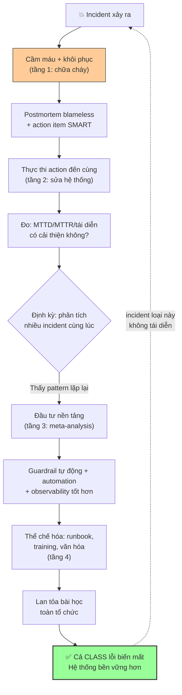

# Làm sao biến incident thành improvement lâu dài?

## ⚡ Tóm tắt ngắn (30s)
* **Bản chất**: Biến incident thành cải tiến lâu dài là chuyển từ tư duy **"chữa cháy" (firefighting)** sang **"học tập có hệ thống" (organizational learning)**. Cốt lõi: mỗi incident là một **bài kiểm tra miễn phí phơi bày điểm yếu của hệ thống & quy trình**, và giá trị thật chỉ được thu hoạch khi ta **đóng vòng lặp học tập (close the loop)**: postmortem blameless → action item SMART được thực thi đến cùng → phát hiện pattern xuyên suốt nhiều incident → đầu tư vào nền tảng (guardrail, automation, văn hóa). Đo lường bằng xu hướng **MTTD/MTTR giảm** và **tỉ lệ tái diễn giảm** theo thời gian.
* **Thảm họa thực chiến được giải quyết**:
  1. **Vòng lặp chữa cháy bất tận (Groundhog Day Incidents)**: Cùng một loại sự cố lặp lại hàng quý vì mỗi lần chỉ fix triệu chứng, không ai sửa nguyên nhân hệ thống hay nhìn ra pattern chung.
  2. **Học tập cục bộ, không lan tỏa (Knowledge Silo)**: Một team học được bài học quý nhưng team khác lặp lại đúng sai lầm đó vì kiến thức không được chia sẻ toàn tổ chức.
* **Quyết định Senior**:
  1. **Đóng vòng lặp action item đến cùng**: Coi incident chỉ thật sự "đóng" khi mọi action phòng ngừa hoàn thành, không phải khi dịch vụ phục hồi.
  2. **Phân tích pattern xuyên incident (meta-analysis)**: Định kỳ nhìn tổng thể nhiều incident để tìm nguyên nhân hệ thống lặp lại, đầu tư vào nền tảng.
  3. **Lan tỏa & thể chế hóa bài học**: Lessons learned thành runbook, guardrail tự động, training — biến kiến thức cá nhân thành tài sản tổ chức.

---

## 🔍 Chi tiết bản chất thực chiến: Vòng lặp học tập từ incident

### Tháp giá trị: từ một incident đến cải tiến hệ thống
```
TẦNG 4: THỂ CHẾ HÓA (institutional)
  → guardrail tự động, văn hóa, đào tạo: cả CLASS lỗi biến mất
TẦNG 3: PHÁT HIỆN PATTERN (cross-incident)
  → nhìn nhiều incident, tìm nguyên nhân hệ thống lặp lại
TẦNG 2: SỬA HỆ THỐNG (per-incident action items)
  → action item SMART được thực thi đến cùng (prevent/detect/respond)
TẦNG 1: CHỮA CHÁY (immediate)
  → cầm máu, khôi phục dịch vụ  ← phần lớn tổ chức DỪNG ở đây
```
* Phần lớn tổ chức chỉ làm tầng 1. Giá trị lâu dài nằm ở tầng 2-4. Senior đẩy tổ chức leo lên các tầng trên.

### Bước 1: Đóng vòng lặp action item (close the loop)
* Postmortem chỉ có giá trị khi action item được **thực thi đến cùng**. Coi action item incident là backlog ưu tiên cao, có owner, review định kỳ trong operational review. Định nghĩa "incident đóng = mọi action phòng ngừa đã xong", không phải "dịch vụ đã chạy lại".

### Bước 2: Sửa trên cả 3 trục, ưu tiên đòn bẩy hệ thống
* Mỗi incident cải tiến: **phát hiện** (MTTD — alert/SLO tốt hơn), **phản ứng** (MTTR — runbook/automation), **phòng ngừa** (guardrail chặn root cause). Ưu tiên thay đổi chặn được cả một *class* lỗi (vd "mọi external call phải có circuit breaker") hơn vá một điểm.

### Bước 3: Phân tích pattern xuyên incident (meta-analysis)
* Một incident là một điểm dữ liệu; nhiều incident vẽ ra **xu hướng**. Định kỳ (hàng quý) phân tích toàn bộ incident: loại nào lặp lại nhiều nhất? Nguyên nhân chung là gì (thiếu test config? thiếu observability? quy trình deploy yếu?)? Đầu tư nền tảng vào đúng điểm đau lớn nhất thay vì vá lẻ tẻ.

### Bước 4: Thể chế hóa & lan tỏa
* Biến bài học cá nhân thành **tài sản tổ chức**: runbook tái dùng, guardrail tự động trong CI/CD, template, training cho người mới, "incident review" công khai. Kiến thức không lan tỏa thì incident chỉ dạy được một người.

### Đo lường để biết có thật sự cải thiện
* Theo dõi xu hướng: MTTD/MTTR giảm dần, tỉ lệ incident tái diễn giảm, % action item hoàn thành đúng hạn, error budget được bảo toàn. Không đo = không biết đang tốt lên hay tệ đi.

---

## 🎨 Sơ đồ trực quan: Vòng lặp biến incident thành cải tiến lâu dài



---

## 💻 Code thực chiến: Theo dõi cải tiến & meta-analysis (artifact)

### Artifact: `INCIDENT-IMPROVEMENT-TRACKER.md` (bảng theo dõi sống)
```markdown
# 📈 THEO DÕI CẢI TIẾN TỪ INCIDENT — Quý 2/2026

## XU HƯỚNG METRIC (đo để biết có thật sự tốt lên)
| Metric                     | Q1    | Q2    | Mục tiêu | Xu hướng |
|----------------------------|-------|-------|----------|----------|
| MTTD trung bình            | 12p   | 5p    | < 5p     | 🟢 giảm   |
| MTTR trung bình            | 47p   | 31p   | < 30p    | 🟢 giảm   |
| Số incident SEV1/SEV2      | 9     | 6     | < 5      | 🟢 giảm   |
| Tỉ lệ incident tái diễn    | 33%   | 17%   | < 10%    | 🟢 giảm   |
| % action item đóng đúng hạn| 55%   | 82%   | > 90%    | 🟡 cải thiện |

## 🔍 META-ANALYSIS (pattern xuyên incident quý này)
- 4/6 incident có root cause liên quan THAY ĐỔI CONFIG ngoài CI.
  => ĐÒN BẨY HỆ THỐNG: bắt mọi config thay đổi qua pipeline + validate.
     (1 action chặn được cả CLASS lỗi này) -> OPS-5001, P0.
- 3/6 incident phát hiện chậm do thiếu SLO-based alert.
  => Đầu tư: chuẩn hóa SLO + burn-rate alert cho mọi service core.

## ✅ ACTION ITEM TỪ INCIDENT (đóng đến cùng)
| Từ incident | Action (đòn bẩy)               | Owner | Hạn   | Trạng thái |
|-------------|--------------------------------|-------|-------|------------|
| #0630       | Config guardrail trong CI      | @an   | 07-07 | 🟢 Done    |
| #0630       | Circuit breaker payment        | @binh | 07-10 | 🟡 Doing   |
| #0612       | Runbook "DB failover" + drill  | @chau | 07-15 | 🟡 Doing   |
| meta        | SLO + burn-rate alert toàn core| @an   | 07-30 | ⏳ Plan    |
```

### Artifact: guardrail thể chế hóa bài học (ví dụ CI check)
```yaml
# .ci/config-guardrail.yml — biến bài học "#0630 config lỗi" thành
# guardrail TỰ ĐỘNG: cả class lỗi "config sai lọt lên prod" bị chặn.
config_validation:
  stage: validate
  script:
    - |
      # Bài học từ incident #0630: timeout 0.5s gây retry storm
      TIMEOUT=$(yq '.payment.gateway.timeout' config/prod.yml)
      if [ "$TIMEOUT" -lt 1000 ] || [ "$TIMEOUT" -gt 30000 ]; then
        echo "❌ timeout=$TIMEOUT nằm ngoài khoảng an toàn [1000,30000]ms"
        echo "   (guardrail sinh ra từ postmortem #0630)"
        exit 1
      fi
    - ./scripts/validate-config-schema.sh config/prod.yml
  rules:
    - if: '$CI_COMMIT_BRANCH == "main"'
```

---

## 📊 Bảng so sánh: Tổ chức chữa cháy vs tổ chức học tập

| Tiêu chí | ❌ Tổ chức chữa cháy (firefighting) | ✅ Tổ chức học tập (learning org) |
| :--- | :--- | :--- |
| **Sau khi dịch vụ phục hồi** | Coi như xong, quay lại việc. | Postmortem + action item là bắt buộc. |
| **Action item** | Viết rồi quên. | Track đến khi đóng, là backlog P1. |
| **Tầm nhìn** | Từng incident riêng lẻ. | Phân tích pattern xuyên incident. |
| **Loại fix ưu tiên** | Vá triệu chứng điểm. | Đòn bẩy chặn cả class lỗi. |
| **Kiến thức** | Nằm trong đầu vài người. | Thể chế hóa: runbook, guardrail, training. |
| **Đo lường** | Không đo, "cảm giác". | MTTD/MTTR/tái diễn theo xu hướng. |
| **Kết quả dài hạn** | Cùng sự cố lặp lại mãi. | Incident giảm dần, hệ thống bền vững. |

---

## ⚠️ Common Gotchas & Questions follow-up

### 1. Cạm bẫy "Tôn vinh người chữa cháy thay vì người phòng ngừa (The Firefighter Hero Culture)"
* **Vấn đề**: Tổ chức khen thưởng và ngưỡng mộ người "lao vào dập lửa lúc 3h sáng", coi đó là anh hùng. Nghe có vẻ tích cực, nhưng nó tạo ra một **incentive lệch lạc**: việc phòng ngừa thầm lặng (viết guardrail, sửa root cause để incident KHÔNG bao giờ xảy ra) trở nên vô hình và không được ghi nhận, trong khi chữa cháy ồn ào được tôn vinh. Kết quả nghịch lý: hệ thống được giữ ở trạng thái mong manh vừa đủ để luôn có lửa để dập — vì dập lửa mới được khen. Người giỏi nhất dành thời gian chữa cháy thay vì xóa bỏ nguyên nhân.
* **Giải pháp**: (1) **Ghi nhận và tôn vinh công việc phòng ngừa** ngang bằng hoặc hơn chữa cháy: người viết guardrail làm biến mất cả một class incident xứng đáng được công nhận nhiều hơn người dập lửa lặp đi lặp lại. (2) **Đo "incident KHÔNG xảy ra"**: theo dõi xu hướng giảm incident và tái diễn như thước đo thành công của team, không chỉ đếm số lửa đã dập. (3) **Coi incident lặp lại là thất bại của hệ thống, không phải cơ hội tỏa sáng** — nếu cùng loại sự cố xảy ra lần hai, đó là tín hiệu action item phòng ngừa chưa được làm, cần truy đến cùng. (4) Lãnh đạo định hình lại narrative: mục tiêu là một hệ thống **nhàm chán vì ít sự cố**, không phải một đội cứu hỏa xuất sắc.

### 2. Câu hỏi đào sâu từ interviewer
* **Q: "Tổ chức của bạn làm postmortem đều đặn nhưng incident vẫn lặp lại. Bạn chẩn đoán vấn đề nằm ở đâu và sửa thế nào?"**
* **Trả lời**:
  * Postmortem đều mà incident vẫn lặp là triệu chứng của một vòng lặp học tập bị đứt ở đâu đó; tôi sẽ chẩn đoán theo các điểm đứt phổ biến:
    1. **Action item không được thực thi (đứt ở tầng 2)**: Đây là nguyên nhân số một. Kiểm tra tỉ lệ action item đóng đúng hạn — nếu thấp, vấn đề là action item không vào backlog thật, không có owner rõ, hoặc luôn bị feature đè ưu tiên. Sửa: đưa action vào sprint như P1, review định kỳ, định nghĩa incident chỉ đóng khi action xong.
    2. **Action item không actionable hoặc vá triệu chứng (đứt ở chất lượng)**: Nếu action chỉ là "cẩn thận hơn" hoặc vá đúng một endpoint thay vì chặn cả class lỗi, thì dù làm xong incident vẫn tái diễn ở dạng khác. Sửa: yêu cầu root cause đào tới tầng hệ thống (5 Whys), ưu tiên đòn bẩy hệ thống.
    3. **Không nhìn pattern xuyên incident (đứt ở tầng 3)**: Mỗi postmortem làm riêng lẻ nên không ai thấy "4/6 incident cùng do config" — bỏ lỡ đòn bẩy lớn nhất. Sửa: thêm meta-analysis định kỳ hàng quý.
    4. **Bài học không lan tỏa (đứt ở tầng 4)**: Team A học rồi, team B lặp lại. Sửa: incident review công khai toàn tổ chức, thể chế hóa thành guardrail/runbook dùng chung.
    5. **Văn hóa blame ngầm (đứt ở gốc rễ)**: Nếu người ta vẫn sợ bị đổ lỗi, postmortem sẽ hời hợt, giấu root cause thật, và không học được gì thật. Sửa: củng cố psychological safety thật sự. Tôi sẽ đo điểm đứt bằng dữ liệu (tỉ lệ action đóng, tỉ lệ tái diễn, chất lượng root cause) rồi sửa đúng mắt xích yếu nhất thay vì làm postmortem nhiều hơn một cách hình thức.
