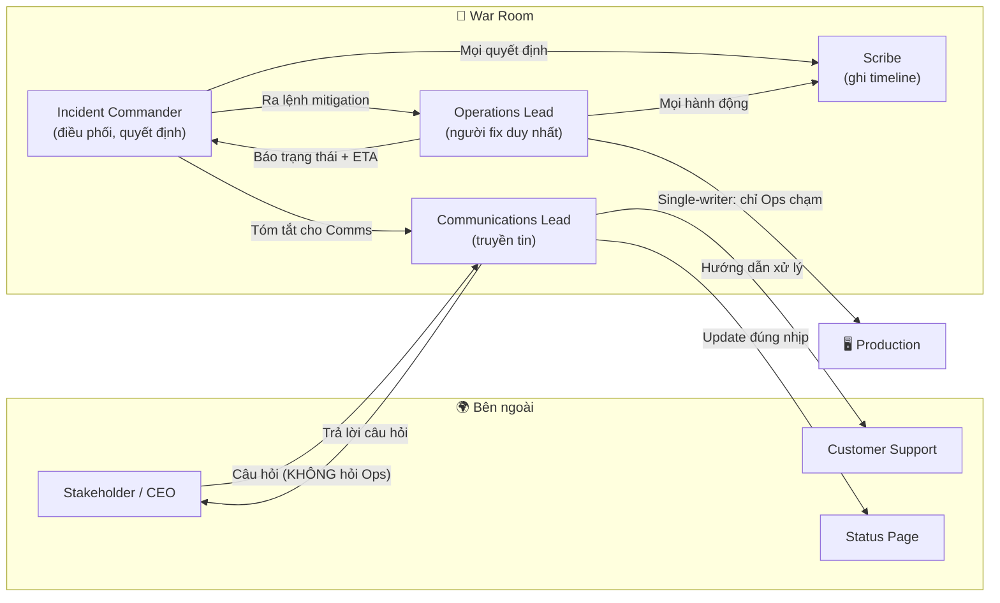

# Làm sao phân công người điều tra, người communicate, người fix?

## ⚡ Tóm tắt ngắn (30s)
* **Bản chất**: Phân công trong incident là áp dụng mô hình **ICS (Incident Command System)** đã được giới cứu hỏa/SRE chuẩn hóa. Có **4 vai trò cốt lõi tách bạch**: **Incident Commander (IC)** điều phối & ra quyết định, **Operations/Tech Lead** trực tiếp fix, **Communications Lead** báo cáo stakeholder, và **Scribe** ghi timeline. Nguyên tắc tối thượng: **một người một vai, vai trò rõ ràng bằng lời nói (explicit ownership)** — không để "ai đó chắc đang lo việc đó".
* **Thảm họa thực chiến được giải quyết**:
  1. **Diffusion of responsibility (ai cũng tưởng người khác lo)**: 6 người trong call, không ai update status page vì "tưởng có người làm rồi". Khách hàng và CEO mất niềm tin vì im lặng 40 phút.
  2. **IC kiêm luôn fixer (tunnel vision)**: Người chỉ huy cắm đầu vào terminal, bỏ bê điều phối; các nhánh điều tra trùng lặp, không ai tổng hợp được bức tranh toàn cảnh.
* **Quyết định Senior**:
  1. **Gọi tên cụ thể (verbal assignment)**: "@An là Ops Lead, @Bình là Comms, @Châu là Scribe" — không dùng câu mơ hồ "ai rảnh thì làm".
  2. **IC giữ tay khỏi bàn phím**: IC chỉ điều phối; mọi thay đổi production do Ops Lead thực hiện (single-writer rule).
  3. **Scale vai trò theo SEV**: SEV3 một người gánh nhiều vai; SEV1 tách rõ từng vai, thậm chí có Deputy IC để bàn giao ca.

---

## 🔍 Chi tiết bản chất thực chiến: 4 vai trò ICS và ranh giới trách nhiệm

```
                    ┌─────────────────────────┐
                    │  INCIDENT COMMANDER (IC) │  ← Ra quyết định, điều phối
                    │  "Não bộ" của incident   │
                    └───────────┬─────────────┘
            ┌───────────────────┼────────────────────┐
            ▼                   ▼                    ▼
   ┌────────────────┐  ┌─────────────────┐  ┌────────────────┐
   │ OPERATIONS LEAD│  │ COMMUNICATIONS  │  │     SCRIBE     │
   │ (Tech Lead)    │  │ LEAD            │  │  (Ghi chép)    │
   │ Trực tiếp fix  │  │ Báo stakeholder │  │ Ghi timeline   │
   └────────────────┘  └─────────────────┘  └────────────────┘
```

### Incident Commander (IC) — Người chỉ huy
* **Làm gì**: Giữ bức tranh tổng thể, ra quyết định (rollback hay không, escalate hay không), phân công và điều phối các nhánh điều tra, gác cổng mọi thay đổi production.
* **KHÔNG làm gì**: Không tự gõ lệnh fix, không cắm đầu vào một giả thuyết. IC là người **hỏi** ("trạng thái hiện tại?", "ETA?"), không phải người **làm**.

### Operations / Tech Lead — Người fix
* **Làm gì**: Là người duy nhất được phép thay đổi production (single-writer). Thực thi mitigation (rollback, flag, restart), điều tra kỹ thuật, báo cáo trạng thái cho IC.
* **Nguyên tắc**: Mọi hành động phải nói to/gõ vào kênh trước khi làm: *"Tôi sẽ rollback service payment về v1.8 trong 30s nữa"* để IC và Scribe nắm được.

### Communications Lead — Người truyền tin
* **Làm gì**: Là tường lửa giữa team kỹ thuật và thế giới bên ngoài (stakeholder, CS, status page, lãnh đạo). Dịch ngôn ngữ kỹ thuật sang ngôn ngữ business, đăng update đúng nhịp.
* **Tại sao cần tách**: Để Ops Lead không bị gián đoạn bởi câu hỏi "khi nào xong?" từ 10 phía. Comms hấp thụ toàn bộ áp lực giao tiếp.

### Scribe — Người ghi chép
* **Làm gì**: Ghi lại timeline có timestamp của mọi sự kiện và quyết định. Đây là nguyên liệu sống cho postmortem blameless và là cứu cánh khi bàn giao ca.

---

## 🎨 Sơ đồ trực quan: Luồng thông tin giữa 4 vai trò



---

## 💻 Code thực chiến: Template phân vai dán sẵn trong kênh incident

Artifact dưới đây được pin ngay khi mở kênh incident, IC điền tên vào và tag mọi người để **không ai mơ hồ về vai trò của mình**.

### Artifact: `INCIDENT-ROLES.md`
```markdown
# 🎯 PHÂN VAI INCIDENT #2026-0630-payment-5xx — SEV2

| Vai trò              | Người phụ trách | Trách nhiệm chính                          |
|----------------------|-----------------|--------------------------------------------|
| 🎖️ Incident Commander | @An            | Quyết định, điều phối, gác cổng production  |
| 🔧 Operations Lead    | @Bình          | Người DUY NHẤT chạm production, thực thi fix |
| 📢 Communications     | @Châu          | Status page + stakeholder + CS, update /15p |
| ✍️ Scribe             | @Dũng          | Ghi timeline có timestamp                    |
| 🤝 Deputy IC (SEV1)   | (n/a ở SEV2)   | Sẵn sàng nhận bàn giao IC                    |

## QUY TẮC VÀNG
1. ⛔ SINGLE-WRITER: chỉ @Bình được đổi production. Người khác muốn thử
   gì phải xin qua IC.
2. 🗣️ NÓI TRƯỚC KHI LÀM: mọi hành động gõ vào kênh trước, ví dụ
   "[10:42] Bình: sắp rollback payment -> v1.8".
3. ❓ Câu hỏi "bao giờ xong?" => hỏi @Châu (Comms), KHÔNG hỏi @Bình.
4. 🔄 Bàn giao ca: nói rõ "Tôi bàn giao IC cho @X", pin lại trạng thái.

## STATUS HIỆN TẠI (Comms cập nhật)
- Mitigation: đang rollback
- Next update: 10:55
```

### Artifact: Scribe timeline (mẫu dòng ghi)
```
[10:38] An: Tuyên bố incident, nhận IC. SEV2.
[10:39] An: Phân vai - Bình=Ops, Châu=Comms, Dũng=Scribe.
[10:41] Bình: Xác nhận error rate 8% trên endpoint /checkout.
[10:42] An: QUYẾT ĐỊNH rollback. Bình thực thi.
[10:43] Bình: kubectl rollout undo deploy/payment -> v1.8 ĐÃ CHẠY.
[10:45] Châu: Đã đăng status page lần 1, hẹn update 10:55.
[10:48] Bình: Error rate giảm về 0.2%. Hệ thống ổn định.
```

---

## 📊 Bảng so sánh: Mức độ tách vai theo SEV level

| Tiêu chí | SEV3 (ảnh hưởng nhỏ) | SEV2 (một phần dịch vụ) | SEV1 (toàn hệ thống / mất tiền) |
| :--- | :--- | :--- | :--- |
| **Incident Commander** | Kiêm luôn Ops (1 người). | Tách riêng IC. | IC riêng + Deputy IC để bàn giao ca. |
| **Operations Lead** | Chính là người on-call. | 1 Ops Lead chuyên trách. | 1 Ops Lead + có thể nhiều subject-matter expert hỗ trợ. |
| **Communications** | IC tự đăng 1 status ngắn. | Comms Lead riêng. | Comms Lead riêng + phối hợp PR/lãnh đạo. |
| **Scribe** | Tự ghi vài dòng. | Scribe riêng. | Scribe riêng, timeline chi tiết cho postmortem. |
| **Báo lãnh đạo** | Không cần. | Báo manager. | Đánh thức cả management chain. |
| **Số người trong call** | 1-2. | 3-5. | 5-10 (vẫn giữ vai rõ ràng, tránh đông vô ích). |

---

## ⚠️ Common Gotchas & Questions follow-up

### 1. Cạm bẫy "Phân vai bằng câu mơ hồ (Implicit Assignment)"
* **Vấn đề**: IC nói "ai đó update status page giúp với" hoặc "mọi người xem log nhé". Câu mệnh lệnh không có chủ ngữ cụ thể tạo ra **bystander effect**: ai cũng tưởng người khác làm, kết quả không ai làm. Status page im lặng, hoặc 5 người cùng đọc một log mà bỏ trống các nhánh khác.
* **Giải pháp**: Luôn phân vai bằng cách **gọi tên cụ thể + xác nhận**: *"@Châu, bạn nhận Comms nhé?"* — và chờ Châu trả lời *"Xác nhận, tôi nhận Comms."* Ownership phải explicit và được acknowledge. Pin bảng phân vai lên đầu kênh để mọi người luôn nhìn thấy.

### 2. Câu hỏi đào sâu từ interviewer
* **Q: "Incident kéo dài 6 tiếng, IC và Ops Lead đều kiệt sức. Bạn xử lý việc bàn giao ca (handoff) thế nào để không mất context?"**
* **Trả lời**:
  * Bàn giao ca trong incident dài là một quy trình có chủ đích, không phải "ai mệt thì nghỉ":
    1. **Deputy IC chuẩn bị sẵn**: Với incident dài, ngay từ đầu nên có Deputy IC theo dõi song song để khi cần là nhận bàn giao mượt mà, không phải đọc lại từ đầu.
    2. **Handoff có cấu trúc**: Người giao đọc to bản tóm tắt: *trạng thái hiện tại, các giả thuyết đã loại trừ, hành động đang chạy, các rủi ro đã biết, next steps*. Người nhận đọc lại để xác nhận đã hiểu (read-back).
    3. **Tuyên bố công khai**: Gõ vào kênh *"Bàn giao IC từ @An sang @Em lúc 16:00"* và pin lại, để cả team biết giờ phải hỏi ai.
    4. **Scribe timeline là cứu cánh**: Nhờ có timeline ghi liên tục, người nhận ca có thể đọc lại toàn bộ diễn biến mà không cần ai kể lại — đây chính là lý do vai Scribe quan trọng từ phút đầu.
    5. **Cưỡng bức nghỉ ngơi**: IC nên chủ động ép người kiệt sức ra khỏi vai trò; người mệt ra quyết định sai dễ gây sự cố chồng sự cố.
