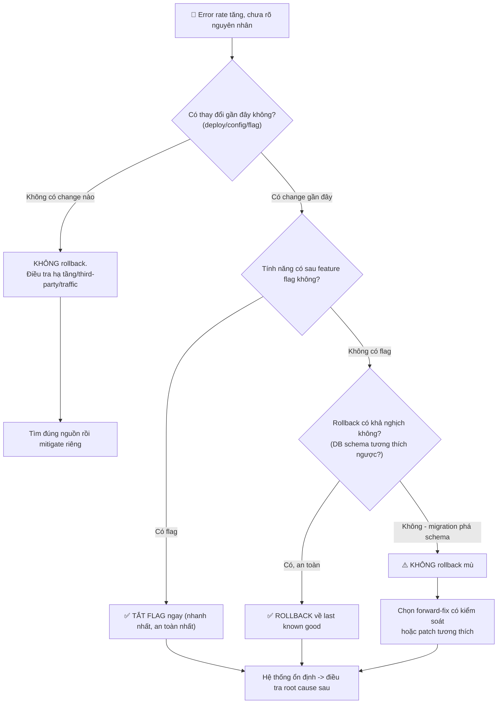

# Khi chưa rõ nguyên nhân, bạn có nên rollback không?

## ⚡ Tóm tắt ngắn (30s)
* **Bản chất**: Câu trả lời của Senior là **CÓ — rollback là hành động mặc định khi sự cố trùng thời điểm với một thay đổi gần đây, ngay cả khi chưa rõ root cause**. Triết lý cốt lõi: **"Stabilize before Diagnose"** (ổn định trước, chẩn đoán sau). Rollback không phải để "sửa lỗi", mà để **cầm máu (mitigate)** và đưa hệ thống về trạng thái tốt-đã-biết (last known good). Việc tìm nguyên nhân được thực hiện sau, trong môi trường an toàn, trên artifact đã thu thập.
* **Thảm họa thực chiến được giải quyết**:
  1. **Debug trong khi hệ thống đang cháy (High MTTR)**: On-call cố đọc log tìm root cause 30 phút trong khi khách hàng không checkout được — đáng lẽ chỉ cần rollback 2 phút để cầm máu rồi điều tra sau.
  2. **Rollback mù gây hỏng dữ liệu (Irreversible Rollback)**: Deploy mới đã chạy DB migration xóa cột; rollback code cũ làm app cũ không đọc được schema, gây sập kép. Rollback không phải lúc nào cũng an toàn.
* **Quyết định Senior**:
  1. **Mặc định rollback khi có tương quan thời gian**: Nếu lỗi xuất hiện ngay sau một deploy/config change, rollback là lựa chọn đầu tiên — không cần chứng minh nhân quả trước.
  2. **Kiểm tra tính khả nghịch (reversibility) trước khi rollback**: Hỏi "rollback này có an toàn với DB schema và dữ liệu đã ghi không?" Nếu migration không tương thích ngược, chọn forward-fix hoặc feature-flag thay vì rollback.
  3. **Ưu tiên feature flag > rollback > forward-fix**: Tắt flag nhanh nhất (giây), rollback trung bình (phút), forward-fix chậm và rủi ro nhất.

---

## 🔍 Chi tiết bản chất thực chiến: Khi nào rollback, khi nào không

Rollback là mitigation tốt nhất khi thỏa **3 điều kiện**, và nguy hiểm khi vi phạm tính khả nghịch:

### Khi NÊN rollback (mặc định)
* **Có tương quan thời gian rõ ràng**: Sự cố bắt đầu trong vòng vài phút sau một deploy/config/flag change. Đây là tín hiệu mạnh nhất; xác suất change là thủ phạm rất cao.
* **Rollback là khả nghịch (reversible)**: Bản cũ tương thích ngược với trạng thái hiện tại của DB và downstream. Không có migration phá vỡ schema.
* **Chưa rõ root cause nhưng cần cầm máu gấp**: Chính tình huống này — không biết tại sao nhưng biết "trước khi deploy thì ổn".

### Khi KHÔNG nên rollback (hoặc rollback cẩn trọng)
* **Migration không tương thích ngược**: Bản mới đã xóa/đổi cột, đổi format message queue, hoặc đã ghi dữ liệu theo schema mới mà bản cũ không đọc được. Rollback code sẽ gây sập kép hoặc mất dữ liệu.
* **Sự cố KHÔNG tương quan với deploy**: Lỗi đến từ third-party down, hết dung lượng đĩa, DDoS, sự cố hạ tầng cloud — rollback code vô ích, tốn thời gian quý báu.
* **Đã có nhiều traffic ghi theo trạng thái mới**: Rollback có thể làm mất dữ liệu người dùng vừa tạo.

### Nguyên tắc "Expand and Contract" để rollback luôn an toàn
* Thiết kế migration theo pattern mở rộng-thu hẹp: thêm cột mới trước (expand), code mới ghi cả cũ-mới, rồi nhiều ngày sau mới xóa cột cũ (contract). Nhờ vậy, **mọi deploy đều rollback được** vì schema luôn tương thích với cả bản cũ và mới.

---

## 🎨 Sơ đồ trực quan: Cây quyết định rollback khi chưa rõ nguyên nhân



---

## 💻 Code thực chiến: Checklist quyết định rollback (artifact)

Trước khi gõ lệnh rollback, IC và Ops Lead chạy qua checklist 30 giây này để tránh "rollback mù" gây thảm họa kép.

### Artifact: `ROLLBACK-DECISION-CHECKLIST.md`
```markdown
# ⚖️ CHECKLIST QUYẾT ĐỊNH ROLLBACK (chạy trong 30 giây)

## BƯỚC 1: CÓ ĐÁNG NGỜ KHÔNG?
- [ ] Sự cố bắt đầu trong vòng ___ phút sau change gần nhất?
- [ ] Change gần nhất là: deploy / config / flag / infra  (khoanh tròn)
- [ ] Nếu KHÔNG có change nào trùng thời điểm => DỪNG, điều tra hướng khác.

## BƯỚC 2: ROLLBACK CÓ AN TOÀN KHÔNG? (quan trọng nhất!)
- [ ] Deploy này có chạy DB migration không?  (Y/N)
- [ ] Nếu CÓ: migration có tương thích ngược không? (bản cũ đọc được schema?)
      [ ] Tương thích ngược  => rollback AN TOÀN
      [ ] Phá vỡ schema      => ⛔ KHÔNG rollback mù, dùng forward-fix
- [ ] Có dữ liệu mới đã ghi theo format mới chưa? (nguy cơ mất data?)
- [ ] Message queue / event format có đổi không?

## BƯỚC 3: CHỌN VŨ KHÍ (ưu tiên từ trên xuống)
- [ ] 1. Tắt feature flag        (giây)  <-- ưu tiên nhất
- [ ] 2. Rollback deployment     (phút)  <-- nếu khả nghịch
- [ ] 3. Failover region/replica (phút)
- [ ] 4. Forward-fix có kiểm soát (lâu)  <-- chỉ khi rollback không an toàn

## BƯỚC 4: THỰC THI (single-writer)
- [ ] Thông báo kênh: "Sắp rollback <svc> về <ver> trong 30s"
- [ ] Lệnh: kubectl rollout undo deployment/<svc> -n production
- [ ] Quan sát error rate 2-3 phút sau rollback
- [ ] Nếu KHÔNG cải thiện => rollback KHÔNG phải nguyên nhân,
      cân nhắc roll-forward và mở rộng điều tra.
```

---

## 📊 Bảng so sánh: Rollback vs Forward-fix vs Feature-flag-off

| Tiêu chí | Rollback (về bản cũ) | Forward-fix (vá rồi deploy đè) | Feature Flag Off (tắt flag) |
| :--- | :--- | :--- | :--- |
| **Tốc độ cầm máu** | Trung bình (2-5 phút). | Chậm (15-45 phút: code-build-test-deploy). | **Cực nhanh (giây)**. |
| **Cần biết root cause?** | **Không** — đưa về trạng thái tốt đã biết. | **Có** — phải hiểu lỗi mới vá đúng. | Không. |
| **Rủi ro với dữ liệu** | Cao nếu migration không tương thích ngược. | Trung bình (code mới trong lúc cuống). | **Rất thấp** (code cũ vẫn chạy song song). |
| **Khi nào dùng** | Lỗi sâu trong core, có tương quan deploy, schema an toàn. | Khi rollback không an toàn (migration đã phá schema). | Khi tính năng mới được bọc flag — luôn ưu tiên đầu tiên. |
| **Rủi ro sự cố kép** | Có (rollback mù). | Cao nhất (vá vội tạo lỗi mới). | Thấp nhất. |

---

## ⚠️ Common Gotchas & Questions follow-up

### 1. Cạm bẫy "Rollback mù gây thảm họa kép (The Irreversible Migration Trap)"
* **Vấn đề**: Deploy v2 chạy migration xóa cột `old_status` và thêm `status_v2`. Phát hiện v2 lỗi, on-call phản xạ `kubectl rollout undo`. Code v1 khởi động lại nhưng query `old_status` không còn tồn tại → toàn bộ request crash → sập cả hai phiên bản, tệ hơn cả lúc đầu. Tệ nhất: dữ liệu user ghi vào `status_v2` trong 10 phút qua giờ bị "mồ côi" vì v1 không biết cột đó.
* **Giải pháp**: (1) Luôn áp dụng **Expand-and-Contract** để migration tương thích ngược, không bao giờ xóa cột trong cùng deploy với thêm cột. (2) Trước khi rollback, **bắt buộc** hỏi "deploy này có migration không?" — nếu có và không tương thích ngược, chuyển sang forward-fix/patch thay vì rollback. (3) Ưu tiên feature flag để hoàn toàn tránh phải đụng tới rollback DB.

### 2. Câu hỏi đào sâu từ interviewer
* **Q: "Bạn rollback xong nhưng error rate KHÔNG giảm. Điều đó nói lên điều gì và bạn làm gì tiếp?"**
* **Trả lời**:
  * Rollback không cải thiện là một tín hiệu chẩn đoán cực kỳ giá trị, không phải thất bại:
    1. **Loại trừ giả thuyết "deploy là thủ phạm"**: Nếu về bản cũ mà vẫn lỗi, thì nguyên nhân **không nằm ở code vừa deploy**. Ta vừa thu hẹp không gian tìm kiếm rất nhiều.
    2. **Chuyển hướng điều tra sang hạ tầng/downstream**: Khả năng cao là third-party down, DB quá tải, hết connection pool, sự cố mạng/cloud, hoặc một change ở tầng khác (config infra, DNS, certificate). Kiểm tra các dependency và dashboard hạ tầng.
    3. **Cẩn trọng với "trạng thái đã thay đổi"**: Có thể deploy mới đã gây ra một thay đổi dai dẳng (ví dụ ghi dữ liệu lỗi, đầu độc cache, làm đầy queue) mà rollback code không xóa được. Cần mitigation riêng: xóa cache, drain queue, sửa dữ liệu hỏng.
    4. **Mở rộng war room**: Báo IC để huy động thêm chuyên gia hạ tầng, vì đây không còn là sự cố ứng dụng đơn thuần. Đồng thời cập nhật Comms rằng ETA bị kéo dài.
