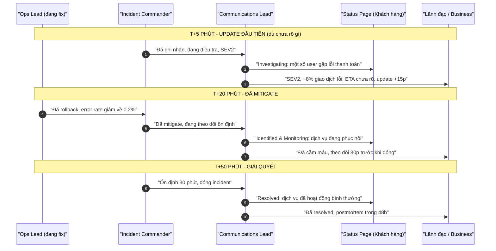

# Làm sao communicate incident với stakeholder?

## ⚡ Tóm tắt ngắn (30s)
* **Bản chất**: Communicate incident là một kỹ năng tách biệt với việc fix, do **Communications Lead** đảm nhận. Nguyên tắc cốt lõi: **giao tiếp theo nhịp đều đặn (cadence), bằng ngôn ngữ business chứ không phải kỹ thuật, và minh bạch có kiểm soát**. Mục tiêu không phải "che giấu", mà là **bảo vệ niềm tin** — sự im lặng làm xói mòn niềm tin nhanh hơn cả bản thân sự cố. Khung chuẩn: *cái gì đang xảy ra → ảnh hưởng gì đến bạn → chúng tôi đang làm gì → khi nào update tiếp*.
* **Thảm họa thực chiến được giải quyết**:
  1. **Im lặng radio (Radio Silence)**: Team cắm đầu fix 45 phút không update gì; stakeholder và khách hàng hoảng loạn, CS bị ngập câu hỏi, CEO gọi điện gây thêm áp lực lên đúng người đang fix.
  2. **Rò rỉ chi tiết kỹ thuật gây hoảng**: Comms đăng "NullPointerException ở PaymentService dòng 142" lên status page công khai — khách hàng không hiểu, đối thủ và báo chí khai thác, lộ chi tiết bảo mật.
* **Quyết định Senior**:
  1. **Update trong 5 phút đầu dù chưa biết gì**: "Đã ghi nhận sự cố, đang điều tra, update sau 15 phút" — thiết lập nhịp ngay lập tức.
  2. **Phân tầng thông điệp theo audience**: Khách hàng (status page) nhận thông điệp ngắn gọn business; lãnh đạo nhận tác động doanh thu & ETA; nội bộ nhận chi tiết kỹ thuật.
  3. **Comms Lead là tường lửa**: Mọi câu hỏi "bao giờ xong?" đổ vào Comms, không làm gián đoạn Ops Lead.

---

## 🔍 Chi tiết bản chất thực chiến: 3 tầng audience và nhịp giao tiếp

### Phân tầng audience (mỗi tầng một ngôn ngữ)
```
┌──────────────────────────────────────────────────────────┐
│ TẦNG 1: KHÁCH HÀNG (Status Page công khai)               │
│  Ngôn ngữ: business, ngắn, không thuật ngữ kỹ thuật       │
│  "Một số người dùng có thể gặp khó khăn khi thanh toán"   │
├──────────────────────────────────────────────────────────┤
│ TẦNG 2: LÃNH ĐẠO / BUSINESS (Slack exec, email)          │
│  Ngôn ngữ: tác động + ETA + nguồn lực                     │
│  "SEV2, ~8% giao dịch lỗi, doanh thu ảnh hưởng, ETA 30p"  │
├──────────────────────────────────────────────────────────┤
│ TẦNG 3: NỘI BỘ KỸ THUẬT (kênh incident)                  │
│  Ngôn ngữ: kỹ thuật đầy đủ, timeline, giả thuyết          │
│  "Error rate 8% endpoint /checkout, đang rollback v1.8"   │
└──────────────────────────────────────────────────────────┘
```

### Nhịp giao tiếp (Cadence) theo SEV
* **SEV1**: update mỗi 15-30 phút, kể cả khi "chưa có gì mới" (vẫn nói "vẫn đang xử lý, chưa có ETA mới").
* **SEV2**: update mỗi 30-60 phút.
* Quy tắc: **luôn hẹn giờ update tiếp theo** ở cuối mỗi thông điệp. Stakeholder biết khi nào có tin mới sẽ ngừng hỏi dồn dập.

### Cấu trúc một thông điệp chuẩn (4 thành phần)
1. **What**: Cái gì đang xảy ra (mô tả triệu chứng, không phải root cause nếu chưa chắc).
2. **Impact**: Ảnh hưởng gì đến người nhận (ai, tính năng nào, bao nhiêu %).
3. **Action**: Chúng tôi đang làm gì (đang điều tra / đang mitigate / đã khôi phục).
4. **Next**: Khi nào có update tiếp theo.

### Nguyên tắc ngôn ngữ
* **Không đổ lỗi, không hứa hẹn thời gian cứng khi chưa chắc** ("đang nỗ lực khôi phục nhanh nhất" thay vì "sẽ xong trong 10 phút").
* **Không tiết lộ chi tiết bảo mật/kỹ thuật** ra status page công khai.
* **Trung thực**: không nói "đã khắc phục" khi chỉ mới mitigate tạm.

---

## 🎨 Sơ đồ trực quan: Luồng truyền tin của Communications Lead



---

## 💻 Code thực chiến: Bộ template communication (artifact thực chiến)

Comms Lead không sáng tác lúc cuống — họ dùng template điền chỗ trống để đăng nhanh và nhất quán.

### Artifact: `STATUS-PAGE-TEMPLATES.md`
```markdown
# 📢 TEMPLATE STATUS PAGE (4 trạng thái chuẩn)

## 1️⃣ INVESTIGATING (đăng trong 5 phút đầu)
> **[Đang điều tra]** Chúng tôi đã ghi nhận sự cố ảnh hưởng đến
> {tính năng, vd: thanh toán}. Đội ngũ kỹ thuật đang khẩn trương
> điều tra. Chúng tôi sẽ cập nhật trước {HH:MM}.

## 2️⃣ IDENTIFIED (đã xác định / đã mitigate)
> **[Đã xác định nguyên nhân]** Chúng tôi đã xác định nguyên nhân và
> đang triển khai khắc phục. Một số người dùng có thể vẫn gặp gián đoạn.
> Cập nhật tiếp theo trước {HH:MM}.

## 3️⃣ MONITORING (đang theo dõi)
> **[Đang theo dõi]** Biện pháp khắc phục đã được áp dụng, dịch vụ đang
> phục hồi. Chúng tôi đang theo dõi để đảm bảo ổn định.

## 4️⃣ RESOLVED (đã giải quyết)
> **[Đã khắc phục]** Sự cố đã được khắc phục hoàn toàn lúc {HH:MM}.
> Chúng tôi thành thật xin lỗi vì sự bất tiện. Báo cáo chi tiết
> (postmortem) sẽ được chia sẻ trong vòng 48 giờ.

---

# 💼 TEMPLATE BÁO LÃNH ĐẠO (Slack/Email)
> **[INCIDENT SEV{N}] {tiêu đề ngắn}**
> • Bắt đầu: {HH:MM}    • Trạng thái: {Investigating/Mitigated/Resolved}
> • Tác động:  trên {/checkout}
> • Hành động: {đang rollback payment -> v1.8}
> • Giả thuyết: {nghi do change config X}
> • Next update: {HH:MM}
```

---

## 📊 Bảng so sánh: Thông điệp cho từng tầng audience

| Tiêu chí | Khách hàng (Status Page) | Lãnh đạo / Business | Nội bộ kỹ thuật (kênh incident) |
| :--- | :--- | :--- | :--- |
| **Mức chi tiết kỹ thuật** | Tối thiểu, không thuật ngữ. | Trung bình, tập trung tác động. | Đầy đủ: log, trace, giả thuyết. |
| **Trọng tâm thông điệp** | "Ảnh hưởng gì đến tôi, khi nào hết". | "Tác động doanh thu, ETA, nguồn lực". | "Triệu chứng, hành động, root cause". |
| **Tần suất** | Mỗi mốc trạng thái thay đổi. | Theo cadence SEV (15-60p). | Liên tục, real-time. |
| **Giọng điệu** | Đồng cảm, xin lỗi, trấn an. | Khách quan, số liệu, quyết đoán. | Thẳng thắn, kỹ thuật, không vòng vo. |
| **Điều TRÁNH** | Chi tiết kỹ thuật, đổ lỗi, hứa giờ cứng. | Thuật ngữ khó hiểu, mơ hồ về tác động. | Giấu giếm, lạc quan giả. |

---

## ⚠️ Common Gotchas & Questions follow-up

### 1. Cạm bẫy "Im lặng vì chưa có gì để nói (The Silence Trap)"
* **Vấn đề**: Team nghĩ "chưa fix xong, chưa biết nguyên nhân, đăng update làm gì cho mất công" và giữ im lặng 45 phút. Trong khoảng trống đó, khách hàng tự đồn đoán tệ hơn thực tế, CS bị ngập, lãnh đạo gọi trực tiếp gây áp lực lên Ops Lead, và niềm tin bị bào mòn nghiêm trọng — đôi khi tổn hại danh tiếng còn lớn hơn cả downtime kỹ thuật.
* **Giải pháp**: **"Không có tin mới" cũng là một tin.** Vẫn đăng đúng nhịp: *"Chúng tôi vẫn đang tích cực xử lý, chưa có ETA mới, sẽ cập nhật trước HH:MM."* Sự đều đặn của nhịp giao tiếp tự nó tạo niềm tin rằng "có người đang kiểm soát". Comms Lead có nhiệm vụ riêng chính là để đảm bảo nhịp này không bao giờ bị đứt vì team mải fix.

### 2. Câu hỏi đào sâu từ interviewer
* **Q: "Trong lúc incident, lãnh đạo nhắn riêng cho bạn (Ops Lead đang fix) hỏi 'bao giờ xong?' liên tục. Bạn xử lý thế nào?"**
* **Trả lời**:
  * Đây chính xác là vấn đề mà vai Communications Lead sinh ra để giải quyết:
    1. **Chuyển hướng về Comms một cách lịch sự**: Trả lời ngắn *"Em đang tập trung fix, mọi cập nhật tiến độ anh/chị theo dõi qua @CommsLead và status page nhé, em sẽ feed thông tin liên tục cho bạn ấy"* — bảo vệ sự tập trung của mình mà không tỏ ra thất lễ.
    2. **Thiết lập kênh chính thức duy nhất**: IC nên công bố ngay từ đầu rằng mọi update đi qua một kênh/một người, để dập tắt thói quen nhắn riêng từng người. Điều này tránh việc Ops Lead phải kể đi kể lại cùng một thông tin cho 5 người.
    3. **Comms chủ động "đi trước" câu hỏi**: Nếu Comms update đủ đều và đủ rõ về tác động + ETA, lãnh đạo sẽ không cần nhắn riêng. Phần lớn việc hỏi dồn dập đến từ khoảng trống thông tin, nên lấp khoảng trống là cách phòng ngừa tốt nhất.
    4. **Không hứa ETA cứng để "cho yên"**: Tuyệt đối tránh buột miệng "10 phút nữa" chỉ để chấm dứt câu hỏi — sai hẹn còn làm mất niềm tin nặng hơn.
