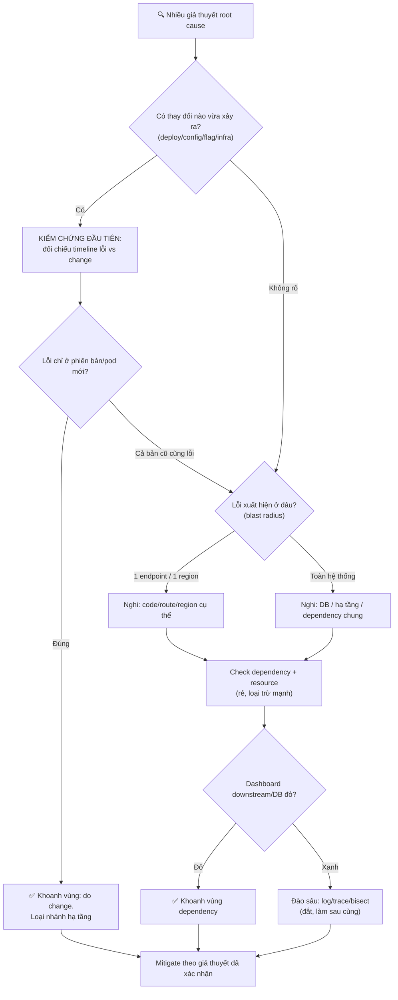

# Khi có nhiều giả thuyết root cause, bạn ưu tiên kiểm chứng cái nào?

## ⚡ Tóm tắt ngắn (30s)
* **Bản chất**: Khi có nhiều giả thuyết, Senior không kiểm chứng tuần tự ngẫu nhiên mà **ưu tiên hóa giả thuyết theo ma trận "xác suất × chi phí kiểm chứng × giá trị loại trừ"**. Quy tắc vàng: **bắt đầu từ thứ thay đổi gần nhất (recent change first)** vì phần lớn sự cố production đến từ một thay đổi vừa được đưa lên. Ưu tiên các phép kiểm chứng **nhanh, rẻ và có khả năng loại trừ cả một nhánh lớn** (binary search trên không gian giả thuyết).
* **Thảm họa thực chiến được giải quyết**:
  1. **Tunnel vision vào giả thuyết yêu thích (Confirmation Bias)**: Senior tin chắc lỗi do code mình viết, dành 40 phút đào sâu trong khi thủ phạm thật là một config infra đổi 5 phút trước — đáng lẽ check trong 30 giây.
  2. **Kiểm chứng tuần tự đắt đỏ (Serial Expensive Probing)**: Thử từng giả thuyết theo thứ tự dễ-nghĩ-ra nhất thay vì rẻ-nhất-trước, làm MTTR phình to.
* **Quyết định Senior**:
  1. **Recent change first**: Câu hỏi đầu tiên luôn là "cái gì vừa thay đổi?" (deploy, config, flag, infra, traffic, third-party).
  2. **Ưu tiên phép kiểm chứng rẻ & loại trừ mạnh**: Chọn test nhanh nhất mà loại được nhiều giả thuyết nhất (chia đôi không gian nghi vấn).
  3. **Phân công song song, tránh trùng lặp**: IC giao mỗi nhánh giả thuyết cho một người, ghi rõ "đang kiểm chứng cái gì" để không 5 người cùng đào một hố.

---

## 🔍 Chi tiết bản chất thực chiến: Ma trận ưu tiên giả thuyết

### Ba trục đánh giá mỗi giả thuyết
* **Prior probability (xác suất tiên nghiệm)**: Giả thuyết này có khả năng đúng cao không? *Recent change* luôn có prior cao nhất.
* **Cost to test (chi phí kiểm chứng)**: Mất bao lâu/rủi ro gì để xác nhận hay loại bỏ? Check dashboard = rẻ; reproduce trên prod = đắt.
* **Information gain (giá trị loại trừ)**: Kiểm chứng này loại được bao nhiêu giả thuyết khác? Một test chia đôi không gian nghi vấn là vàng.

### Thứ tự ưu tiên thực chiến (từ trên xuống)
```
1. RECENT CHANGE         → "cái gì vừa đổi?" (deploy/config/flag/infra)
   ↳ rẻ nhất, prior cao nhất, thường là thủ phạm
2. CORRELATION TÍN HIỆU  → lỗi bắt đầu lúc nào? trùng với sự kiện gì?
   ↳ đối chiếu timeline error vs deploy/traffic/cron
3. BLAST RADIUS PATTERN  → lỗi ở 1 endpoint hay toàn bộ? 1 region hay all?
   ↳ pattern thu hẹp tầng nghi vấn (app vs infra vs DB)
4. DEPENDENCY HEALTH     → downstream/DB/third-party có đỏ không?
   ↳ check dashboard, rẻ, loại trừ cả nhánh "lỗi nội bộ"
5. RESOURCE EXHAUSTION   → CPU/mem/disk/connection pool/thread pool?
   ↳ các nguyên nhân kinh điển, dashboard sẵn có
6. GIẢ THUYẾT SÂU & ĐẮT  → đọc code, reproduce, bisect commit
   ↳ chỉ làm khi các bước rẻ trên không ra
```

### Kỹ thuật "Differential Diagnosis" (chẩn đoán phân biệt)
* Mượn từ y khoa: liệt kê mọi giả thuyết, rồi tìm **một quan sát phân biệt** chúng. Ví dụ: "nếu lỗi do deploy thì chỉ pod v2 lỗi; nếu do DB thì cả v1 và v2 đều lỗi". Chỉ cần nhìn error theo version là loại được một nửa.

### Tránh confirmation bias
* Chủ động hỏi *"giả thuyết của tôi SAI thì tôi sẽ thấy gì?"* và đi tìm bằng chứng phản bác, thay vì chỉ tìm bằng chứng ủng hộ. Senior giỏi là người sẵn sàng giết giả thuyết yêu thích của mình nhanh nhất.

---

## 🎨 Sơ đồ trực quan: Cây ưu tiên kiểm chứng giả thuyết



---

## 💻 Code thực chiến: Bảng theo dõi giả thuyết (Hypothesis Tracker artifact)

Để tránh trùng lặp và tunnel vision, Scribe duy trì một bảng giả thuyết sống trong kênh incident — ai đang kiểm chứng cái gì, kết quả ra sao.

### Artifact: `HYPOTHESIS-TRACKER.md`
```markdown
# 🧪 BẢNG THEO DÕI GIẢ THUYẾT — Incident #2026-0630

| # | Giả thuyết                       | Prior | Chi phí test | Người làm | Trạng thái      |
|---|----------------------------------|-------|--------------|-----------|-----------------|
| 1 | Do deploy v2.3 (10:35) gây lỗi   | CAO   | Rẻ (30s)     | @Bình     | 🟡 Đang test     |
| 2 | DB connection pool cạn kiệt      | TB    | Rẻ (1p)      | @An       | ❌ Loại (pool OK) |
| 3 | Third-party payment gateway down | TB    | Rẻ (1p)      | @Châu     | ❌ Loại (200 OK)  |
| 4 | Config infra (LB timeout) đổi    | CAO   | Rẻ (2p)      | @An       | 🟡 Đang test     |
| 5 | Memory leak gây OOM              | THẤP  | Đắt (reproduce) | -      | ⏸️ Chưa làm     |

## QUY TẮC
- 🟡 = đang kiểm chứng (ghi rõ AI làm => không trùng lặp)
- ✅ = xác nhận đúng    ❌ = đã loại trừ    ⏸️ = chờ
- Ưu tiên test theo: Prior CAO + Chi phí RẺ trước.
- Mỗi giả thuyết loại trừ phải có BẰNG CHỨNG (số liệu), không "cảm thấy".

## PHÉP KIỂM CHỨNG PHÂN BIỆT (differential)
- "Nếu do deploy => chỉ pod v2 lỗi"  -> nhìn error_rate by version
- "Nếu do DB    => cả v1 và v2 lỗi"  -> đối chiếu
=> Quan sát: error CHỈ trên v2 pods => mạnh cho giả thuyết #1
```

### Artifact: lệnh kiểm chứng nhanh (cheat sheet)
```bash
# Giả thuyết #1: lỗi theo version? (chia đôi không gian: code vs hạ tầng)
kubectl get pods -l app=payment -L version
# => so error rate giữa version=v2.3 và v1.8 trên dashboard

# Giả thuyết #2: connection pool cạn?
curl -s localhost:8080/actuator/metrics/hikaricp.connections.active

# Giả thuyết #3: third-party còn sống?
curl -s -o /dev/null -w "%{http_code} %{time_total}s\n" https://gateway.partner/health

# Giả thuyết #4: config infra vừa đổi?
git -C infra/ log --oneline --since="30 min ago"
```

---

## 📊 Bảng so sánh: Thứ tự kiểm chứng — rẻ-mạnh trước vs đắt-yếu sau

| Loại kiểm chứng | Chi phí | Giá trị loại trừ | Ưu tiên | Ví dụ |
| :--- | :--- | :--- | :--- | :--- |
| **Recent change diff** | Rất rẻ (giây) | Rất cao (prior lớn nhất) | 🥇 Đầu tiên | `git log`, lịch sử deploy/config |
| **Error by version/region** | Rẻ (giây) | Cao (chia đôi app/infra) | 🥈 | Dashboard nhóm theo tag |
| **Dependency/DB health** | Rẻ (phút) | Cao (loại nhánh nội bộ) | 🥉 | Health check, DB CPU/pool |
| **Resource metrics** | Rẻ (phút) | Trung bình | 4 | CPU/mem/disk/thread pool |
| **Đọc log/trace chi tiết** | Trung bình | Trung bình | 5 | Lọc theo trace ID |
| **Reproduce / git bisect** | Đắt (lâu, rủi ro) | Cao nhưng chậm | Cuối cùng | Tái hiện trên staging |

---

## ⚠️ Common Gotchas & Questions follow-up

### 1. Cạm bẫy "Yêu giả thuyết của mình (Confirmation Bias / Tunnel Vision)"
* **Vấn đề**: Engineer vừa deploy code mới, trong tiềm thức tin chắc "chắc do mình", lao vào đọc chính xác đoạn code của mình 40 phút, diễn giải mọi log mơ hồ theo hướng ủng hộ giả thuyết đó. Trong khi đó thủ phạm thật là một thay đổi config load balancer của team infra 5 phút trước — chỉ cần một câu hỏi "có ai vừa đổi gì ở tầng infra không?" là ra ngay.
* **Giải pháp**: (1) **Recent change first một cách toàn diện**: liệt kê MỌI thay đổi gần đây từ MỌI team (app, infra, config, flag, DNS, cert), không chỉ change của mình. (2) **Đặt câu hỏi phản chứng**: "nếu giả thuyết tôi sai, tôi sẽ quan sát thấy gì?" rồi đi tìm dấu hiệu đó. (3) **IC làm trọng tài khách quan**: IC không bị cuốn vào code, có thể hỏi những câu "ngây thơ" giúp phá vỡ tunnel vision. (4) **Mỗi loại trừ phải có bằng chứng số liệu**, không loại bằng cảm tính.

### 2. Câu hỏi đào sâu từ interviewer
* **Q: "Hai giả thuyết đều có xác suất cao và đều rẻ để test. Bạn test cái nào trước, và có nên test song song không?"**
* **Trả lời**:
  * Khi hai giả thuyết ngang nhau về prior và chi phí, ta dùng thêm hai tiêu chí phụ:
    1. **Information gain (giá trị loại trừ) làm tie-breaker**: Chọn cái mà kết quả của nó loại trừ được nhiều giả thuyết KHÁC nhất. Một test phân biệt được nhiều nhánh đáng giá hơn test chỉ xác nhận một điểm.
    2. **Có, NÊN test song song khi an toàn**: Đây chính là lý do ta phân công nhiều người. IC giao giả thuyết A cho @An, giả thuyết B cho @Bình, cập nhật vào Hypothesis Tracker. Điều kiện: các phép test phải **read-only/không xâm lấn** (đọc dashboard, health check) — song song hóa các quan sát thì an toàn.
    3. **Nhưng KHÔNG song song các hành động thay đổi production**: Đọc/quan sát thì song song được; còn mọi *thay đổi* để kiểm chứng (restart, đổi config, rollback một phần) phải tuân thủ single-writer qua IC, vì hai thay đổi đồng thời sẽ làm nhiễu tín hiệu — không biết cái nào gây ra thay đổi quan sát được.
    4. **Tổng hợp về một mối**: Dù song song, mọi kết quả phải đổ về Hypothesis Tracker và IC, để có người nhìn bức tranh toàn cảnh và ra quyết định mitigation thống nhất.
