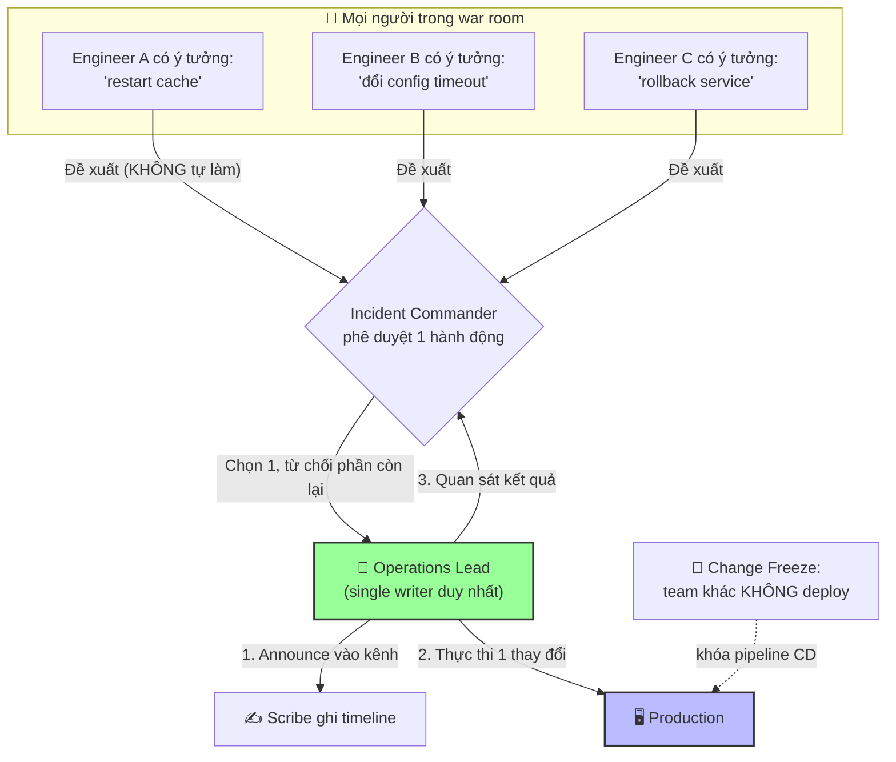

# Làm sao tránh nhiều người cùng thay đổi production trong lúc incident?

## ⚡ Tóm tắt ngắn (30s)
* **Bản chất**: Giải pháp cốt lõi là **Single-Writer Rule (quy tắc một người ghi)**: tại mọi thời điểm, **chỉ một người duy nhất — Operations Lead — được phép thay đổi production**, và mọi thay đổi phải được **IC phê duyệt + nói to/ghi vào kênh trước khi thực hiện**. Kết hợp với **change freeze** (đóng băng mọi thay đổi không liên quan đến incident) và một **timeline tập trung**. Mục tiêu: giữ cho hệ thống chỉ có **một biến số thay đổi tại một thời điểm**, để mọi quan sát còn ý nghĩa chẩn đoán.
* **Thảm họa thực chiến được giải quyết**:
  1. **Giẫm chân nhau (Concurrent Conflicting Changes)**: 4 engineer mỗi người tự ý restart service, đổi config, rollback một phần. Khi error rate giảm, không ai biết hành động nào có tác dụng — và một thay đổi vô tình phá hỏng fix của người khác, kéo dài incident.
  2. **Nhiễu tín hiệu chẩn đoán (Signal Pollution)**: Nhiều thay đổi đồng thời làm metric nhảy loạn, không thể quy nhân quả → không học được gì cho postmortem.
* **Quyết định Senior**:
  1. **Single-writer rule**: Chỉ Ops Lead chạm production; người khác đề xuất qua IC, không tự ý làm.
  2. **Change freeze toàn cục**: Tạm dừng mọi deploy/merge/cron không khẩn cấp của các team khác trong suốt incident.
  3. **Announce-before-act + timeline**: Mọi thay đổi gõ vào kênh trước khi làm, Scribe ghi lại — một biến số một thời điểm.

---

## 🔍 Chi tiết bản chất thực chiến: 4 cơ chế kiểm soát thay đổi

### 1. Single-Writer Rule (quy tắc một người ghi)
* Tại một thời điểm chỉ **một người** có "cây bút" để sửa production. Người đó là Ops Lead do IC chỉ định.
* Người khác có ý tưởng? Đề xuất qua IC: *"Tôi đề xuất restart service X"*. IC quyết định và giao lại cho Ops Lead thực thi. Không ai tự ý gõ lệnh.
* Lý do toán học: nếu có $n$ người cùng thay đổi, số tương tác cần suy luận là $O(n^2)$ — không thể chẩn đoán được. Với $n=1$, mỗi thay đổi có nhân quả rõ ràng.

### 2. Change Freeze (đóng băng thay đổi)
* Trong lúc incident, **tạm dừng mọi thay đổi production không liên quan** từ tất cả các team: deploy, merge to main, migration theo lịch, cron jobs rủi ro, thậm chí cả các incident-fix của team khác.
* Lý do: một deploy "vô hại" của team khác giữa lúc đang điều tra có thể làm nhiễu tín hiệu hoặc chồng thêm sự cố. Change freeze thường được tự động hóa: khi tuyên bố SEV1/SEV2, pipeline CD bị khóa.

### 3. Announce-Before-Act (nói trước khi làm)
* Ops Lead phải gõ vào kênh **trước** mỗi hành động: *"[10:42] Sắp rollback payment về v1.8 trong 30s"*. Sau khi làm: *"[10:43] ĐÃ rollback xong"*.
* Điều này cho IC cơ hội veto, cho Scribe ghi timeline, và cho cả team một mental model chung về trạng thái hệ thống.

### 4. Centralized Timeline (timeline tập trung)
* Một nguồn sự thật duy nhất ghi mọi thay đổi có timestamp. Khi metric thay đổi, ta đối chiếu timeline để biết hành động nào gây ra — đây là nền tảng cho cả việc mitigate đúng lẫn postmortem.

---

## 🎨 Sơ đồ trực quan: Cổng kiểm soát thay đổi single-writer



---

## 💻 Code thực chiến: Quy ước single-writer + tự động change freeze (artifact)

### Artifact: `SINGLE-WRITER-PROTOCOL.md` (pin đầu kênh incident)
```markdown
# ⛔ GIAO THỨC SINGLE-WRITER — BẮT BUỘC TRONG INCIDENT

## AI ĐƯỢC CHẠM PRODUCTION?
👉 CHỈ Operations Lead: @Bình
   Mọi người khác: ĐỀ XUẤT qua IC @An, KHÔNG tự gõ lệnh.

## QUY TRÌNH MỖI THAY ĐỔI (bắt buộc 3 bước)
1. 🗣️ ANNOUNCE: gõ vào kênh "[HH:MM] sắp <hành động> trong Ns"
2. ✅ APPROVE: chờ IC xác nhận "OK go"
3. 🔧 ACT + REPORT: thực hiện, rồi gõ "[HH:MM] ĐÃ xong, kết quả: ..."

## 🧊 CHANGE FREEZE (toàn công ty, tự động khi SEV1/SEV2)
- ❌ Cấm merge to main
- ❌ Cấm deploy production (mọi service)
- ❌ Cấm chạy migration theo lịch
- ❌ Tạm dừng cron jobs rủi ro
- ✅ Chỉ Ops Lead của incident này được thay đổi

## VÌ SAO?
Một biến số một thời điểm => mỗi thay đổi có nhân quả rõ ràng =>
mitigate đúng + học được cho postmortem. Nhiều người đổi cùng lúc =
không ai biết cái gì có tác dụng = MTTR phình to + sự cố chồng sự cố.
```

### Artifact: gate change-freeze trong CI/CD pipeline (ví dụ)
```yaml
# .ci/deploy-guard.yml — chặn deploy khi đang có incident SEV1/SEV2
deploy_guard:
  stage: pre-deploy
  script:
    - |
      # Đọc cờ incident từ feature-flag service / KV store
      SEV=$(curl -s "$INCIDENT_API/active-sev" || echo "none")
      if [ "$SEV" = "SEV1" ] || [ "$SEV" = "SEV2" ]; then
        echo "🧊 CHANGE FREEZE đang bật (đang có $SEV)."
        echo "Mọi deploy bị chặn trừ override khẩn cấp có phê duyệt IC."
        # Cho phép override CÓ CHỦ ĐÍCH, để lại dấu vết audit
        if [ "$INCIDENT_OVERRIDE_APPROVED_BY" = "" ]; then
          exit 1
        fi
        echo "⚠️ Override bởi: $INCIDENT_OVERRIDE_APPROVED_BY (đã ghi audit)"
      fi
  rules:
    - if: '$CI_COMMIT_BRANCH == "main"'
```

---

## 📊 Bảng so sánh: Hỗn loạn nhiều-người-ghi vs kỷ luật single-writer

| Tiêu chí | ❌ Nhiều người cùng thay đổi (free-for-all) | ✅ Single-Writer + Change Freeze |
| :--- | :--- | :--- |
| **Khả năng chẩn đoán nhân quả** | Bằng 0 — metric nhảy loạn, không quy được. | Rõ ràng — mỗi thay đổi một tín hiệu. |
| **Rủi ro giẫm chân/phá fix nhau** | Cao — một người vô tình undo fix người khác. | Không — chỉ một người ghi tại một thời điểm. |
| **MTTR** | Phình to, hỗn loạn. | Thấp, có kiểm soát. |
| **Khả năng audit / postmortem** | Không tái dựng được chuỗi sự kiện. | Timeline đầy đủ, học được bài học. |
| **Rủi ro sự cố chồng sự cố** | Rất cao. | Thấp. |
| **Cảm giác trong war room** | Náo loạn, nhiều người gõ song song. | Trật tự: đề xuất → phê duyệt → thực thi. |

---

## ⚠️ Common Gotchas & Questions follow-up

### 1. Cạm bẫy "Anh hùng đơn độc gõ lệnh lén (The Silent Cowboy)"
* **Vấn đề**: Một engineer giỏi, sốt ruột, tự SSH vào production và sửa một config "cho nhanh" mà không báo ai vì "tôi chắc chắn cái này đúng". Đúng lúc đó Ops Lead đang rollback. Hai thay đổi chồng lên nhau: error rate giảm rồi tăng lại bất thường, cả team rối loạn không hiểu chuyện gì, mất 20 phút mới phát hiện có người gõ lén. Tệ hơn, hành động lén không được ghi vào timeline nên postmortem thiếu mảnh ghép quan trọng.
* **Giải pháp**: (1) Văn hóa **"loud over heroic"** — báo to luôn tốt hơn tự xử anh hùng; tôn vinh người tuân thủ giao thức, không tôn vinh cowboy. (2) **Kiểm soát truy cập kỹ thuật**: trong incident, hạn chế quyền write production chỉ cho Ops Lead (break-glass access có audit), người khác chỉ read-only. (3) **Announce-before-act là luật cứng**: bất kỳ thay đổi nào không qua kênh đều bị coi là vi phạm nghiêm trọng, kể cả khi nó "đúng".

### 2. Câu hỏi đào sâu từ interviewer
* **Q: "Single-writer làm Ops Lead thành nút cổ chai (bottleneck) khi cần nhiều việc song song. Khi nào và làm sao bạn nới quy tắc này một cách an toàn?"**
* **Trả lời**:
  * Single-writer là về *thay đổi*, không phải về *mọi hoạt động* — và có thể nới có kiểm soát:
    1. **Phân biệt đọc và ghi**: Single-writer chỉ áp cho các hành động *thay đổi* production. Mọi hoạt động *read-only* (đọc log, query dashboard, health check, chạy lệnh chẩn đoán không xâm lấn) thì nhiều người làm song song thoải mái — đó là cách ta điều tra nhanh mà vẫn an toàn.
    2. **Chia vùng (sharding writers) khi thật cần**: Nếu incident lớn cần thay đổi ở nhiều hệ thống độc lập (ví dụ một người lo service A, một người lo cluster DB), IC có thể chỉ định nhiều writer nhưng **mỗi người một vùng tách biệt, không giao thoa**, và mỗi vùng vẫn tuân thủ announce-before-act. Mấu chốt là không có hai người cùng thay đổi *cùng một thành phần*.
    3. **Tuần tự hóa các thay đổi giao thoa**: Nếu các thay đổi có thể ảnh hưởng lẫn nhau, bắt buộc làm tuần tự qua IC để giữ "một biến số một thời điểm" — chấp nhận chậm hơn để đổi lấy khả năng chẩn đoán.
    4. **IC điều tiết hàng đợi**: Khi Ops Lead quá tải, IC ưu tiên hóa danh sách thay đổi (cái nào cầm máu trước), tạm gác các thay đổi "tốt-nhưng-không-khẩn". Bottleneck có chủ đích còn hơn hỗn loạn không kiểm soát.
