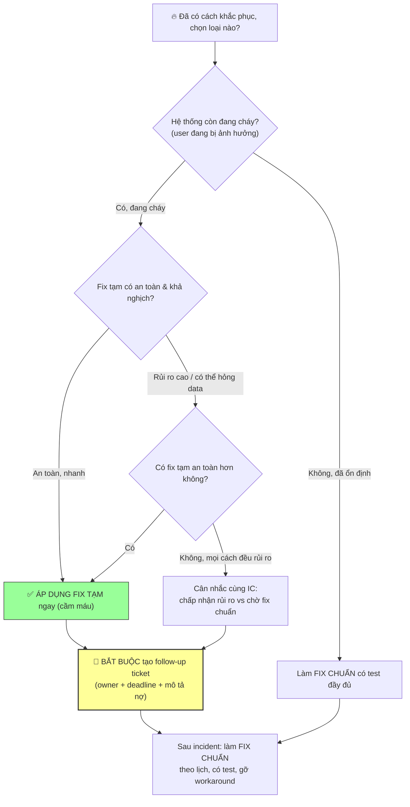

# Khi fix tạm khác fix chuẩn, bạn ra quyết định thế nào?

## ⚡ Tóm tắt ngắn (30s)
* **Bản chất**: Đây là sự phân biệt giữa **Mitigation (cầm máu tạm)** và **Remediation (fix chuẩn triệt để)**. Senior hiểu rằng **trong incident, mục tiêu là khôi phục dịch vụ nhanh nhất, không phải fix đẹp nhất**. Quyết định dựa trên ma trận **MTTR vs Rủi ro**: chọn hành động khôi phục nhanh & an toàn nhất ngay bây giờ (fix tạm), rồi **bắt buộc ghi nợ kỹ thuật (tracked tech debt)** để làm fix chuẩn sau, không bao giờ để fix tạm trở thành vĩnh viễn không ai theo dõi.
* **Thảm họa thực chiến được giải quyết**:
  1. **Cầu toàn trong khủng hoảng (Gold-plating under fire)**: Engineer từ chối workaround "xấu" và cố viết fix chuẩn ngay trong incident, kéo dài downtime 40 phút trong khi một dòng config tạm đã có thể cầm máu trong 2 phút.
  2. **Fix tạm thành nợ vĩnh viễn (The Permanent Temporary Fix)**: Workaround "chỉ tạm thôi" được để nguyên 8 tháng, không ai theo dõi, rồi chính nó gây ra incident tiếp theo.
* **Quyết định Senior**:
  1. **Trong incident: ưu tiên MTTR thấp + rủi ro thấp**: Chọn fix tạm an toàn để cầm máu, đừng cầu toàn khi hệ thống đang cháy.
  2. **Mọi fix tạm phải sinh ra một follow-up ticket có owner & deadline**: Biến nợ ngầm thành nợ có sổ sách.
  3. **Đánh giá fix tạm theo "blast radius của chính nó"**: Một workaround không được tạo ra rủi ro mới lớn hơn vấn đề nó giải quyết.

---

## 🔍 Chi tiết bản chất thực chiến: Khung quyết định Mitigation vs Remediation

### Hai pha tách biệt của vòng đời incident
```
PHA 1: INCIDENT (đang cháy)        PHA 2: SAU INCIDENT (đã ổn định)
─────────────────────────         ──────────────────────────────
Mục tiêu: MTTR thấp nhất    →      Mục tiêu: đúng & bền vững nhất
Chấp nhận: fix tạm "xấu"           Yêu cầu: fix chuẩn, có test
Tiêu chí: nhanh + an toàn          Tiêu chí: triệt để root cause
Ví dụ: tắt flag, scale up,         Ví dụ: sửa bug gốc, refactor,
       restart, config tạm                thêm guardrail, viết test
```

### Tiêu chí chọn fix tạm TRONG incident (theo thứ tự)
1. **Tốc độ cầm máu (MTTR)**: Phục hồi được trong giây/phút hay không?
2. **Rủi ro của chính fix tạm**: Nó có thể gây hỏng dữ liệu / sự cố mới không? Một fix tạm rủi ro cao thì không phải fix tạm tốt.
3. **Tính khả nghịch**: Có dễ gỡ bỏ khi làm fix chuẩn không?
4. **Phạm vi tác động**: Có ảnh hưởng phần khác của hệ thống không?

### Các dạng fix tạm phổ biến (mitigation toolbox)
* **Tắt feature flag** — nhanh nhất, rủi ro thấp nhất.
* **Scale up/out tạm** — giải quyết quá tải tức thời (thêm pod, tăng connection pool).
* **Restart / failover** — xử lý leak, deadlock, hung state.
* **Config override tạm** — tăng timeout, đổi route, bật circuit breaker.
* **Rate-limit / shed load** — hy sinh một phần traffic để cứu phần lớn.

### Nguyên tắc "Reversible + Tracked"
* Fix tạm tốt phải **khả nghịch** (gỡ được) và **được theo dõi** (có ticket). Quyết định "fix tạm hay fix chuẩn" không phải nhị phân *chọn cái này bỏ cái kia*, mà là **fix tạm ngay BÂY GIỜ + fix chuẩn theo lịch SAU**.

---

## 🎨 Sơ đồ trực quan: Cây quyết định fix tạm vs fix chuẩn



---

## 💻 Code thực chiến: Template ghi nợ kỹ thuật cho fix tạm (artifact)

Mỗi fix tạm phải để lại hai dấu vết: một comment cảnh báo trong code và một ticket theo dõi. Đây là cách biến "nợ ngầm" thành "nợ có sổ sách".

### Artifact: comment chuẩn cho workaround trong code
```java
// ⚠️ TEMPORARY MITIGATION — Incident #2026-0630 (SEV2)
// Tăng timeout từ 2s -> 10s để cầm máu khi payment-gateway chậm.
// Đây KHÔNG phải fix chuẩn: root cause là retry storm chưa có circuit breaker.
// FOLLOW-UP: JIRA OPS-4821 (owner: @an, deadline: 2026-07-07)
// GỠ BỎ workaround này khi circuit breaker được triển khai.
@Value("${payment.gateway.timeout:10000}") // tạm: 10s (chuẩn: 2s)
private int gatewayTimeoutMs;
```

### Artifact: `FOLLOW-UP-TICKET.md` (tạo ngay khi áp fix tạm)
```markdown
# 🎫 FOLLOW-UP: Thay fix tạm bằng fix chuẩn — OPS-4821

**Loại:** Tech Debt (Incident Mitigation Cleanup)   **Ưu tiên:** P1
**Nguồn gốc:** Incident #2026-0630 (SEV2, payment 5xx)
**Owner:** @an     **Deadline:** 2026-07-07 (1 tuần)

## FIX TẠM ĐÃ ÁP DỤNG (mitigation)
- Tăng gateway timeout 2s -> 10s để tránh fail nhanh khi partner chậm.
- Vị trí: PaymentClient.java, config payment.gateway.timeout.
- Rủi ro còn tồn: thread bị giữ lâu hơn, nguy cơ pool exhaustion nếu
  partner chậm kéo dài.

## FIX CHUẨN CẦN LÀM (remediation)
- [ ] Thêm circuit breaker (Resilience4j) cho payment-gateway.
- [ ] Cấu hình fallback + bulkhead để cô lập thread pool.
- [ ] Trả timeout về 2s sau khi có circuit breaker.
- [ ] Thêm integration test mô phỏng partner chậm/down.
- [ ] Thêm alert cho tỉ lệ open-circuit.

## ĐIỀU KIỆN ĐÓNG TICKET
- Workaround đã được GỠ BỎ khỏi code.
- Fix chuẩn đã deploy + có test xanh + có dashboard.
```

---

## 📊 Bảng so sánh: Fix tạm (Mitigation) vs Fix chuẩn (Remediation)

| Tiêu chí | Fix tạm (Mitigation) | Fix chuẩn (Remediation) |
| :--- | :--- | :--- |
| **Thời điểm áp dụng** | Trong incident, khi đang cháy. | Sau incident, khi đã ổn định. |
| **Mục tiêu** | MTTR thấp nhất — cầm máu. | Triệt tiêu root cause — bền vững. |
| **Tiêu chuẩn chất lượng** | Đủ an toàn & khả nghịch là được. | Đúng, có test, có guardrail. |
| **Ví dụ** | Tắt flag, scale up, tăng timeout, restart. | Sửa bug gốc, thêm circuit breaker, refactor. |
| **Yêu cầu test** | Quan sát metric phục hồi là đủ. | Unit + integration test bắt buộc. |
| **Bắt buộc kèm theo** | Follow-up ticket + comment cảnh báo. | Gỡ bỏ workaround + đóng ticket nợ. |
| **Rủi ro lớn nhất** | Trở thành "vĩnh viễn" nếu không track. | Làm chậm, nhưng đó là đúng pha. |

---

## ⚠️ Common Gotchas & Questions follow-up

### 1. Cạm bẫy "Fix tạm trở thành vĩnh viễn (The Permanent Temporary Fix)"
* **Vấn đề**: Workaround được áp trong incident với lời hứa "tuần sau làm fix chuẩn". Nhưng incident kết thúc, áp lực biến mất, không ai tạo ticket hoặc ticket bị tụt ưu tiên mãi. 8 tháng sau, cái timeout 10s tạm bợ kia gây ra một incident mới về pool exhaustion — và không ai nhớ tại sao timeout lại là 10s. Nợ ngầm đáo hạn vào thời điểm tệ nhất.
* **Giải pháp**: (1) **"No mitigation without a ticket"** — quy tắc cứng: mọi fix tạm phải sinh ra một follow-up ticket có owner và deadline NGAY trong incident, coi đây là một mục bắt buộc trong checklist đóng incident. (2) **Comment cảnh báo trong code** trỏ về incident và ticket, để người đọc code sau này hiểu đây là workaround. (3) **Postmortem theo dõi đến khi đóng**: action item "thay fix tạm bằng fix chuẩn" phải nằm trong danh sách follow-up của postmortem và được review định kỳ cho đến khi hoàn thành.

### 2. Câu hỏi đào sâu từ interviewer
* **Q: "Fix tạm của bạn đã cầm máu, dịch vụ ổn định, nhưng quản lý nói 'ổn rồi, chuyển nhân lực sang việc khác, fix chuẩn để sau'. Bạn thuyết phục thế nào?"**
* **Trả lời**:
  * Đây là tình huống kinh điển nơi áp lực kinh doanh muốn bỏ rơi nợ kỹ thuật, và Senior cần lập luận bằng ngôn ngữ rủi ro/business:
    1. **Định lượng rủi ro tồn dư**: Giải thích cụ thể fix tạm để lại nguy cơ gì — "timeout 10s nghĩa là nếu partner chậm kéo dài, thread pool sẽ cạn và chúng ta lặp lại đúng incident vừa rồi, nhưng tệ hơn". Biến nợ kỹ thuật trừu tượng thành xác suất incident cụ thể.
    2. **Khung error budget / lặp lại**: Nếu tổ chức có văn hóa SRE, dùng error budget: incident này đã tiêu tốn ngân sách lỗi; để fix tạm tồn tại làm tăng xác suất tiêu hết budget, dẫn đến phải đóng băng feature mới. Điều này gắn nợ kỹ thuật với mục tiêu giao hàng mà quản lý quan tâm.
    3. **Đề xuất có cân nhắc, không cực đoan**: Không đòi dừng mọi thứ. Đề xuất một time-box hợp lý (ví dụ 1 tuần) với ước lượng công sức rõ ràng, và ưu tiên hóa phần rủi ro cao nhất trước. Cho quản lý một lựa chọn được lượng hóa, không phải tối hậu thư.
    4. **Ghi nhận quyết định để có trách nhiệm**: Nếu quản lý vẫn quyết hoãn, ghi rõ trong postmortem rằng "quyết định chấp nhận rủi ro X, hoãn fix chuẩn đến Y, người duyệt Z". Việc minh bạch hóa quyết định chấp nhận rủi ro vừa bảo vệ team vừa tạo áp lực lành mạnh để nợ không bị lãng quên.
