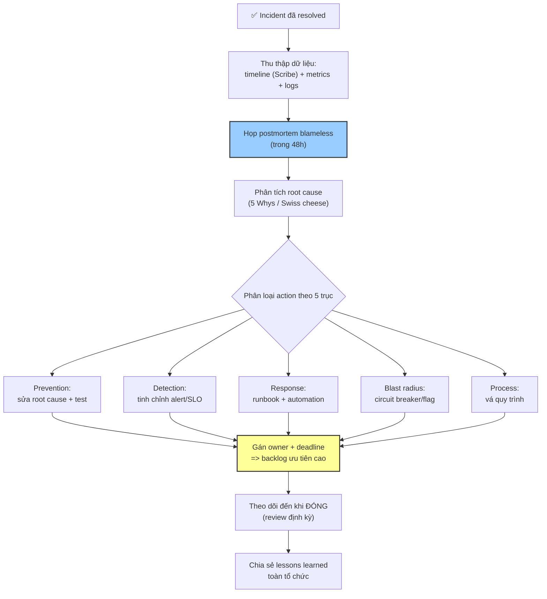

# Sau incident, follow-up action nên gồm những gì?

## ⚡ Tóm tắt ngắn (30s)
* **Bản chất**: Follow-up sau incident xoay quanh hai sản phẩm: một **Postmortem blameless** (báo cáo phân tích không đổ lỗi) và một danh sách **action item có thể hành động (actionable, có owner, có deadline, được theo dõi đến khi đóng)**. Mục tiêu không phải "tìm ai sai" mà là **biến sự cố thành cải tiến hệ thống lâu dài** — sửa cả nguyên nhân kỹ thuật lẫn các lỗ hổng quy trình (phát hiện chậm, phản ứng chậm, communicate kém). Nguyên tắc: mọi action item phải **thay đổi hệ thống/quy trình**, không phải "lần sau cẩn thận hơn".
* **Thảm họa thực chiến được giải quyết**:
  1. **Postmortem để mốc (The Write-Only Postmortem)**: Viết báo cáo xong cất vào ngăn kéo, không ai thực hiện action item, sự cố y hệt lặp lại 3 tháng sau.
  2. **Action item mơ hồ vô dụng (Non-actionable Actions)**: Kết luận chỉ là "team cần cẩn thận hơn khi deploy" — không ai làm gì cụ thể, không có gì thay đổi.
* **Quyết định Senior**:
  1. **Postmortem trong 48h, blameless**: Tập trung vào hệ thống & quy trình, không vào con người.
  2. **Action item SMART có owner & deadline**: Mỗi action cụ thể, đo được, gán người, có hạn — và được track như backlog ưu tiên cao.
  3. **Cải tiến trên cả 3 trục MTTD/MTTR/Prevent**: Phát hiện nhanh hơn, phản ứng nhanh hơn, ngăn tái diễn.

---

## 🔍 Chi tiết bản chất thực chiến: 5 nhóm follow-up action

### Phân loại action theo trục cải tiến (đừng chỉ fix bug gốc)
```
TRỤC 1: NGĂN TÁI DIỄN (Prevention)
  → sửa root cause, thêm guardrail, validation, test
TRỤC 2: PHÁT HIỆN NHANH HƠN (Reduce MTTD)
  → thêm/tinh chỉnh alert, dashboard, SLO monitoring
TRỤC 3: PHẢN ỨNG NHANH HƠN (Reduce MTTR)
  → runbook, automation rollback, cải thiện tooling
TRỤC 4: GIẢM TÁC ĐỘNG (Reduce blast radius)
  → circuit breaker, bulkhead, feature flag, graceful degrade
TRỤC 5: CẢI THIỆN QUY TRÌNH (Process)
  → vá lỗ hổng communicate, escalation, on-call, change mgmt
```

### Các thành phần bắt buộc của một postmortem tốt
1. **Tóm tắt (Summary)**: Cái gì xảy ra, tác động, thời lượng.
2. **Timeline**: Mốc thời gian từ phát hiện → mitigate → resolve (từ Scribe).
3. **Impact**: Định lượng — bao nhiêu user, bao nhiêu request lỗi, doanh thu, vi phạm SLA.
4. **Root Cause**: Phân tích bằng kỹ thuật như **5 Whys** hoặc fishbone — đào đến nguyên nhân hệ thống, không dừng ở "người gõ nhầm".
5. **What went well / what went poorly**: Điều gì hiệu quả (để giữ), điều gì kém (để sửa).
6. **Action Items**: Bảng action SMART có owner + deadline + ticket.
7. **Lessons Learned**: Bài học chia sẻ rộng cho toàn tổ chức.

### Phân biệt contributing factors vs root cause
* Hầu hết incident lớn không có một nguyên nhân duy nhất mà là **chuỗi nhiều yếu tố góp phần** (Swiss cheese model). Postmortem tốt liệt kê tất cả các lớp phòng thủ đã thủng, không chỉ giọt nước cuối cùng.

### Action item phải SMART
* **S**pecific, **M**easurable, **A**ssignable (có owner), **R**ealistic, **T**ime-bound. "Cẩn thận hơn" KHÔNG phải action item; "thêm validation chặn config rỗng ở CI, owner @an, deadline 07-07" mới là action item.

---

## 🎨 Sơ đồ trực quan: Vòng đời follow-up sau incident



---

## 💻 Code thực chiến: Template postmortem blameless (artifact chuẩn Google SRE)

### Artifact: `POSTMORTEM-TEMPLATE.md`
```markdown
# 📋 POSTMORTEM — Incident #2026-0630: Payment 5xx (SEV2)

**Trạng thái:** Final   **Tác giả:** @an   **Reviewers:** @binh, @chau
**Nguyên tắc:** BLAMELESS — tập trung hệ thống & quy trình, KHÔNG đổ lỗi cá nhân.

## 1. TÓM TẮT
Trong 28 phút (10:35-11:03), ~8% giao dịch thanh toán trả lỗi 5xx do
config timeout bị đổi gây retry storm làm cạn thread pool.

## 2. TÁC ĐỘNG (ĐỊNH LƯỢNG)
- Thời lượng: 28 phút   • User ảnh hưởng: ~12,000
- Giao dịch lỗi: ~3,400   • Ước tính doanh thu mất: ~X
- Vi phạm SLA: có (availability tháng giảm còn 99.8%)

## 3. TIMELINE (từ Scribe)
| Thời gian | Sự kiện |
|-----------|---------|
| 10:35 | Config timeout đổi 2s->0.5s qua hotfix config |
| 10:37 | Error rate bắt đầu tăng, alert kích hoạt |
| 10:40 | Tuyên bố incident, @an nhận IC |
| 10:48 | Xác định: retry storm do timeout quá thấp |
| 10:52 | Mitigate: tăng timeout về 5s (fix tạm) |
| 11:03 | Error rate về 0.2%, theo dõi ổn định, resolved |

## 4. ROOT CAUSE (5 WHYS)
1. Vì sao lỗi 5xx? -> thread pool cạn.
2. Vì sao cạn? -> retry storm khi timeout quá ngắn.
3. Vì sao timeout quá ngắn? -> config 0.5s được đẩy nhầm.
4. Vì sao đẩy được? -> không có validation/test cho thay đổi config.
5. Vì sao không có validation? -> config thay đổi ngoài pipeline CI.
=> ROOT CAUSE HỆ THỐNG: thiếu guardrail cho thay đổi config.

## 5. WHAT WENT WELL / POORLY
✅ Tốt: phát hiện nhanh nhờ alert, mitigate gọn, comms đều.
❌ Kém: không có circuit breaker; config đổi ngoài CI; runbook thiếu.

## 6. ACTION ITEMS
| # | Trục | Action (SMART) | Owner | Deadline | Ticket |
|---|------|----------------|-------|----------|--------|
| 1 | Prevent | Bắt config thay đổi qua CI + validate range | @an | 07-07 | OPS-4821 |
| 2 | Blast | Thêm circuit breaker payment-gateway | @binh | 07-10 | OPS-4822 |
| 3 | Detect | Alert cho thread-pool saturation | @chau | 07-05 | OPS-4823 |
| 4 | Response | Viết runbook "payment 5xx" | @an | 07-05 | OPS-4824 |
| 5 | Process | Bỏ đường đổi config trực tiếp prod | @binh | 07-12 | OPS-4825 |

## 7. LESSONS LEARNED (chia sẻ toàn tổ chức)
Thay đổi config cũng nguy hiểm như thay đổi code — phải qua cùng pipeline
guardrail. Circuit breaker là bắt buộc cho mọi external call.
```

---

## 📊 Bảng so sánh: Follow-up tốt vs follow-up vô dụng

| Tiêu chí | ❌ Follow-up vô dụng | ✅ Follow-up tốt (Senior) |
| :--- | :--- | :--- |
| **Giọng điệu postmortem** | Tìm người để đổ lỗi (blameful). | Blameless — tập trung hệ thống/quy trình. |
| **Root cause** | Dừng ở "người gõ nhầm". | Đào tới nguyên nhân hệ thống (5 Whys). |
| **Action item** | "Lần sau cẩn thận hơn". | SMART: cụ thể, có owner, deadline, ticket. |
| **Phạm vi cải tiến** | Chỉ fix bug gốc. | Cả 5 trục: prevent/detect/respond/blast/process. |
| **Theo dõi** | Viết xong cất ngăn kéo. | Track đến khi đóng, review định kỳ. |
| **Lan tỏa** | Chỉ team biết. | Lessons learned chia sẻ toàn tổ chức. |
| **Kết quả** | Sự cố lặp lại. | Hệ thống bền vững hơn sau mỗi incident. |

---

## ⚠️ Common Gotchas & Questions follow-up

### 1. Cạm bẫy "Postmortem chỉ-ghi-không-đọc (The Write-Only Postmortem)"
* **Vấn đề**: Team họp postmortem, viết báo cáo công phu, liệt kê 8 action item rất hay — rồi tất cả quay lại làm feature. Action item nằm trong một tài liệu không ai mở lại, không vào backlog, không có ai review tiến độ. Ba tháng sau, đúng sự cố đó lặp lại vì circuit breaker "đã ghi trong action item" chưa bao giờ được làm. Postmortem trở thành nghi thức vô nghĩa.
* **Giải pháp**: (1) **Action item phải vào backlog thật** như ticket P1, không nằm trong tài liệu riêng — biến chúng thành công việc được lập kế hoạch sprint. (2) **Có owner duy nhất cho mỗi action** (không phải "cả team"). (3) **Review định kỳ**: trong standup/sprint review hoặc một cuộc họp operational review hàng tuần, rà soát các action item incident còn mở. (4) **Định nghĩa "incident đóng hoàn toàn" = mọi action item đóng**, không phải khi dịch vụ phục hồi. (5) Theo dõi tỉ lệ hoàn thành action item như một metric sức khỏe của tổ chức.

### 2. Câu hỏi đào sâu từ interviewer
* **Q: "Làm sao bạn ưu tiên hóa khi một incident sinh ra 12 action item nhưng team không có băng thông làm hết?"**
* **Trả lời**:
  * Không phải mọi action item đều bình đẳng; Senior ưu tiên hóa bằng rủi ro và đòn bẩy:
    1. **Phân loại P0/P1/P2 theo rủi ro tái diễn × tác động**: Action ngăn chính xác incident vừa rồi tái diễn (ví dụ guardrail config) là P0 — làm ngay. Action "tốt nhưng phòng xa" có thể là P2.
    2. **Ưu tiên đòn bẩy hệ thống hơn vá điểm**: Một thay đổi ngăn được cả một CLASS lỗi (ví dụ "mọi external call bắt buộc có circuit breaker") giá trị hơn nhiều so với vá riêng một endpoint. Tìm action có blast radius cải tiến lớn nhất.
    3. **Tách "phải làm để an toàn" khỏi "nên làm để tốt hơn"**: Nhóm đầu là điều kiện để đóng incident, không thương lượng. Nhóm sau đưa vào backlog cải tiến bình thường, cạnh tranh ưu tiên với feature.
    4. **Time-box và giao việc thực tế**: Không gán 12 action cho một người. Phân bổ theo năng lực team, đặt deadline thực tế, và nếu thật sự thiếu băng thông thì minh bạch hóa với quản lý rằng "hoãn các action này = chấp nhận rủi ro X" — để quyết định ưu tiên là quyết định có ý thức, không phải bỏ quên.
    5. **Quick wins trước**: Trong các action P0, làm cái rẻ-mà-hiệu-quả-cao trước (ví dụ thêm một alert mất 1 giờ) để giảm rủi ro nhanh trong khi các action lớn hơn đang triển khai.
