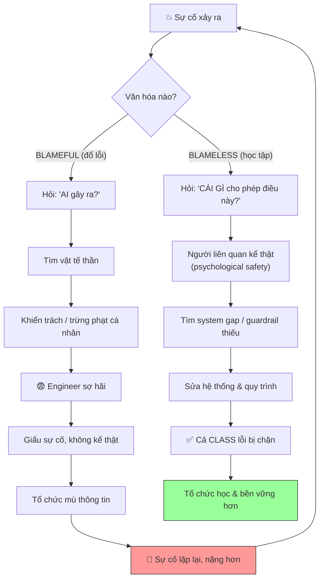

# Postmortem blameless nghĩa là gì?

## ⚡ Tóm tắt ngắn (30s)
* **Bản chất**: Postmortem **blameless** (không đổ lỗi) là triết lý phân tích sự cố do Google SRE phổ biến, dựa trên giả định nền tảng: **con người không gây ra sự cố vì cẩu thả hay ngu dốt, mà vì hệ thống cho phép sai lầm đó xảy ra**. Thay vì hỏi "ai gây ra?", ta hỏi "hệ thống/quy trình nào đã cho phép một người có ý tốt vẫn tạo ra kết quả tệ?". Mục tiêu là **học tập và cải tiến hệ thống**, không phải trừng phạt. Nền tảng tâm lý là **psychological safety** — chỉ khi an toàn thì người ta mới dám kể thật chuyện gì đã xảy ra.
* **Thảm họa thực chiến được giải quyết**:
  1. **Văn hóa che giấu (Cover-up Culture)**: Khi postmortem đổ lỗi cá nhân, lần sau engineer giấu sự cố, không báo cáo, không kể thật → tổ chức mù thông tin, sự cố nhỏ tích tụ thành thảm họa lớn.
  2. **Sửa triệu chứng thay vì hệ thống (Scapegoating)**: Đổ lỗi "anh A gõ nhầm", sa thải/khiển trách A, nhưng hệ thống vẫn cho phép gõ nhầm → người B sẽ lặp lại y hệt.
* **Quyết định Senior**:
  1. **Hỏi "what & how", không hỏi "who"**: Tập trung vào chuỗi sự kiện và lỗ hổng hệ thống, không vào danh tính người bấm nút.
  2. **Coi human error là triệu chứng, không phải nguyên nhân**: Mỗi "lỗi người" là một dấu hiệu của một guardrail còn thiếu.
  3. **Tạo psychological safety**: Người liên quan được mời kể lại trung thực mà không sợ hậu quả, vì lời kể của họ là dữ liệu quý nhất.

---

## 🔍 Chi tiết bản chất thực chiến: Nguyên lý của blameless postmortem

### Giả định nền tảng: con người làm điều hợp lý với thông tin họ có
* Trong khoảnh khắc đó, người thực hiện hành động tin rằng mình đang làm đúng, dựa trên thông tin, công cụ và áp lực họ có. Nếu kết quả tệ, lỗi nằm ở chỗ **hệ thống đã đặt họ vào vị trí dễ sai** — UI gây nhầm lẫn, thiếu xác nhận, thiếu test, runbook mơ hồ, áp lực thời gian.
* Đây là sự khác biệt giữa **"blame" (đổ lỗi cá nhân)** và **"accountability" (trách nhiệm cải tiến hệ thống)**. Blameless KHÔNG có nghĩa là không-trách-nhiệm; nó chuyển trách nhiệm từ "trừng phạt người" sang "sửa hệ thống".

### Từ "Human Error" đến "System Gap" — phép dịch chuyển tư duy
```
❌ TƯ DUY ĐỔ LỖI (blameful)          ✅ TƯ DUY BLAMELESS
─────────────────────────           ──────────────────────────────
"A gõ nhầm lệnh xóa DB"        →     "Tại sao một lệnh xóa DB production
                                     chạy được mà không cần xác nhận
                                     hai bước / không có dry-run?"
"B deploy thứ Sáu gây sự cố"   →     "Tại sao pipeline cho phép deploy
                                     không có canary / auto-rollback?"
"C quên tắt feature flag"      →     "Tại sao không có checklist tự động
                                     / nhắc nhở flag tồn đọng?"
```

### Vòng tròn xói mòn của văn hóa đổ lỗi (vì sao blame phản tác dụng)
* Đổ lỗi → người ta sợ → giấu sự cố & không kể thật → tổ chức mất dữ liệu → không học được → sự cố lặp lại nặng hơn → lại đổ lỗi. Blame tạo ra **chính xác môi trường sinh ra nhiều sự cố hơn**.

### Liên hệ "Just Culture" và mô hình phân biệt hành vi
* Blameless không có nghĩa "không bao giờ có hậu quả với bất kỳ ai". **Just Culture** phân biệt: lỗi do hệ thống (human error → sửa hệ thống), hành vi liều lĩnh có ý thức bỏ qua quy trình an toàn (at-risk/reckless → mới xem xét trách nhiệm cá nhân). Đại đa số sự cố thuộc nhóm đầu.

---

## 🎨 Sơ đồ trực quan: Tư duy blameless vs blameful



---

## 💻 Code thực chiến: Cách viết phần Root Cause theo lối blameless (artifact)

So sánh cùng một sự cố được viết theo hai cách — đây là minh họa rõ nhất bản chất blameless.

### Artifact: Root Cause — ❌ BLAMEFUL vs ✅ BLAMELESS
```markdown
# ❌ CÁCH VIẾT ĐỔ LỖI (sai)
Root cause: Bạn An đã chạy nhầm lệnh migration trên production thay vì
staging. An cần cẩn thận hơn lần sau. Đã nhắc nhở An.
=> VẤN ĐỀ: quy kết cá nhân, action vô dụng ("cẩn thận hơn"),
   hệ thống KHÔNG đổi => người khác sẽ lặp lại y hệt.

# ✅ CÁCH VIẾT BLAMELESS (đúng)
Root cause: Công cụ migration dùng CHUNG một biến môi trường cho cả
staging và production, mặc định trỏ production. Không có:
  - xác nhận tên môi trường trước khi chạy
  - dry-run bắt buộc
  - phân tách credential staging/prod
=> Bất kỳ ai ở vị trí đó, với cùng công cụ, đều có thể vô tình chạy
   trên prod. Đây là lỗ hổng HỆ THỐNG, không phải lỗi cá nhân.

Contributing factors (Swiss cheese — các lớp đã thủng):
  1. Tool không hỏi xác nhận môi trường.
  2. Credential prod/staging không tách biệt.
  3. Áp lực thời gian (đang xử lý ticket gấp).
  4. Không có review cho lệnh thủ công trên prod.
```

### Artifact: Action item suy ra trực tiếp từ system gap
```markdown
| # | System gap | Action (sửa hệ thống, không "nhắc nhở người") | Owner |
|---|-----------|-----------------------------------------------|-------|
| 1 | Tool không xác nhận env | Bắt nhập tên env + gõ "PRODUCTION" để confirm | @binh |
| 2 | Credential chung | Tách credential prod/staging, prod cần break-glass | @chau |
| 3 | Không dry-run | Mặc định --dry-run, phải thêm --apply mới chạy thật | @binh |
| 4 | Lệnh thủ công không review | Migration chỉ chạy qua pipeline có phê duyệt | @an |
```

---

## 📊 Bảng so sánh: Postmortem Blameful vs Blameless

| Tiêu chí | ❌ Blameful (đổ lỗi) | ✅ Blameless (không đổ lỗi) |
| :--- | :--- | :--- |
| **Câu hỏi trung tâm** | "Ai gây ra sự cố này?" | "Cái gì trong hệ thống cho phép nó xảy ra?" |
| **Coi human error là** | Nguyên nhân gốc, cần trừng phạt. | Triệu chứng của một system gap. |
| **Kết quả với con người** | Khiển trách, sợ hãi, che giấu. | An toàn tâm lý, kể thật, hợp tác. |
| **Action item** | "Cẩn thận hơn" — vô dụng. | Sửa hệ thống — chặn cả class lỗi. |
| **Luồng thông tin** | Bị bóp nghẹt, sự cố bị giấu. | Cởi mở, mọi sự cố được báo cáo & học. |
| **Hiệu ứng dài hạn** | Sự cố lặp lại, tổ chức mong manh. | Hệ thống bền vững hơn sau mỗi lần. |
| **Trách nhiệm (accountability)** | Trừng phạt cá nhân. | Trách nhiệm cải tiến hệ thống tập thể. |

---

## ⚠️ Common Gotchas & Questions follow-up

### 1. Cạm bẫy "Blameless giả tạo (Performative Blamelessness)"
* **Vấn đề**: Tổ chức tuyên bố "chúng tôi làm postmortem blameless" nhưng trong cuộc họp vẫn có ánh mắt soi mói, câu hỏi mỉa mai "sao lúc đó không nghĩ tới?", và sau đó người liên quan vẫn bị ảnh hưởng đánh giá hiệu suất. Blameless trên giấy nhưng blameful trong thực tế còn tệ hơn không có gì — vì nó phá vỡ niềm tin: lần sau không ai dám kể thật vì biết "blameless" chỉ là vỏ bọc.
* **Giải pháp**: (1) **Facilitator trung lập** điều phối, cắt ngang ngay khi có câu hỏi mang tính quy kết, lái về "hệ thống nào cho phép?". (2) **Tách bạch tuyệt đối postmortem khỏi đánh giá hiệu suất/lương thưởng** — và nói rõ điều này. (3) **Lãnh đạo làm gương**: khi chính lãnh đạo công khai kể về sai lầm của mình một cách blameless, văn hóa mới thật. (4) **Người gây ra sự cố thường là người viết/trình bày postmortem** — đây là tín hiệu mạnh rằng họ được tin tưởng, không bị trừng phạt, biến trải nghiệm thành đóng góp.

### 2. Câu hỏi đào sâu từ interviewer
* **Q: "Blameless có nghĩa là không ai chịu trách nhiệm gì cả à? Nếu một người liên tục cẩu thả, bỏ qua quy trình an toàn thì sao?"**
* **Trả lời**:
  * Đây là hiểu lầm phổ biến nhất; blameless KHÔNG đồng nghĩa với không-trách-nhiệm:
    1. **Blameless ≠ accountability-less**: Blameless loại bỏ việc *đổ lỗi và trừng phạt cá nhân cho một sai sót trung thực*, nhưng vẫn giữ *trách nhiệm tập thể cải tiến hệ thống*. Mọi action item đều có owner chịu trách nhiệm thực hiện — đó chính là accountability.
    2. **Just Culture phân biệt loại hành vi**: Khung Just Culture chia hành vi thành ba mức: **human error** (nhầm lẫn trung thực → sửa hệ thống, an ủi người); **at-risk behavior** (lách quy trình vì tưởng an toàn → huấn luyện, làm rõ rủi ro); và **reckless behavior** (cố ý bỏ qua quy trình an toàn dù biết rõ rủi ro → đây mới là lúc xem xét trách nhiệm cá nhân/kỷ luật).
    3. **Phần lớn sự cố là human error**: Trong thực tế, gần như mọi sự cố production rơi vào nhóm đầu — người có ý tốt bị hệ thống đặt vào thế dễ sai. Vì vậy mặc định blameless là đúng cho đa số trường hợp.
    4. **Lặp lại là tín hiệu của system gap, không phải tính xấu**: Nếu MỘT người "liên tục cẩu thả", câu hỏi blameless là: tại sao hệ thống cho phép một người lặp lại cùng lỗi nhiều lần mà không có guardrail chặn? Có thể họ thiếu đào tạo, công cụ tồi, hoặc khối lượng việc quá tải. Chỉ khi loại trừ hết các yếu tố hệ thống mà vẫn là cố ý liều lĩnh, mới chuyển sang xử lý cá nhân — và đó là ngoại lệ hiếm, không phải mặc định.
