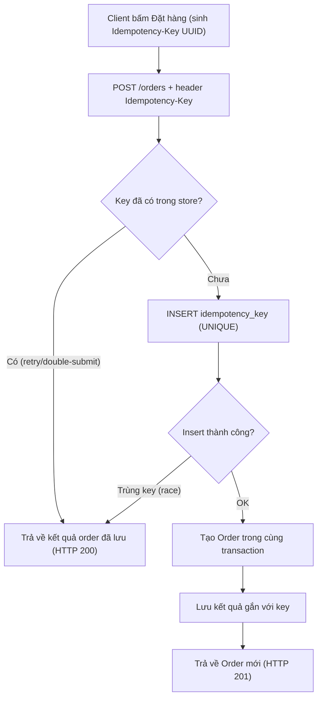

# Order bị tạo 2 lần: nguyên nhân có thể là gì, fix ngắn hạn/dài hạn ra sao?

## ⚡ Tóm tắt ngắn (30s)
* **Bản chất**: "Duplicate Order" gần như luôn là hệ quả của một thao tác **không idempotent** bị thực thi lại. Cùng một ý định nghiệp vụ (1 lần bấm "Đặt hàng") nhưng tạo ra 2 bản ghi vật lý trong DB. Một Senior Engineer không hỏi "ai sai" mà hỏi: "Request thứ 2 đến từ đâu, và tại sao hệ thống không nhận ra nó là bản sao của request thứ nhất?".
* **Các nguyên nhân gốc rễ thường gặp**:
  1. **Client double-submit**: User bấm nút 2 lần do mạng chậm, hoặc double-click; nút submit không bị disable sau cú bấm đầu.
  2. **Client/Gateway retry trên timeout**: Backend xử lý mất 8 giây, client timeout ở 5 giây và **tự retry**. Request đầu vẫn chạy ngầm và commit thành công → 2 order. Đây là thủ phạm phổ biến nhất ở môi trường production.
  3. **At-least-once delivery của message queue**: Order được tạo từ một consumer Kafka/SQS. Khi consumer crash sau khi xử lý nhưng trước khi commit offset, message được redeliver → tạo lại order.
  4. **Load balancer / API Gateway retry**: Nginx/Envoy cấu hình `retry on 5xx` hoặc `connection reset` cũng nhân đôi request ghi.
* **Quyết định Senior**:
  1. **Fix dài hạn (root cause)**: Áp **Idempotency Key** do client sinh (UUID), kết hợp **UNIQUE constraint** ở DB làm lá chắn vật lý cuối cùng. Mọi giải pháp khác chỉ là vá tạm.
  2. **Fix ngắn hạn (cầm máu)**: Thêm unique index trên "business key" (ví dụ `(user_id, cart_hash, created_minute)`) để chặn ngay; disable nút submit; tắt retry mù ở gateway cho endpoint ghi.

---

## 🔍 Chi tiết bản chất thực chiến: Cách điều tra & vá lỗi

### Quy trình debug có cấu trúc (đừng đoán mò)
1. **Khoanh vùng bằng dữ liệu**: Query 2 order trùng, so sánh `created_at` (cách nhau mili-giây hay vài giây?), `request_id`/`trace_id`, `client_ip`, `user_agent`. Nếu 2 order có **cùng trace_id** → retry trong cùng một luồng (gateway/client retry). Nếu **khác trace_id nhưng cách nhau mili-giây** → double-submit của user.
2. **Truy log gateway/LB**: Kiểm tra access log của Nginx/Envoy xem có 2 request `POST /orders` không, và có dòng `upstream_retry` không.
3. **Soi consumer queue** (nếu order tạo qua queue): Kiểm tra số lần message được deliver, offset commit có bị reset không.
4. **Tái hiện**: Dùng `curl` gửi 2 request song song cùng payload để xác nhận hệ thống không chống trùng.

### Tại sao "check rồi insert" KHÔNG cứu được
```java
if (orderRepo.existsByCartId(cartId)) return existing; // ❌ Vô dụng dưới đồng thời
orderRepo.save(newOrder);
```
Hai luồng cùng chạy `existsByCartId` trước khi luồng nào kịp `save` → cả hai đều thấy "chưa tồn tại" → cùng insert. Đây là lỗi **Check-then-Act** kinh điển. Chỉ có ràng buộc ở tầng DB (UNIQUE) hoặc khóa mới giải quyết triệt để.

### Idempotency Key hoạt động thế nào
* Client sinh một `Idempotency-Key` (UUID) cho **mỗi ý định đặt hàng**, gửi qua header.
* Server lưu key này cùng kết quả xử lý. Nếu key đã tồn tại → trả lại **kết quả cũ** thay vì tạo order mới.
* Khác biệt mấu chốt: key gắn với "ý định", nên dù client retry bao nhiêu lần với cùng key, kết quả vẫn là một order duy nhất.

---

## 🎨 Sơ đồ: Luồng chống trùng order bằng Idempotency Key



---

## 💻 Code thực chiến: BAD vs GOOD

### ❌ BAD: Không idempotent, tin tưởng client gửi đúng 1 lần
```java
@PostMapping("/orders")
public OrderResponse create(@RequestBody CreateOrderRequest req) {
    // ❌ Mỗi request là một order mới. Retry = order mới.
    Order order = new Order(req.getUserId(), req.getItems(), req.getAmount());
    orderRepository.save(order);
    paymentClient.charge(order); // retry ở đây còn charge tiền 2 lần!
    return OrderResponse.from(order);
}
```

### ✅ GOOD: Idempotency Key + UNIQUE constraint làm lá chắn vật lý
```sql
-- Lá chắn vật lý: dù code có lỗi, DB vẫn từ chối bản ghi trùng
CREATE TABLE idempotency_keys (
    id_key       VARCHAR(64) PRIMARY KEY,   -- UUID client gửi
    user_id      BIGINT NOT NULL,
    order_id     BIGINT,                     -- kết quả đã lưu
    response_body TEXT,
    created_at   TIMESTAMP DEFAULT now()
);
-- Phòng tuyến 2: chặn trùng theo business key
ALTER TABLE orders ADD CONSTRAINT uq_order_idem UNIQUE (idempotency_key);
```

```java
@Service
@RequiredArgsConstructor
public class OrderService {

    private final OrderRepository orderRepository;
    private final IdempotencyRepository idemRepository;

    @Transactional
    public OrderResponse create(String idemKey, CreateOrderRequest req) {
        // 1. Đã xử lý trước đó? Trả lại kết quả cũ (idempotent)
        var existing = idemRepository.findById(idemKey);
        if (existing.isPresent()) {
            return OrderResponse.fromJson(existing.get().getResponseBody());
        }

        try {
            // 2. Chiếm chỗ key trước — UNIQUE PK chặn race condition
            idemRepository.insertNew(idemKey, req.getUserId());

            // 3. Tạo order trong cùng transaction
            Order order = new Order(req.getUserId(), req.getItems(), req.getAmount());
            order.setIdempotencyKey(idemKey);
            orderRepository.save(order);

            OrderResponse resp = OrderResponse.from(order);
            idemRepository.saveResult(idemKey, order.getId(), resp.toJson());
            return resp;

        } catch (DataIntegrityViolationException raceLost) {
            // 4. Luồng song song đã chiếm key — đọc lại kết quả của nó
            return OrderResponse.fromJson(
                idemRepository.findById(idemKey).orElseThrow().getResponseBody());
        }
    }
}
```

---

## 📊 Bảng so sánh: Nguyên nhân vs Triệu chứng vs Cách xác minh

| Nguyên nhân gốc | Triệu chứng đặc trưng | Cách xác minh | Fix ngắn hạn | Fix dài hạn |
| :--- | :--- | :--- | :--- | :--- |
| **Client double-submit** | 2 order khác trace_id, cách nhau vài trăm ms, cùng user-agent | So `trace_id` + `created_at` của 2 order | Disable nút submit sau click | Idempotency-Key sinh từ client |
| **Client/gateway retry trên timeout** | 2 order **cùng trace_id**, order đầu xử lý lâu | Đối chiếu log gateway + thời gian xử lý backend | Tắt retry mù cho endpoint ghi | Idempotency-Key + timeout tuning |
| **Queue at-least-once redelivery** | 2 order từ cùng message, lệch khi consumer crash | Đếm delivery count, soi offset commit | Tăng `max.poll` timeout | Idempotent consumer (dedup theo messageId) |
| **LB/Envoy retry 5xx** | 2 order khi backend trả 5xx tạm thời | Soi `upstream_retry` trong access log | Bỏ retry cho POST | Chỉ retry GET/idempotent verb |

---

## ⚠️ Common Gotchas & Questions follow-up

### 1. Cạm bẫy "Unique constraint nhưng app nuốt lỗi"
* **Vấn đề**: Có UNIQUE index rồi nhưng code bắt `DataIntegrityViolationException` và... trả về lỗi 500 cho user. User thấy lỗi, bấm lại lần nữa, lần này nghĩ là chưa đặt được → trải nghiệm tệ, support ngập đơn khiếu nại "tôi bị trừ tiền mà không thấy đơn".
* **Giải pháp**: Khi bắt lỗi trùng, **không phải báo lỗi** mà phải **đọc lại order đã tồn tại và trả về như thành công** (HTTP 200 + order cũ). Idempotency đúng nghĩa là "gọi lại trả cùng kết quả", không phải "gọi lại báo lỗi".

### 2. Câu hỏi đào sâu từ interviewer
* **Interviewer: "Idempotency key lưu ở Redis cho nhanh, hay ở DB? Nếu Redis thì sao đảm bảo atomic với việc tạo order ở Postgres?"**
* **Trả lời**:
  1. **Nguyên tắc**: Idempotency key và việc tạo order phải nằm trong **cùng một ranh giới giao dịch (atomic boundary)**. Nếu key ở Redis còn order ở Postgres, ta có 2 datastore → mất tính nguyên tử, dễ rơi vào cảnh "key đã set nhưng order chưa kịp tạo do crash".
  2. **Khuyến nghị**: Lưu idempotency key **cùng DB với order** (bảng `idempotency_keys`), tận dụng transaction của Postgres để key và order commit/rollback cùng nhau.
  3. **Khi nào dùng Redis**: Chỉ dùng Redis làm **lớp lọc nhanh phía trước** (fast-path reject) để giảm tải DB, nhưng **DB UNIQUE vẫn là nguồn chân lý cuối cùng (source of truth)**. Không bao giờ dựa duy nhất vào Redis cho tính đúng đắn vì Redis có thể mất key khi failover (non-persistent).
