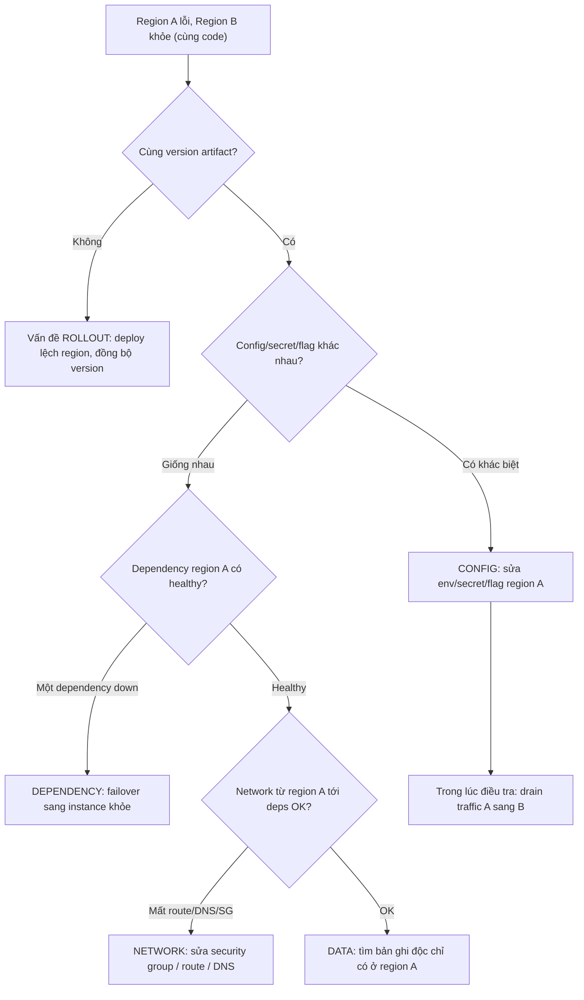

# Một region bị lỗi, region khác bình thường: config, data, network hay dependency?

## ⚡ Tóm tắt ngắn (30s)
* **Bản chất**: Cùng một codebase, cùng artifact deploy, nhưng **region A lỗi còn region B khỏe**. Đây là dấu hiệu vàng: lỗi **không nằm ở code** (vì code giống hệt nhau), mà nằm ở **thứ gì đó khác biệt giữa hai region**. Senior lập tức thu hẹp phạm vi vào "what's different per region" thay vì lao vào đọc code nghiệp vụ.
* **Bốn nghi phạm khác biệt theo region**:
  1. **Config**: Biến môi trường, secret, endpoint, feature flag khác nhau giữa region (DB host sai, key hết hạn ở 1 region).
  2. **Data**: Dữ liệu khác nhau — region A có một bản ghi "độc" gây crash, hoặc migration chạy lệch, schema version khác.
  3. **Network**: Region A mất kết nối tới một dependency (firewall, security group, DNS, route, peering down).
  4. **Dependency**: Một service/DB/cache mà region A phụ thuộc đang down, trong khi region B dùng instance khác vẫn sống.
* **Quyết định Senior**:
  1. **So sánh có hệ thống (diff per region)**: config, version, health của dependency, kết nối mạng — tìm điểm khác biệt.
  2. **Cầm máu trước**: Nếu là region đang phục vụ user, **failover/drain traffic** sang region khỏe (DNS/global LB) để cắt ảnh hưởng, rồi điều tra nguội.

---

## 🔍 Chi tiết bản chất thực chiến: Phương pháp "what's different"

### Quy trình debug có cấu trúc
1. **Xác nhận đối xứng**: Có chắc 2 region chạy **cùng version artifact** không? Deploy có thể đã tới region B mà chưa tới A (hoặc ngược lại) → thực ra là vấn đề rollout, không phải region.
2. **So config**: Diff toàn bộ env/secret/feature-flag giữa A và B. Đây là nguyên nhân **phổ biến nhất** — một endpoint, một key, một flag khác nhau.
3. **Kiểm tra dependency của riêng region A**: DB region A, cache region A, downstream service region A — cái nào unhealthy? Mỗi region thường có bản sao dependency riêng.
4. **Test network từ trong region A**: Từ pod region A, thử kết nối tới từng dependency (`curl`, `telnet`, DNS resolve). Region A có thể mất route/security-group tới một service.
5. **Soi data-specific**: Nếu config + network + dependency đều ổn → nghi một **bản ghi dữ liệu độc** chỉ có ở region A gây lỗi xử lý.

### Vì sao bắt đầu từ config
Code giống nhau loại trừ logic bug. Trong các khác biệt còn lại, **config sai là dễ xảy ra và dễ kiểm tra nhất**: một lần deploy quên cập nhật secret ở region A, một feature flag bật nhầm, một DB connection string trỏ sai. Bắt đầu từ config cho tỉ lệ trúng cao với chi phí điều tra thấp.

### Bẫy "deploy lệch region" giả dạng region issue
Rất hay gặp: pipeline deploy tuần tự region B trước, region A sau. Trong cửa sổ giữa hai lần, region A chạy **code cũ** còn B chạy **code mới**. Triệu chứng "1 region lỗi" thực ra là "1 region chưa được deploy bản fix" hoặc "bản mới lỗi mới tới B". Luôn kiểm tra version hash trước tiên.

---

## 🎨 Sơ đồ: Khoanh vùng lỗi theo region



---

## 💻 Code thực chiến: BAD vs GOOD

### ❌ BAD: Config cứng, không health check dependency, không degrade
```java
@Configuration
public class AppConfig {
    // ❌ Hardcode endpoint, không phân biệt region → 1 region trỏ sai là chết
    public static final String PAYMENT_URL = "https://payment-east.internal";

    @Bean
    public PaymentClient paymentClient() {
        // ❌ Không timeout, không fallback → dependency region chết kéo sập cả app
        return new PaymentClient(PAYMENT_URL);
    }
}
```

### ✅ GOOD: Config theo region + health check + circuit breaker fail-fast
```java
@Configuration
@RequiredArgsConstructor
public class AppConfig {

    // Endpoint lấy từ config theo region, không hardcode
    @Value("${region.id}") private String regionId;
    @Value("${payment.url}") private String paymentUrl;

    @Bean
    public PaymentClient paymentClient() {
        return PaymentClient.builder()
                .baseUrl(paymentUrl)               // khác nhau theo region
                .connectTimeout(Duration.ofSeconds(2))
                .readTimeout(Duration.ofSeconds(3)) // fail nhanh khi region deps chậm
                .build();
    }
}

@Service
@RequiredArgsConstructor
public class PaymentFacade {

    private final PaymentClient paymentClient;

    // Circuit breaker: nếu dependency region A hỏng, fail-fast + fallback
    @CircuitBreaker(name = "payment", fallbackMethod = "fallback")
    public PaymentResult charge(ChargeRequest req) {
        return paymentClient.charge(req);
    }

    private PaymentResult fallback(ChargeRequest req, Throwable t) {
        // Degrade có kiểm soát thay vì sập: đẩy vào hàng đợi xử lý sau / báo lỗi rõ
        log.error("Payment dependency down in region, degrading", t);
        return PaymentResult.queuedForRetry(req.getId());
    }
}
```

```yaml
# Health check phân biệt từng dependency để định vị region nào hỏng cái gì
management:
  endpoint:
    health:
      group:
        readiness:
          include: db, redis, paymentService, kafka  # mỗi deps một indicator
  health:
    region:
      id: ${REGION_ID}   # đưa region vào health output để dashboard tách bạch
```

---

## 📊 Bảng so sánh: Nghi phạm vs Triệu chứng vs Cách xác minh

| Nghi phạm | Triệu chứng | Cách xác minh | Fix nhanh | Fix dài hạn |
| :--- | :--- | :--- | :--- | :--- |
| **Rollout lệch version** | Lỗi biến mất sau khi A deploy xong | So version hash A vs B | Đồng bộ deploy | Canary + health gate per region |
| **Config khác biệt** | Lỗi kết nối/auth chỉ ở A | Diff env/secret/flag | Sửa config region A | Config as code, kiểm tra drift |
| **Data độc** | Lỗi chỉ với một số request/bản ghi ở A | Tái hiện với data region A | Cô lập/sửa bản ghi | Validation đầu vào + schema check |
| **Network** | Timeout/connection refused tới deps | `curl`/DNS từ pod region A | Mở SG/route/DNS | IaC quản lý network, alert peering |
| **Dependency down** | Health của 1 deps region A đỏ | Health endpoint per dependency | Failover deps | Multi-AZ deps + circuit breaker |

---

## ⚠️ Common Gotchas & Questions follow-up

### 1. Cạm bẫy "Đổ lỗi cho code và đọc nghiệp vụ hàng giờ"
* **Vấn đề**: Khi sự cố nổ ra, phản xạ tự nhiên là mở code nghiệp vụ tìm bug. Nhưng nếu **code giống hệt nhau ở 2 region mà chỉ A lỗi**, đọc code là lãng phí thời gian vàng — bug logic sẽ lỗi ở **cả hai** region. Tín hiệu "bất đối xứng theo region" gần như loại trừ logic bug.
* **Giải pháp**: Kỷ luật điều tra: khi triệu chứng bất đối xứng (region/tenant/nhóm user), **bắt đầu từ cái khác biệt giữa hai bên**, không phải từ cái giống nhau (code). Tiết kiệm hàng giờ.

### 2. Câu hỏi đào sâu từ interviewer
* **Interviewer: "Region A hỏng dependency. Bạn failover traffic sang B. Nhưng B giờ gánh gấp đôi tải. Rủi ro gì và bạn chuẩn bị thế nào?"**
* **Trả lời**:
  1. **Rủi ro cascading failure**: Region B vốn chỉ sized cho tải của nó. Nhận gấp đôi đột ngột có thể làm B quá tải và sập theo → mất cả hai region (sự cố lan rộng).
  2. **Chuẩn bị capacity headroom**: Mỗi region nên có dư công suất (ví dụ chạy ở 50% để chịu được khi gánh thêm region kia). Đây là chi phí của high availability đa region.
  3. **Failover có kiểm soát**: Không dồn 100% tức thì mà **drain dần** + bật **auto-scaling** ở B trước. Kết hợp **load shedding** (ưu tiên request quan trọng, từ chối request ít quan trọng) để B không sập. Sau sự cố, chạy **game day** mô phỏng mất region để kiểm chứng B thật sự gánh nổi.
