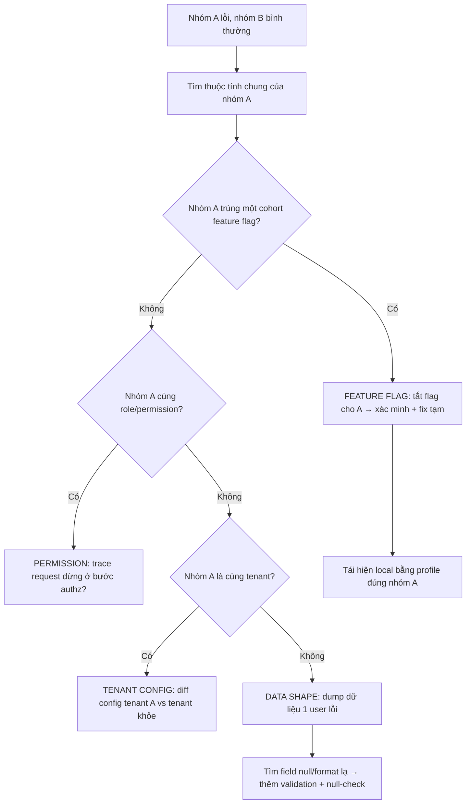

# Một nhóm user bị lỗi, nhóm khác không: feature flag, permission, data shape hay tenant config?

## ⚡ Tóm tắt ngắn (30s)
* **Bản chất**: Lỗi **phân tầng theo nhóm user** (group A lỗi, group B bình thường) trên cùng một hệ thống là tín hiệu vàng: nguyên nhân nằm ở **thứ phân biệt nhóm này với nhóm kia**, không phải ở code chung. Cũng giống bài toán "1 region lỗi", Senior tìm "what's different per group" thay vì đọc code nghiệp vụ chung (vì bug chung sẽ lỗi mọi user).
* **Bốn nghi phạm khác biệt theo nhóm**:
  1. **Feature flag**: Một flag bật cho nhóm A (theo % rollout, theo tenant, theo cohort) kích hoạt code path lỗi mà nhóm B chưa chạm tới.
  2. **Permission/role**: Nhóm A có role/scope khác → đi vào nhánh authz bị lỗi, hoặc thiếu quyền gọi một dependency.
  3. **Data shape**: Dữ liệu của nhóm A có hình dạng khác — field null, giá trị ngoài enum, ký tự unicode, list rỗng — làm code crash (NPE, parse error) chỉ với họ.
  4. **Tenant config**: Trong hệ multi-tenant, mỗi tenant có cấu hình riêng (currency, locale, integration endpoint, limit). Config tenant A sai/thiếu gây lỗi cục bộ.
* **Quyết định Senior**: **Phân khúc (segment) triệu chứng** theo flag/role/tenant/data để khoanh vùng, rồi xác minh bằng cách tái hiện với đúng "profile" của nhóm lỗi.

---

## 🔍 Chi tiết bản chất thực chiến: Phân khúc để khoanh vùng

### Quy trình debug có cấu trúc
1. **Định nghĩa chính xác "nhóm lỗi"**: Nhóm A là ai? Cùng tenant? Cùng role? Cùng cohort feature flag? Cùng đặc điểm dữ liệu (user tạo trước 2020, user có địa chỉ nước ngoài)? Tìm **thuộc tính chung** của nhóm lỗi là 80% lời giải.
2. **Đối chiếu feature flag**: Nhóm A có flag nào bật mà B không? Tắt thử flag cho A xem hết lỗi không (cách xác minh nhanh + cũng là fix tạm).
3. **So role/permission**: Nhóm A có role gì khác? Trace một request lỗi xem dừng ở bước authz hay ở nghiệp vụ.
4. **Soi data shape**: Lấy một user lỗi cụ thể, dump dữ liệu của họ, tìm field bất thường (null, format lạ). Tái hiện local với chính dữ liệu đó.
5. **Kiểm tra tenant config**: Nếu nhóm = tenant, diff config tenant A vs tenant khỏe.

### Vì sao tái hiện theo "profile nhóm lỗi" là then chốt
Bug chỉ xảy ra với nhóm A vì input/context của họ khác. Nếu bạn test với tài khoản admin của mình (profile khác A) sẽ **không bao giờ tái hiện được** → tưởng "không sửa được" hay "không tái hiện". Phải dựng một test account **đúng đặc điểm của nhóm lỗi** (cùng role, cùng flag, cùng kiểu data) mới lộ bug.

### Data shape — thủ phạm âm thầm phổ biến
Code chạy tốt với "dữ liệu đẹp" của đa số user, nhưng nhóm nhỏ có dữ liệu "xấu": tên có emoji, số điện thoại format khác, address quốc tế thiếu mã bưu chính, một list optional bị null. Code thiếu null-check / validation crash đúng nhóm này. Đây là lý do "đa số ổn, thiểu số lỗi".

---

## 🎨 Sơ đồ: Khoanh vùng lỗi theo nhóm user



---

## 💻 Code thực chiến: BAD vs GOOD

### ❌ BAD: Giả định data shape, không phòng thủ flag/tenant
```java
public InvoiceView render(User user) {
    // ❌ Giả định address luôn có postalCode → nhóm user quốc tế thiếu field → NPE
    String zip = user.getAddress().getPostalCode().trim();

    // ❌ Bật code path mới cho flag mà không xử lý dữ liệu cũ của cohort đó
    if (featureFlags.isOn("NEW_TAX_ENGINE", user)) {
        return newTaxEngine.compute(user); // nhóm bật flag mà thiếu tax config → crash
    }
    return legacy.compute(user, zip);
}
```

### ✅ GOOD: Phòng thủ data shape + flag an toàn + tenant config có default
```java
@Service
@RequiredArgsConstructor
public class InvoiceService {

    private final FeatureFlags featureFlags;
    private final TenantConfigRepository tenantConfigRepo;
    private final NewTaxEngine newTaxEngine;
    private final LegacyTaxEngine legacy;

    public InvoiceView render(User user) {
        // 1. Phòng thủ data shape: không giả định field tồn tại
        String zip = Optional.ofNullable(user.getAddress())
                .map(Address::getPostalCode)
                .map(String::trim)
                .orElse("");  // nhóm thiếu zip vẫn render được

        // 2. Tenant config có giá trị mặc định an toàn, không null
        TenantConfig cfg = tenantConfigRepo.findByTenant(user.getTenantId())
                .orElseGet(TenantConfig::defaults);

        // 3. Feature flag: chỉ bật nhánh mới khi điều kiện tiên quyết đủ
        if (featureFlags.isOn("NEW_TAX_ENGINE", user) && cfg.hasTaxRules()) {
            try {
                return newTaxEngine.compute(user, cfg);
            } catch (Exception e) {
                // Fallback an toàn cho cohort mới thay vì để cả nhóm lỗi
                log.error("New tax engine failed for tenant {}, fallback", user.getTenantId(), e);
                return legacy.compute(user, cfg, zip);
            }
        }
        return legacy.compute(user, cfg, zip);
    }
}
```

```java
// Log/metric có gắn segment để tách bạch nhóm lỗi trên dashboard
@Component
public class RequestTagger {
    public void tag(User user) {
        MDC.put("tenant", user.getTenantId());
        MDC.put("role", user.getRole());
        MDC.put("flags", featureFlags.activeFor(user)); // dễ phân khúc lỗi theo nhóm
    }
}
```

---

## 📊 Bảng so sánh: Nghi phạm vs Triệu chứng vs Cách xác minh

| Nghi phạm | Triệu chứng | Cách xác minh | Fix nhanh | Fix dài hạn |
| :--- | :--- | :--- | :--- | :--- |
| **Feature flag** | Nhóm lỗi trùng cohort % rollout | Tắt flag cho nhóm → hết lỗi | Tắt/giảm rollout flag | Flag có fallback + test cả 2 nhánh |
| **Permission/role** | Lỗi 403 hoặc thiếu dữ liệu theo role | Trace dừng ở authz | Sửa role mapping | Test authz cho mọi role |
| **Data shape** | Lỗi NPE/parse với một số user | Dump data user lỗi, tìm field lạ | Null-check chỗ crash | Validation đầu vào + schema |
| **Tenant config** | Cả tenant lỗi, tenant khác ổn | Diff config tenant | Sửa/điền config tenant | Default an toàn + validate config |

---

## ⚠️ Common Gotchas & Questions follow-up

### 1. Cạm bẫy "Không tái hiện được nên đóng ticket"
* **Vấn đề**: Dev test bằng tài khoản của mình (admin, tenant nội bộ, data sạch), không thấy lỗi, kết luận "không tái hiện được / do client" và đóng ticket. Nhưng nhóm user thật vẫn lỗi hằng ngày vì họ có **profile khác** (role thường, tenant khác, data thật lộn xộn).
* **Giải pháp**: Quy tắc: **tái hiện phải dùng đúng profile của nhóm lỗi**. Tạo test account cùng role/flag/tenant, hoặc (an toàn, có kiểm soát) impersonate một user nhóm lỗi ở môi trường staging với bản sao dữ liệu của họ. Không bao giờ kết luận "không tái hiện" khi chưa dựng đúng context.

### 2. Câu hỏi đào sâu từ interviewer
* **Interviewer: "Lỗi chỉ xảy ra với khoảng 3% user, rải rác không theo tenant hay role rõ ràng. Bạn khoanh vùng kiểu gì?"**
* **Trả lời**:
  1. **Khi không có segment hiển nhiên, để dữ liệu tự lộ pattern**: Thu thập tập user lỗi, rồi **phân tích thuộc tính chung** một cách định lượng — so phân phối của nhóm lỗi vs nhóm khỏe trên nhiều chiều (ngày tạo account, app version, locale, có/không một field, độ dài dữ liệu).
  2. **Thường lộ ra một chiều ẩn**: ví dụ "3% lỗi đều là user dùng app version cũ chưa gửi field mới", hoặc "đều có tên chứa ký tự non-ASCII", hoặc "đều thuộc shard DB số 7 đang có vấn đề".
  3. **Công cụ**: Dùng structured logging + có thể query (MDC tag như code trên) để pivot nhanh; nếu cần, lấy mẫu vài chục user lỗi và soi thủ công tìm điểm chung. Bản chất là **bài toán phân khúc dữ liệu**, không phải đọc code.
