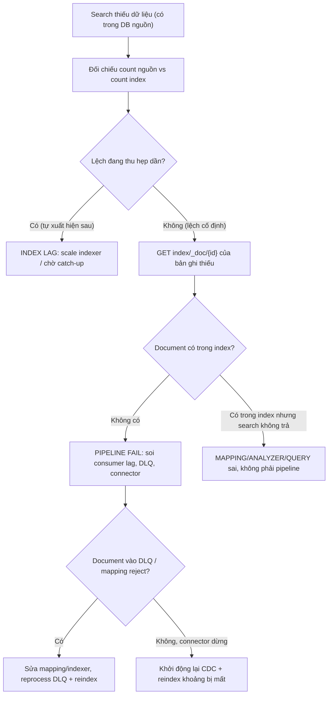

# Search result thiếu dữ liệu: index async lag hay pipeline fail?

## ⚡ Tóm tắt ngắn (30s)
* **Bản chất**: Dữ liệu **có trong DB nguồn nhưng không xuất hiện trong kết quả search** (Elasticsearch/OpenSearch/Solr). Vì search index gần như luôn được cập nhật **bất đồng bộ** từ nguồn (qua CDC, queue, hoặc batch reindex), thiếu dữ liệu rơi vào hai họ nguyên nhân:
  1. **Index async lag (tạm thời)**: Pipeline vẫn chạy nhưng **chậm/đang backlog** — bản ghi mới chưa kịp index. Dữ liệu sẽ xuất hiện sau vài giây/phút. Đây là **vấn đề độ trễ**, tự lành.
  2. **Pipeline fail (vĩnh viễn)**: Một mắt xích của đường đồng bộ **gãy** — consumer chết, message vào DLQ, mapping reject document, CDC dừng. Dữ liệu **không bao giờ** xuất hiện cho tới khi sửa pipeline. Đây là **vấn đề đứt gãy**.
* **Cách phân biệt nhanh**:
  * Lag → dữ liệu **cũ** đã có trong index, chỉ **bản ghi mới nhất** thiếu, và xuất hiện dần theo thời gian.
  * Fail → một **khoảng thời gian/loại bản ghi** thiếu hẳn và **không tự xuất hiện**; index lag metric không giảm hoặc error rate pipeline tăng.
* **Quyết định Senior**: Đối chiếu **count nguồn vs count index** + soi **pipeline health (lag, DLQ, error)** để phân biệt, rồi: chờ/scale nếu là lag, hoặc fix mắt xích + **reindex** nếu là fail.

---

## 🔍 Chi tiết bản chất thực chiến: Lag vs Fail

### Quy trình debug có cấu trúc
1. **Đối chiếu nguồn vs index**: Đếm bản ghi trong DB nguồn và trong index cho cùng điều kiện. Lệch nhỏ và đang thu hẹp → lag. Lệch lớn/cố định → fail.
2. **Tra một bản ghi cụ thể bị thiếu**: Lấy ID bản ghi user báo thiếu. Query thẳng index bằng ID (`GET /index/_doc/{id}`).
   * Không có → chưa được index (lag hoặc fail trên đường ghi).
   * Có nhưng search không trả → vấn đề **query/mapping/analyzer**, không phải pipeline (ví dụ field không được index, analyzer cắt token sai).
3. **Soi pipeline health**: Consumer lag của topic CDC, DLQ size, error log của indexer, trạng thái connector (Debezium/Logstash).
4. **Kiểm tra mapping reject**: ES trả lỗi khi document sai kiểu (gửi string vào field number) → document bị **drop im lặng** nếu indexer nuốt lỗi.

### Phân biệt "không index được" vs "index rồi nhưng search sai"
Đây là rẽ nhánh quan trọng. Nếu document **có** trong index (`_doc/{id}` trả về) mà search vẫn thiếu, vấn đề **không phải pipeline** mà là:
* **Mapping**: field bị set `index: false` hoặc không phân tích → không khớp truy vấn.
* **Analyzer**: text được tokenize khác giữa lúc index và lúc query → không match.
* **Query**: filter/permission trong query loại bản ghi đó ra.

Nhầm hai nhánh này dẫn tới "sửa pipeline mãi không hết" trong khi lỗi nằm ở mapping.

### Vì sao pipeline fail thường im lặng
Indexer hay bắt exception rồi `log.warn` và **ack message** (coi như xong) để "không chặn luồng". Hậu quả: document lỗi bị bỏ qua vĩnh viễn, không vào DLQ, không alert. Search thiếu dữ liệu mà không có dấu vết. Đây là anti-pattern phổ biến nhất gây "pipeline fail âm thầm".

---

## 🎨 Sơ đồ: Chẩn đoán search thiếu dữ liệu



---

## 💻 Code thực chiến: BAD vs GOOD

### ❌ BAD: Indexer nuốt lỗi, không DLQ, ack mọi message
```java
@KafkaListener(topics = "product-cdc", groupId = "indexer")
public void index(ProductEvent e) {
    try {
        esClient.index(toDocument(e)); // ❌ nếu mapping reject → ném exception
    } catch (Exception ex) {
        log.warn("index failed for {}", e.getId()); // ❌ nuốt lỗi → mất document vĩnh viễn
    }
    // message vẫn được ack → không bao giờ retry, không vào DLQ
}
```

### ✅ GOOD: Bubble lỗi để retry/DLQ + đối chiếu count + reindex
```java
@Component
@RequiredArgsConstructor
public class ProductIndexer {

    private final ElasticsearchClient esClient;

    @KafkaListener(topics = "product-cdc", groupId = "indexer")
    public void index(ProductEvent e, Acknowledgment ack) {
        try {
            esClient.index(i -> i.index("products").id(e.getId()).document(toDocument(e)));
            ack.acknowledge(); // chỉ ack khi index thật sự thành công
        } catch (ElasticsearchException mappingError) {
            // Lỗi mapping/dữ liệu xấu → KHÔNG ack mù; đẩy vào DLQ để điều tra + alert
            throw new IndexingException("Document rejected: " + e.getId(), mappingError);
        }
    }
}
```

```java
// Job đối soát: phát hiện lệch nguồn vs index để biết pipeline có gãy không
@Component
@RequiredArgsConstructor
public class IndexReconciliationJob {

    private final ProductRepository sourceRepo;
    private final ElasticsearchClient esClient;
    private final ProductIndexer indexer;

    @Scheduled(fixedDelay = 600_000) // mỗi 10 phút
    public void reconcile() throws IOException {
        long sourceCount = sourceRepo.countActive();
        long indexCount = esClient.count(c -> c.index("products")).count();
        if (sourceCount - indexCount > THRESHOLD) {
            log.error("Index drift detected: source={} index={}", sourceCount, indexCount);
            // Tìm các ID có ở nguồn mà thiếu ở index → reindex bù
            List<String> missing = sourceRepo.findIdsNotIn(indexedIds());
            missing.forEach(id -> indexer.reindexById(id));
        }
    }
}
```

---

## 📊 Bảng so sánh: Index lag vs Pipeline fail vs Mapping sai

| Tiêu chí | Index LAG | Pipeline FAIL | Mapping/Query sai |
| :--- | :--- | :--- | :--- |
| **Dữ liệu tự xuất hiện sau?** | Có, sau vài giây/phút | Không bao giờ | Không (document có nhưng query không khớp) |
| **`_doc/{id}` trong index?** | Chưa có (đang tới) | Không có | **Có** |
| **Count nguồn vs index** | Lệch nhỏ, thu hẹp | Lệch lớn cố định | Khớp (vấn đề ở truy vấn) |
| **Pipeline metric** | Consumer lag cao tạm thời | DLQ tăng / connector dừng / error | Bình thường |
| **Fix** | Scale indexer, chờ catch-up | Sửa mắt xích + reprocess DLQ + reindex | Sửa mapping/analyzer/query, reindex |

---

## ⚠️ Common Gotchas & Questions follow-up

### 1. Cạm bẫy "Reindex toàn bộ mỗi khi thiếu dữ liệu"
* **Vấn đề**: Thấy search thiếu, phản xạ là "reindex full" cả index hàng trăm triệu document. Việc này **rất tốn tài nguyên**, kéo dài hàng giờ, tăng tải DB nguồn + ES, và **không giải quyết nguyên nhân gốc** — nếu pipeline vẫn gãy, reindex xong lại thiếu tiếp.
* **Giải pháp**: Trước hết **sửa mắt xích gãy** (consumer/connector/mapping), rồi chỉ **reindex phần thiếu** (theo khoảng thời gian/ID bị ảnh hưởng) qua đối soát count như code GOOD. Reindex full chỉ là phương án cuối khi index hỏng cấu trúc, và nên dùng **alias + reindex sang index mới rồi swap** để không downtime.

### 2. Câu hỏi đào sâu từ interviewer
* **Interviewer: "User vừa tạo bản ghi xong search ngay không thấy, nhưng 5 giây sau thì thấy. Đây có phải bug không, và xử lý thế nào?"**
* **Trả lời**:
  1. **Không phải bug, đây là bản chất near-real-time của search index** (ES refresh interval mặc định 1s + độ trễ pipeline async). Search **không** đảm bảo read-your-writes tức thì như DB giao dịch.
  2. **Nếu nghiệp vụ cần "tạo xong thấy ngay"**: đừng đọc từ index cho luồng đó. **Read-your-writes** bằng cách query thẳng DB nguồn cho bản ghi user vừa tạo (hiển thị ngay), còn search dùng cho duyệt/tìm kiếm chung chấp nhận độ trễ nhỏ.
  3. **Quản lý kỳ vọng**: Đặt **SLO độ trễ index** (ví dụ p99 < 5s) và giám sát nó. Nếu độ trễ vượt SLO mới coi là sự cố (lag bất thường); còn vài giây là chấp nhận được và nên thiết kế UX phù hợp (thông báo "đang cập nhật").
