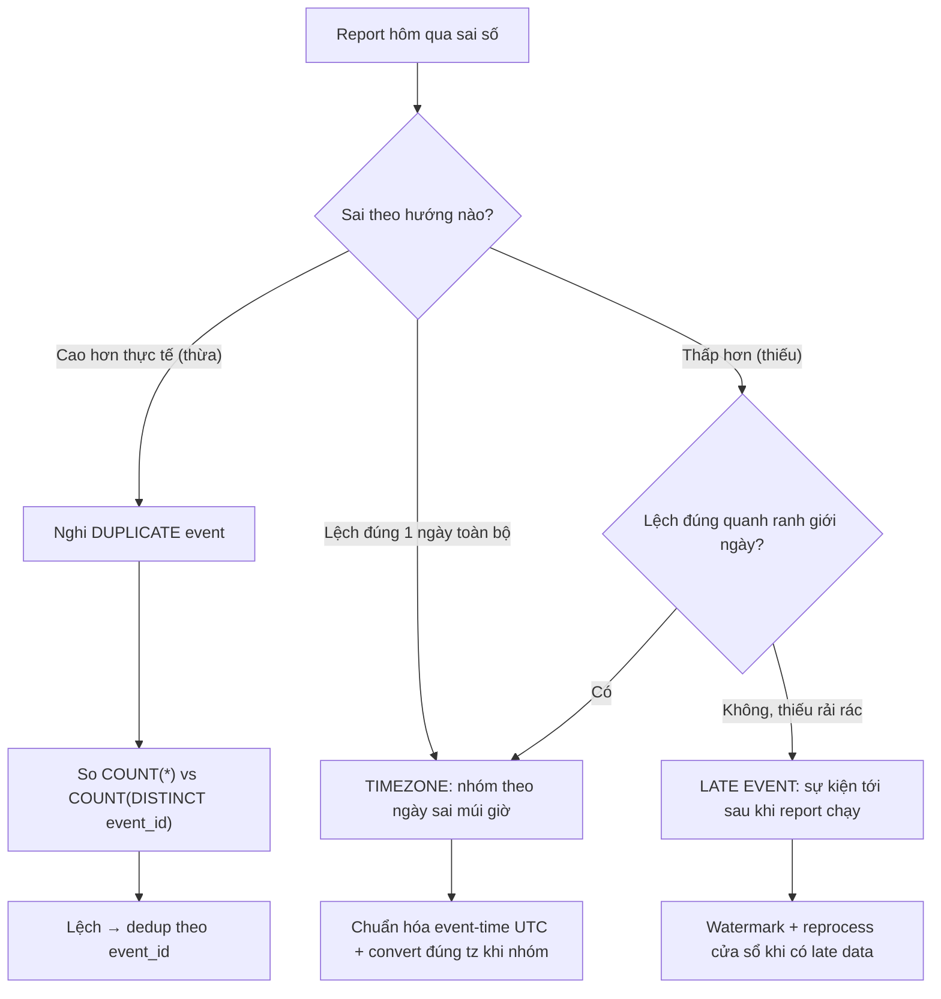

# Report sai số liệu hôm qua: timezone, late event hay duplicate event?

## ⚡ Tóm tắt ngắn (30s)
* **Bản chất**: Report tổng hợp (doanh thu, số đơn, DAU...) ngày hôm qua ra **sai số** so với thực tế. Vì report là kết quả **gom nhóm sự kiện theo cửa sổ thời gian**, sai số gần như luôn đến từ ba thủ phạm liên quan tới "sự kiện rơi vào sai ô thời gian hoặc bị đếm sai số lần":
  1. **Timezone**: Sự kiện lưu UTC nhưng report nhóm theo giờ địa phương (hoặc ngược lại). Một đơn lúc 23:30 ngày 1 (giờ VN, UTC+7) bị tính sang ngày 1 UTC khác → lệch ngày → sai tổng ngày.
  2. **Late event**: Sự kiện thật phát sinh hôm qua nhưng **tới hệ thống muộn** (mobile offline, retry, queue lag) sau khi report đã chạy → bị thiếu (under-count), hoặc bị tính vào hôm nay (sai ngày).
  3. **Duplicate event**: Cùng một sự kiện được ghi nhiều lần (at-least-once delivery, client retry) → đếm vượt (over-count).
* **Cách phân biệt hướng lệch**:
  * Thiếu (under) → nghi **late event** hoặc **timezone đẩy sự kiện ra khỏi cửa sổ**.
  * Thừa (over) → nghi **duplicate event**.
* **Quyết định Senior**: Lưu sự kiện với **event-time chuẩn UTC + timezone tách bạch**, xử lý **late data bằng watermark + reprocess**, và **dedup theo event_id** để đếm chính xác.

---

## 🔍 Chi tiết bản chất thực chiến: Ba thủ phạm

### Quy trình debug có cấu trúc
1. **Xác định hướng lệch**: Report cao hơn hay thấp hơn thực tế? Cao → duplicate. Thấp → thiếu (late/timezone). Lệch đúng một "ngày" → gần như chắc timezone.
2. **Chọn vài bản ghi nghi ngờ và truy ngược**: Lấy một giao dịch ở **ranh giới ngày** (gần nửa đêm). Xem `event_time` lưu kiểu gì (có timezone không?), report nhóm theo cột nào, convert ở đâu.
3. **Đối chiếu raw event vs aggregate**: Đếm trực tiếp từ bảng sự kiện thô với điều kiện thời gian rõ ràng, so với con số report. Lệch ở đâu lộ thủ phạm ở đó.
4. **Soi dedup**: Có `event_id` duy nhất không? Có `COUNT(DISTINCT event_id)` hay `COUNT(*)`?
5. **Soi thời điểm report chạy vs arrival của event**: Report chạy 0h05 nhưng event hôm qua tới lúc 0h10 → bị bỏ sót (late).

### Timezone — lỗi tinh vi và phổ biến nhất
Hai cái bẫy:
* **Lưu local time không kèm offset**: `2024-01-01 23:30` không biết là giờ nào → không thể nhóm đúng.
* **Nhóm theo timezone khác lúc ghi**: Lưu UTC, nhưng `GROUP BY DATE(event_time)` lấy ngày UTC trong khi nghiệp vụ cần ngày theo giờ VN. Đơn 23:30 ngày 1 (VN) = 16:30 ngày 1 UTC → may mắn đúng ngày; nhưng đơn 06:30 ngày 2 (VN) = 23:30 ngày 1 UTC → bị tính nhầm sang ngày 1. Lệch ngày một cách hệ thống.

### Late event — bản chất của dữ liệu phân tán
Event-time (lúc sự kiện thật xảy ra) khác processing-time (lúc hệ thống nhận). Mobile offline gửi event chậm vài giờ; queue backlog đẩy event trễ. Nếu report nhóm theo **processing-time**, một sự kiện hôm qua tới hôm nay bị tính sai ngày. Nếu nhóm theo **event-time nhưng chạy report quá sớm**, late event chưa tới → thiếu.

---

## 🎨 Sơ đồ: Truy nguyên report sai số liệu



---

## 💻 Code thực chiến: BAD vs GOOD

### ❌ BAD: Local time mơ hồ, đếm trùng, nhóm theo processing-time
```java
// ❌ Lưu thời gian không kèm timezone, dùng giờ server
event.setTime(LocalDateTime.now()); // server ở đâu? UTC hay VN? không ai biết
eventRepository.save(event);
```
```sql
-- ❌ COUNT(*) đếm cả bản ghi trùng; DATE() theo timezone của DB session (mơ hồ)
SELECT DATE(created_at) AS day, COUNT(*) AS orders, SUM(amount) AS revenue
FROM order_events
WHERE created_at >= '2024-01-01' AND created_at < '2024-01-02'
GROUP BY DATE(created_at);
```

### ✅ GOOD: UTC chuẩn + event_id dedup + nhóm theo timezone nghiệp vụ
```java
@Entity
public class OrderEvent {
    @Id
    private String eventId;        // ✅ ID duy nhất để dedup (idempotent ingest)

    private Instant eventTime;     // ✅ event-time chuẩn UTC (lúc sự kiện thật xảy ra)
    private Instant ingestTime;    // ✅ tách processing-time để phát hiện late

    private BigDecimal amount;
}

@Service
@RequiredArgsConstructor
public class EventIngestService {
    private final OrderEventRepository repo;

    // Idempotent ingest: insert theo eventId, trùng thì bỏ qua → chống duplicate
    @Transactional
    public void ingest(OrderEvent e) {
        if (repo.existsById(e.getEventId())) return;
        e.setEventTime(e.getEventTime());            // đã là Instant (UTC)
        e.setIngestTime(Instant.now());
        try {
            repo.save(e);
        } catch (DataIntegrityViolationException dup) {
            // race: bản ghi trùng eventId vừa được insert → bỏ qua, idempotent
        }
    }
}
```
```sql
-- ✅ Nhóm theo NGÀY GIỜ VIỆT NAM, đếm DISTINCT event_id (chống trùng)
SELECT (event_time AT TIME ZONE 'Asia/Ho_Chi_Minh')::date AS day_vn,
       COUNT(DISTINCT event_id) AS orders,
       SUM(amount)             AS revenue
FROM order_events
WHERE event_time >= TIMESTAMP '2024-01-01 00:00' AT TIME ZONE 'Asia/Ho_Chi_Minh'
  AND event_time <  TIMESTAMP '2024-01-02 00:00' AT TIME ZONE 'Asia/Ho_Chi_Minh'
GROUP BY (event_time AT TIME ZONE 'Asia/Ho_Chi_Minh')::date;
```

---

## 📊 Bảng so sánh: Thủ phạm vs Triệu chứng vs Cách xác minh

| Thủ phạm | Hướng lệch | Triệu chứng đặc trưng | Cách xác minh | Fix |
| :--- | :--- | :--- | :--- | :--- |
| **Timezone** | Lệch đúng 1 ngày / quanh nửa đêm | Sai có hệ thống ở ranh giới ngày | Soi event ở 23:00–01:00, so ngày UTC vs local | Lưu UTC, nhóm theo tz nghiệp vụ rõ ràng |
| **Late event** | Thiếu (under) | Số tăng dần khi chạy lại report sau | So thời điểm report chạy vs ingestTime | Watermark + reprocess cửa sổ |
| **Duplicate event** | Thừa (over) | `COUNT(*) > COUNT(DISTINCT id)` | So hai count | Dedup theo event_id, idempotent ingest |

---

## ⚠️ Common Gotchas & Questions follow-up

### 1. Cạm bẫy "Report chạy quá sớm rồi không bao giờ chạy lại"
* **Vấn đề**: Report ngày hôm qua chạy lúc 0h05. Nhưng dữ liệu vẫn còn "chảy vào": late event từ mobile offline, queue backlog, retry — có thể tới trong vài giờ sau nửa đêm. Report đã "chốt sổ" quá sớm và **không bao giờ tính lại**, nên vĩnh viễn thiếu các sự kiện đến muộn. Càng có nhiều user offline (mobile), sai số càng lớn.
* **Giải pháp**: Áp khái niệm **watermark + lateness window**. Coi report là **kết quả có thể chỉnh lại (mutable/restatable)**: chạy bản sơ bộ lúc 0h, rồi **reprocess lại** sau một cửa sổ trễ (ví dụ chốt cứng sau 24–48h khi đã chắc dữ liệu ổn định). Hiển thị rõ "số liệu sơ bộ" vs "đã chốt" cho người đọc report.

### 2. Câu hỏi đào sâu từ interviewer
* **Interviewer: "Hệ thống phục vụ user nhiều múi giờ. Một user ở Mỹ, một ở VN. 'Doanh thu ngày hôm qua' nên tính theo múi giờ nào?"**
* **Trả lời**:
  1. **Không có một câu trả lời đúng tuyệt đối — phải định nghĩa nghiệp vụ rõ ràng**. Thường có hai chuẩn: (a) **một timezone cố định của doanh nghiệp** (ví dụ tất cả report theo giờ trụ sở) cho báo cáo tài chính nhất quán; hoặc (b) **theo timezone của từng user/cửa hàng** cho báo cáo vận hành cục bộ.
  2. **Nguyên tắc kỹ thuật bất biến**: luôn **lưu event-time ở UTC** (Instant), và **chỉ convert sang timezone mong muốn ở tầng truy vấn/hiển thị**. Không bao giờ lưu local time trần. Như vậy cùng dữ liệu có thể tổng hợp theo bất kỳ múi giờ nào mà không sai lệch.
  3. **Tài liệu hóa**: Ghi rõ trong định nghĩa metric "doanh thu ngày = theo timezone X" để mọi người đọc report hiểu cùng một thứ — phần lớn tranh cãi "số liệu sai" thực ra là **bất đồng về định nghĩa cửa sổ ngày**, không phải bug code.
