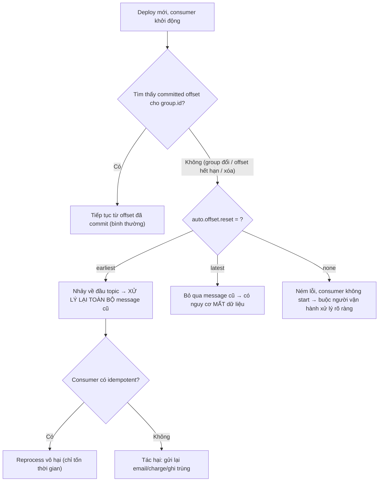

# Deploy mới làm consumer xử lý lại toàn bộ message cũ: offset commit sai?

## ⚡ Tóm tắt ngắn (30s)
* **Bản chất**: Sau khi deploy, consumer bỗng **đọc lại từ đầu topic** (reprocess toàn bộ message lịch sử). Đây gần như luôn là vấn đề về **vị trí offset của consumer group bị mất hoặc bị reset**, kết hợp với cấu hình `auto.offset.reset=earliest`. Khi consumer không tìm thấy offset đã commit cho group của nó, nó **fallback về `auto.offset.reset`**: `earliest` → nhảy về đầu topic (reprocess tất cả); `latest` → bỏ qua message cũ (mất dữ liệu). Triệu chứng "xử lý lại toàn bộ" = đã rơi vào nhánh `earliest`.
* **Các nguyên nhân gốc làm mất offset**:
  1. **Đổi `group.id`** (vô tình qua config/env khi deploy): group mới chưa có offset → reset theo `auto.offset.reset=earliest`.
  2. **Offset bị hết hạn/xóa**: `offsets.retention.minutes` hết hạn trong lúc consumer down lâu (cuối tuần) → broker xóa offset → reset.
  3. **Commit sai cơ chế**: bật `enable.auto.commit` nhưng crash trước khi commit, hoặc code seek về đầu, hoặc đổi từ tên topic/partition mapping.
* **Quyết định Senior**: **Giữ nguyên `group.id`**, đặt `auto.offset.reset=latest` (hoặc `none` để fail rõ ràng) cho consumer không idempotent, và **commit thủ công sau khi xử lý**. Quan trọng nhất: consumer phải **idempotent** để reprocess không gây tác hại.

---

## 🔍 Chi tiết bản chất thực chiến: Cơ chế offset

### Quy trình debug có cấu trúc
1. **So `group.id` trước/sau deploy**: Diff config. Nếu group đổi (kể cả thêm prefix/suffix do template env) → đây là nguyên nhân số một.
2. **Kiểm tra offset của group ở broker**: `kafka-consumer-groups.sh --describe --group <id>`. Xem `CURRENT-OFFSET` có bị về 0 / về `earliest` không.
3. **Soi `auto.offset.reset`**: Nếu = `earliest` và offset bị mất → giải thích trọn vẹn việc reprocess toàn bộ.
4. **Kiểm tra thời gian consumer down**: Có lâu hơn `offsets.retention.minutes` không (mặc định 7 ngày, có cụm chỉnh ngắn hơn)? Down qua kỳ nghỉ dài có thể vượt retention.
5. **Soi cách commit**: auto-commit hay manual? Crash có thể commit hụt.

### Vì sao `auto.offset.reset` chỉ là "phương án dự phòng"
Nhiều người hiểu nhầm `auto.offset.reset` điều khiển consumer đọc từ đâu mỗi lần chạy. **Sai**. Nó **chỉ có tác dụng khi không có offset đã commit hợp lệ** cho group. Bình thường consumer luôn tiếp tục từ offset đã commit. Chỉ khi offset mất (group mới, offset hết hạn, partition mới) thì mới fallback về giá trị này. Vì vậy `earliest` chỉ "vô hại" cho tới ngày offset bị mất — rồi nó replay toàn bộ.

### Đổi group.id — cái bẫy deploy âm thầm
`group.id` thường lấy từ biến môi trường/template. Một thay đổi tưởng vô hại — đổi tên service, thêm namespace, sửa Helm value — làm `group.id` khác đi. Với Kafka, group mới = **chưa từng tồn tại** = không có offset = reset theo `earliest`. Toàn bộ topic được xử lý lại. Đây là lý do "deploy xong tự nhiên reprocess".

---

## 🎨 Sơ đồ: Vì sao deploy gây reprocess toàn bộ



---

## 💻 Code thực chiến: BAD vs GOOD

### ❌ BAD: group.id từ env dễ đổi + earliest + auto-commit + không idempotent
```java
@KafkaListener(
    topics = "payments",
    // ❌ group.id ghép từ nhiều biến → một thay đổi deploy là đổi group → reset
    groupId = "${app.name}-${app.version}-payments"
)
public void consume(PaymentEvent e) {
    // ❌ auto-commit bật mặc định; ❌ không idempotent
    emailService.sendReceipt(e.getUserId());   // reprocess → gửi lại hàng triệu email!
    ledgerService.record(e);                    // reprocess → ghi sổ trùng
}
```

### ✅ GOOD: group.id ổn định + manual commit + idempotent consumer
```java
@Configuration
public class KafkaConsumerConfig {

    @Bean
    public ConcurrentKafkaListenerContainerFactory<String, PaymentEvent> factory(
            ConsumerFactory<String, PaymentEvent> cf) {
        var f = new ConcurrentKafkaListenerContainerFactory<String, PaymentEvent>();
        f.setConsumerFactory(cf);
        // ✅ Commit thủ công SAU khi xử lý xong, không auto-commit
        f.getContainerProperties().setAckMode(ContainerProperties.AckMode.MANUAL);
        return f;
    }
}
```
```yaml
spring:
  kafka:
    consumer:
      # ✅ group.id CỐ ĐỊNH, KHÔNG gắn version/biến hay đổi
      group-id: payment-processor
      enable-auto-commit: false
      # ✅ none: nếu mất offset thì FAIL rõ ràng để người vận hành quyết định,
      #    tránh âm thầm replay toàn bộ. (latest nếu chấp nhận bỏ message cũ)
      auto-offset-reset: none
```
```java
@Component
@RequiredArgsConstructor
public class PaymentConsumer {

    private final ProcessedEventRepository processedRepo; // bảng dedup theo eventId
    private final EmailService emailService;
    private final LedgerService ledgerService;

    @KafkaListener(topics = "payments", groupId = "payment-processor")
    public void consume(PaymentEvent e, Acknowledgment ack) {
        // ✅ Idempotent: nếu đã xử lý eventId này thì bỏ qua → reprocess vô hại
        if (processedRepo.existsById(e.getEventId())) {
            ack.acknowledge();
            return;
        }
        ledgerService.record(e);
        emailService.sendReceipt(e.getUserId());
        processedRepo.markProcessed(e.getEventId()); // đánh dấu đã xử lý
        ack.acknowledge();                            // commit offset sau cùng
    }
}
```

---

## 📊 Bảng so sánh: Nguyên nhân mất offset vs Triệu chứng vs Fix

| Nguyên nhân | Triệu chứng | Cách xác minh | Fix |
| :--- | :--- | :--- | :--- |
| **Đổi `group.id`** | Reprocess toàn bộ ngay sau deploy | Diff config, `--describe` thấy group mới | Khóa group.id cố định, không gắn version |
| **Offset hết hạn (retention)** | Reprocess sau khi down lâu (nghỉ lễ) | So downtime vs `offsets.retention.minutes` | Tăng retention / heartbeat giữ group sống |
| **`auto.offset.reset=earliest`** | Mọi lần mất offset đều replay từ đầu | Đọc config consumer | Đặt `latest`/`none` + idempotent |
| **Auto-commit + crash** | Reprocess một phần message gần nhất | Soi log crash quanh commit | Manual commit sau xử lý |

---

## ⚠️ Common Gotchas & Questions follow-up

### 1. Cạm bẫy "earliest vô hại cho tới ngày nó không vô hại"
* **Vấn đề**: `auto.offset.reset=earliest` chạy êm hàng tháng vì offset luôn tồn tại, nên team coi nó "an toàn". Rồi một ngày consumer down qua kỳ nghỉ dài, offset hết hạn bị broker xóa, consumer khởi động lại và **replay 6 tháng message** — gửi lại hàng triệu email, charge lại, ghi sổ trùng. Thảm họa đến từ một cấu hình "ngủ đông".
* **Giải pháp**: Với consumer **không idempotent**, đặt `auto.offset.reset=none` để khi mất offset thì **fail rõ ràng** (consumer không start, alert on-call) thay vì âm thầm replay. On-call sẽ quyết định seek tới đâu một cách có ý thức. Đồng thời, biến mọi consumer thành **idempotent** để biến reprocess từ "thảm họa" thành "chỉ tốn thời gian".

### 2. Câu hỏi đào sâu từ interviewer
* **Interviewer: "Bạn vừa lỡ deploy gây replay. Một số message đã xử lý lại và lỡ gửi email trùng. Bây giờ xử lý thế nào để dừng thiệt hại và phục hồi?"**
* **Trả lời**:
  1. **Dừng thiệt hại ngay (cầm máu)**: **Pause/stop consumer** lập tức để ngừng reprocess thêm. Mỗi giây chạy tiếp là thêm email/charge trùng.
  2. **Đưa offset về đúng vị trí**: Dùng `kafka-consumer-groups.sh --reset-offsets --to-datetime <thời điểm trước sự cố>` (hoặc `--to-offset`) cho group, sau khi xác định offset đúng mà consumer **đã xử lý tới** trước khi reset. Việc này khôi phục vị trí để không xử lý lại phần đã chạy đúng.
  3. **Khắc phục gốc + idempotency**: Sửa nguyên nhân (khóa group.id, đổi `auto.offset.reset`), và triển khai **bảng dedup theo eventId** để lần sau reprocess không gây side-effect. Với phần đã gửi trùng, đánh giá tác động (email thì xin lỗi; charge thì refund qua đối soát). Bài học cốt lõi: **at-least-once là mặc định của Kafka, nên consumer bắt buộc idempotent** — đó mới là phòng tuyến thật sự, không phải hy vọng offset không bao giờ mất.
