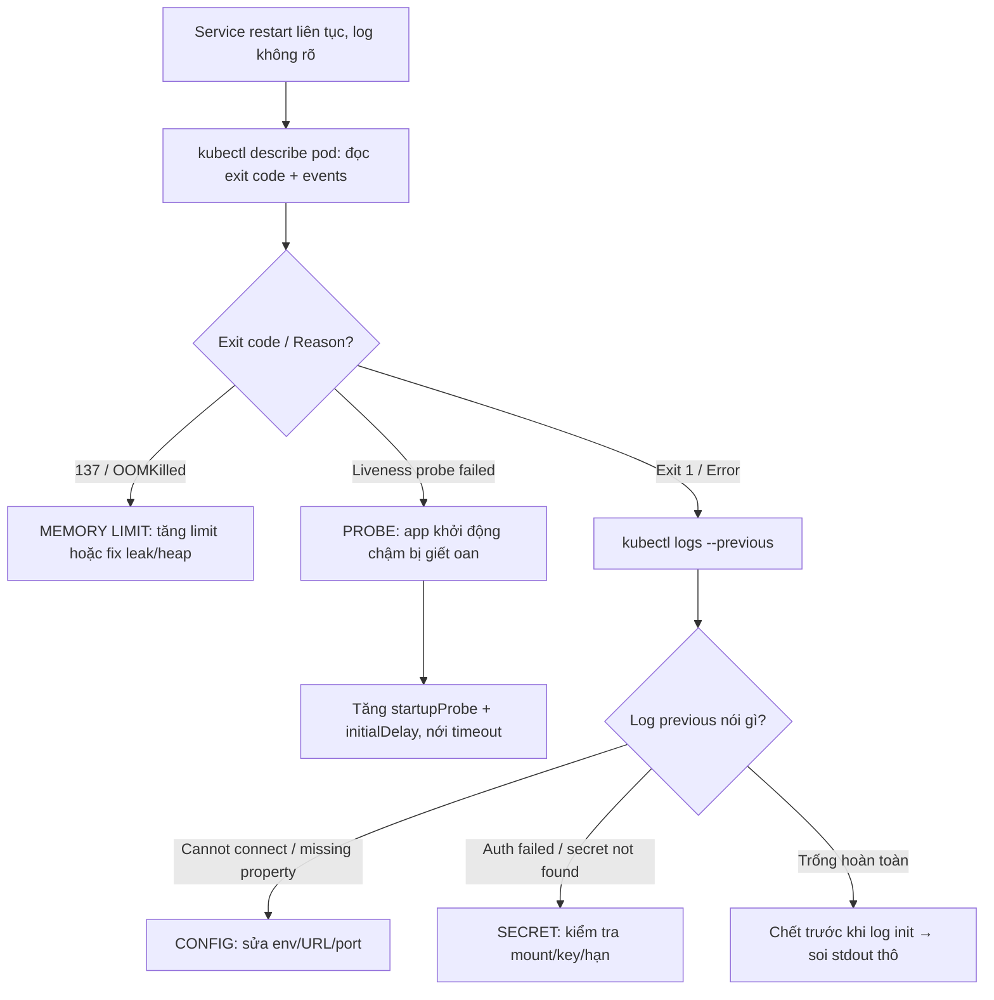

# Service restart liên tục nhưng log không rõ lỗi: startup probe, memory limit, config hay secret?

## ⚡ Tóm tắt ngắn (30s)
* **Bản chất**: Service bị restart lặp đi lặp lại (`CrashLoopBackOff` trong Kubernetes) nhưng **application log không cho thấy exception rõ ràng**. Log im lặng là manh mối: nó nghĩa là tiến trình thường **bị giết từ bên ngoài** (orchestrator/OS) **trước khi** app kịp log lỗi, hoặc chết **trước khi** logging được khởi tạo. Senior nhìn ra ngoài app log — vào **kubelet events, exit code, OOM killer, probe status** — vì sự thật nằm ở tầng hạ tầng.
* **Bốn nghi phạm chính**:
  1. **Startup/liveness probe sai**: Probe gọi `/health` quá sớm hoặc timeout quá ngắn; app khởi động chậm (warm-up JVM, load cache) chưa kịp ready → kubelet tưởng chết → **giết và restart** lặp lại. App "khỏe" nhưng bị giết oan.
  2. **Memory limit (OOMKilled)**: Container vượt `resources.limits.memory` → kernel OOM killer giết tiến trình bằng **SIGKILL (exit 137)**. SIGKILL không cho app cơ hội log gì → "log không rõ lỗi".
  3. **Config sai**: Thiếu/sai biến môi trường, URL, port → app fail fast lúc startup. Đôi khi lỗi bị nuốt hoặc in ra stderr không được thu thập.
  4. **Secret thiếu/sai**: Secret chưa mount, sai key, hết hạn → app không kết nối được DB/vault lúc khởi động → chết sớm trước khi logging sẵn sàng.
* **Quyết định Senior**: Đọc **`kubectl describe pod` + exit code + events + previous logs** để phân biệt "bị giết" (probe/OOM) vs "tự chết" (config/secret), rồi sửa đúng tầng.

---

## 🔍 Chi tiết bản chất thực chiến: Đọc tín hiệu hạ tầng

### Quy trình debug có cấu trúc
1. **`kubectl describe pod`**: Đọc `Last State` → `Reason` và **exit code**. Đây là bằng chứng vàng:
   * `OOMKilled` / exit **137** → memory limit.
   * `Error` exit **1** → app tự chết (thường config/secret/lỗi khởi động).
   * Liveness probe failed events → probe sai.
2. **`kubectl logs <pod> --previous`**: Log của lần chạy **trước khi** restart — chỗ này mới chứa lỗi thật (log hiện tại là lần khởi động mới chưa chết). Cực kỳ quan trọng vì "log không rõ" thường do nhìn nhầm log container đang chạy.
3. **Đọc Events**: `Liveness probe failed`, `Readiness probe failed`, `Back-off restarting`, `Failed to mount secret` — events nói thẳng nguyên nhân.
4. **Đo thời gian sống**: Pod chết sau **vài giây** (chưa kịp ready) → nghi config/secret/startup. Chết sau **vài phút dưới tải** → nghi OOM (memory tăng dần tới limit).

### Vì sao "log không rõ lỗi" lại là manh mối, không phải bế tắc
* **SIGKILL (OOM, exit 137)** giết tức thì, app **không có cơ hội** chạy shutdown hook hay log → đương nhiên log "sạch". Vắng lỗi chính là dấu hiệu bị giết từ ngoài.
* **Chết trước khi logging init**: Nếu config/secret sai làm app fail trong lúc khởi tạo (trước khi logback/log4j sẵn sàng), lỗi chỉ ra **stdout/stderr thô**, không vào log file/aggregator → "không thấy trong log" nhưng có trong `kubectl logs --previous`.

### Phân biệt "bị giết" vs "tự chết"
* **Bị giết** (probe/OOM): app vốn chạy được, nhưng orchestrator/kernel chấm dứt nó. Exit 137, events probe/OOM. Sửa ở **cấu hình hạ tầng** (probe timing, memory limit).
* **Tự chết** (config/secret): app **không khởi động nổi**, throw lúc bootstrap. Exit 1, log previous có stack trace "cannot connect", "missing property". Sửa ở **config/secret**.

---

## 🎨 Sơ đồ: Chẩn đoán CrashLoopBackOff



---

## 💻 Code thực chiến: BAD vs GOOD

### ❌ BAD: Probe quá khắt khe + không tách startup + heap = limit
```yaml
# ❌ Liveness gọi ngay sau 5s, app JVM warm-up mất 40s → bị giết trước khi ready
livenessProbe:
  httpGet: { path: /actuator/health, port: 8080 }
  initialDelaySeconds: 5
  periodSeconds: 5
  failureThreshold: 2        # ❌ chỉ 2 lần fail là restart → vòng lặp chết
resources:
  limits:
    memory: "512Mi"          # ❌ = đúng -Xmx → JVM + metaspace vượt → OOMKilled 137
```

### ✅ GOOD: startupProbe tách biệt + heap < limit + fail-fast rõ ràng cho config
```yaml
# ✅ startupProbe bảo vệ giai đoạn khởi động chậm; liveness chỉ chạy SAU khi started
startupProbe:
  httpGet: { path: /actuator/health/liveness, port: 8080 }
  initialDelaySeconds: 10
  periodSeconds: 5
  failureThreshold: 30        # cho phép tới 150s để khởi động xong (warm-up JVM)
livenessProbe:
  httpGet: { path: /actuator/health/liveness, port: 8080 }
  periodSeconds: 10
  failureThreshold: 3
readinessProbe:
  httpGet: { path: /actuator/health/readiness, port: 8080 }
  periodSeconds: 5
resources:
  requests: { memory: "512Mi" }
  limits:   { memory: "1Gi" }   # ✅ limit > heap để chừa metaspace, thread, off-heap
```
```java
// ✅ Validate config/secret lúc startup và LOG RÕ RÀNG trước khi fail
@Component
@RequiredArgsConstructor
public class StartupValidator {

    private final Environment env;

    @EventListener(ApplicationReadyEvent.class)
    public void validate() {
        requireProp("DB_URL");
        requireProp("DB_PASSWORD");   // secret bắt buộc
        log.info("Startup config validation passed");
    }

    private void requireProp(String key) {
        String v = env.getProperty(key);
        if (v == null || v.isBlank()) {
            // Log rõ ràng TRƯỚC khi fail → không còn "log không rõ lỗi"
            log.error("FATAL: required config/secret '{}' is missing", key);
            throw new IllegalStateException("Missing required config: " + key);
        }
    }
}
```
```java
// JVM nhận biết container memory limit để không tự vượt → tránh OOMKilled
// Thêm vào JAVA_OPTS:
//   -XX:MaxRAMPercentage=70.0   (heap tối đa 70% RAM container, chừa cho off-heap)
//   -XX:+ExitOnOutOfMemoryError  (chết dứt khoát + log thay vì treo)
```

---

## 📊 Bảng so sánh: Nghi phạm vs Triệu chứng vs Cách xác minh

| Nghi phạm | Exit code / Reason | Thời điểm chết | Cách xác minh | Fix |
| :--- | :--- | :--- | :--- | :--- |
| **Startup/liveness probe** | Liveness probe failed | Sau initialDelay, app vẫn warm-up | Events "probe failed", app thật ra healthy | startupProbe + nới timeout |
| **Memory limit** | 137 / OOMKilled | Sau vài phút dưới tải | `describe` thấy OOMKilled, dmesg OOM | Tăng limit / fix heap leak / MaxRAMPercentage |
| **Config sai** | 1 / Error | Vài giây sau start | `logs --previous`: missing property/URL | Sửa env/configmap |
| **Secret thiếu/sai** | 1 / Error hoặc mount fail | Lúc start / lúc connect | Events "secret not found", log auth failed | Mount đúng secret/key, gia hạn |

---

## ⚠️ Common Gotchas & Questions follow-up

### 1. Cạm bẫy "Nhìn nhầm log container đang chạy thay vì log lần chết"
* **Vấn đề**: On-call chạy `kubectl logs <pod>` thấy log "bình thường, đang khởi động" và kết luận "log không có lỗi". Nhưng đó là log của **lần khởi động mới nhất** (vừa restart, chưa kịp chết lại). Lỗi thật nằm ở **lần chạy trước** — đã bị xóa khỏi log hiện tại khi container restart. Đây là lý do số một khiến "log không rõ lỗi".
* **Giải pháp**: Luôn dùng `kubectl logs <pod> --previous` để xem log của **container đã chết**, nơi chứa stack trace thật. Kết hợp `kubectl describe pod` đọc `Last State`/exit code. Và đảm bảo log được **ship sang aggregator (Loki/ELK)** ngay khi sinh ra, để không mất log khi pod bị xóa — không bao giờ dựa vào log cục bộ của pod đã restart.

### 2. Câu hỏi đào sâu từ interviewer
* **Interviewer: "Pod OOMKilled (137) nhưng heap dump cho thấy heap chỉ dùng 60% -Xmx. Tại sao vẫn OOM, và bạn chỉnh gì?"**
* **Trả lời**:
  1. **Bộ nhớ JVM ≠ chỉ heap**: Container memory limit tính **toàn bộ** RSS của tiến trình = heap **+ metaspace + thread stacks + JIT code cache + direct/off-heap buffers (NIO, Netty) + native libs**. Heap 60% nhưng metaspace + off-heap (ví dụ nhiều thread, hoặc thư viện dùng `DirectByteBuffer`) đẩy tổng RSS vượt limit → kernel OOMKill, dù heap còn chỗ.
  2. **Chẩn đoán**: Bật **Native Memory Tracking** (`-XX:NativeMemoryTracking=summary`) để xem phân bổ off-heap; soi số thread (mỗi thread ~512KB–1MB stack); kiểm tra direct buffer (`-XX:MaxDirectMemorySize`).
  3. **Chỉnh**: Đặt **`-XX:MaxRAMPercentage`** thay vì `-Xmx` cứng để JVM tự chừa chỗ cho non-heap theo limit container; giới hạn thread pool và direct memory; và đặt **memory limit > heap một biên đủ lớn** (heap thường ~70–75% limit). Bài học: trong container, phải quản lý **tổng bộ nhớ tiến trình**, không chỉ heap.
