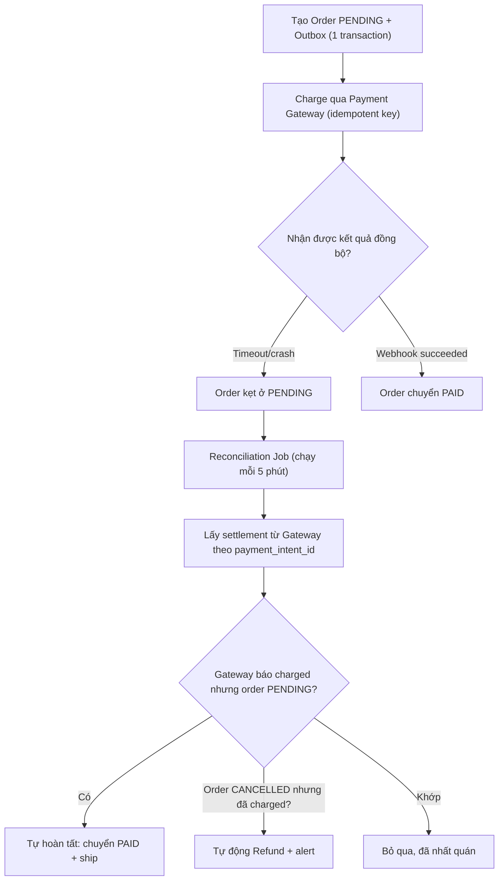

# Payment bị charge tiền nhưng order fail: thiết kế reconciliation thế nào?

## ⚡ Tóm tắt ngắn (30s)
* **Bản chất**: Đây là kinh điển của bài toán **dual-write / distributed transaction**: tiền đã trừ ở cổng thanh toán (hệ thống ngoài) nhưng order ở DB nội bộ không được tạo (do app crash, timeout, hoặc lỗi nghiệp vụ sau bước charge). Hai hệ thống — Payment Gateway và Order DB — không có giao dịch ACID chung, nên **không có cách nào đảm bảo cả hai cùng thành công 100%**. Senior chấp nhận sự thật đó và thiết kế **reconciliation (đối soát)** để phát hiện và tự chữa lành các lệch trạng thái.
* **Các nguyên nhân gốc rễ**:
  1. **App crash giữa charge và save order**: Charge thành công, chưa kịp ghi order thì pod bị OOM-kill / deploy restart.
  2. **Timeout nhưng charge vẫn thành công**: App gọi payment, timeout 5s, nghĩ là fail, rollback order; nhưng gateway thực ra đã charge xong.
  3. **Webhook thanh toán bị miss**: Gateway gửi webhook "đã charge" nhưng app đang down / endpoint trả 5xx → mất tín hiệu.
* **Quyết định Senior**:
  1. **Đảo thứ tự + Outbox**: Tạo order ở trạng thái `PENDING` **trước**, ghi vào DB cùng một outbox record, **rồi mới** charge. Order luôn tồn tại để đối soát.
  2. **Reconciliation job định kỳ**: So khớp danh sách giao dịch từ Payment Gateway (qua report API / settlement file) với order DB; tự refund hoặc tự hoàn tất order cho các lệch.
  3. **Idempotent charge + webhook**: Mọi charge và mọi webhook đều idempotent theo `payment_intent_id`.

---

## 🔍 Chi tiết bản chất thực chiến: Cách thiết kế chống lệch tiền

### Quy trình điều tra một ca lệch cụ thể
1. **Xác định hướng lệch**: Tiền-có-order-không (over-charge, nguy hiểm về tiền) hay order-có-tiền-không (under-charge, mất doanh thu)? Hướng đầu phải ưu tiên xử lý vì liên quan trực tiếp tới tiền khách.
2. **Truy `payment_intent_id`**: Đây là khóa nối giữa hai thế giới. Tra ở gateway dashboard xem trạng thái thật (`succeeded`/`failed`).
3. **Soi log app quanh thời điểm charge**: Tìm exception, restart, timeout.
4. **Đối chiếu settlement file**: Cuối ngày gateway gửi file settlement — nguồn chân lý về tiền thực thu.

### Vì sao "charge trước, tạo order sau" là sai lầm
Nếu charge tiền trước rồi mới tạo order, khi tạo order fail thì bạn có tiền nhưng **không có bản ghi nào để đối soát** — không biết tiền đó thuộc về đơn nào. Đảo lại: tạo order `PENDING` trước, order luôn tồn tại như một "neo" để reconciliation bám vào.

### Pattern chuẩn: Outbox + State Machine
* Order đi qua các trạng thái: `PENDING` → `PAID` → `CONFIRMED`, hoặc `PENDING` → `PAYMENT_FAILED` → `CANCELLED`.
* Mọi chuyển trạng thái do **webhook idempotent** hoặc **reconciliation job** điều khiển, không bao giờ dựa vào "lời gọi đồng bộ trả về thành công".
* Outbox đảm bảo: nếu order được ghi thì sự kiện "cần charge" cũng được ghi trong cùng transaction — không mất tín hiệu.

---

## 🎨 Sơ đồ: Reconciliation đối soát Payment vs Order



---

## 💻 Code thực chiến: BAD vs GOOD

### ❌ BAD: Dual-write không có đối soát
```java
@PostMapping("/checkout")
public void checkout(CheckoutRequest req) {
    paymentClient.charge(req.getCard(), req.getAmount()); // tiền trừ ở đây
    Order order = new Order(req);
    orderRepository.save(order); // ❌ nếu crash/lỗi ở đây → tiền mất dấu
}
```

### ✅ GOOD: Order PENDING trước + Reconciliation job
```java
@Service
@RequiredArgsConstructor
public class CheckoutService {

    private final OrderRepository orderRepository;
    private final PaymentClient paymentClient;

    @Transactional
    public Long initCheckout(CheckoutRequest req) {
        // 1. Order luôn tồn tại trước khi đụng tới tiền
        Order order = new Order(req.getUserId(), req.getAmount(), OrderStatus.PENDING);
        order.setPaymentIntentId(UUID.randomUUID().toString()); // khóa đối soát
        orderRepository.save(order);
        return order.getId();
    }

    // Webhook idempotent từ gateway
    @Transactional
    public void onPaymentWebhook(String paymentIntentId, String status) {
        Order order = orderRepository.findByPaymentIntentId(paymentIntentId)
                .orElseThrow();
        if (order.getStatus() != OrderStatus.PENDING) return; // idempotent: đã xử lý
        if ("succeeded".equals(status)) {
            order.setStatus(OrderStatus.PAID);
        } else {
            order.setStatus(OrderStatus.PAYMENT_FAILED);
        }
        orderRepository.save(order);
    }
}
```

```java
// Reconciliation job: nguồn chân lý là settlement của gateway
@Component
@RequiredArgsConstructor
public class PaymentReconciliationJob {

    private final OrderRepository orderRepository;
    private final PaymentGatewayApi gatewayApi;
    private final RefundService refundService;

    @Scheduled(fixedDelay = 300_000) // mỗi 5 phút
    public void reconcile() {
        // Order kẹt PENDING quá 10 phút → kiểm tra gateway
        var stuck = orderRepository.findStuckPending(Duration.ofMinutes(10));
        for (Order o : stuck) {
            PaymentStatus real = gatewayApi.getStatus(o.getPaymentIntentId());
            if (real == PaymentStatus.SUCCEEDED) {
                o.setStatus(OrderStatus.PAID);          // tiền có → hoàn tất order
                orderRepository.save(o);
            } else if (real == PaymentStatus.NOT_FOUND) {
                o.setStatus(OrderStatus.CANCELLED);     // không charge → hủy order
                orderRepository.save(o);
            }
        }
        // Hướng nguy hiểm: order CANCELLED nhưng gateway đã charge → refund
        for (var charged : gatewayApi.listCharged(LocalDate.now())) {
            Order o = orderRepository.findByPaymentIntentId(charged.intentId()).orElse(null);
            if (o != null && o.getStatus() == OrderStatus.CANCELLED) {
                refundService.refund(charged.intentId(), charged.amount());
            }
        }
    }
}
```

---

## 📊 Bảng so sánh: Hướng lệch vs Triệu chứng vs Xử lý

| Hướng lệch | Triệu chứng | Cách xác minh | Hành động tự động | Mức ưu tiên |
| :--- | :--- | :--- | :--- | :--- |
| **Tiền có, order không** | Khách kêu "đã trừ tiền không thấy đơn" | Settlement file có `intent_id`, order DB không có | Tạo/hoàn tất order hoặc refund | 🔴 Khẩn (liên quan tiền) |
| **Order PAID, tiền không thực thu** | Doanh thu lệch khi đối soát cuối ngày | Order PAID nhưng settlement không có | Đánh dấu `PAYMENT_FAILED`, hủy ship | 🟠 Cao |
| **Webhook miss** | Order kẹt PENDING dù tiền đã trừ | Gateway báo succeeded, app không nhận webhook | Job tự pull status, chuyển PAID | 🟠 Cao |
| **Double charge** | Khách bị trừ 2 lần cùng order | 2 charge cùng `idempotency_key` | Refund bản dư | 🔴 Khẩn |

---

## ⚠️ Common Gotchas & Questions follow-up

### 1. Cạm bẫy "Reconciliation không idempotent gây refund 2 lần"
* **Vấn đề**: Job đối soát chạy mỗi 5 phút. Một order CANCELLED đã charge bị job phát hiện và refund. Nhưng nếu refund chậm, lần chạy job kế tiếp lại thấy order vẫn CANCELLED + vẫn có charge → refund lần nữa → mất tiền doanh nghiệp.
* **Giải pháp**: Mọi hành động chữa lành phải idempotent. Trước khi refund, ghi trạng thái `REFUND_INITIATED` với `refund_id` duy nhất; gateway refund API cũng nhận idempotency key. Job lần sau thấy `REFUND_INITIATED` thì bỏ qua.

### 2. Câu hỏi đào sâu từ interviewer
* **Interviewer: "Tại sao không dùng distributed transaction (2PC/XA) cho payment + order để khỏi cần reconciliation?"**
* **Trả lời**:
  1. **Payment Gateway là hệ thống của bên thứ ba** (Stripe, VNPay...), không tham gia XA transaction của bạn. 2PC chỉ áp được khi mọi resource đều hỗ trợ XA — điều không tồn tại với API HTTP bên ngoài.
  2. **2PC có coordinator là single point of failure** và khóa tài nguyên lâu, không scale ở hệ thống throughput cao.
  3. **Cách đúng**: Chấp nhận **eventual consistency**, dùng **Saga + Outbox + Reconciliation**. Reconciliation không phải "giải pháp tệ" mà là **mạng lưới an toàn bắt buộc** trong mọi hệ thống thanh toán nghiêm túc — kể cả ngân hàng cũng đối soát cuối ngày.
