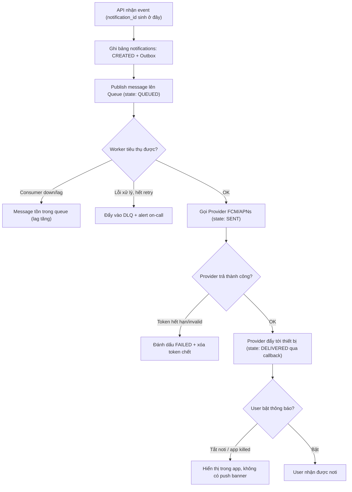

# User không nhận được notification: trace từ API đến queue đến worker ra sao?

## ⚡ Tóm tắt ngắn (30s)
* **Bản chất**: Notification là một **pipeline bất đồng bộ nhiều chặng**: `API nhận event → publish message → queue → worker tiêu thụ → gọi provider (FCM/APNs/SMS/Email) → thiết bị user`. Mất noti ở **bất kỳ chặng nào** đều dẫn tới cùng triệu chứng "user không nhận được". Senior không đoán mà **trace có hệ thống từng chặng bằng correlation ID** để khoanh vùng chặng gãy.
* **Các nguyên nhân gốc rễ theo chặng**:
  1. **API**: Event không được publish (exception bị nuốt, validation fail).
  2. **Queue**: Message vào nhầm topic/routing key, hoặc nằm trong **DLQ (dead-letter queue)** sau khi retry hết.
  3. **Worker**: Consumer down/lag, hoặc xử lý lỗi rồi ack nhầm (mất message).
  4. **Provider**: Token thiết bị hết hạn, bị provider rate-limit, hoặc payload sai format.
  5. **Thiết bị**: User tắt thông báo, app bị kill, token chưa đăng ký.
* **Quyết định Senior**:
  1. **Correlation ID xuyên suốt**: Mỗi notification có `notification_id` đi kèm từ API tới provider, log ở mọi chặng.
  2. **Notification có trạng thái + outbox**: Lưu bảng `notifications` với state machine (`CREATED → QUEUED → SENT → DELIVERED → FAILED`) để trace được "tới chặng nào thì gãy".
  3. **DLQ + alert**: Mọi message fail vào DLQ và bắn cảnh báo, không im lặng.

---

## 🔍 Chi tiết bản chất thực chiến: Trace từng chặng

### Quy trình trace có cấu trúc
1. **Lấy `notification_id` của ca lỗi cụ thể** (hỏi user thời điểm + loại noti, tra bảng `notifications`).
2. **Đọc trạng thái cuối cùng** của record đó:
   * Không có record → gãy ở **API** (event chưa từng tạo noti).
   * `CREATED` nhưng không `QUEUED` → publish thất bại (kiểm tra outbox/broker).
   * `QUEUED` nhưng không `SENT` → **worker** không tiêu thụ (lag? DLQ? consumer down?).
   * `SENT` nhưng không `DELIVERED` → **provider/thiết bị** (token chết, user tắt noti).
3. **Soi metric**: Queue depth, consumer lag, DLQ size, provider error rate.
4. **Tái hiện**: Gửi noti test tới chính token của user qua provider để loại trừ chặng provider.

### Bẫy "fire-and-forget" nuốt lỗi
Rất nhiều hệ thống publish noti theo kiểu bắn-rồi-quên, không lưu trạng thái. Khi mất noti, **không có dấu vết nào để trace** — đó là lý do bước đầu tiên luôn là "có bảng `notifications` với trạng thái chưa?". Không có observability thì mọi điều tra chỉ là đoán mò.

### Tại sao DLQ là bạn thân
Khi worker xử lý một message lỗi (ví dụ token sai format), nó retry vài lần rồi đẩy vào DLQ thay vì ack-bỏ (mất) hoặc retry vô hạn (kẹt queue). DLQ giúp: (1) message không mất, (2) queue chính không bị nghẽn, (3) alert cho on-call điều tra.

---

## 🎨 Sơ đồ: Pipeline notification và các điểm gãy



---

## 💻 Code thực chiến: BAD vs GOOD

### ❌ BAD: Fire-and-forget, không trạng thái, nuốt lỗi
```java
@PostMapping("/events/order-shipped")
public void onOrderShipped(OrderEvent e) {
    try {
        kafkaTemplate.send("notifications", buildPayload(e)); // ❌ không lưu trạng thái
    } catch (Exception ex) {
        log.warn("send failed"); // ❌ nuốt lỗi, không trace được, không retry
    }
}
```

### ✅ GOOD: Có trạng thái, outbox, DLQ, idempotent
```java
@Service
@RequiredArgsConstructor
public class NotificationService {

    private final NotificationRepository repo;
    private final OutboxRepository outbox;

    // Tầng API: ghi trạng thái + outbox trong cùng transaction
    @Transactional
    public void enqueue(Long userId, String type, Map<String, Object> data) {
        Notification n = Notification.builder()
                .id(UUID.randomUUID().toString())
                .userId(userId).type(type)
                .status(NotificationStatus.CREATED)
                .payload(data).build();
        repo.save(n);
        // Outbox: đảm bảo publish không mất nếu broker tạm chết
        outbox.save(new OutboxEvent("notifications", n.getId(), toJson(n)));
    }
}

@Component
@RequiredArgsConstructor
public class NotificationWorker {

    private final NotificationRepository repo;
    private final PushProvider pushProvider;

    @KafkaListener(topics = "notifications", groupId = "notif-worker")
    public void onMessage(String notificationId, Acknowledgment ack) {
        Notification n = repo.findById(notificationId).orElse(null);
        if (n == null || n.getStatus() == NotificationStatus.SENT) {
            ack.acknowledge(); // idempotent: đã gửi rồi thì bỏ qua
            return;
        }
        try {
            n.setStatus(NotificationStatus.SENT);
            repo.save(n);
            PushResult r = pushProvider.send(n.getUserId(), n.getPayload());
            if (r.tokenInvalid()) {
                pushProvider.removeDeadToken(n.getUserId()); // dọn token chết
                n.setStatus(NotificationStatus.FAILED);
                repo.save(n);
            }
            ack.acknowledge(); // chỉ ack khi đã xử lý xong
        } catch (TransientException retryable) {
            // không ack → message được redeliver; sau N lần Kafka đẩy vào DLQ
            throw retryable;
        }
    }
}
```

---

## 📊 Bảng so sánh: Chặng gãy vs Triệu chứng vs Cách xác minh

| Chặng | Triệu chứng | Cách xác minh | Fix nhanh | Fix dài hạn |
| :--- | :--- | :--- | :--- | :--- |
| **API** | Không có record trong bảng notifications | Tra `notification_id`, soi log publish | Sửa validation/exception nuốt | Outbox đảm bảo publish |
| **Queue** | State QUEUED, consumer lag cao | Kiểm tra queue depth + consumer group lag | Scale consumer | Auto-scale theo lag |
| **Worker** | Message nằm trong DLQ | Soi DLQ size + nội dung message | Reprocess DLQ thủ công | Sửa bug xử lý + alert DLQ |
| **Provider** | State SENT nhưng không DELIVERED | Gửi test tới token, soi provider error code | Xóa token chết | Token refresh + dọn định kỳ |
| **Thiết bị** | DELIVERED nhưng user không thấy | Hỏi user setting noti | Hướng dẫn bật noti | In-app inbox dự phòng |

---

## ⚠️ Common Gotchas & Questions follow-up

### 1. Cạm bẫy "Ack trước khi xử lý xong → mất noti im lặng"
* **Vấn đề**: Worker cấu hình `enable.auto.commit=true` (Kafka) hoặc ack ngay khi nhận message. Nếu worker crash **sau khi ack nhưng trước khi gọi provider**, message coi như đã xử lý nhưng noti chưa hề gửi. User mất noti mà không có dấu vết lỗi.
* **Giải pháp**: Dùng **manual ack** và chỉ ack **sau khi** đã gọi provider thành công (hoặc đã chuyển trạng thái dứt khoát). Với at-least-once + idempotent consumer, tệ nhất là gửi lặp (chấp nhận được), không bao giờ mất.

### 2. Câu hỏi đào sâu từ interviewer
* **Interviewer: "User báo nhận noti chậm 30 phút chứ không phải mất hẳn. Bạn nghi chặng nào?"**
* **Trả lời**:
  1. **Chậm chứ không mất → gần như chắc chắn là consumer lag**: Queue đang backlog, worker tiêu thụ không kịp tốc độ produce. Xác minh bằng **consumer lag metric** (Kafka `records-lag-max`).
  2. **Nguyên nhân lag**: Worker scale không đủ, hoặc một message "độc" (poison message) làm worker retry liên tục chặn partition, hoặc provider chậm kéo tụt throughput.
  3. **Xử lý**: Scale consumer theo lag, tách provider call sang thread pool có timeout, đẩy poison message vào DLQ để không chặn partition. Dài hạn: auto-scale consumer dựa trên lag và đặt SLO độ trễ noti (ví dụ p99 < 60 giây).
