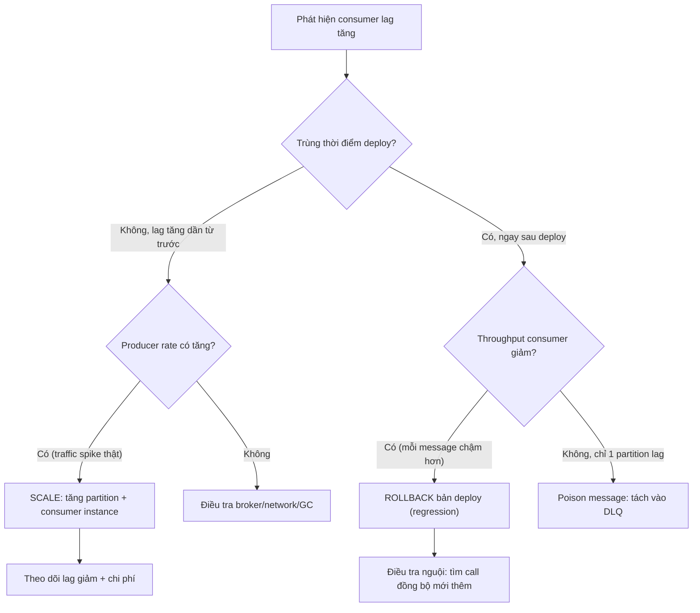

# Kafka lag tăng sau deploy: bạn rollback hay scale consumer?

## ⚡ Tóm tắt ngắn (30s)
* **Bản chất**: Consumer lag = khoảng cách giữa offset mới nhất producer ghi và offset consumer đã xử lý. Lag tăng **đột ngột ngay sau deploy** là tín hiệu mạnh rằng **bản deploy mới làm chậm tốc độ xử lý**, chứ không phải tải tăng tự nhiên. Câu hỏi "rollback hay scale" là một cái bẫy nhị phân: Senior trả lời **"tùy nguyên nhân — và phải chẩn đoán trước khi hành động"**. Scale consumer mù khi nguyên nhân là code chậm thì chỉ tốn tiền mà lag vẫn tăng.
* **Khung quyết định**:
  1. **Nếu lag do bản deploy mới chậm/lỗi (regression)** → **ROLLBACK**. Scale thêm consumer chỉ che giấu triệu chứng, mỗi consumer vẫn chậm.
  2. **Nếu lag do tải thật tăng** (đúng dịp khuyến mãi, traffic spike) trùng thời điểm deploy → **SCALE consumer** (tăng partition + instance).
  3. **Nếu lag do poison message chặn partition** → tách message độc vào DLQ, không rollback cũng không cần scale.
* **Quyết định Senior**: Ưu tiên **rollback nếu nghi regression** vì nó nhanh, an toàn, đảo ngược được; sau đó điều tra nguội. "Khi nghi ngờ, rollback trước, debug sau" là nguyên tắc vận hành.

---

## 🔍 Chi tiết bản chất thực chiến: Chẩn đoán trước khi hành động

### Quy trình debug có cấu trúc (5 phút đầu)
1. **Lag tăng đúng lúc deploy?** So timestamp deploy với đường cong lag. Trùng khít → nghi regression mạnh.
2. **Per-partition hay toàn bộ?** Nếu chỉ **một partition** lag → poison message hoặc hot key. Nếu **mọi partition** lag đều → code chậm toàn cục hoặc tải tăng.
3. **Throughput consumer giảm?** So `records-consumed-rate` trước/sau deploy. Giảm → mỗi message xử lý lâu hơn (regression). Giữ nguyên nhưng lag vẫn tăng → producer rate tăng (tải thật).
4. **Soi xử lý mỗi message**: Bản mới có thêm DB call đồng bộ? Gọi API ngoài chậm? Bỏ batch thành xử lý từng cái? Tắt cache?

### Vì sao "scale consumer" không phải lúc nào cũng cứu
* **Giới hạn partition**: Số consumer hữu ích trong một group **không vượt quá số partition**. Topic có 6 partition thì consumer thứ 7 trở đi nằm không. Scale instance không tăng song song được nếu hết partition.
* **Nếu mỗi message giờ tốn gấp đôi thời gian** (do regression), scale gấp đôi consumer chỉ đưa throughput về như cũ — và bạn vừa trả gấp đôi chi phí cho một bản deploy lỗi.

### Khi nào rollback là đúng
Bản mới thêm một synchronous call (ví dụ gọi service làm giàu dữ liệu) trong vòng lặp xử lý message → mỗi message chậm thêm 50ms → throughput tụt. Rollback đưa throughput về ngay, lag tự tiêu. Đây là tình huống điển hình nhất.

---

## 🎨 Sơ đồ: Cây quyết định Rollback vs Scale



---

## 💻 Code thực chiến: BAD vs GOOD

### ❌ BAD: Regression điển hình — call đồng bộ trong vòng lặp message
```java
@KafkaListener(topics = "orders", groupId = "enrich")
public void consume(OrderEvent e) {
    // ❌ Bản deploy mới thêm dòng này: gọi REST đồng bộ cho TỪNG message
    UserProfile p = userServiceClient.getProfile(e.getUserId()); // 50ms/lần
    enrichAndSave(e, p);
    // Throughput tụt từ 5000 msg/s xuống 200 msg/s → lag bùng nổ
}
```

### ✅ GOOD: Batch + cache + xử lý song song an toàn
```java
@Service
@RequiredArgsConstructor
public class OrderEnrichConsumer {

    private final UserServiceClient userServiceClient;
    private final OrderRepository orderRepository;
    // Cache profile để tránh gọi REST cho mỗi message
    private final LoadingCache<Long, UserProfile> profileCache = Caffeine.newBuilder()
            .maximumSize(50_000)
            .expireAfterWrite(Duration.ofMinutes(10))
            .build(this::fetchProfile);

    // Xử lý theo batch: 1 lời gọi cho nhiều userId thay vì N lời gọi
    @KafkaListener(topics = "orders", groupId = "enrich",
                   containerFactory = "batchFactory")
    public void consumeBatch(List<OrderEvent> events, Acknowledgment ack) {
        Set<Long> userIds = events.stream()
                .map(OrderEvent::getUserId).collect(Collectors.toSet());
        // 1 call batch thay vì N call đồng bộ
        Map<Long, UserProfile> profiles = userServiceClient.getProfilesBatch(userIds);

        List<EnrichedOrder> enriched = events.stream()
                .map(e -> enrich(e, profiles.get(e.getUserId())))
                .toList();
        orderRepository.saveAll(enriched);
        ack.acknowledge();
    }

    private UserProfile fetchProfile(Long userId) {
        return userServiceClient.getProfile(userId);
    }
}
```

```yaml
# Tăng song song đúng cách: số partition phải >= số consumer instance mong muốn
# Lệnh tăng partition (chỉ tăng được, không giảm):
# kafka-topics.sh --alter --topic orders --partitions 12
spring:
  kafka:
    listener:
      concurrency: 6   # số thread tiêu thụ, <= số partition
    consumer:
      max-poll-records: 500   # batch lớn hơn → throughput cao hơn
```

---

## 📊 Bảng so sánh: Nguyên nhân lag vs Triệu chứng vs Hành động

| Nguyên nhân | Triệu chứng | Cách xác minh | Hành động đúng | Hành động SAI thường gặp |
| :--- | :--- | :--- | :--- | :--- |
| **Regression bản deploy** | Lag tăng ngay sau deploy, throughput tụt | So timestamp deploy + `records-consumed-rate` | **Rollback** | Scale mù (tốn tiền, vẫn lag) |
| **Traffic spike thật** | Producer rate tăng, throughput consumer giữ nguyên | So `records-produced-rate` | **Scale** partition + instance | Rollback (vô ích, tải vẫn cao) |
| **Poison message** | Chỉ 1 partition lag, retry liên tục | Soi lag per-partition + log lỗi lặp | Tách vào DLQ | Restart consumer (kẹt lại ngay) |
| **GC/broker chậm** | Lag mọi partition, latency broker tăng | Soi GC pause, broker metrics | Tune JVM/broker | Scale consumer (không trúng đích) |

---

## ⚠️ Common Gotchas & Questions follow-up

### 1. Cạm bẫy "Scale consumer vượt số partition"
* **Vấn đề**: Lag tăng, on-call scale consumer từ 6 lên 12 instance trên topic chỉ có 6 partition. 6 instance mới nhận **0 partition**, nằm không hoàn toàn, lag vẫn nguyên. Tệ hơn, rebalance khi thêm instance còn gây "stop-the-world" tạm dừng tiêu thụ, lag tăng thêm trong lúc rebalance.
* **Giải pháp**: Hiểu rằng song song bị chặn bởi số partition. Muốn scale thật phải **tăng partition trước** (`--alter --partitions`), nhưng lưu ý tăng partition làm thay đổi phân phối key → mất thứ tự với key cũ. Vì vậy nên thiết kế dư partition từ đầu.

### 2. Câu hỏi đào sâu từ interviewer
* **Interviewer: "Bạn rollback, nhưng trong lúc bản lỗi chạy, một số message đã được consumer mới commit offset. Rollback có làm xử lý lại hay mất message không?"**
* **Trả lời**:
  1. **Offset đã commit thì không bị xử lý lại** khi rollback code, vì offset nằm ở broker (`__consumer_offsets`), độc lập với version code consumer. Rollback chỉ đổi logic xử lý, consumer tiếp tục từ offset đã commit.
  2. **Rủi ro thật**: Nếu bản lỗi xử lý **sai** một số message rồi vẫn commit offset (ví dụ enrich thiếu dữ liệu nhưng vẫn ack), những message đó **đã mất cơ hội xử lý đúng**. Cần xác định khoảng offset bị ảnh hưởng và **reprocess có chọn lọc** (reset offset về điểm trước deploy cho consumer group, nếu xử lý idempotent).
  3. **Bài học**: Vì vậy consumer phải **idempotent** — để có thể reset offset reprocess an toàn mà không tạo side-effect trùng.
