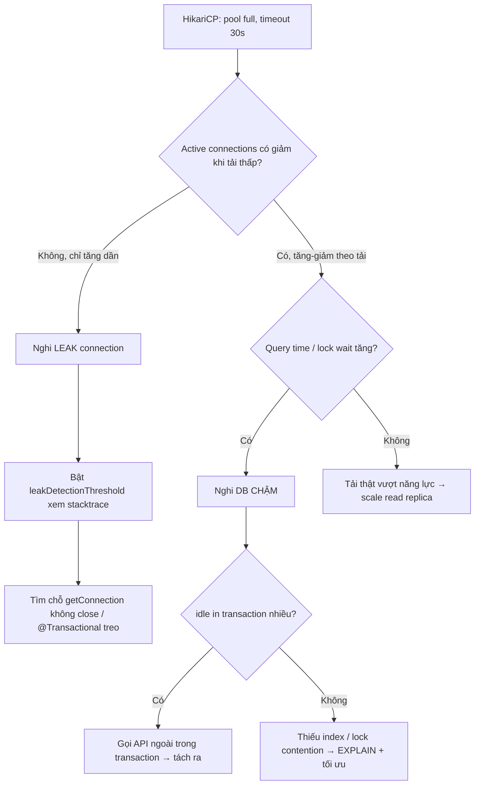

# DB connection pool full: app leak connection hay DB chậm?

## ⚡ Tóm tắt ngắn (30s)
* **Bản chất**: "Connection pool full" (ví dụ HikariCP báo `Connection is not available, request timed out after 30000ms`) chỉ là **triệu chứng**. Connection bị giữ lâu hơn tốc độ trả về, pool cạn. Có **hai họ nguyên nhân hoàn toàn khác nhau** cần phân biệt vì cách fix ngược nhau:
  1. **App leak connection**: Code lấy connection mà **quên đóng** (không trả về pool). Pool cạn dần theo thời gian, không phụ thuộc tải. Đây là **bug code**.
  2. **DB chậm**: Query/transaction chạy lâu (thiếu index, lock contention, DB quá tải), connection bị **giữ hợp lệ nhưng quá lâu**, pool cạn khi tải cao. Đây là **vấn đề hiệu năng**.
* **Cách phân biệt nhanh**:
  * Leak → số connection active **chỉ tăng không giảm**, kể cả khi traffic thấp; restart app là hết (tạm thời).
  * DB chậm → active tăng-giảm theo tải, đi kèm **query time / lock wait tăng**; restart app không cứu được vì DB vẫn chậm.
* **Quyết định Senior**: Nhìn **metric HikariCP** (`active`, `idle`, `pending`, `connectionUsageMillis`) + **slow query log** để chẩn đoán đúng họ nguyên nhân **trước khi** đụng tới `maximumPoolSize`. Tăng pool size mù khi DB chậm chỉ chuyển nghẽn xuống DB và làm DB sập nhanh hơn.

---

## 🔍 Chi tiết bản chất thực chiến: Phân biệt leak vs chậm

### Quy trình debug có cấu trúc
1. **Đọc HikariCP metrics**:
   * `hikaricp.connections.active` luôn = max và **không bao giờ giảm** → nghi **leak**.
   * `active` dao động theo tải, `pending` (luồng chờ connection) tăng giờ cao điểm → nghi **DB chậm**.
2. **Bật `leakDetectionThreshold`**: Hikari sẽ log stacktrace của connection bị giữ quá ngưỡng (ví dụ 30s) — chỉ thẳng dòng code leak.
3. **Đối chiếu DB-side**: Query `pg_stat_activity` (Postgres) xem connection đang `idle in transaction` (dấu hiệu leak/transaction mở quên đóng) hay `active` chạy query lâu (DB chậm).
4. **Slow query log + EXPLAIN**: Nếu query chậm, tìm full table scan, thiếu index, lock wait.

### Dấu hiệu vàng: `idle in transaction`
Connection ở trạng thái `idle in transaction` nghĩa là transaction đã mở nhưng app đang... không làm gì (chờ I/O ngoài, gọi REST trong transaction, hoặc quên commit). Đây là **kẻ giết pool** phổ biến nhất: vừa giữ connection vừa giữ lock. Nguyên nhân thường là **gọi API ngoài / xử lý lâu bên trong `@Transactional`**.

### Vì sao tăng pool size là con dao hai lưỡi
Mỗi connection là một process/thread phía DB tốn RAM + CPU. Postgres khuyến nghị số connection ≈ `(core * 2) + effective_spindle`. Tăng pool từ 20 lên 200 khi DB đang chậm → 200 query chậm cùng lúc → DB CPU 100% → **mọi thứ chậm hơn**. Pool nhỏ thực ra **bảo vệ DB** bằng cách xếp hàng tại app.

---

## 🎨 Sơ đồ: Chẩn đoán pool full



---

## 💻 Code thực chiến: BAD vs GOOD

### ❌ BAD 1: Leak connection do không đóng (JDBC thủ công)
```java
public User findUser(Long id) throws SQLException {
    Connection conn = dataSource.getConnection(); // ❌ không bao giờ close
    PreparedStatement ps = conn.prepareStatement("SELECT * FROM users WHERE id=?");
    ps.setLong(1, id);
    ResultSet rs = ps.executeQuery();
    return rs.next() ? mapUser(rs) : null; // connection rò rỉ mỗi lần gọi
}
```

### ❌ BAD 2: Giữ connection lâu — gọi API ngoài trong transaction
```java
@Transactional
public void processOrder(Long orderId) {
    Order o = orderRepository.findById(orderId).orElseThrow();
    // ❌ Gọi REST chậm (2s) NẰM TRONG transaction → connection bị giữ 2s,
    //    đồng thời giữ lock row → pool cạn khi tải cao
    ShippingQuote q = shippingClient.getQuote(o); // idle in transaction!
    o.setShippingFee(q.fee());
    orderRepository.save(o);
}
```

### ✅ GOOD: Try-with-resources + tách I/O ngoài khỏi transaction
```java
// 1. Đóng connection chắc chắn bằng try-with-resources
public User findUser(Long id) {
    String sql = "SELECT * FROM users WHERE id=?";
    try (Connection conn = dataSource.getConnection();
         PreparedStatement ps = conn.prepareStatement(sql)) {
        ps.setLong(1, id);
        try (ResultSet rs = ps.executeQuery()) {
            return rs.next() ? mapUser(rs) : null;
        }
    } catch (SQLException e) {
        throw new DataAccessException("findUser failed", e);
    }
}

// 2. Gọi API ngoài TRƯỚC, chỉ mở transaction ngắn để ghi
@Service
@RequiredArgsConstructor
public class OrderProcessor {
    private final OrderRepository orderRepository;
    private final ShippingClient shippingClient;

    public void processOrder(Long orderId) {
        Order o = orderRepository.findById(orderId).orElseThrow();
        ShippingQuote q = shippingClient.getQuote(o);   // ✅ ngoài transaction
        persistFee(orderId, q.fee());                   // ✅ transaction ngắn
    }

    @Transactional
    public void persistFee(Long orderId, BigDecimal fee) {
        Order o = orderRepository.findById(orderId).orElseThrow();
        o.setShippingFee(fee);
        orderRepository.save(o);
    }
}
```

```yaml
# Cấu hình Hikari giúp phát hiện sớm
spring:
  datasource:
    hikari:
      maximum-pool-size: 20          # đừng tăng mù; căn theo năng lực DB
      connection-timeout: 5000        # fail nhanh thay vì chờ 30s
      leak-detection-threshold: 20000 # log stacktrace nếu giữ > 20s
      max-lifetime: 1800000
```

---

## 📊 Bảng so sánh: Leak vs DB chậm

| Tiêu chí | App LEAK connection | DB CHẬM |
| :--- | :--- | :--- |
| **Đường cong active** | Tăng dần, **không giảm** dù tải thấp | Tăng-giảm theo tải |
| **Restart app** | Hết tạm thời rồi tái diễn | Không cứu được (DB vẫn chậm) |
| **DB-side (`pg_stat_activity`)** | Nhiều `idle in transaction` hoặc idle | Nhiều `active` chạy query lâu |
| **Dấu hiệu kèm theo** | Stacktrace leak từ Hikari | Slow query log, lock wait, DB CPU cao |
| **Fix đúng** | Đóng connection / sửa @Transactional treo | Thêm index, tách I/O ngoài, scale replica |
| **Fix SAI** | Tăng pool size (chỉ chậm sập hơn) | Tăng pool size (làm DB sập nhanh hơn) |

---

## ⚠️ Common Gotchas & Questions follow-up

### 1. Cạm bẫy "Tăng maximumPoolSize là phản xạ đầu tiên"
* **Vấn đề**: Thấy pool full, on-call tăng `maximumPoolSize` từ 20 lên 100. Nếu nguyên nhân là DB chậm, giờ có 100 query chậm cùng lúc đập vào DB → DB CPU 100%, lock contention tăng, **toàn hệ thống chậm hơn trước**. Nếu nguyên nhân là leak, pool 100 chỉ kéo dài thời gian trước khi lại full.
* **Giải pháp**: Pool size không phải nút "tăng cho hết nghẽn". Nó nên **nhỏ và ổn định**, đóng vai trò hàng đợi bảo vệ DB. Chẩn đoán đúng họ nguyên nhân trước, rồi mới chỉnh — và thường là sửa code/query chứ không phải tăng pool.

### 2. Câu hỏi đào sâu từ interviewer
* **Interviewer: "Pool full chỉ xảy ra lúc 9h sáng mỗi ngày rồi tự hết. Leak hay chậm?"**
* **Trả lời**:
  1. **Tự hết khi qua giờ cao điểm → gần như chắc chắn KHÔNG phải leak** (leak không tự lành theo giờ). Đây là **DB chậm/quá tải dưới tải cao điểm**.
  2. **Điều tra**: 9h sáng là lúc traffic đỉnh hoặc trùng một **batch job/report nặng** chạy cùng lúc gây lock/contention. Soi xem có cron job, có query analytic chạy trên DB chính lúc đó không.
  3. **Xử lý**: Tách read tải nặng sang **read replica**, dời batch ra khung giờ thấp điểm, thêm index cho query nóng giờ cao điểm, và đặt `connection-timeout` ngắn để fail nhanh + degrade có kiểm soát thay vì treo 30s.
