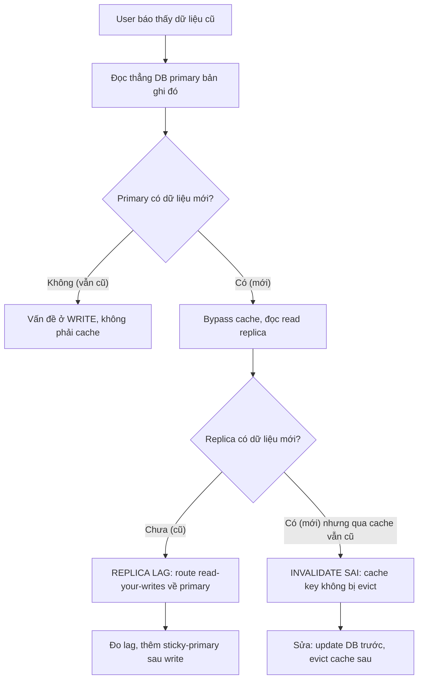

# Cache trả dữ liệu cũ: invalidate sai hay read replica lag?

## ⚡ Tóm tắt ngắn (30s)
* **Bản chất**: "Stale data" (dữ liệu cũ) có thể đến từ **hai tầng cache hoàn toàn khác nhau**, và Senior phải phân biệt vì cách fix khác hẳn:
  1. **Application cache (Redis/Caffeine) invalidate sai**: Sau khi update DB, key cache không bị xóa/cập nhật → đọc tiếp ra giá trị cũ. Lỗi nằm ở **logic invalidation của ứng dụng**.
  2. **Read replica lag**: App ghi vào primary, đọc từ replica. Replication chưa kịp đồng bộ (lag vài trăm ms tới vài giây) → đọc replica ra dữ liệu trước update. Lỗi nằm ở **tầng hạ tầng DB**, không phải cache.
* **Cách phân biệt nhanh**:
  * Invalidate sai → stale **vô thời hạn** cho tới khi TTL hết hoặc key bị ghi đè; đọc thẳng DB primary vẫn ra dữ liệu mới.
  * Replica lag → stale **trong cửa sổ ngắn** (bằng độ lag) rồi tự đúng; đọc primary ra mới, đọc replica ra cũ.
* **Quyết định Senior**:
  1. **Cache-aside + invalidate đúng**: Update DB **trước**, **rồi** xóa cache key (không phải set lại) để tránh race condition ghi đè bằng giá trị cũ.
  2. **Read-your-writes**: Sau khi user vừa ghi, route read của chính họ về **primary** (hoặc đợi lag) để họ luôn thấy thay đổi của mình.

---

## 🔍 Chi tiết bản chất thực chiến: Hai tầng stale

### Quy trình debug có cấu trúc
1. **Đọc thẳng primary**: Query trực tiếp DB primary cho bản ghi đó.
   * Primary ra dữ liệu **mới** + cache/replica ra **cũ** → đúng là vấn đề cache/replica.
   * Primary ra dữ liệu **cũ** → ghi chưa thành công, vấn đề ở tầng write, không phải cache.
2. **Bypass cache, đọc replica**: Nếu vẫn cũ → **replica lag**. Nếu replica đúng nhưng qua cache vẫn cũ → **invalidate sai**.
3. **Đo lag replica**: `SELECT now() - pg_last_xact_replay_timestamp()` (Postgres) hoặc `Seconds_Behind_Master` (MySQL).
4. **Kiểm tra TTL key + đường update**: Xem code update có gọi `cache.evict` không, có race condition không.

### Cache-aside và bẫy thứ tự thao tác
Pattern cache-aside chuẩn: đọc → miss → load DB → set cache. Khi update:
* **ĐÚNG**: Update DB → **xóa** cache key. Lần đọc kế tiếp miss → load lại từ DB ra giá trị mới.
* **SAI 1** (set thay vì delete): Update DB → **set** cache = giá trị mới. Hai luồng update song song có thể set xen kẽ → cache giữ giá trị của luồng chậm hơn → stale.
* **SAI 2** (xóa trước update): Xóa cache → (một luồng đọc xen vào, load DB cũ, set cache cũ) → mới update DB. Cache giữ giá trị cũ → stale. Vì vậy phải **update DB trước, xóa cache sau**.

### Replica lag — không phải bug, là bản chất
Replication là **bất đồng bộ** theo mặc định để không làm chậm write. Lag là điều bình thường. Vấn đề chỉ phát sinh khi **đọc-ngay-sau-ghi** kỳ vọng thấy thay đổi tức thì (read-your-writes). Giải pháp không phải "xóa lag" mà là **định tuyến đọc thông minh**.

---

## 🎨 Sơ đồ: Chẩn đoán stale data



---

## 💻 Code thực chiến: BAD vs GOOD

### ❌ BAD 1: Invalidate sai — set cache thay vì xóa, sai thứ tự
```java
@Transactional
public void updatePrice(Long productId, BigDecimal newPrice) {
    // ❌ Set cache TRƯỚC khi commit DB → nếu transaction rollback, cache có giá sai
    cache.put("product:" + productId, newPrice);
    Product p = productRepository.findById(productId).orElseThrow();
    p.setPrice(newPrice);
    productRepository.save(p);
    // Hai luồng update song song set xen kẽ → cache giữ giá của luồng chậm
}
```

### ❌ BAD 2: Đọc replica ngay sau khi ghi (read-your-writes vỡ)
```java
public ProductView updateThenShow(Long id, BigDecimal price) {
    productRepository.updateOnPrimary(id, price);   // ghi primary
    return readReplicaRepository.findById(id);       // ❌ đọc replica chưa kịp sync → cũ
}
```

### ✅ GOOD: Cache-aside đúng thứ tự + read-your-writes
```java
@Service
@RequiredArgsConstructor
public class ProductService {

    private final ProductRepository productRepository;
    private final StringRedisTemplate cache;

    // Cache-aside: đọc
    public Product getProduct(Long id) {
        String key = "product:" + id;
        String cached = cache.opsForValue().get(key);
        if (cached != null) return deserialize(cached);
        Product p = productRepository.findById(id).orElseThrow();
        cache.opsForValue().set(key, serialize(p), Duration.ofMinutes(10));
        return p;
    }

    // Update: DB trước, EVICT (không set) sau khi commit
    @Transactional
    public void updatePrice(Long id, BigDecimal newPrice) {
        Product p = productRepository.findById(id).orElseThrow();
        p.setPrice(newPrice);
        productRepository.save(p);
        // Đăng ký evict SAU khi transaction commit thành công
        TransactionSynchronizationManager.registerSynchronization(
            new TransactionSynchronization() {
                @Override public void afterCommit() {
                    cache.delete("product:" + id); // ✅ xóa, lần đọc sau load lại
                }
            });
    }

    // Read-your-writes: vừa ghi thì đọc primary cho chính user đó
    public Product getAfterWrite(Long id) {
        return productRepository.findByIdOnPrimary(id); // ép primary, né lag replica
    }
}
```

---

## 📊 Bảng so sánh: Invalidate sai vs Replica lag

| Tiêu chí | Cache invalidate SAI | Read replica LAG |
| :--- | :--- | :--- |
| **Thời gian stale** | Vô thời hạn tới khi TTL hết / ghi đè | Ngắn, bằng độ lag rồi tự đúng |
| **Đọc primary trực tiếp** | Ra dữ liệu **mới** | Ra dữ liệu **mới** |
| **Đọc replica trực tiếp** | Ra dữ liệu **mới** (nếu cache bypass) | Ra dữ liệu **cũ** |
| **Tầng lỗi** | Logic ứng dụng | Hạ tầng DB |
| **Fix đúng** | Update DB trước, evict cache sau commit | Read-your-writes về primary, giảm lag |
| **Cách xác minh** | Bypass cache vẫn đúng, qua cache thì sai | `pg_last_xact_replay_timestamp` lệch lớn |

---

## ⚠️ Common Gotchas & Questions follow-up

### 1. Cạm bẫy "Evict cache trước khi transaction commit"
* **Vấn đề**: Code xóa cache **bên trong** `@Transactional`, trước khi commit. Một luồng đọc khác xen vào ngay sau khi evict nhưng **trước khi commit** → cache miss → load từ DB ra **giá trị cũ chưa commit** → set lại cache giá cũ. Sau đó transaction commit → DB mới nhưng cache lại cũ. Stale quay lại.
* **Giải pháp**: Luôn evict cache trong `afterCommit` (sau khi transaction chắc chắn xong), như code GOOD ở trên. Hoặc dùng pattern **delayed double delete**: xóa cache, commit, đợi một khoảng ngắn rồi xóa lần nữa để dọn giá trị bị race set vào.

### 2. Câu hỏi đào sâu từ interviewer
* **Interviewer: "Nếu vừa có cache vừa có replica, user ghi xong vẫn thấy cũ. Bạn debug thứ tự thế nào?"**
* **Trả lời**:
  1. **Bóc từng lớp từ gần user nhất**: Đầu tiên bypass application cache (thêm header bỏ cache / đọc với flag). Nếu hết stale → lỗi ở **cache invalidation**.
  2. **Nếu vẫn stale sau khi bypass cache** → ép đọc **primary**. Hết stale → lỗi **replica lag**. Còn stale → lỗi ở **write path** (chưa commit thật).
  3. **Kết hợp nguy hiểm**: Khi cache được populate **từ replica đang lag**, ta nhân đôi vấn đề — cache "đóng băng" giá trị cũ của replica thậm chí sau khi replica đã sync. Vì vậy quy ước: **cache write-path luôn populate từ primary** sau khi ghi, hoặc chấp nhận TTL ngắn cho dữ liệu nhạy cảm về độ tươi.
