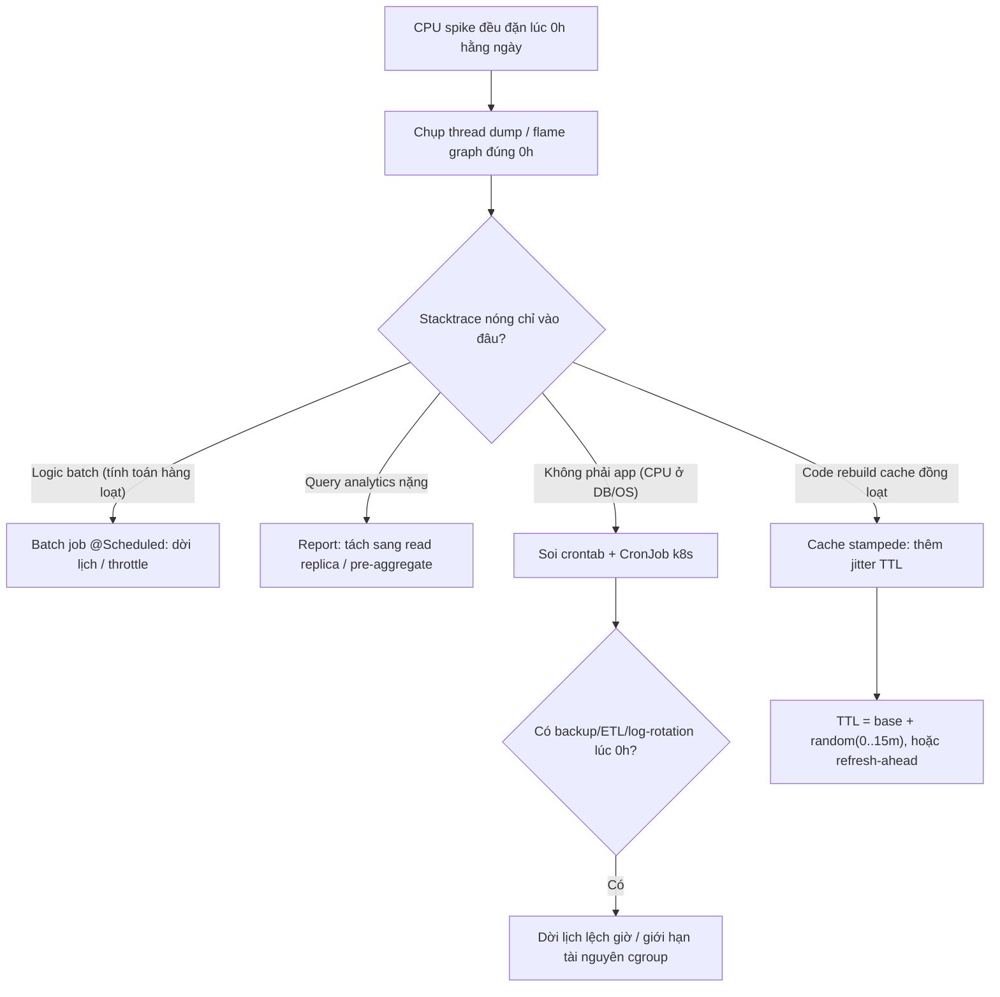

# CPU spike mỗi ngày lúc 0h: batch job, cron, report hay cache expire cùng lúc?

## ⚡ Tóm tắt ngắn (30s)
* **Bản chất**: CPU spike **đều đặn đúng một thời điểm cố định mỗi ngày** (0h) là dấu hiệu kinh điển của một **tác vụ được lập lịch (scheduled)** chứ không phải tải người dùng (tải user không bao giờ đều đặn đúng giây như vậy). Câu hỏi không phải "có phải scheduled không" mà là "**cái scheduled nào**" trong 4 nghi phạm: batch job nội bộ, cron OS, report/analytics, hoặc **cache stampede do TTL hết cùng lúc**.
* **Bốn nghi phạm và đặc trưng**:
  1. **Batch job** (`@Scheduled(cron=...)`): xử lý hàng loạt — tính lãi, tổng kết ngày, gửi email — đặt đúng 0h.
  2. **Cron OS / external scheduler**: backup, log rotation, ETL kéo dữ liệu lúc 0h.
  3. **Report/analytics**: query nặng quét cả ngày dữ liệu chạy đầu ngày mới.
  4. **Cache stampede**: hàng loạt key cache set với TTL cố định (ví dụ "cache 24h" nạp lúc 0h hôm trước) **hết hạn đồng loạt lúc 0h** → đồng loạt miss → đồng loạt rebuild → CPU + DB spike.
* **Quyết định Senior**: Dùng **profiler / thread dump tại thời điểm spike** + **scheduler inventory** để định danh chính xác, rồi áp giải pháp tương ứng: dời lịch, jitter TTL, tách tải sang replica, hoặc throttle batch.

---

## 🔍 Chi tiết bản chất thực chiến: Truy tìm thủ phạm

### Quy trình debug có cấu trúc
1. **Chụp được khoảnh khắc spike**: Lấy **thread dump / async-profiler flame graph** đúng lúc 0h. Stacktrace nóng chỉ thẳng code đang ăn CPU — batch job hay rebuild cache.
2. **Liệt kê mọi scheduler**: Grep toàn bộ `@Scheduled`, Quartz job, crontab (`crontab -l`), Kubernetes `CronJob`, external ETL. Cái nào cấu hình quanh 0h?
3. **Phân biệt CPU app vs CPU DB**: Spike ở app process hay ở DB? Report/analytics thường đốt CPU **DB**; batch xử lý in-memory đốt CPU **app**.
4. **Soi cache metric**: Nếu là stampede → thấy **cache hit ratio rơi xuống đáy** đúng 0h rồi hồi lại, kèm DB query spike (đồng loạt rebuild).

### Cache stampede — kẻ giấu mặt tinh vi nhất
Đây là nghi phạm khó nhất vì không có "job" nào hiện diện. Kịch bản: lúc 0h hôm qua, hệ thống nạp 10.000 key với `TTL = 24h`. Đúng 0h hôm nay, cả 10.000 key hết hạn **cùng giây**. Mọi request đồng loạt miss → đồng loạt query DB rebuild → DB và app spike dữ dội (thundering herd). Triệu chứng: spike ngắn, dữ dội, đúng bội số 24h kể từ lần deploy/nạp cache.

### Vì sao "đúng 0h" là manh mối vàng
Tải người dùng thật có phân phối mượt theo giờ trong ngày. Một spike **vuông góc, đúng giây, lặp lại hằng ngày** gần như loại trừ 100% khả năng do user. Nó là máy móc — và máy móc thì có lịch, tra lịch ra thủ phạm.

---

## 🎨 Sơ đồ: Truy tìm nguồn CPU spike lúc 0h



---

## 💻 Code thực chiến: BAD vs GOOD

### ❌ BAD 1: Batch job nặng chạy đúng 0h, không throttle
```java
@Scheduled(cron = "0 0 0 * * *") // ❌ đúng 0h, cùng lúc với mọi job khác
public void calculateDailyInterest() {
    List<Account> all = accountRepository.findAll(); // ❌ load toàn bộ vào RAM
    for (Account a : all) {                          // ❌ ép CPU 100% một mạch
        a.setInterest(compute(a));
        accountRepository.save(a);                   // ❌ N+1 ghi từng cái
    }
}
```

### ❌ BAD 2: Cache TTL cố định → stampede lúc 0h
```java
public Config getConfig(String key) {
    String v = redis.opsForValue().get(key);
    if (v == null) {
        v = db.loadConfig(key);
        // ❌ Mọi key set cùng TTL 24h → hết hạn đồng loạt → thundering herd
        redis.opsForValue().set(key, v, Duration.ofHours(24));
    }
    return v;
}
```

### ✅ GOOD: Batch chia lô + jitter TTL + tránh stampede
```java
@Service
@RequiredArgsConstructor
public class DailyInterestJob {

    private final AccountRepository accountRepository;

    // Dời lệch giờ thấp điểm + xử lý theo lô để dàn tải
    @Scheduled(cron = "0 30 2 * * *") // 2h30, tránh trùng 0h
    public void calculateDailyInterest() {
        int page = 0, size = 500;
        Slice<Account> slice;
        do {
            slice = accountRepository.findAll(PageRequest.of(page++, size));
            List<Account> batch = slice.getContent();
            batch.forEach(a -> a.setInterest(compute(a)));
            accountRepository.saveAll(batch);   // ghi theo lô, không N+1
            sleepQuietly(200);                  // throttle: nhường CPU cho traffic
        } while (slice.hasNext());
    }
}

@Service
@RequiredArgsConstructor
public class ConfigCache {

    private final StringRedisTemplate redis;
    private final ConfigDao db;
    private final Random random = new Random();

    public String getConfig(String key) {
        String v = redis.opsForValue().get(key);
        if (v != null) return v;
        v = db.loadConfig(key);
        // ✅ Jitter: base 24h + ngẫu nhiên 0..60 phút → key hết hạn rải đều
        long ttl = Duration.ofHours(24).toSeconds() + random.nextInt(3600);
        redis.opsForValue().set(key, v, Duration.ofSeconds(ttl));
        return v;
    }
}
```

---

## 📊 Bảng so sánh: Nghi phạm vs Triệu chứng vs Cách xác minh

| Nghi phạm | Triệu chứng đặc trưng | Cách xác minh | Fix |
| :--- | :--- | :--- | :--- |
| **Batch job (`@Scheduled`)** | CPU **app** spike kéo dài, đúng giờ cron | Thread dump → stacktrace batch | Dời giờ, chia lô, throttle |
| **Cron OS / ETL** | CPU **OS/DB** spike, app process bình thường | `crontab -l`, k8s CronJob, log backup | Lệch lịch, giới hạn cgroup |
| **Report / analytics** | CPU **DB** spike, query quét cả ngày | Slow query log lúc 0h | Tách replica, pre-aggregate |
| **Cache stampede** | Spike ngắn dữ dội, **hit ratio rơi đáy** đúng 0h | Cache metric + DB query đồng loạt | Jitter TTL, refresh-ahead, lock rebuild |

---

## ⚠️ Common Gotchas & Questions follow-up

### 1. Cạm bẫy "Nhiều job cùng đặt 0h vô tình cộng dồn"
* **Vấn đề**: Mỗi team đặt job của mình `cron = "0 0 0 * * *"` vì "nửa đêm cho rảnh". Mười job cùng nổ lúc 0h, **cộng dồn** thành spike khổng lồ, tranh CPU + DB connection + lock lẫn nhau, có thể gây timeout dây chuyền. Mỗi job nhìn riêng thì vô hại.
* **Giải pháp**: Có **scheduler inventory** tập trung, rải các job ra khung giờ khác nhau (0h, 1h, 2h...). Với job độc lập nên thêm **random initial delay** để chúng không khởi động cùng giây. Coi "0h" như một tài nguyên khan hiếm cần điều phối.

### 2. Câu hỏi đào sâu từ interviewer
* **Interviewer: "Spike lúc 0h làm p99 latency của API user tăng vọt. Job batch và API dùng chung instance. Bạn cô lập thế nào?"**
* **Trả lời**:
  1. **Tách workload vật lý**: Chạy batch job trên **instance/pool riêng** (hoặc Kubernetes Job riêng), không chung process với API phục vụ user. Đây là nguyên tắc tách "online" và "offline" workload.
  2. **Tách tải DB**: Batch đọc/aggregate trên **read replica**, để primary phục vụ traffic user mượt mà.
  3. **Throttle + ưu tiên**: Nếu buộc chung, giới hạn batch bằng rate-limit nội bộ (sleep giữa các lô như code GOOD), đặt thread pool batch ưu tiên thấp, và đặt batch vào khung giờ traffic thấp nhất thay vì đúng 0h (thường 3–4h sáng thấp hơn).
