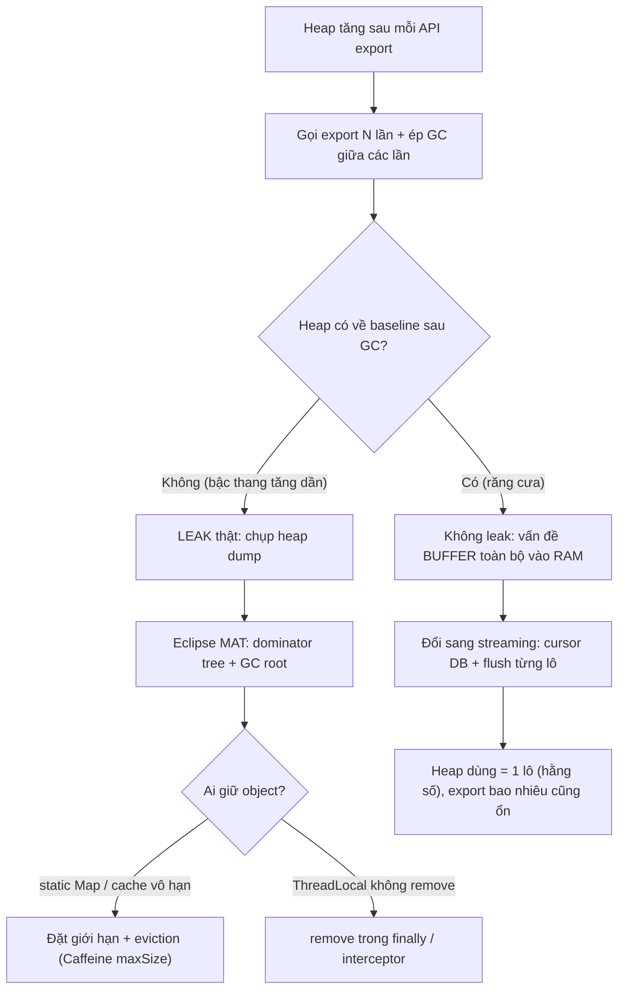

# Memory tăng sau mỗi lần gọi API export: stream file sai hay giữ object lớn?

## ⚡ Tóm tắt ngắn (30s)
* **Bản chất**: Heap tăng **mỗi lần gọi API export** rồi không trả về (hoặc trả chậm) là dấu hiệu kinh điển của **materialize toàn bộ dữ liệu vào RAM trước khi ghi ra**. API export hay đụng tới hàng triệu bản ghi; nếu code `findAll()` rồi build cả file trong bộ nhớ, mỗi request ngốn hàng trăm MB → vài request đồng thời là `OutOfMemoryError`. Có hai biểu hiện cần phân biệt:
  1. **Buffer toàn bộ vào RAM (không stream)**: Heap tăng vọt trong lúc export rồi **giảm lại sau GC** khi request xong. Đây là **vấn đề thiết kế streaming**, không phải leak thật.
  2. **Giữ object lớn (leak thật)**: Heap tăng và **không giảm** sau khi export xong — object bị giữ bởi cache, static collection, ThreadLocal, hoặc listener không gỡ. Đây là **memory leak**.
* **Cách phân biệt nhanh**: Chụp heap **trước, trong, sau** export. Sau export GC mà heap về baseline → **buffer/streaming**. Không về baseline, tăng tích lũy qua nhiều lần → **leak**.
* **Quyết định Senior**: **Stream từ DB → ghi thẳng ra output** (cursor/pagination + flush), không bao giờ giữ toàn bộ dataset trong RAM. Với leak, dùng **heap dump + dominator tree** để tìm GC root giữ object.

---

## 🔍 Chi tiết bản chất thực chiến: Streaming vs Leak

### Quy trình debug có cấu trúc
1. **Theo dõi heap qua nhiều request**: Gọi export 5 lần liên tiếp, ép GC giữa các lần.
   * Heap răng cưa (tăng rồi về baseline) → **buffer, không leak** → fix bằng streaming.
   * Heap bậc thang (mỗi lần tăng một nấc, không về) → **leak** → tìm GC root.
2. **Heap dump khi nghi leak**: Phân tích bằng **Eclipse MAT** → dominator tree chỉ object chiếm nhiều nhất + GC root giữ chúng (static map? cache vô hạn?).
3. **Soi code export**: Có `findAll()` / `list.addAll(...)` / build `byte[]` cả file không? Có giữ `List` ở field/static không?
4. **Đo theo size dữ liệu**: Heap tăng tỉ lệ thuận với số bản ghi export → chắc chắn materialize toàn bộ.

### Streaming đúng: từ DB tới HTTP response không phình RAM
Chìa khóa là **không bao giờ giữ quá một lô nhỏ trong RAM** tại bất kỳ thời điểm nào:
* **DB**: dùng cursor/stream (`Stream<T>` JPA, JDBC `fetchSize`, hoặc keyset pagination) thay vì `findAll()`.
* **Ghi**: flush từng dòng/lô thẳng vào `OutputStream` của response, không build `StringBuilder`/`byte[]` chứa cả file.
* **Kết quả**: bộ nhớ dùng = kích thước một lô (hằng số), không phụ thuộc tổng số bản ghi → export 10 triệu dòng vẫn chạy với heap nhỏ.

### Bẫy "buffer vô hình" của thư viện
Nhiều thư viện Excel (Apache POI `XSSFWorkbook`) **giữ toàn bộ workbook trong RAM**. Export Excel 500k dòng bằng `XSSFWorkbook` chắc chắn OOM. Phải dùng `SXSSFWorkbook` (streaming, chỉ giữ N dòng gần nhất trong RAM, phần còn lại flush ra đĩa tạm). CSV thì luôn streaming dễ dàng.

---

## 🎨 Sơ đồ: Chẩn đoán memory tăng khi export



---

## 💻 Code thực chiến: BAD vs GOOD

### ❌ BAD 1: Buffer toàn bộ vào RAM trước khi trả về
```java
@GetMapping("/export")
public ResponseEntity<byte[]> export() {
    List<Order> all = orderRepository.findAll();   // ❌ load 5 triệu row vào RAM
    StringBuilder sb = new StringBuilder();         // ❌ cả file CSV trong 1 String
    for (Order o : all) sb.append(toCsvLine(o));
    byte[] data = sb.toString().getBytes();         // ❌ nhân đôi RAM (String + byte[])
    return ResponseEntity.ok().body(data);          // OOM khi vài request đồng thời
}
```

### ❌ BAD 2: Leak — giữ kết quả export trong static cache
```java
// ❌ static map giữ mọi export đã tạo, không bao giờ xóa → heap bậc thang
private static final Map<Long, byte[]> EXPORT_CACHE = new HashMap<>();

public byte[] export(Long userId) {
    byte[] data = buildExport(userId);
    EXPORT_CACHE.put(userId, data); // ❌ giữ vĩnh viễn → leak thật
    return data;
}
```

### ✅ GOOD: Stream thẳng từ DB ra response, RAM hằng số
```java
@RestController
@RequiredArgsConstructor
public class OrderExportController {

    private final OrderRepository orderRepository;

    @GetMapping("/export")
    public void export(HttpServletResponse response) throws IOException {
        response.setContentType("text/csv");
        response.setHeader("Content-Disposition", "attachment; filename=orders.csv");

        try (var writer = new BufferedWriter(
                 new OutputStreamWriter(response.getOutputStream(), StandardCharsets.UTF_8));
             // Stream cursor từ DB: chỉ giữ 1 row tại một thời điểm
             Stream<Order> stream = orderRepository.streamAll()) {

            writer.write("id,user,amount,created_at\n");
            int count = 0;
            var it = stream.iterator();
            while (it.hasNext()) {
                writer.write(toCsvLine(it.next()));
                if (++count % 1000 == 0) {
                    writer.flush();                // đẩy ra client, giải phóng buffer
                    orderRepository.detachAll();    // gỡ entity khỏi persistence context
                }
            }
            writer.flush();
        }
    }
}
```

```java
// Repository: stream với fetch size hợp lý, không materialize
public interface OrderRepository extends JpaRepository<Order, Long> {
    @QueryHints(@QueryHint(name = HINT_FETCH_SIZE, value = "1000"))
    @Query("SELECT o FROM Order o")
    Stream<Order> streamAll();   // trả Stream, đọc theo cursor
}
```

---

## 📊 Bảng so sánh: Buffer/Streaming vs Leak thật

| Tiêu chí | Buffer toàn bộ (không stream) | Giữ object lớn (LEAK) |
| :--- | :--- | :--- |
| **Heap sau export + GC** | Về baseline (răng cưa) | Không về, tăng bậc thang |
| **Quan hệ với số bản ghi** | Đỉnh heap tỉ lệ thuận data export | Tăng tích lũy qua mỗi request |
| **Restart app** | Mỗi request lại phình rồi tự dọn | Hết tạm rồi leak lại |
| **Công cụ chẩn đoán** | Theo dõi heap khi 1 request chạy | Heap dump + dominator tree (MAT) |
| **Nguyên nhân** | `findAll()`, build cả file trong RAM | static map / cache vô hạn / ThreadLocal |
| **Fix đúng** | Stream cursor + flush từng lô | Giới hạn cache + eviction + remove |

---

## ⚠️ Common Gotchas & Questions follow-up

### 1. Cạm bẫy "Persistence context phình to dù đã stream"
* **Vấn đề**: Đã dùng `Stream<Order>` nhưng heap **vẫn tăng** trong lúc export. Lý do: JPA giữ **mọi entity đã đọc trong persistence context (first-level cache)** để theo dõi dirty checking. Stream 5 triệu row → 5 triệu entity bị giữ trong `EntityManager` → vẫn OOM dù "đã stream".
* **Giải pháp**: Định kỳ gọi `entityManager.clear()` (hoặc `detach`) sau mỗi lô để gỡ entity khỏi persistence context, như `detachAll()` trong code GOOD. Hoặc dùng **DTO projection** / JDBC thẳng để né hẳn entity tracking. Đây là lỗi cực hay gặp khiến "stream mà vẫn leak".

### 2. Câu hỏi đào sâu từ interviewer
* **Interviewer: "Export file lớn mất 2 phút, client hay timeout, user bấm lại nhiều lần làm OOM nhanh hơn. Thiết kế lại thế nào?"**
* **Trả lời**:
  1. **Chuyển export sang bất đồng bộ (async job)**: API trả ngay `202 Accepted` + `jobId`. Một worker sinh file, lưu vào **object storage (S3)**, rồi báo user qua link tải. Tách export khỏi request-response đồng bộ giúp né timeout và né bấm-lại-spam.
  2. **Idempotency cho export job**: Cùng tham số export trong cửa sổ ngắn → trả cùng `jobId`, không sinh job mới mỗi lần user bấm lại.
  3. **Giới hạn tài nguyên**: Worker export chạy pool riêng, giới hạn số job đồng thời (ví dụ semaphore = 3) để vài export khổng lồ không đồng loạt đập vào RAM. Kết hợp streaming ra S3 (multipart upload) để RAM luôn hằng số.
