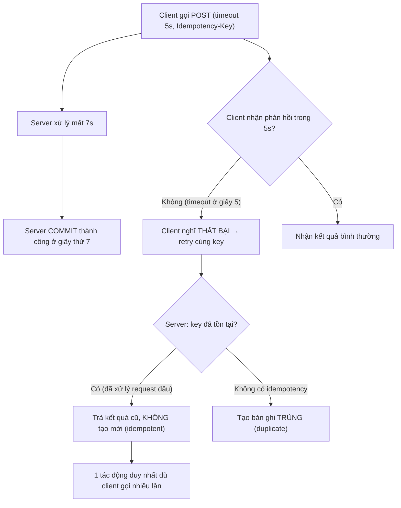

# API timeout nhưng backend vẫn xử lý thành công: client retry gây duplicate không?

## ⚡ Tóm tắt ngắn (30s)
* **Bản chất**: Đây là một trong những cái bẫy nguy hiểm và phổ biến nhất của hệ thống phân tán. Client đặt timeout (ví dụ 5s), backend xử lý mất 7s nhưng **vẫn commit thành công**. Client thấy timeout → nghĩ là **thất bại** → **retry**. Nếu thao tác **không idempotent**, retry tạo ra **bản ghi/giao dịch trùng**. Câu trả lời cho "có gây duplicate không?": **CÓ — chắc chắn có, trừ khi bạn thiết kế idempotency**.
* **Tại sao timeout không có nghĩa là thất bại**: Timeout chỉ nói "client không nhận được phản hồi trong thời gian chờ", **không** nói "server không làm gì". Đây là sự khác biệt sống còn — client và server có hai cái nhìn khác nhau về cùng một sự kiện. Mất phản hồi ≠ mất tác động.
* **Quyết định Senior**:
  1. **Idempotency key**: Mọi thao tác ghi quan trọng (tạo order, charge tiền, chuyển khoản) phải nhận idempotency key do client sinh. Retry với cùng key → trả kết quả cũ, không tạo mới.
  2. **Phân loại retry an toàn**: Chỉ auto-retry các thao tác **idempotent** (GET, hoặc POST có idempotency key). Không bao giờ retry mù POST tạo tài nguyên.
  3. **Timeout budget hợp lý**: Đặt client timeout > p99 latency của server để giảm timeout giả.

---

## 🔍 Chi tiết bản chất thực chiến: Vùng xám của timeout

### Quy trình debug có cấu trúc
1. **Xác nhận có duplicate thật không**: Query theo business key + thời gian, đếm bản ghi trùng. Đối chiếu với log timeout của client.
2. **Khớp timeline**: So thời điểm client timeout với thời điểm server commit. Nếu server commit **sau** lúc client timeout → đúng kịch bản "timeout giả + retry duplicate".
3. **Soi tầng nào retry**: Client app? HTTP client library (mặc định retry)? Load balancer/service mesh (Envoy retry policy)? Tất cả đều có thể retry ngầm mà dev không biết.
4. **Đo p99 vs timeout**: Nếu p99 latency server > client timeout → timeout giả xảy ra thường xuyên một cách hệ thống.

### Ba kết cục của một request timeout
Khi client timeout, request thật sự rơi vào một trong ba trạng thái mà client **không phân biệt được**:
1. Request **chưa tới** server (mất ở mạng đi) → retry an toàn.
2. Request **đang xử lý / đã xử lý xong** nhưng phản hồi mất ở đường về → retry **gây duplicate**.
3. Server **đã xử lý và sẽ phản hồi** nhưng chậm → retry tạo request thứ hai song song.

Vì client không biết mình ở trường hợp nào, **giả định an toàn duy nhất là "có thể đã xử lý rồi"** → phải idempotent.

### Retry ngầm — kẻ thù giấu mặt
Nhiều thư viện HTTP (một số cấu hình OkHttp, gRPC, Feign, service mesh) **mặc định retry** trên timeout/connection error. Dev viết code "gọi 1 lần" nhưng thực tế hệ thống gọi 2–3 lần dưới gầm. Đây là lý do duplicate xuất hiện "không rõ từ đâu". Luôn kiểm tra retry policy ở mọi tầng.

---

## 🎨 Sơ đồ: Timeout giả dẫn tới duplicate và cách chặn



---

## 💻 Code thực chiến: BAD vs GOOD

### ❌ BAD: Client retry mù + server không idempotent
```java
// Client: thư viện tự retry trên timeout
@Bean
public RestTemplate restTemplate() {
    var rt = new RestTemplate();
    // ❌ Retry mọi lỗi gồm timeout → POST tạo order bị gọi lại → duplicate
    rt.setRequestFactory(retryEverythingFactory(3));
    return rt;
}

// Server: tạo order không có chống trùng
@PostMapping("/transfer")
public TransferResult transfer(@RequestBody TransferRequest req) {
    // ❌ Mỗi lần gọi = một lần chuyển tiền. Retry = chuyển 2 lần!
    return transferService.execute(req.getFrom(), req.getTo(), req.getAmount());
}
```

### ✅ GOOD: Idempotency key + retry chỉ cho thao tác an toàn
```java
@RestController
@RequiredArgsConstructor
public class TransferController {

    private final TransferService transferService;
    private final IdempotencyStore idempotencyStore;

    @PostMapping("/transfer")
    public TransferResult transfer(
            @RequestHeader("Idempotency-Key") String idemKey,
            @RequestBody TransferRequest req) {

        // 1. Đã xử lý key này? Trả kết quả cũ — retry không tạo tác động mới
        var cached = idempotencyStore.find(idemKey);
        if (cached.isPresent()) return cached.get().result();

        // 2. Xử lý + lưu kết quả gắn key, atomic trong 1 transaction
        return transferService.executeIdempotent(idemKey, req);
    }
}

@Service
@RequiredArgsConstructor
public class TransferService {

    private final TransferRepository repo;
    private final IdempotencyStore idempotencyStore;

    @Transactional
    public TransferResult executeIdempotent(String idemKey, TransferRequest req) {
        try {
            idempotencyStore.reserve(idemKey);  // UNIQUE PK chặn race
        } catch (DataIntegrityViolationException raced) {
            // Luồng song song (retry) đã chiếm key → đọc lại kết quả của nó
            return idempotencyStore.find(idemKey).orElseThrow().result();
        }
        TransferResult result = doTransfer(req);
        idempotencyStore.saveResult(idemKey, result);
        return result;
    }
}
```

```yaml
# Client: chỉ retry GET (idempotent), không retry POST tạo tài nguyên
resilience4j:
  retry:
    instances:
      readApi:    { maxAttempts: 3, retryExceptions: [java.io.IOException] }
      writeApi:   { maxAttempts: 1 }   # ❗ không retry mù thao tác ghi
```

---

## 📊 Bảng so sánh: Loại thao tác vs Retry vs Rủi ro duplicate

| Loại thao tác | Idempotent tự nhiên? | An toàn auto-retry? | Rủi ro nếu retry mù | Cách làm an toàn |
| :--- | :---: | :---: | :--- | :--- |
| **GET (đọc)** | Có | Có | Không | Retry thoải mái |
| **PUT (set giá trị tuyệt đối)** | Có | Có | Không | Retry an toàn |
| **DELETE theo id** | Có | Có | Lần 2 báo not-found (chấp nhận) | Coi 404 là thành công |
| **POST tạo tài nguyên** | Không | Không | **Duplicate order/charge** | Bắt buộc idempotency key |
| **Tăng/giảm tương đối (`balance += x`)** | Không | Không | **Cộng tiền nhiều lần** | Idempotency key + state check |

---

## ⚠️ Common Gotchas & Questions follow-up

### 1. Cạm bẫy "Server hủy xử lý khi client ngắt kết nối"
* **Vấn đề**: Để "tránh duplicate", có người định cho server **hủy xử lý khi client timeout/disconnect**. Nhưng ở giao dịch tiền, việc hủy giữa chừng còn nguy hiểm hơn: có thể đã trừ tiền tài khoản A nhưng chưa cộng tài khoản B rồi bị hủy → mất tiền. Hơn nữa server thường **không biết** client đã ngắt cho tới khi cố ghi phản hồi.
* **Giải pháp**: Không dựa vào "hủy khi disconnect". Để server **luôn hoàn tất giao dịch một cách nguyên tử** (transaction đảm bảo all-or-nothing), và dùng **idempotency** để retry của client không tạo tác động kép. Đúng đắn đến từ atomicity + idempotency, không từ việc đoán client còn kết nối hay không.

### 2. Câu hỏi đào sâu từ interviewer
* **Interviewer: "Client retry với cùng idempotency key, nhưng request đầu VẪN đang chạy chưa commit. Hai request chạy song song cùng key thì sao?"**
* **Trả lời**:
  1. **Đây là race thật sự cần xử lý**. Khi request thứ hai tới lúc request đầu chưa commit, cả hai cùng thấy "key chưa có kết quả".
  2. **Giải pháp bằng UNIQUE constraint**: Bước "reserve key" insert một row với PK = idempotency key. Chỉ **một** luồng insert thành công; luồng kia nhận `DataIntegrityViolationException` và phải **chờ/đọc lại** kết quả của luồng thắng (như code GOOD). Đây là điểm tế nhị: không chỉ check "có kết quả chưa" mà phải dùng ràng buộc DB để tuần tự hóa.
  3. **Trạng thái trung gian**: Có thể đặt key ở trạng thái `IN_PROGRESS` khi reserve; request thứ hai thấy `IN_PROGRESS` thì trả `409 Conflict` (client chờ rồi thử lại) thay vì tạo mới — an toàn tuyệt đối, không bao giờ duplicate.
