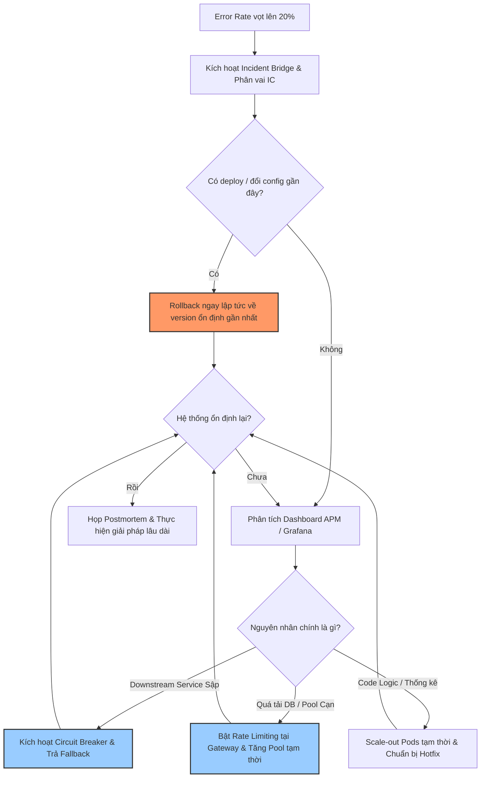

# Error rate tăng từ 0.1% lên 20%, bạn xử lý incident thế nào?

## ⚡ Tóm tắt ngắn (30s)
* **Bản chất**: Đây là sự cố nghiêm trọng cấp độ cao (Severity 1 Incident). Quy tắc vàng trong ứng phó sự cố là **Giảm thiểu ảnh hưởng trước, Tìm nguyên nhân gốc sau (Mitigation first, RCA later)**. Quy trình xử lý gồm 4 giai đoạn chuẩn SRE: **Xác định mức độ (Triage)** $\r\rightarrow$ **Khoanh vùng & Cô lập (Containment)** $\r\rightarrow$ **Khắc phục tạm thời (Mitigation)** $\r\rightarrow$ **Phân tích lâu dài (Postmortem/RCA)**.
* **Các thảm họa thực chiến được giải quyết**:
    1. **Mù quáng mò mẫm trong lúc hệ thống cháy (Action Paralysis)**: Kỹ sư hoảng loạn đọc hàng triệu dòng log thô mà không có Dashboard tập trung để khoanh vùng, làm kéo dài thời gian downtime (MTTR).
    2. **Khắc phục gây hỏng hóc thêm (Compounding Failures)**: Tiến hành vá code (hotfix) vội vã trực tiếp lên production mà không test kỹ, dẫn đến lỗi chồng lỗi.
    3. **Quá tải hệ thống do Retry Storm**: Hệ thống lỗi trả về 5xx nhưng phía Client liên tục tự động retry không có delay, khiến hệ thống quá tải nghiêm trọng hơn và không thể tự hồi phục.
* **Quyết định Senior**: Ngay lập tức thiết lập kênh giao tiếp sự cố (Incident Bridge). Sử dụng Prometheus/Grafana để xác định phạm vi ảnh hưởng (chỉ một cụm hay toàn hệ thống). Nếu vừa deploy, thực hiện **Rollback khẩn cấp ngay lập tức** trong vòng 3 phút mà không cần suy nghĩ sâu. Nếu do quá tải hoặc nghẽn DB, kích hoạt **Circuit Breaker** hoặc **Rate Limiting** để giảm lưu lượng và cứu sống hệ thống trước, tránh hiệu ứng Domino.

---

## 🔍 Chi tiết bản chất thực chiến

Khi tỉ lệ lỗi (Error Rate) tăng vọt từ 0.1% lên 20%, hệ thống đang trong trạng thái cực kỳ nguy kịch. Một kỹ sư Senior sẽ dẫn dắt đội ngũ qua quy trình chuẩn hóa sau:

### Giai đoạn 1: Xác định & Đánh giá phạm vi (Triage - 5 phút đầu)
1. **Thiết lập Incident Bridge**: Mở ngay phòng họp trực tuyến (Slack Huddle, Teams hoặc Zoom) và chỉ định 3 vai trò rõ ràng:
   * **Incident Commander (IC)**: Người điều phối chính, ra quyết định cuối cùng.
   * **Communications Lead**: Người cập nhật trạng thái cho stakeholders và khách hàng.
   * **Operations/Technical Leads**: Các kỹ sư tập trung điều tra kỹ thuật.
2. **Kiểm tra Deployment Log**: Câu hỏi đầu tiên luôn là: *Có hoạt động deploy hay thay đổi config nào vừa diễn ra không?*
3. **Đánh giá Golden Signals (Prometheus/Grafana)**:
   * **Traffic (RPS)**: Có bị tấn công DDoS hay tăng đột biến không?
   * **Latency (p99)**: Lỗi 5xx đi kèm với latency cao (nghẽn tài nguyên) hay phản hồi lỗi ngay lập tức (lỗi code, lỗi phân quyền)?
   * **Errors**: Lỗi tập trung ở một API cụ thể, một Pod cụ thể, hay rải rác toàn hệ thống?

### Giai đoạn 2: Khoanh vùng & Giảm thiểu ảnh hưởng (Containment & Mitigation - 15 phút tiếp theo)
* **Kịch bản A: Do vừa deploy phiên bản mới**
  * **Hành động**: **ROLLBACK KHẨN CẤP**. Tuyệt đối không ngồi debug code trên production hoặc cố gắng viết hotfix trong trạng thái hoảng loạn.
* **Kịch bản B: Do Downstream Service hoặc Third-party bị sập**
  * **Hành động**: Kích hoạt **Circuit Breaker** sang chế độ *Open* để dừng gọi dịch vụ lỗi, đồng thời trả về kết quả dự phòng (fallback/degraded data) hoặc dữ liệu từ cache để bảo vệ trải nghiệm khách hàng.
* **Kịch bản C: Do cạn kiệt tài nguyên (CPU 100%, DB Connection Pool Full)**
  * **Hành động**: 
    1. Tiến hành **Scale-out** (tăng số lượng pods/instances) lập tức nếu nút thắt ở tầng ứng dụng vô hướng (stateless application).
    2. Bật cấu hình **Rate Limiting / Shedding** ở API Gateway để loại bỏ các request không thiết yếu, bảo vệ các luồng quan trọng (như Thanh toán/Checkout).

### Giai đoạn 3: Phân tích nguyên nhân gốc rễ (RCA) & Vá lỗi triệt để
* Chỉ thực hiện khi hệ thống đã quay lại trạng thái ổn định (Error rate < 0.1%).
* Sử dụng **Trace ID** trên APM để phân tích một vài request lỗi điển hình nhằm tìm ra nguyên nhân chính xác: NullPointerException, Connection Timeout, OOM, hay lỗi logic nghiệp vụ.

---

## 🎨 Sơ đồ trực quan (Quy trình SRE ứng phó Incident 5xx)



---

## 💻 Code thực chiến / Cấu hình thực tế: BAD vs GOOD

### ❌ BAD: Không có Circuit Breaker, gọi Downstream dễ gây lỗi Domino toàn hệ thống
Khi dịch vụ thanh toán (`payment-service`) bị chậm hoặc sập, request của người dùng sẽ bị giữ lại vô thời hạn, làm cạn kiệt Thread Pool của dịch vụ gọi (`order-service`), khiến toàn bộ ứng dụng sập theo.

```java
@Service
public class OrderServiceBad {
    @Autowired
    private RestTemplate restTemplate;

    public OrderResponse processOrder(OrderRequest request) {
        // ❌ Gọi trực tiếp dịch vụ ngoài mà không có cơ chế bảo vệ.
        // Nếu payment-service sập hoặc trễ 30s, thread này sẽ bị block, gây cạn kiệt thread pool.
        PaymentResponse payment = restTemplate.postForObject(
            "http://payment-service/api/pay", 
            new PaymentRequest(request.getAmount()), 
            PaymentResponse.class
        );
        return new OrderResponse(request.getId(), "SUCCESS", payment.getTransactionId());
    }
}
```

---

### ✅ GOOD: Tích hợp Resilience4j Circuit Breaker có cơ chế Fallback an toàn
Cấu hình Circuit Breaker tự động ngắt kết nối khi tỷ lệ lỗi vượt ngưỡng, đồng thời cung cấp phương thức fallback để duy trì hoạt động tối thiểu của hệ thống.

* **Cấu hình Resilience4j (application.yml)**:
```yaml
resilience4j.circuitbreaker:
  instances:
    paymentService:
      slidingWindowType: COUNT_BASED
      slidingWindowSize: 10
      minimumNumberOfCalls: 5
      failureRateThreshold: 50 # ✅ Tự động ngắt (Open) nếu >50% cuộc gọi bị lỗi
      waitDurationInOpenState: 10000ms # ✅ Đợi 10s trước khi thử lại (Half-Open)
      slowCallRateThreshold: 75
      slowCallDurationThreshold: 2000ms
```

* **Mã nguồn ứng dụng tích hợp bảo vệ Circuit Breaker**:
```java
@Service
public class OrderServiceGood {
    private static final Logger logger = LoggerFactory.getLogger(OrderServiceGood.class);

    @Autowired
    private RestTemplate restTemplate;

    // ✅ Tích hợp Circuit Breaker với tên cấu hình 'paymentService' và fallback method an toàn
    @CircuitBreaker(name = "paymentService", fallbackMethod = "processOrderFallback")
    public OrderResponse processOrder(OrderRequest request) {
        PaymentResponse payment = restTemplate.postForObject(
            "http://payment-service/api/pay", 
            new PaymentRequest(request.getAmount()), 
            PaymentResponse.class
        );
        return new OrderResponse(request.getId(), "SUCCESS", payment.getTransactionId());
    }

    // ✅ Phương thức Fallback được gọi ngay lập tức khi Circuit Breaker MỞ hoặc cuộc gọi bị lỗi
    public OrderResponse processOrderFallback(OrderRequest request, Throwable t) {
        logger.warn("Payment service unavailable (Reason: {}). Processing fallback for order: {}", 
            t.getMessage(), request.getId());
        
        // Trả về trạng thái PENDING_PAYMENT thay vì ném lỗi 500 cho người dùng
        return new OrderResponse(request.getId(), "PENDING_PAYMENT", "SYSTEM_FALLBACK_TEMP_ID");
    }
}
```

---

## 📊 Bảng so sánh các phương pháp xử lý sự cố khẩn cấp

| Tiêu chí | Viết Hotfix khẩn cấp (Hotfixing) | Rollback về phiên bản cũ (Rollback) | Bật/Tắt Feature Flag (Toggle) | Kích hoạt Circuit Breaker (Fallback) |
| :--- | :--- | :--- | :--- | :--- |
| **Thời gian hồi phục (MTTR)**| Rất chậm (15–60 phút để code, test, deploy) | Nhanh (3–10 phút tùy CI/CD pipeline) | Cực nhanh (gần như tức thời, < 1 phút) | Tự động (vài mili-giây do hệ thống tự ngắt) |
| **Độ an toàn** | Thấp (Dễ tạo thêm lỗi mới do áp lực tâm lý) | Rất cao (Quay lại trạng thái ổn định đã được kiểm chứng) | Cao (Chỉ thay đổi luồng xử lý động) | Cao (Bảo vệ hạ tầng khỏi sập hoàn toàn) |
| **Độ phức tạp chuẩn bị** | Thấp (Không cần chuẩn bị trước) | Trung bình (Yêu cầu quy trình DB migration tương thích ngược) | Cao (Phải code sẵn Feature Flag trong code) | Cao (Cần thiết kế và cấu hình thư viện trước) |

---

## ⚠️ Common Gotchas & Questions follow-up

### 1. Cạm bẫy "Mù thông tin do Rollback xóa sạch log chứng cứ"
* **Vấn đề**: Khi xảy ra sự cố, đội ngũ kỹ sư thực hiện rollback ngay lập tức. Sau khi rollback, lỗi biến mất, nhưng toàn bộ log lỗi tại thời điểm sự cố cũng bị ghi đè hoặc biến mất khi các container bị hủy (đặc biệt trong Kubernetes). Đội ngũ không thể tìm nguyên nhân để sửa lỗi lâu dài.
* **Giải pháp**: Phải triển khai hệ thống **Log tập trung (ELK, Loki, Splunk)** để lưu giữ log vĩnh viễn ở môi trường ngoài container, hoặc trước khi rollback phải cô lập một instance bị lỗi ra khỏi Load Balancer (chuyển sang trạng thái cách ly) để giữ nguyên hiện trường phục vụ debug.

### 2. Câu hỏi đào sâu từ interviewer
* **Q: Nếu lỗi 5xx tăng cao do database bị table lock do một migration chạy ngầm chưa tối ưu, bạn không thể rollback database schema vì sẽ làm mất dữ liệu của những người dùng đã ghi thành công trong 10 phút qua. Bạn sẽ làm thế nào?**
  * *Trả lời*: Đây là tình huống "tiến thoái lưỡng nan" kinh điển. Trong trường hợp này, tôi sẽ thực hiện các bước sau:
    1. Kích hoạt ngay **Rate Limiting** để giảm tải tối đa các luồng đọc/ghi không thiết yếu vào bảng bị lock.
    2. Sử dụng command line database để tìm luồng (session/thread ID) đang giữ khóa độc quyền (exclusive lock) bằng truy vấn hệ thống (ví dụ: `show processlist` hoặc `pg_stat_activity`) và thực hiện `KILL` luồng đó ngay lập tức để giải phóng bảng.
    3. Nếu lock do một câu lệnh `ALTER TABLE` chưa tối ưu đang chạy, tôi sẽ hủy (cancel) tiến trình migration đó. Database sẽ tự động thực hiện quá trình rollback giao dịch (transaction rollback) an toàn mà không làm mất dữ liệu hiện hữu.
    4. Triển khai phương án bổ sung chỉ số (Index) trực tiếp dạng trực tuyến (`CREATE INDEX CONCURRENTLY` trong Postgres hoặc `ONLINE` trong MySQL/Oracle) để hỗ trợ giảm tải truy vấn mà không gây khóa bảng tiếp.
