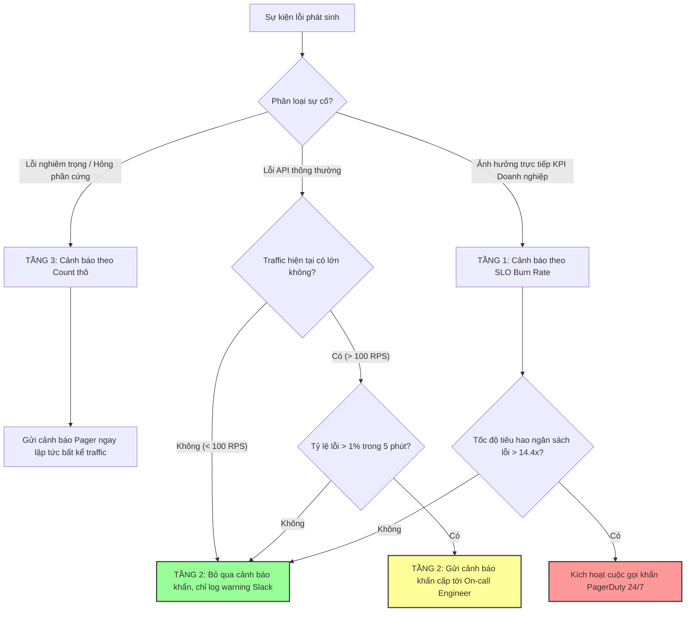

# Bạn sẽ alert theo số lượng lỗi, tỷ lệ lỗi hay impact business?

## ⚡ Tóm tắt ngắn (30s)
* **Bản chất**: Đây là bài toán thiết kế **Chiến lược Cảnh báo Quan trắc (Alerting Strategy)** trong SRE. Cảnh báo theo **Số lượng lỗi (Error Count)** dễ gây nhiễu và gây trơ cảnh báo (Alert Fatigue). Cảnh báo theo **Tỷ lệ lỗi (Error Rate)** tốt hơn nhưng dễ báo động giả lúc thấp điểm (3h sáng). Tiêu chuẩn vàng của kỹ sư Senior là thiết kế **Cảnh báo Đa tầng (Layered Alerting)** trọng tâm vào **Mức độ ảnh hưởng Kinh doanh (Business Impact)** dựa trên chỉ số **SLI/SLO** và tốc độ tiêu hao ngân sách lỗi (Error Budget Burn Rate).
* **Các thảm họa thực chiến được giải quyết**:
    1. **Trơ cảnh báo làm sập hệ thống âm thầm (Alert Fatigue)**: Kênh Slack/PagerDuty của team ngập tràn hàng ngàn tin nhắn báo động lỗi không quan trọng mỗi ngày. Hệ quả là khi sự cố sập DB thực sự xảy ra, các kỹ sư bỏ qua tin nhắn vì coi thường, làm kéo dài thời gian ngừng hoạt động (MTTR).
    2. **Đội ngũ bị gọi thức giấc lúc 3h sáng oan uổng**: Một dịch vụ có traffic thấp lúc nửa đêm đột ngột phát sinh 1 request bị lỗi do người dùng nhập sai tham số, tỷ lệ lỗi vọt lên 100%, kích hoạt cuộc gọi khẩn cấp (Pager Call) vô lý.
* **Quyết định Senior**: Triển khai chiến lược cảnh báo 3 tầng: **Tầng 1 (Khẩn cấp - PagerDuty)**: Cảnh báo theo tốc độ tiêu thụ ngân sách lỗi (Burn Rate) của luồng cốt lõi (ví dụ: Số lượng giao dịch thanh toán thành công giảm > 15% so với cùng kỳ tuần trước). **Tầng 2 (Trung bình - Slack)**: Cảnh báo tỷ lệ lỗi (Error Rate > 1%) đi kèm điều kiện ngưỡng lưu lượng tối thiểu (Volume Threshold, ví dụ: > 100 request/phút) để tránh báo giả lúc đêm muộn. **Tầng 3 (Thấp - Warning)**: Cảnh báo số lượng lỗi thô (Error Count) chỉ áp dụng cho các lỗi cực kỳ nghiêm trọng, không thể dung thứ (ví dụ: `DatabaseConnectionRefused`, `OOM`).

---

## 🔍 Chi tiết bản chất thực chiến

Để xây dựng hệ thống cảnh báo cấp độ Senior giúp bảo vệ giấc ngủ của kỹ sư và bảo vệ túi tiền của doanh nghiệp, chúng ta phân tích ưu nhược điểm và cách phối hợp 3 phương pháp cảnh báo:

### 1. Cảnh báo theo Số lượng lỗi thô (Error Count Alerting)
* **Cơ chế**: Phát báo động khi số lượng lỗi 5xx vượt qua một ngưỡng cố định (ví dụ: > 50 lỗi trong 1 phút).
* **Nhược điểm lớn**: Thiếu ngữ cảnh lưu lượng (Traffic Context). 
  * Nếu vào giờ cao điểm hệ thống nhận 100,000 RPS, phát sinh 50 lỗi (tỷ lệ 0.05%) là hoàn toàn chấp nhận được.
  * Nếu vào lúc thấp điểm chỉ có 50 request gọi vào hệ thống và cả 50 request đều hỏng (tỷ lệ 100%), hệ thống sập hoàn toàn nhưng cảnh báo sẽ **không bao giờ kích hoạt** vì chưa vượt ngưỡng 50 lỗi.
* **Use case đúng**: Chỉ dùng cho các lỗi đặc biệt nghiêm trọng có tỷ lệ dung sai bằng 0 (Zero-tolerance errors) như lỗi bảo mật, lỗi cạn kiệt phần cứng.

### 2. Cảnh báo theo Tỷ lệ lỗi (Error Rate Alerting)
* **Cơ chế**: Phát báo động khi tỷ lệ lỗi vượt ngưỡng phần trăm (ví dụ: Error Rate > 1% trong 5 phút).
* **Nhược điểm lớn**: Lỗi giả lúc nửa đêm (Low Traffic Anomaly). Lúc 3h sáng chỉ có 1 request gọi vào hệ thống và bị lỗi mạng, tỷ lệ lập tức vọt lên 100%, dựng đầu kỹ sư trực sự cố dậy vô lý.
* **Cách khắc phục**: Phải cấu hình cờ điều kiện đi kèm (Muti-condition Alert) trên Prometheus: `Error Rate > 1% AND Traffic Volume > 100 requests`.

### 3. Cảnh báo theo Ảnh hưởng Kinh doanh (Business/User Impact Alerting)
* **Cơ chế**: Theo dõi các chỉ số đo lường trực tiếp nỗi đau của người dùng (User Pain) thông qua các **Chỉ số mức độ dịch vụ (SLIs)** và **Mục tiêu mức độ dịch vụ (SLOs)**.
* **Ví dụ**: Thay vì đếm lỗi CPU hay lỗi 500 chung chung, ta theo dõi: *Tỷ lệ đặt đơn hàng thành công (Order Success Rate)* hoặc *Thời gian hoàn tất giao dịch thanh toán (p95 Latency)*.
* **Cơ chế Burn Rate**: Tính toán tốc độ tiêu hao của "Ngân sách lỗi" (Error Budget). Nếu hệ thống đang đốt ngân sách lỗi với tốc độ quá nhanh (Burn Rate > 14.4 lần bình thường), điều này nghĩa là hệ thống sẽ sập hoàn toàn trong vài giờ tới nếu không can thiệp, lập tức kích hoạt Pager khẩn cấp.

---

## 🎨 Sơ đồ trực quan (Chiến lược Cảnh báo đa tầng chuẩn SRE)



---

## 💻 Code thực chiến / Cấu hình thực tế: BAD vs GOOD

### ❌ BAD: Cấu hình cảnh báo Prometheus nghèo nàn, dễ gây báo động giả lúc đêm muộn
Cấu hình cảnh báo lỗi chỉ dựa trên tỷ lệ lỗi 5xx đơn thuần, khiến hệ thống tự động gọi điện dựng kỹ sư dậy lúc đêm muộn do biến động lưu lượng nhỏ.

* **Cấu hình Alertmanager Rules (alerts.yml) tồi**:
```yaml
groups:
  - name: app_alerts
    rules:
      - alert: HighErrorRate
        # ❌ LỖI: Chỉ tính tỷ lệ lỗi 5xx mà không kiểm tra lưu lượng request thực tế tối thiểu.
        # Nếu có 1 request lỗi lúc 3h sáng, tỷ lệ lỗi = 1, kích hoạt alert khẩn cấp!
        expr: sum(rate(http_server_requests_seconds_count{status=~"5.."}[5m])) / sum(rate(http_server_requests_seconds_count[5m])) > 0.05
        for: 2m
        labels:
          severity: critical # Gọi điện PagerDuty
        annotations:
          summary: "Error rate is high: {{ $value | humanizePercentage }}"
```

---

### ✅ GOOD: Cấu hình Alert Prometheus đa tầng, an toàn và thông minh
Tích hợp kiểm tra ngưỡng lưu lượng tối thiểu (Volume Threshold) để tránh báo động giả, kết hợp giám sát SLO Burn Rate cho các dịch vụ cốt lõi.

* **Cấu hình Alertmanager Rules (alerts-production.yml) chuẩn Senior**:
```yaml
groups:
  - name: production_sla_alerts
    rules:
      # ✅ TẦNG 1: Cảnh báo SLO Burn Rate (Ngân sách lỗi bị tiêu hao quá nhanh)
      - alert: ErrorBudgetFastBurn
        # Tự động tính toán tốc độ tiêu hao ngân sách lỗi trong cửa sổ 1 giờ.
        # Nếu tốc độ đốt ngân sách làm sập hệ thống trong vòng 3 ngày, kích hoạt khẩn cấp.
        expr: (sum(rate(http_server_requests_seconds_count{status=~"5.."}[1h])) / sum(rate(http_server_requests_seconds_count[1h]))) > 0.02
        for: 5m
        labels:
          severity: page # Gọi điện thoại PagerDuty thức giấc ngay lập tức
        annotations:
          summary: "CRITICAL: Error budget is burning fast! Current burn rate is above 2%"

      # ✅ TẦNG 2: Cảnh báo Tỷ lệ lỗi (Error Rate) an toàn (có điều kiện volume)
      - alert: ApiErrorRateHighSafe
        # Chỉ kích hoạt khi tỷ lệ lỗi > 1% VÀ tổng lưu lượng request phải lớn hơn 100 requests/phút
        expr: |
          (sum(rate(http_server_requests_seconds_count{status=~"5.."}[5m])) / sum(rate(http_server_requests_seconds_count[5m])) > 0.01)
          and
          (sum(rate(http_server_requests_seconds_count[5m])) * 60 > 100)
        for: 5m
        labels:
          severity: ticket # Tạo ticket Jira / Gửi tin nhắn Slack Group, không gọi điện
        annotations:
          summary: "API Error rate is {{ $value | humanizePercentage }} with traffic > 100 req/min"

      # ✅ TẦNG 3: Cảnh báo Lỗi nghiêm trọng tuyệt đối (Error Count)
      - alert: CoreServiceDatabaseDown
        # Cảnh báo dựa trên đếm số lượng thô áp dụng duy nhất cho các lỗi sập kết nối cơ sở hạ tầng
        expr: sum(increase(database_connection_failures_total[1m])) > 0
        for: 0m # Kích hoạt tức thì không cần chờ đợi
        labels:
          severity: page
        annotations:
          summary: "IMMEDIATE ACTION REQUIRED: Database connection failures detected!"
```

---

## 📊 Bảng so sánh các phương pháp thiết kế cảnh báo

| Tiêu chí | Cảnh báo Số lượng thô (Count Alert) | Cảnh báo Tỷ lệ (Rate Alert) | Cảnh báo Ảnh hưởng Doanh nghiệp (SLO Burn Rate) |
| :--- | :--- | :--- | :--- |
| **Độ nhạy sự cố thực tế** | Kém (Dễ bị trôi lỗi lúc thấp điểm, quá nhạy lúc cao điểm). | Tốt (Giữ nguyên độ nhạy theo tỷ lệ phần trăm). | Tuyệt vời (Đo đếm trực tiếp mức độ thiệt hại tài chính/trải nghiệm). |
| **Tỷ lệ báo động giả** | Rất cao (Gây ra hiện tượng Alert Fatigue nghiêm trọng). | Trung bình (Bị lỗi giả lúc lưu lượng traffic cực thấp). | Cực thấp (Chỉ báo động khi ngân sách lỗi thực sự bị đe dọa). |
| **Mức độ khẩn cấp** | Thấp (Thích hợp cho log warning/non-actionable alerts). | Trung bình (Phù hợp cho cảnh báo vào giờ hành chính). | Cao nhất (Thích hợp cho hệ thống trực sự cố On-call 24/7). |
| **Chi phí thiết lập** | Thấp (Chỉ cần viết câu query đếm đơn giản). | Trung bình (Cần viết câu chia tỷ lệ trên Prometheus). | Cao (Đòi hỏi xác định SLI/SLO và Error Budget cụ thể cho doanh nghiệp). |

---

## ⚠️ Common Gotchas & Questions follow-up

### 1. Cạm bẫy "Lỗi câm lặng cướp ngân sách lỗi" (Silent Outage)
* **Vấn đề**: Hệ thống Gateway trả về lỗi `504 Gateway Timeout` cho 100% người dùng vì app backend bị sập hoàn toàn. Vì backend sập, nó không thể gửi bất kỳ metrics/logs nào về Prometheus.
* **Hậu quả**: Prometheus ghi nhận số lượng request gửi tới backend bằng 0, tỷ lệ lỗi tính toán bằng 0% (vì mẫu số bằng 0), hệ thống cảnh báo im lặng hoàn toàn trong khi khách hàng không thể sử dụng dịch vụ.
* **Giải pháp**: Phải đo đếm các chỉ số quan trắc từ **tầng ngoài cùng (Edge/Gateway hoặc Load Balancer)** thay vì chỉ tin tưởng chỉ số đo từ tầng ứng dụng backend phát ra.

### 2. Câu hỏi đào sâu từ interviewer
* **Q: Làm thế nào bạn thiết lập hệ thống cảnh báo để phát hiện ra sự cố "Sụt giảm doanh thu bất thường" (ví dụ: Số lượng đơn hàng đặt thành công giảm 50% so với ngày thường), trong khi toàn bộ hệ thống hạ tầng CPU, RAM, Network, Database và error logs đều hiển thị màu xanh hoàn toàn ổn định?**
  * *Trả lời*: Đây là kịch bản lỗi logic nghiệp vụ âm thầm (Silent Business Outage, ví dụ: Nút Đặt hàng bị biến mất trên giao diện Frontend do lỗi CSS/JS mới deploy). Để phát hiện:
    1. Tôi sẽ thiết lập chỉ số giám sát **Business metric (ví dụ: `order_placed_total`)** trên Prometheus.
    2. Sử dụng thuật toán **So sánh tương quan chuỗi thời gian (Week-over-Week / Day-over-Day Comparison)**. Câu lệnh Prometheus query sẽ so sánh lưu lượng đơn hàng hiện tại với đúng khung giờ này của tuần trước:
       `sum(rate(order_placed_total[5m])) < sum(rate(order_placed_total[5m] offset 1w)) * 0.5` (Cảnh báo nếu số đơn hàng giảm xuống dưới 50% so với tuần trước).
    3. Cảnh báo này phản ánh trực tiếp Business Impact và là phòng tuyến cuối cùng cực kỳ hiệu quả để bắt các lỗi logic tinh vi mà các monitor hạ tầng truyền thống hoàn toàn bất lực.
